# Migration guide: Oracle to Azure SQL Managed Instance

[!INCLUDE[appliesto-sqldb-sqlmi](../../includes/appliesto-sqlmi.md)]

In this guide, you learn how to migrate your Oracle schemas to Azure SQL Managed Instance by using SQL Server Migration Assistant for Oracle (SSMA for Oracle).

For other migration guides, see [Azure Database Migration Guide](https://docs.microsoft.com/data-migration).

## Prerequisites

Before you begin migrating your Oracle schema to SQL Managed Instance:

- Verify your source environment is supported.
- Download [SSMA for Oracle](https://www.microsoft.com/en-us/download/details.aspx?id=54258).
- Have a target [Azure SQL Managed Instance](../../managed-instance/instance-create-quickstart.md).
- Obtain the [necessary permissions for SSMA for Oracle](/sql/ssma/oracle/connecting-to-oracle-database-oracletosql) and [provider](/sql/ssma/oracle/connect-to-oracle-oracletosql).
 
## Pre-migration

After you've met the prerequisites, you're ready to discover the topology of your environment and assess the feasibility of your migration. This part of the process involves conducting an inventory of the databases that you need to migrate, assessing those databases for potential migration issues or blockers, and then resolving any items you might have uncovered.

### Assess

By using SSMA for Oracle, you can review database objects and data, assess databases for migration, migrate database objects to SQL Managed Instance, and then finally migrate data to the database.

To create an assessment:

1. Open [SSMA for Oracle](https://www.microsoft.com/en-us/download/details.aspx?id=54258).
1. Select **File**, and then select **New Project**.
1. Enter a project name and a location to save your project. Then select **Azure SQL Managed Instance** as the migration target from the drop-down list and select **OK**.

   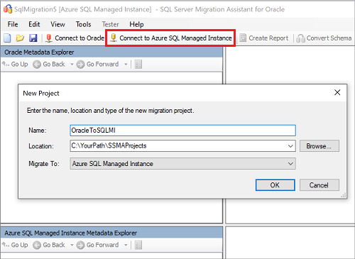

1. Select **Connect to Oracle**. Enter values for Oracle connection details in the **Connect to Oracle** dialog box.

   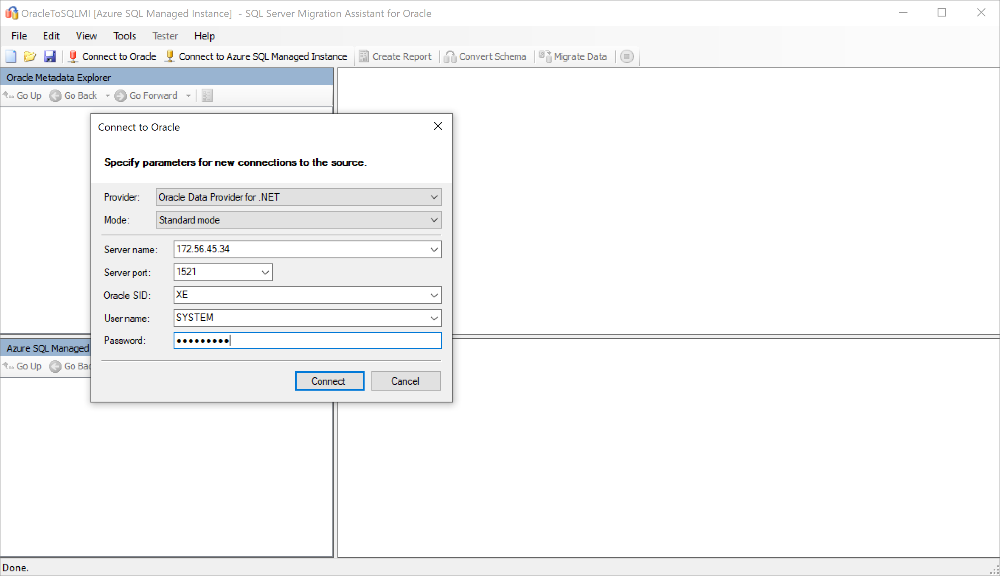

1. Select the Oracle schemas you want to migrate.

   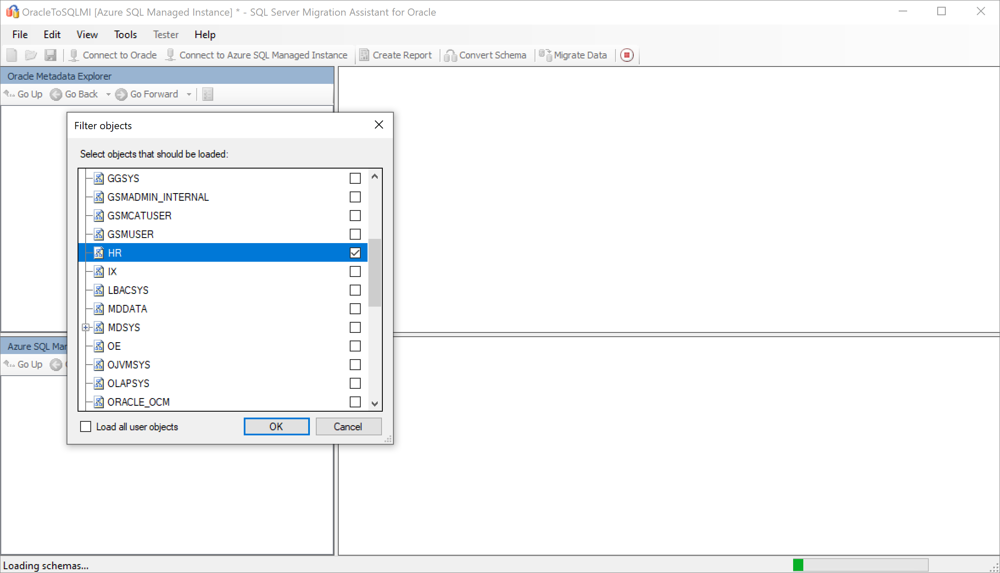

1. In **Oracle Metadata Explorer**, right-click the Oracle schema you want to migrate and then select **Create Report** to generate an HTML report. Alternatively, you can select a database and then select the **Create Report** tab.

   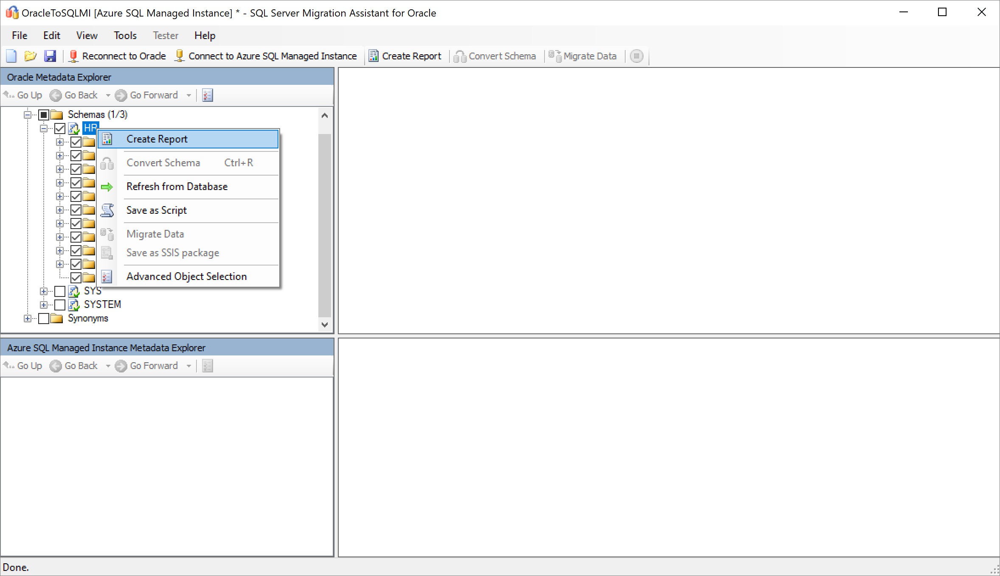

1. Review the HTML report to understand conversion statistics and any errors or warnings. You can also open the report in Excel to get an inventory of Oracle objects and the effort required to perform schema conversions. The default location for the report is in the report folder within SSMAProjects.

   For example, see `drive:\<username>\Documents\SSMAProjects\MyOracleMigration\report\report_2020_11_12T02_47_55\`.

   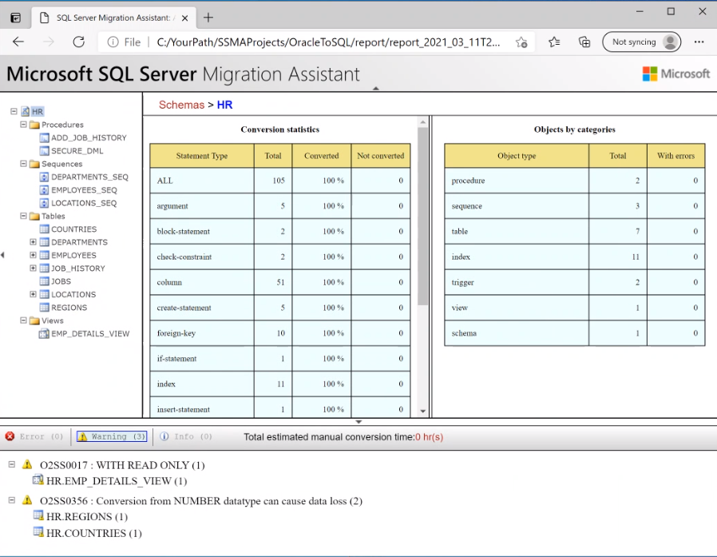

### Validate the data types

Validate the default data type mappings and change them based on requirements if necessary. To do so, follow these steps:

1. In SSMA for Oracle, select **Tools**, and then select **Project Settings**.
1. Select the **Type Mapping** tab.

   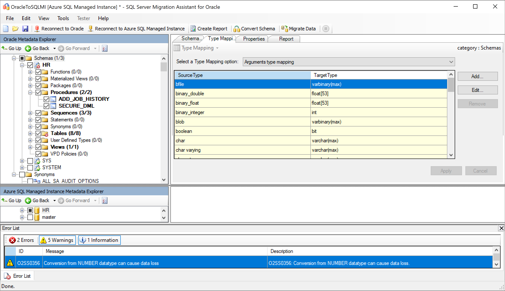

1. You can change the type mapping for each table by selecting the table in **Oracle Metadata Explorer**.

### Convert the schema

To convert the schema:

1. (Optional) Add dynamic or ad-hoc queries to statements. Right-click the node, and then select **Add statements**.
1. Select the **Connect to Azure SQL Managed Instance** tab.
    1. Enter connection details to connect your database in **SQL Database Managed Instance**.
    1. Select your target database from the drop-down list, or enter a new name, in which case a database will be created on the target server.
    1. Enter authentication details, and select **Connect**.

    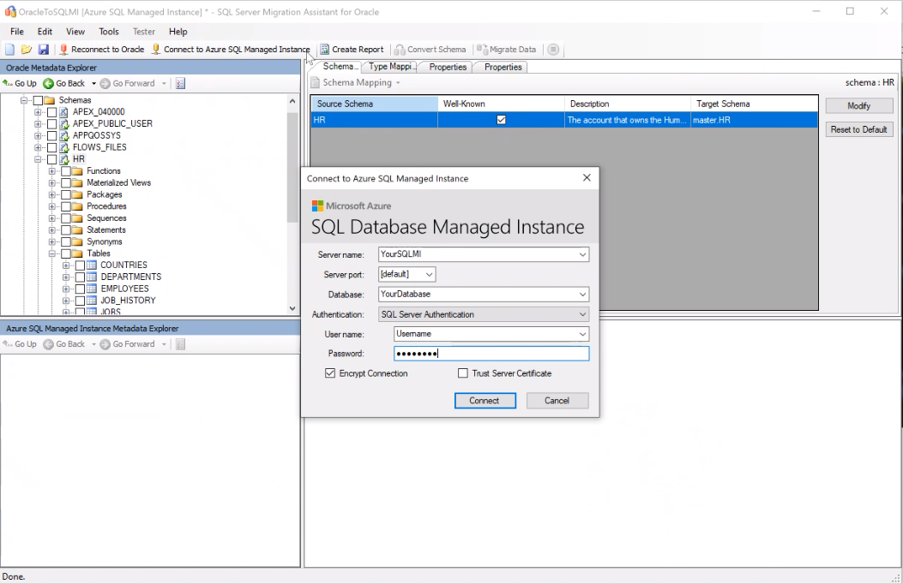

1. In **Oracle Metadata Explorer**, right-click the Oracle schema and then select **Convert Schema**. Alternatively, you can select your schema and then select the **Convert Schema** tab.

   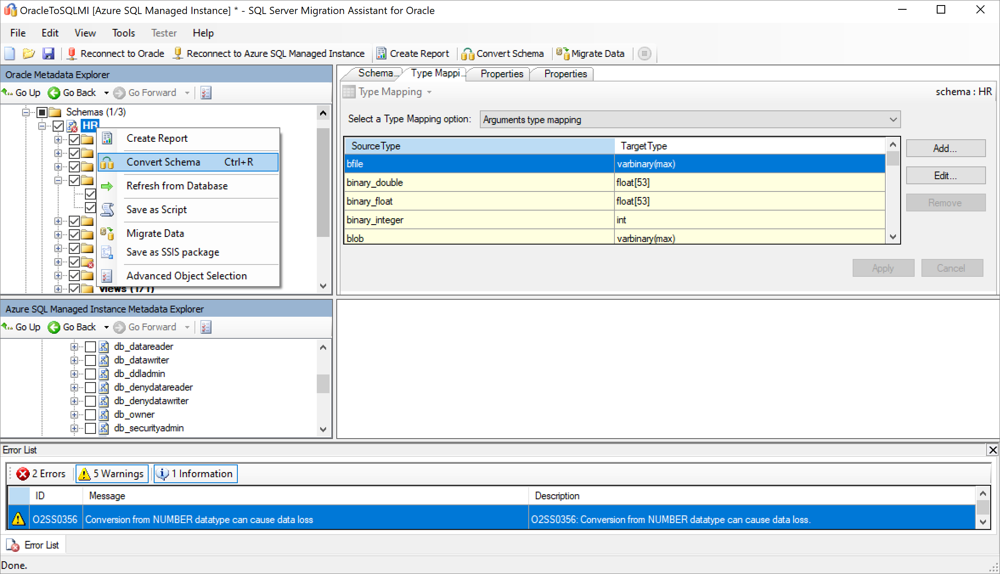

1. After the conversion completes, compare and review the converted objects to the original objects to identify potential problems and address them based on the recommendations.

   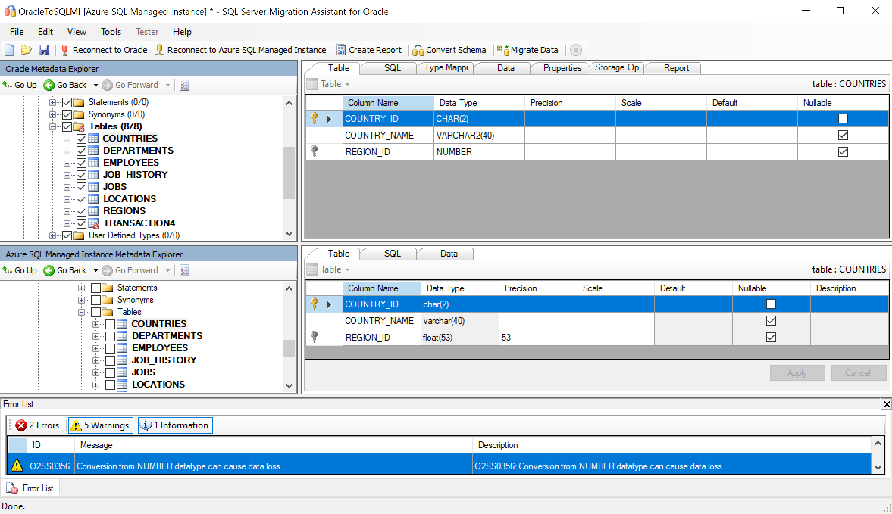

1. Compare the converted Transact-SQL text to the original code, and review the recommendations.

   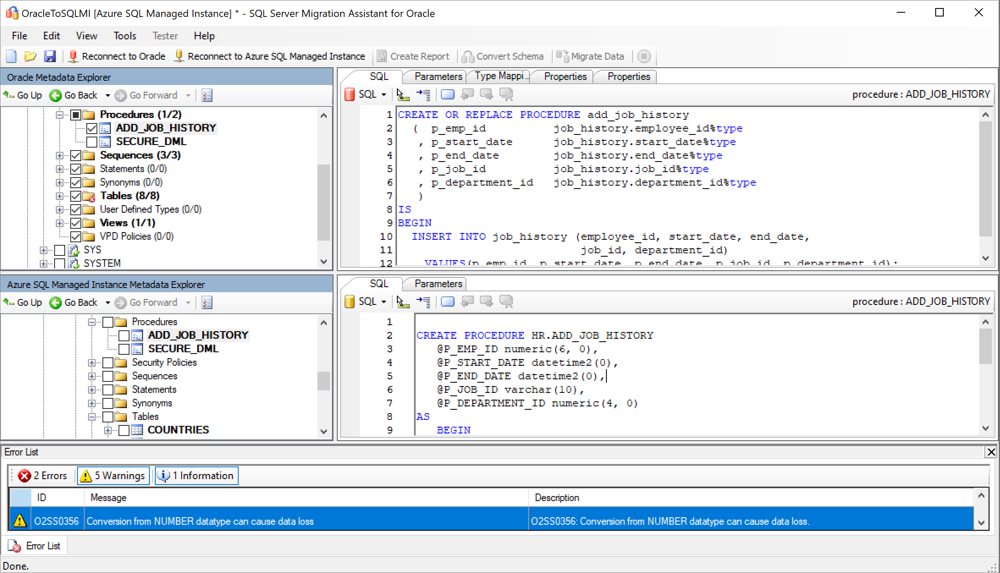

1. In the output pane, select **Review results** and review the errors in the **Error List** pane.
1. Save the project locally for an offline schema remediation exercise. On the **File** menu, select **Save Project**. This step gives you an opportunity to evaluate the source and target schemas offline and perform remediation before you publish the schema to SQL Managed Instance.

## Migrate the databases

After you've completed assessing your databases and addressing any discrepancies, the next step is to run the migration process. Migration involves two steps: publishing the schema and migrating the data.

To publish your schema and migrate your data:

1. Publish the schema by right-clicking the schema or object you want to migrate in **Oracle Metadata Explorer** and selecting **Migrate Data**. Alternatively, you can select the **Migrate Data** tab. To migrate data for an entire database, select the check box next to the database name. To migrate data from individual tables, expand the database, expand **Tables**, and then select the check boxes next to the tables. To omit data from individual tables, clear the check boxes.

   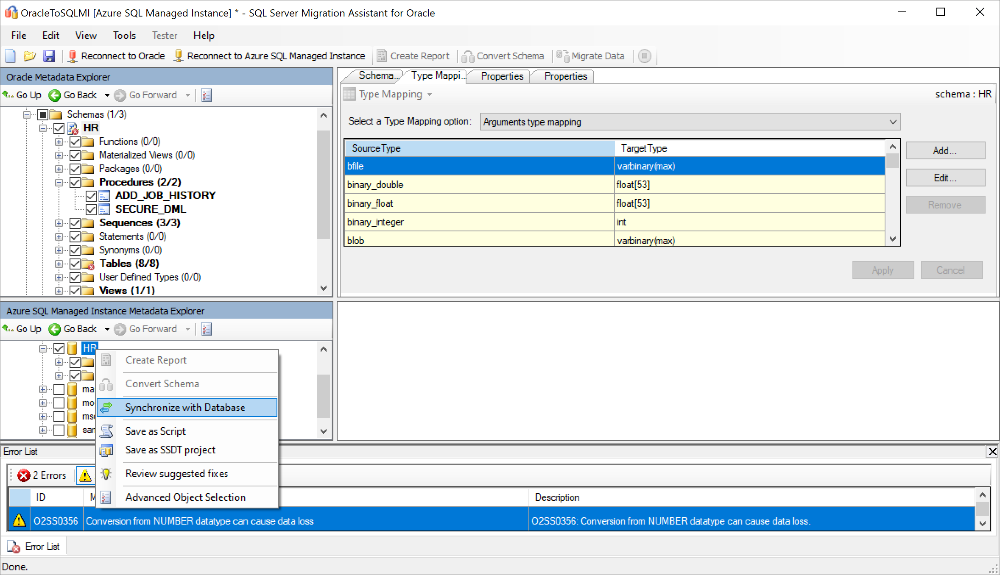

1. Review the mapping between your source project and your target.

   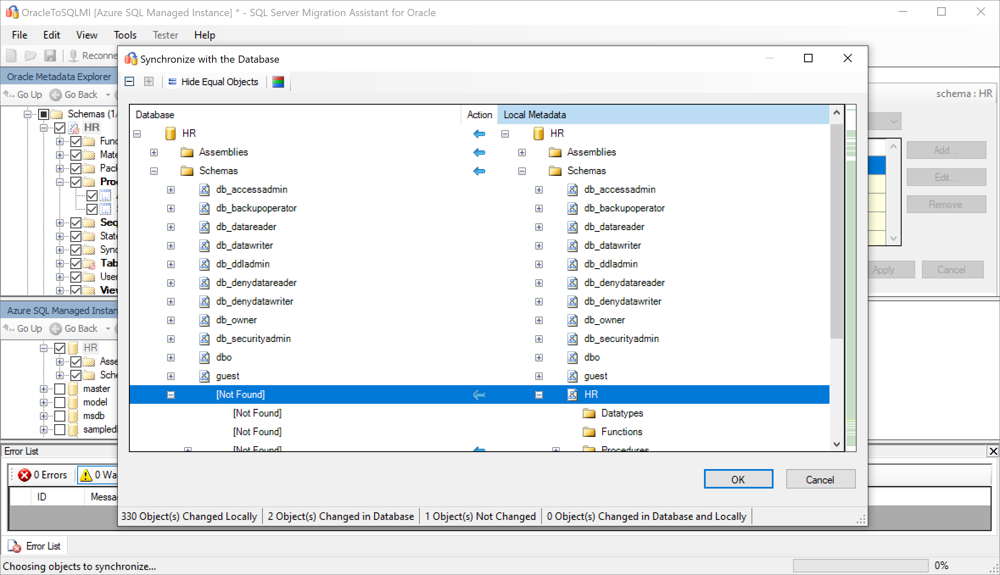

1. Migrate the data by right-clicking the schema from **Oracle Metadata Explorer** and selecting **Migrate Data**.

   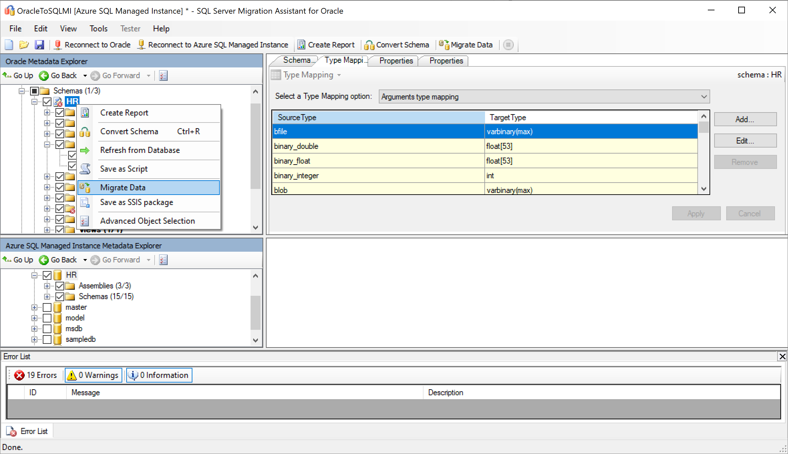

1. Enter connection details for both Oracle and SQL Managed Instance.
1. After the migration is completed, view the **Data Migration Report**.

   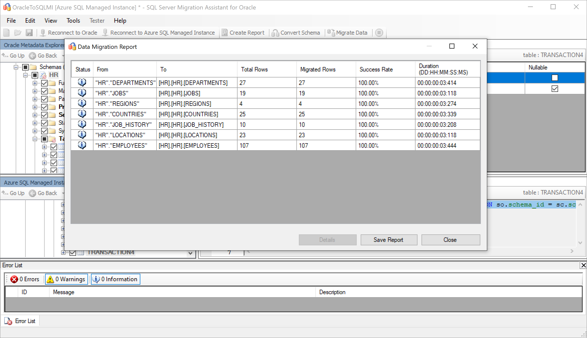

1. Connect to your instance of SQL Managed Instance by using [SQL Server Management Studio](/sql/ssms/download-sql-server-management-studio-ssms), and validate the migration by reviewing the data and schema.

   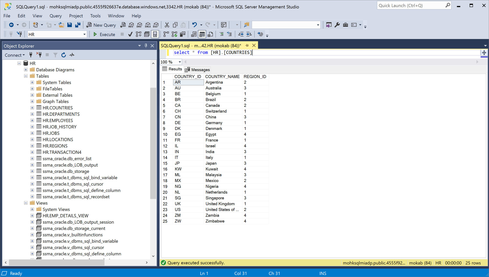

Alternatively, you can also use SQL Server Integration Services to perform the migration. To learn more, see:

- [Getting started with SQL Server Integration Services](https://docs.microsoft.com/sql/integration-services/sql-server-integration-services)
- [SQL Server Integration Services for Azure and Hybrid Data Movement](https://download.microsoft.com/download/D/2/0/D20E1C5F-72EA-4505-9F26-FEF9550EFD44/SSIS%20Hybrid%20and%20Azure.docx)

## Post-migration

After you've successfully completed the *migration* stage, you need to complete a series of post-migration tasks to ensure that everything is functioning as smoothly and efficiently as possible.

### Remediate applications

After the data is migrated to the target environment, all the applications that formerly consumed the source need to start consuming the target. Accomplishing this step will require changes to the applications in some cases.

The [Data Access Migration Toolkit](https://marketplace.visualstudio.com/items?itemName=ms-databasemigration.data-access-migration-toolkit) is an extension for Visual Studio Code that allows you to analyze your Java source code and detect data access API calls and queries. The toolkit provides you with a single-pane view of what needs to be addressed to support the new database back end. To learn more, see the [Migrate our Java application from Oracle](https://techcommunity.microsoft.com/t5/microsoft-data-migration/migrate-your-java-applications-from-oracle-to-sql-server-with/ba-p/368727) blog post.

### Perform tests

The test approach to database migration consists of the following activities:

1. **Develop validation tests**: To test the database migration, you need to use SQL queries. You must create the validation queries to run against both the source and the target databases. Your validation queries should cover the scope you've defined.
2. **Set up a test environment**: The test environment should contain a copy of the source database and the target database. Be sure to isolate the test environment.
3. **Run validation tests**: Run validation tests against the source and the target, and then analyze the results.
4. **Run performance tests**: Run performance tests against the source and the target, and then analyze and compare the results.

### Optimize

The post-migration phase is crucial for reconciling any data accuracy issues, verifying completeness, and addressing performance issues with the workload.

> [!NOTE]
> For more information about these issues and the steps to mitigate them, see the [Post-migration validation and optimization guide](/sql/relational-databases/post-migration-validation-and-optimization-guide).

## Migration assets

For more assistance with completing this migration scenario, see the following resources. They were developed in support of a real-world migration project engagement.

| **Title/link**                                                                                                                                          | **Description**                                                                                                                                                                                                                                                                                                                                                                                       |
| ------------------------------------------------------------------------------------------------------------------------------------------------------- | ----------------------------------------------------------------------------------------------------------------------------------------------------------------------------------------------------------------------------------------------------------------------------------------------------------------------------------------------------------------------------------------------------- |
| [Data Workload Assessment Model and Tool](https://github.com/Microsoft/DataMigrationTeam/tree/master/Data%20Workload%20Assessment%20Model%20and%20Tool) | This tool provides suggested "best fit" target platforms, cloud readiness, and application or database remediation level for a given workload. It offers simple, one-click calculation and report generation that helps to accelerate large estate assessments by providing an automated and uniform target platform decision process.                                                          |
| [Oracle Inventory Script Artifacts](https://github.com/Microsoft/DataMigrationTeam/tree/master/Oracle%20Inventory%20Script%20Artifacts)                 | This asset includes a PL/SQL query that hits Oracle system tables and provides a count of objects by schema type, object type, and status. It also provides a rough estimate of raw data in each schema and the sizing of tables in each schema, with results stored in a CSV format.                                                                                                               |
| [Automate SSMA Oracle Assessment Collection & Consolidation](https://github.com/microsoft/DataMigrationTeam/tree/master/IP%20and%20Scripts/Automate%20SSMA%20Oracle%20Assessment%20Collection%20%26%20Consolidation)                                             | This set of resources uses a .csv file as entry (sources.csv in the project folders) to produce the xml files that are needed to run an SSMA assessment in console mode. The source.csv is provided by the customer based on an inventory of existing Oracle instances. The output files are AssessmentReportGeneration_source_1.xml, ServersConnectionFile.xml, and VariableValueFile.xml.|
| [SSMA for Oracle Common Errors and How to Fix Them](https://aka.ms/dmj-wp-ssma-oracle-errors)                                                           | With Oracle, you can assign a nonscalar condition in the WHERE clause. However, SQL Server doesn't support this type of condition. As a result, SSMA for Oracle doesn't convert queries with a nonscalar condition in the WHERE clause. Instead, it generates the error O2SS0001. This white paper provides more details on the issue and ways to resolve it.          |
| [Oracle to SQL Server Migration Handbook](https://github.com/microsoft/DataMigrationTeam/blob/master/Whitepapers/Oracle%20to%20SQL%20Server%20Migration%20Handbook.pdf)                | This document focuses on the tasks associated with migrating an Oracle schema to the latest version of SQL Server Database. If the migration requires changes to features or functionality, the possible impact of each change on the applications that use the database must be considered carefully.                                                     |

These resources were developed as part of the Data SQL Ninja program, which is sponsored by the Azure Data Group engineering team. The core charter of the Data SQL Ninja program is to unblock and accelerate complex modernization and compete data platform migration opportunities to the Azure Data platform. If you think your organization would be interested in participating in the Data SQL Ninja program, contact your account team and ask them to submit a nomination.

## Next steps

- For a matrix of Microsoft and third-party services and tools that are available to assist you with various database and data migration scenarios and specialty tasks, see [Services and tools for data migration](https://docs.microsoft.com/azure/dms/dms-tools-matrix).

- To learn more about SQL Managed Instance, see:
  - [An overview of Azure SQL Managed Instance](../../managed-instance/sql-managed-instance-paas-overview.md)
  - [Azure Total Cost of Ownership (TCO) Calculator](https://azure.microsoft.com/en-us/pricing/tco/calculator/)

- To learn more about the framework and adoption cycle for cloud migrations, see:
   -  [Cloud Adoption Framework for Azure](/azure/cloud-adoption-framework/migrate/azure-best-practices/contoso-migration-scale)
   -  [Best practices for costing and sizing workloads for migration to Azure](/azure/cloud-adoption-framework/migrate/azure-best-practices/migrate-best-practices-costs)

- For video content, see:
    - [Overview of the migration journey and the tools and services recommended for performing assessment and migration](https://azure.microsoft.com/resources/videos/overview-of-migration-and-recommended-tools-services/)