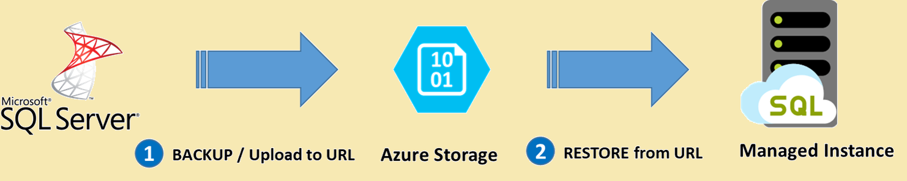

# Migration guide: SQL Server to SQL Managed Instance
[!INCLUDE[appliesto-sqldb-sqlmi](../../includes/appliesto-sqlmi.md)]

This guide helps you migrate your SQL Server instance to Azure SQL Managed Instance. 

You can migrate SQL Server running on-premises or on: 

- SQL Server on Virtual Machines  
- Amazon Web Services (AWS) EC2 
- Amazon Relational Database Service (AWS RDS) 
- Compute Engine (Google Cloud Platform - GCP)  
- Cloud SQL for SQL Server (Google Cloud Platform – GCP) 

For more migration information, see the [migration overview](sql-server-to-managed-instance-overview.md). For other scenarios, see the [Database Migration Guide](https://datamigration.microsoft.com/).

:::image type="content" source="media/sql-server-to-managed-instance-overview/migration-process-flow-small.png" alt-text="Migration process flow":::

## Prerequisites 

To migrate your SQL Server to Azure SQL Managed Instance, make sure to go through the following pre-requisites: 

- Choose a [migration method](sql-server-to-managed-instance-overview.md#migration-options) and the corresponding tools that are required for the chosen method
- Install [Data Migration Assistant (DMA)](https://www.microsoft.com/en-us/download/details.aspx?id=53595) on a machine that can connect to your source SQL Server
- Create [Azure Database Migration Service (DMS)](/azure/dms/quickstart-create-data-migration-service-portal)
- Create a target [Azure SQL Managed Instance](/azure/azure-sql/managed-instance/instance-create-quickstart)


## Pre-migration

After you've verified that your source environment is supported, start with the pre-migration stage. Discover all of the existing data sources, assess migration feasibility, and identify any blocking issues that might prevent your migration.  

### Discover

In the Discover phase, scan the network to identify all SQL Server instances and features used by your organization. 

Use [Azure Migrate](../../../migrate/migrate-services-overview.md) to assesses migration suitability of on-premises servers, perform performance-based sizing, and provide cost estimations for running them in Azure. 

Alternatively, use the [Microsoft Assessment and Planning Toolkit (the "MAP Toolkit")](https://www.microsoft.com/download/details.aspx?id=7826) to assess your current IT infrastructure. The toolkit provides a powerful inventory, assessment, and reporting tool to simplify the migration planning process. 

For more information about tools available to use for the Discover phase, see [Services and tools available for data migration scenarios](../../../dms/dms-tools-matrix.md). 

### Assess 

After data sources have been discovered, assess any on-premises SQL Server instance(s) that can be migrated to Azure SQL Managed Instance to identify migration blockers or compatibility issues. 

You can use the Data Migration Assistant (version 4.1 and later) to assess databases to get: 

- [Azure target recommendations](/sql/dma/dma-assess-sql-data-estate-to-sqldb)
- [Azure SKU recommendations](/sql/dma/dma-sku-recommend-sql-db)

To assess your environment using the Database Migration Assessment, follow these steps: 

1. Open the [Data Migration Assistant (DMA)](https://www.microsoft.com/en-us/download/details.aspx?id=53595). 
1. Select **File** and then choose **New assessment**. 
1. Specify a project name, select SQL Server as the source server type, and then select Azure SQL Managed Instance as the target server type. 
1. Select the type(s) of assessment reports that you want to generate. For example, database compatibility and feature parity. 
    - The **feature parity** category provides a comprehensive set of recommendations, alternatives available in Azure, and mitigating steps to help you plan your migration project. 
    - The **compatibility issues** category identifies partially supported or unsupported feature compatibility issues that might block migration as well as recommendations to address them. 
        > [!IMPORTANT]
        >Based on the type of assessment, the permissions required on the source SQL Server can be different. 
        > - For the **feature parity** advisor, the credentials provided to connect to source SQL Server database must be a member of the *sysadmin* server role.
        > - For the compatibility issues advisor, the credentials provided must have at least `CONNECT SQL`, `VIEW SERVER STATE` and `VIEW ANY DEFINITION` permissions.
        > - DMA will highlight the permissions required for the chosen advisor before running the assessment.
1. Specify the source connection details for your SQL Server and connect to the source database.
1. Select **Start assessment**. 
1. When the process is complete, select and review the assessment reports for migration blocking and feature parity issues. The assessment report can also be exported to a file that can be shared with other teams or personnel in your organization. 
1. Determine the database compatibility level that minimizes post-migration efforts.  
1. Identify the best Azure SQL Managed Instance SKU for your on-premises workload. 

To learn more, see [Perform a SQL Server migration assessment with Data Migration Assistant](/sql/dma/dma-assesssqlonprem).

If SQL Managed Instance is not a suitable target for your workload, SQL Server on Azure VMs might be a viable alternative target for your business. 

#### Scaled Assessments and Analysis
Data Migration Assistant supports performing scaled assessments and consolidation of the assessment reports for analysis. If you have multiple servers and databases that need to be assessed and analysed at scale to provide a wider view of the data estate, click on the following links to learn more.

- [Performing scaled assessments using Powershell](https://docs.microsoft.com/sql/dma/dma-consolidatereports?view=sqlallproducts-allversions)
- [Analyzing assessment reports using Power BI](https://docs.microsoft.com/sql/dma/dma-consolidatereports?view=sqlallproducts-allversions#dma-reports)

> [!IMPORTANT]
>Running assessments at scale for multiple databases can also be automated using [DMA's Command Line Utility](https://docs.microsoft.com/sql/dma/dma-commandline?view=sqlallproducts-allversions) which also allows the results to be uploaded to [Azure Migrate](https://docs.microsoft.com/sql/dma/dma-assess-sql-data-estate-to-sqldb?view=sqlallproducts-allversions#view-target-readiness-assessment-results) for further analysis and target readiness.

### Create a performance baseline

If you need to compare the performance of your workload on a SQL Managed Instance with your original workload running on SQL Server, create a performance baseline to use for comparison. See [performance baseline](sql-server-to-managed-instance-performance-baseline.md) to learn more. 

### Create SQL Managed Instance 

Based on the information in the discover and assess phase, create a right sized target SQL Managed Instance. You can do so by using the [Azure portal](../../managed-instance/instance-create-quickstart.md), [PowerShell](../../managed-instance/scripts/create-configure-managed-instance-powershell.md), or an [ARM Template](/../../managed-instance/create-template-quickstart.md). 


## Migrate

After you have completed tasks associated with the pre-migration stage, you are ready to perform the schema and data migration. You can migrate your data using your chosen [migration method](sql-server-to-managed-instance-overview.md#migration-options) based on your workload and scenario. While there are tools / utilities based migration options that can be leveraged to migrate your SQL Server databases to Azure SQL Managed Instance with minimal downtime, you can also take advantage of backing up your source SQL Server databases and natively restoring them on Azure SQL Managed Instance which is a unique capability in Azure SQL Managed Instance compared to other Azure SQL PaaS deployment models. The two most recommended options for migrating to Azure SQL Managed Instance are described below.

#### Migrate using DMS
To perform migrations using DMS, follow the steps below:
1. Register the **Microsoft.DataMigration** resource provider in your subscription if you are performing this for the first time.
1. Create an Azure Database Migration Service Instance in a desired location of your choice (preferably in the same region as your target Azure SQL Managed Instance) and select an existing virtual network or create a new one to host your DMS instance.
1. After creating your DMS instance, create a new migration project and specify the source server type as **SQL Server** and the target server type as **Azure SQL Database Managed Instance**. Also, choose the type of activity (online or offline data migration) in the migration project creation blade.
1. Specify the source SQL Server details in the Migration source detail screen and the target Azure SQL Managed Instance details in the Migration target details screen.
1. In the next steps of the Migration Wizard, **select the databases** you want to migrate, provide the configuration settings to **specify your SMB Network Share** (that contains your database backups files that can be accessed by DMS using the provided Windows user credentials) and **provide your Azure storage account details** that DMS can upload backup files from the SMB network share to.
1. Subsequently, review the migration summary based on the details you provided and click on **Run migration**. You can then monitor the migration activity and check the progress of your server objects. The migration process, essentially, copies your source SQL Server database's full and transaction log backups and restores them on the target SQL Managed Instance.
1. Finally, after your full database backup is restored on the target Azure SQL Managed Instance, the database is available for performing a migration cutover by selecting **Start Cutover**. At this stage, the migration process will copy the tail-log backup once you make it available in the SMB network share and restore it on the target.
1. It is important to note that during the cutover stage, you should stop all incoming traffic to your source database and update your application's connection string to point to the new Azure SQL Managed Instance database.

For a detailed step-by-step tutorial of this migration option, see [Migrate SQL Server to an Azure SQL Managed Instance online using DMS](/azure/dms/tutorial-sql-server-managed-instance-online). 
#### Migrate using native backup and restore
Native RESTORE of backups (.bak files) taken from a SQL Server instance, available on [Azure Storage](https://azure.microsoft.com/services/storage/) is one of the key capabilities of Azure SQL Managed Instance that enables quick and easy database migration.
> [!NOTE]
> The time taken to take the backup, upload it to Azure storage and perform a native restore operation to Azure SQL Managed Instance is based on the size of the database. Make sure you factor a sufficient downtime to accommodate this process if you running this for very large databases.

The following diagram provides a high-level overview of the process:



To perform migrations using native backup and restore which is an offline / asynchronous operation based on the size of your database, follow the steps below:
1. You can backup database(s) to Azure Blob storage service natively with SQL Server 2012 SP1 CU2 and above. Manage your backups to Azure Blob storage (also referred to as SQL Server Backup to URL) by following the instructions to [Backup with SSMS](https://docs.microsoft.com/sql/relational-databases/backup-restore/sql-server-backup-to-url?view=sqlallproducts-allversions#BackupTaskSSMS).
	> [!NOTE]
	> For SQL Server versions previous to SQL Server 2012 SP1 CU2, you can use the add-in SQL Server Backup to Microsoft Azure Tool to quickly and easily create backups to Microsoft Azure storage. For more information, see [download center](https://go.microsoft.com/fwlink/?LinkID=324399).
1. Next, connect to your Azure SQL Managed Instance using SSMS and create a credential (using Shared Access Signature) to access your Azure Blob Storage account that contains your source SQL Server database backup. A sample script to create a credential is below.
   ```sql
   CREATE CREDENTIAL [https://mitutorials.blob.core.windows.net/databases]
   WITH IDENTITY = 'SHARED ACCESS SIGNATURE'
   , SECRET = 'sv=2017-11-09&ss=bfqt&srt=sco&sp=rwdlacup&se=2028-09-06T02:52:55Z&st=2018-09-04T18:52:55Z&spr=https&sig=WOTiM%2FS4GVF%2FEEs9DGQR9Im0W%2BwndxW2CQ7%2B5fHd7Is%3D'
   ```
1. Run the restore from the backup provided in the Azure storage blob container. A sample script to restore from URL is below.
	```sql
   RESTORE DATABASE [TargetDatabaseName] FROM URL =
     'https://mitutorials.blob.core.windows.net/databases/WideWorldImporters-Standard.bak'
   ```
	> [!NOTE]
	> A database restore operation is asynchronous and retryable. You might get an error in SQL Server Management Studio if the connection breaks or a time-out expires. Azure SQL Database will keep trying to restore database in the background, and you can track the progress of the restore using the [sys.dm_exec_requests](https://docs.microsoft.com/sql/relational-databases/system-dynamic-management-views/sys-dm-exec-requests-transact-sql) and [sys.dm_operation_status](https://docs.microsoft.com/sql/relational-databases/system-dynamic-management-views/sys-dm-operation-status-azure-sql-database) views.
1. Once the restore operation is complete, you can view the database in Object Explorer in SSMS.

To learn more about this migration option, see [Restore a database to Azure SQL Managed Instance with SSMS](https://docs.microsoft.com/azure/azure-sql/managed-instance/restore-sample-database-quickstart).

## Data sync and cutover

When using migration options that continuously replicate / sync data changes from source to the target, the source data and schema can change and drift from the target. During data sync, ensure that all changes on the source are captured and applied to the target during the migration process. 

After you verify that data is same on both the source and the target, you can cutover from the source to the target environment. It is important to plan the cutover process with business / application teams to ensure minimal interruption during cutover does not affect business continuity. 

> [!IMPORTANT]
> For details on the specific steps associated with performing a cutover as part of migrations using DMS, see [Performing migration cutover](../../../dms/tutorial-sql-server-managed-instance-online.md#performing-migration-cutover).


## Post-migration

After you have successfully completed the migration stage, go through a series of post-migration tasks to ensure that everything is functioning smoothly and efficiently. 

The post-migration phase is crucial for reconciling any data accuracy issues and verifying completeness, as well as addressing performance issues with the workload. 

### Remediate applications 

After the data is migrated to the target environment, all the applications that formerly consumed the source need to start consuming the target. Accomplishing this will, in some cases, require changes to the applications.

### Perform tests

The test approach for database migration consists of the following activities:

1. **Develop validation tests**: To test database migration, you need to use SQL queries. You must create the validation queries to run against both the source and the target databases. Your validation queries should cover the scope you have defined.
1. **Set up test environment**: The test environment should contain a copy of the source database and the target database. Be sure to isolate the test environment.
1. **Run validation tests**: Run the validation tests against the source and the target, and then analyze the results.
1. **Run performance tests**: Run performance test against the source and the target, and then analyze and compare the results.

   > [!NOTE]
   > For assistance developing and running post-migration validation tests, consider the Data Quality Solution available from the partner [QuerySurge](https://www.querysurge.com/company/partners/microsoft). 


## Leverage advanced features 

Be sure to take advantage of the advanced cloud-based features offered by SQL Managed Instance, such as [built-in high availability](../../database/high-availability-sla.md), [threat detection](../../database/advanced-data-security.md), and [monitoring and tuning your workload](../../database/monitor-tune-overview.md). 

[Azure SQL Analytics](../../../azure-monitor/insights/azure-sql.md) allows you to monitor a large set of managed instances in a centralized manner.

Some SQL Server features are only available once the [database compatibility level](/sql/relational-databases/databases/view-or-change-the-compatibility-level-of-a-database) is changed to the latest compatibility level (150). 


## Next steps

- For a matrix of the Microsoft and third-party services and tools that are available to assist you with various database and data migration scenarios as well as specialty tasks, see [Service and tools for data migration](../../../dms/dms-tools-matrix.md).

- To learn more about Azure SQL Managed Instance see:
   - [Service Tiers in Azure SQL Managed Instance](../../managed-instance/sql-managed-instance-paas-overview.md#service-tiers)
   - [Differences between SQL Server and Azure SQL Managed Instance](../../managed-instance/transact-sql-tsql-differences-sql-server.md)
   - [Azure total Cost of Ownership Calculator](https://azure.microsoft.com/pricing/tco/calculator/) 


- To learn more about the framework and adoption cycle for Cloud migrations, see
   -  [Cloud Adoption Framework for Azure](/azure/cloud-adoption-framework/migrate/azure-best-practices/contoso-migration-scale)
   -  [Best practices for costing and sizing workloads migrate to Azure](/azure/cloud-adoption-framework/migrate/azure-best-practices/migrate-best-practices-costs) 

- To assess the Application access layer, see [Data Access Migration Toolkit (Preview)](https://marketplace.visualstudio.com/items?itemName=ms-databasemigration.data-access-migration-toolkit)
- For details on how to perform Data Access Layer A/B testing see [Database Experimentation Assistant](/sql/dea/database-experimentation-assistant-overview).
