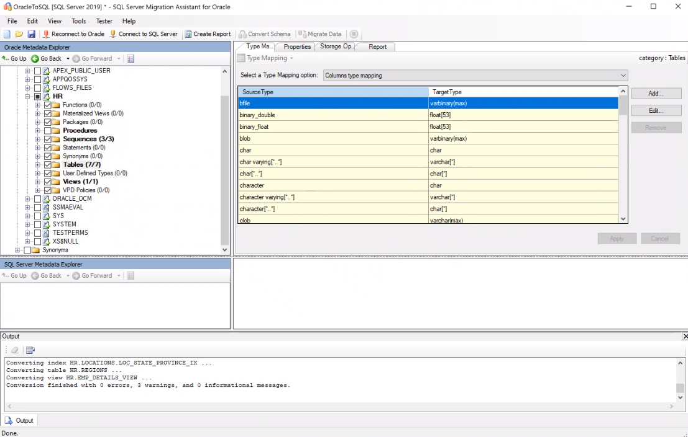
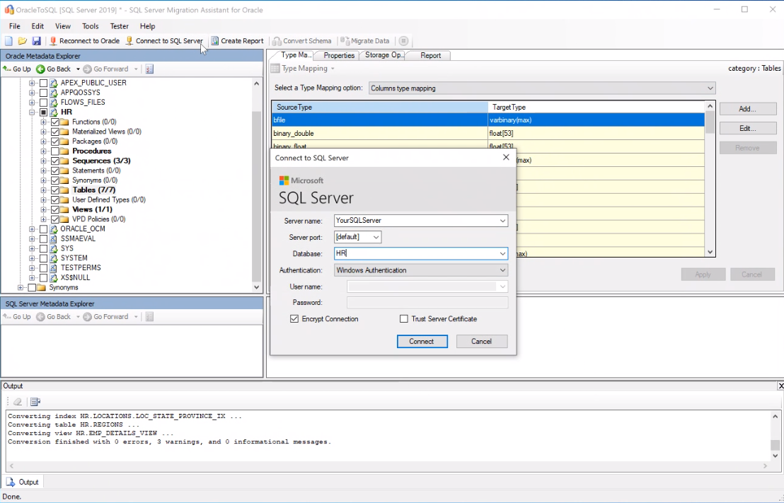
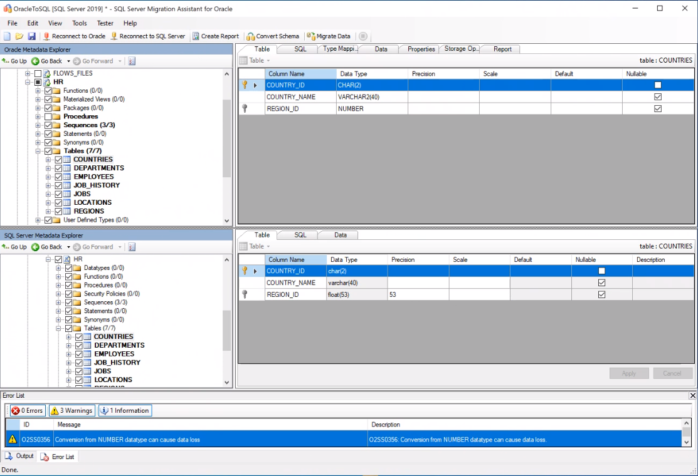

# Migration guide: Oracle to SQL Server on Azure VM
[!INCLUDE[appliesto-sqldb-sqlmi](../../includes/appliesto-sqldb.md)]

This guide teaches you to migrate your Oracle databases to SQL Server on Azure VM using SQL Server Migration Assistant for Oracle. 

For other scenarios, see the [Database Migration Guide](https://datamigration.microsoft.com/).

## Prerequisites 

To migrate your Oracle database to SQL Server on Azure VM, you need:

- To verify your source environment is supported.
- To download [SQL Server Migration Assistant (SSMA) for Oracle](https://www.microsoft.com/en-us/download/details.aspx?id=54258).
- A target [SQL Server VM](../../virtual-machines/windows/sql-vm-create-portal-quickstart.md).

## Pre-migration

As you prepare for migrating to the cloud, verify that your source environment is supported and that you have addressed any prerequisites. This will help to ensure an efficient and successful migration.

This part of the process involves conducting an inventory of the databases that you need to migrate, assessing those databases for potential migration issues or blockers, and then resolving any items you might have uncovered. 

> [!Important]
> SQL Server Migration Assistant for Oracle does not support migration of all Oracle features. For associated workarounds, see [Migration approach for selected Oracle features](https://blogs.msdn.microsoft.com/datamigration/2017/05/10/migration-approach-for-oracle-features/)

### Discover

Use the [MAP Toolkit](https://go.microsoft.com/fwlink/?LinkID=316883) to identify existing data sources and details about the features that are being used by your business to get a better understanding of and plan for the migration. This process involves scanning the network to identify all your organization's Oracle instances together with the version and features in use.

To use the MAP Toolkit to perform an inventory scan, follow these steps: 

1. Open the [MAP Toolkit](https://go.microsoft.com/fwlink/?LinkID=316883).
1. Select **Create/Select database**.

   

1. Select **Create an inventory database**, enter a name for the new inventory database you're creating, provide a brief description, and then select **OK**. 

   :::image type="content" source="media/oracle-to-sql-on-azure-vm-guide/create-inventory-database.png" alt-text="Create an inventory database":::

1. Select **Collect inventory data** to open the **Inventory and Assessment Wizard**. 

   :::image type="content" source="media/oracle-to-sql-on-azure-vm-guide/collect-inventory-data.png" alt-text="Create an inventory database":::

1. In the **Inventory and Assessment Wizard**, choose **Oracle** and then select **Next**. 

   

1. Choose the computer search option that best suits your business needs and environment, and then select **Next**: 

   

1. Either enter credentials or create new credentials for the systems that you want to explore, and then select **Next**.

    

1. Set the order of the credentials, and then select **Next**. 

     

1. Specify the credentials for each computer you want to discover. You can use unique credentials for every computer/machine, or you can choose to use the **All Computer Credentials** list.  

   

1. Verify your selection summary, and then select **Finish**.

   

1. After the scan completes, view the **Data Collection** summary report. The scan take a few minutes, and depends on the number of databases. Select **Close** when finished. 

   
      

1. Select **Options** to generate a report about the Oracle Assessment and database details. Select both options (one by one) to generate the report.

### Assess

After identifying the data sources, use the [SQL Server Migration Assistant (SSMA) for Oracle](https://www.microsoft.com/en-us/download/details.aspx?id=54258) to assess the Oracle instance(s) migrating to the SQL Server VM so that you understand the gaps between the two. Using the migration assistant, you can review database objects and data, assess databases for migration, migrate database objects to SQL Server, and then migrate data to SQL Server.

To create an assessment, follow these steps: 

1. Open the  [SQL Server Migration Assistant (SSMA) for Oracle](https://www.microsoft.com/en-us/download/details.aspx?id=54258). 
1. Select **File** and then choose **New Project**. 
1. Provide a project name, a location to save your project, and then select a SQL Server migration target from the drop-down. Select **OK**. 

   

1. Select **Connect to Oracle**, provide the connection details, and then select **Connect**.

   

1. In **Oracle Metadata Explorer**, select the Oracle schema, and then select **Create Report** to generate an HTML report with conversion statistics and error/warnings, if any..

   

1. Review the HTML report for conversion statistics, as well as errors and warnings. Analyze it to understand conversion issues and resolutions.

   

   This report can also be accessed from the SSMA projects folder as selected in the first screen. From the example above locate the report.xml file from: 

   `drive:\<username>\Documents\SSMAProjects\MyOracleMigration\report\report_2016_11_12T02_47_55\`

    and then open it in Excel to get an inventory of Oracle objects and the effort required to perform schema conversions.

### Validate data types

Validate the default data type mappings and change them based on requirements if necessary. To do so, follow these steps: 

1. Select **Tools** from the menu. 
1. Select **Project Settings**. 
1. Select the **Type mappings** tab. 

   

1. You can change the type mapping for each table by selecting the table in the **Oracle Metadata explorer**. 

### Convert schema

To convert the schema, follow these steps: 

1. (Optional) To convert dynamic or ad-hoc queries, right-click the node and choose **Add statement**.
1. Choose **Connect to SQL Server** from the top-line navigation bar and provide connection details for your SQL Server on Azure VM. You can choose to connect to an existing database or provide a new name, in which case a database will be created on the target server.

   

1. Right-click the schema and choose **Convert Schema**.

   

1. After the schema is finished converting, compare and review the structure of the schema to identify potential problems.

   

   You can save the project locally for an offline schema remediation exercise. You can do so by selecting **Save Project** from the **File** menu. This gives you an opportunity to evaluate the source and target schemas offline and perform remediation before you can publish the schema to SQL Server.

## Migrate

After you have the necessary prerequisites in place and have completed the tasks associated with the **Pre-migration** stage, you are ready to perform the schema and data migration. Migration involves two steps – publishing the schema and migrating the data. SSMA for Oracle is the correct tool to use for this process.

To publish the schema and migrate the data, follow these steps: 

1. Right-click the database from the **SQL Server Metadata Explorer**  and choose **Synchronize with Database**. This action publishes the Oracle schema to SQL Server on Azure VM. 

   

1. Right-click the Oracle schema from the **Oracle Metadata Explorer** and choose **Migrate Data**. Alternatively, you can select Migrate Data from the top-line navigation.

   

1. Provide connection details for Oracle and SQL Server on Azure VM at the dialog box.
1. After migration completes, view the Data Migration report:

    

1. Connect to your SQL Server on Azure VM using [SQL Server Management Studio](/sql/ssms/download-sql-server-management-studio-ssms) to review data and schema on your SQL Server instance. 

   

In addition to using SSMA, you can also use SQL Server Integration Services (SSIS) to migrate the data. To learn more, see: 
- The blog [SQL Server Migration Assistant: How to assess and migrate data from non-Microsoft data platforms to SQL Server](https://blogs.msdn.microsoft.com/datamigration/2016/11/16/sql-server-migration-assistant-how-to-assess-and-migrate-databases-from-non-microsoft-data-platforms-to-sql-server/).
- The article [Getting Started with SQL Server Integration Services](https://docs.microsoft.com//sql/integration-services/sql-server-integration-services).
- The white paper [SQL Server Integration Services: SSIS for Azure and Hybrid Data Movement](https://download.microsoft.com/download/D/2/0/D20E1C5F-72EA-4505-9F26-FEF9550EFD44/SSIS%20Hybrid%20and%20Azure.docx).

## Post-migration 

After you have successfully completed the **Migration** stage, you need to go through a series of post-migration tasks to ensure that everything is functioning as smoothly and efficiently as possible.

### Remediate applications

After the data is migrated to the target environment, all the applications that formerly consumed the source need to start consuming the target. Accomplishing this will in some cases require changes to the applications.

### Perform tests

The test approach for database migration consists of performing the following activities:

1. **Develop validation tests**. To test database migration, you need to use SQL queries. You must create the validation queries to run against both the source and the target databases. Your validation queries should cover the scope you have defined.

2. **Set up test environment**. The test environment should contain a copy of the source database and the target database. Be sure to isolate the test environment.

3. **Run validation tests**. Run the validation tests against the source and the target, and then analyze the results.

4. **Run performance tests**. Run performance test against the source and the target, and then analyze and compare the results.

> [!Note]
> For assistance with developing and running post-migration validation tests, consider the Data Quality Solution available from the partner [QuerySurge](http://www.querysurge.com/company/partners/microsoft).

### Optimize

The post-migration phase is crucial for reconciling any data accuracy issues and verifying completeness, as well as addressing performance issues with the workload.

> [!Note]
> For additional detail about these issues and specific steps to mitigate them, see the [Post-migration Validation and Optimization Guide](https://docs.microsoft.com//sql/relational-databases/post-migration-validation-and-optimization-guide).

## Migration assets 

For additional assistance with completing this migration scenario, please see the following resources, which were developed in support of a real-world migration project engagement.

| **Title/link**                                                                                                                                          | **Description**                                                                                                                                                                                                                                                                                                                                                                                       |
| ------------------------------------------------------------------------------------------------------------------------------------------------------- | ----------------------------------------------------------------------------------------------------------------------------------------------------------------------------------------------------------------------------------------------------------------------------------------------------------------------------------------------------------------------------------------------------- |
| [Data Workload Assessment Model and Tool](https://github.com/Microsoft/DataMigrationTeam/tree/master/Data%20Workload%20Assessment%20Model%20and%20Tool) | This tool provides suggested “best fit” target platforms, cloud readiness, and application/database remediation level for a given workload. It offers simple, one-click calculation and report generation that greatly helps to accelerate large estate assessments by providing and automated and uniform target platform decision process.                                                          |
| [Oracle Inventory Script Artifacts](https://github.com/Microsoft/DataMigrationTeam/tree/master/Oracle%20Inventory%20Script%20Artifacts)                 | This asset includes a PL/SQL query that hits Oracle system tables and provides a count of objects by schema type, object type, and status. It also provides a rough estimate of ‘Raw Data’ in each schema and the sizing of tables in each schema, with results stored in a CSV format.                                                                                                               |
| [SSMA Assessment Tool](https://github.com/Microsoft/DataMigrationTeam/tree/master/SSMA%20Assessment%20Tool)                                             | This set of resource uses a .csv file as entry (sources.csv in the project folders) to produce the xml files that are needed to run SSMA assessment in console mode. The source.csv is provided by the customer based on an inventory of existing Oracle instances. The output files are **AssessmentReportGeneration_source_1.xml**, **ServersConnectionFile.xml**, and **VariableValueFile.xml**. |
| [Oracle to SQL Server Migration Handbook](https://aka.ms/dmj-wp-oracle-sql-handbook)                                                                    | This document focuses on the tasks associated with migrating an Oracle database to the latest version of SQL Serverbase. If the migration requires changes to features/functionality, then the possible impact of each change on the applications that use the database must be considered carefully.                                                                                                 |
| [SSMA for Oracle Common Errors and how to fix them](https://aka.ms/dmj-wp-ssma-oracle-errors)                                                           | With Oracle, you can assign a non-scalar condition in the WHERE clause. However, SQL Server doesn’t support this type of condition. As a result, SQL Server Migration Assistant (SSMA) for Oracle doesn’t convert queries with a non-scalar condition in the WHERE clause, instead generating an error O2SS0001. This white paper provides more details on the issue and ways to resolve it.          |
| [Setting up Oracle 12c Enterprise and Getting It Working by Using the Azure Marketplace Template](https://aka.ms/dmj-wp-oracle12c-linux)                | This white paper provides a step-by-step walkthrough of setting up and implementing Oracle 12c Enterprise by using the Azure Marketplace Template.                                                                                                                                                                                                                                                    |

> [!Note]
> These resources were developed as part of the Data Migration Jumpstart Program (DM Jumpstart), which is sponsored by the Azure Data Group engineering team. The core charter DM Jumpstart is to unblock and accelerate complex modernization and compete data platform migration opportunities to Microsoft’s Azure Data platform. If you think your organization would be interested in participating in the DM Jumpstart program, please contact your account team and ask that they submit a nomination.

## Next steps

- To check the availability of services applicable to SQL Server see the [Azure Global infrastructure center](https://azure.microsoft.com/global-infrastructure/services/?regions=all&amp;products=synapse-analytics,virtual-machines,sql-database)

- For a matrix of the Microsoft and third-party services and tools that are available to assist you with various database and data migration scenarios as well as specialty tasks, see the article [Service and tools for data migration.](../../../dms/dms-tools-matrix.md)

- To learn more about Azure SQL see:
   - [Deployment options](../../azure-sql-iaas-vs-paas-what-is-overview.md)
   - [SQL Server on Azure VMs](../../virtual-machines/windows/sql-server-on-azure-vm-iaas-what-is-overview.md)
   - [Azure total Cost of Ownership Calculator](https://azure.microsoft.com/pricing/tco/calculator/) 

- To learn more about the framework and adoption cycle for Cloud migrations, see
   -  [Cloud Adoption Framework for Azure](/azure/cloud-adoption-framework/migrate/azure-best-practices/contoso-migration-scale)
   -  [Best practices for costing and sizing workloads migrate to Azure](/azure/cloud-adoption-framework/migrate/azure-best-practices/migrate-best-practices-costs) 

- For information about licensing, see
   - [Bring your own license with the Azure Hybrid Benefit](../../virtual-machines/windows/licensing-model-azure-hybrid-benefit-ahb-change.md)
   - [Get free extended support for SQL Server 2008 and SQL Server 2008 R2](../../virtual-machines/windows/sql-server-2008-extend-end-of-support.md)

- To assess the Application access layer, see [Data Access Migration Toolkit (Preview)](https://marketplace.visualstudio.com/items?itemName=ms-databasemigration.data-access-migration-toolkit)
- For details on how to perform Data Access Layer A/B testing see [Database Experimentation Assistant](/sql/dea/database-experimentation-assistant-overview).

