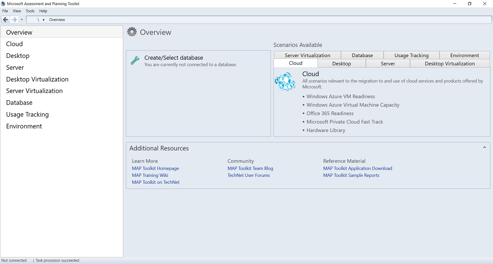
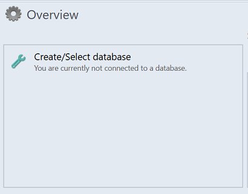
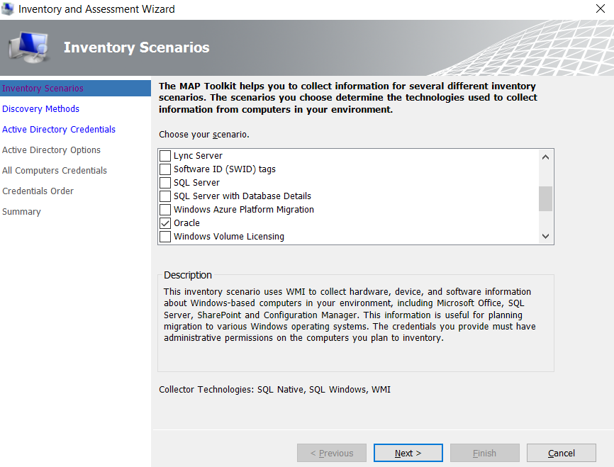
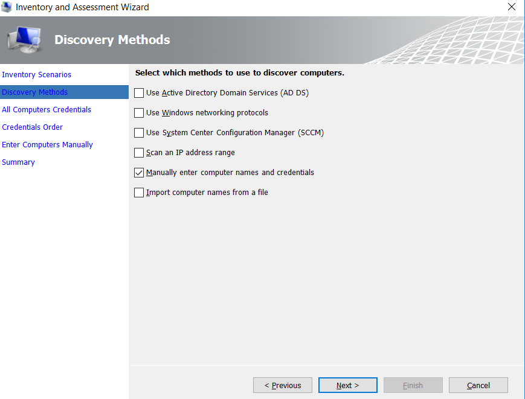
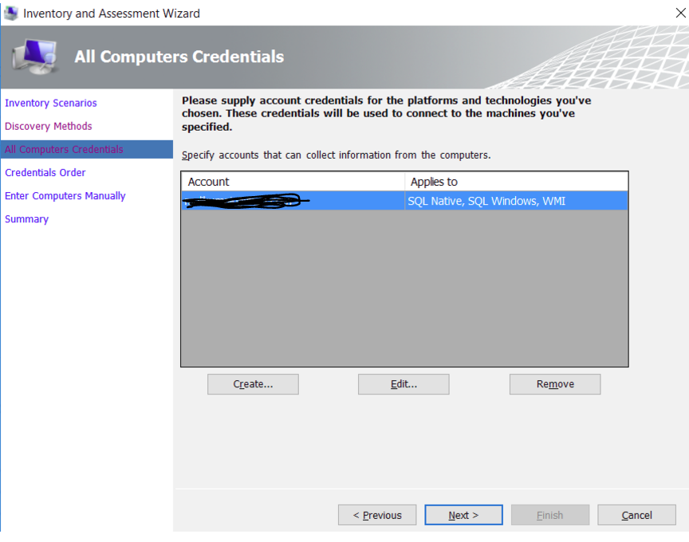
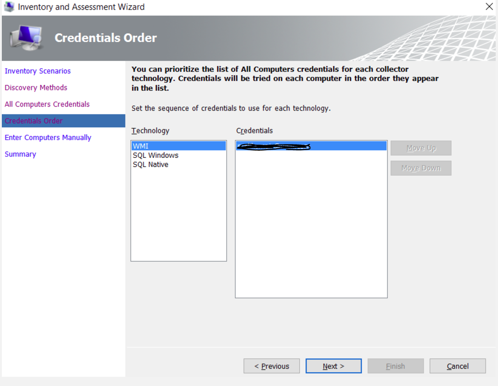
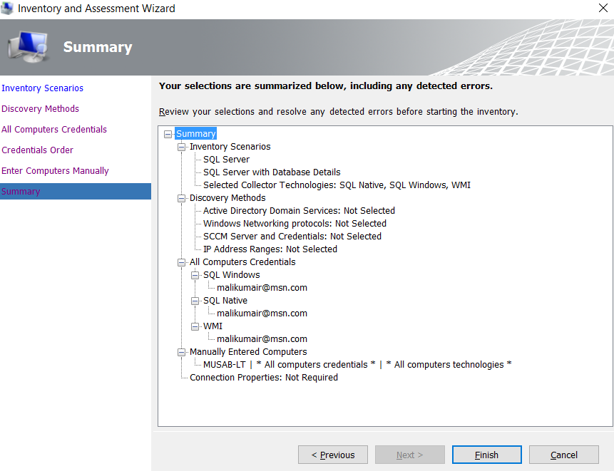
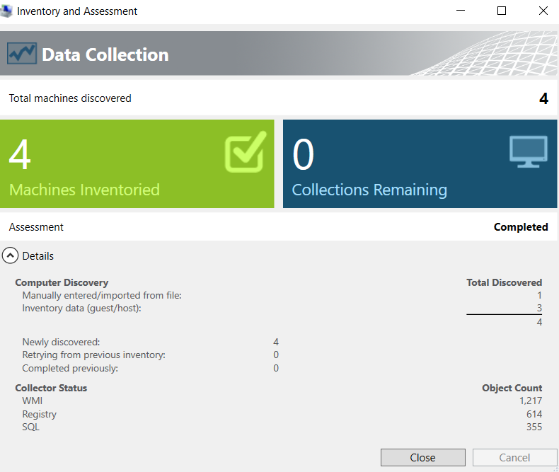
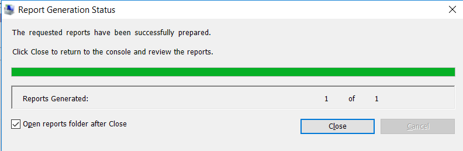
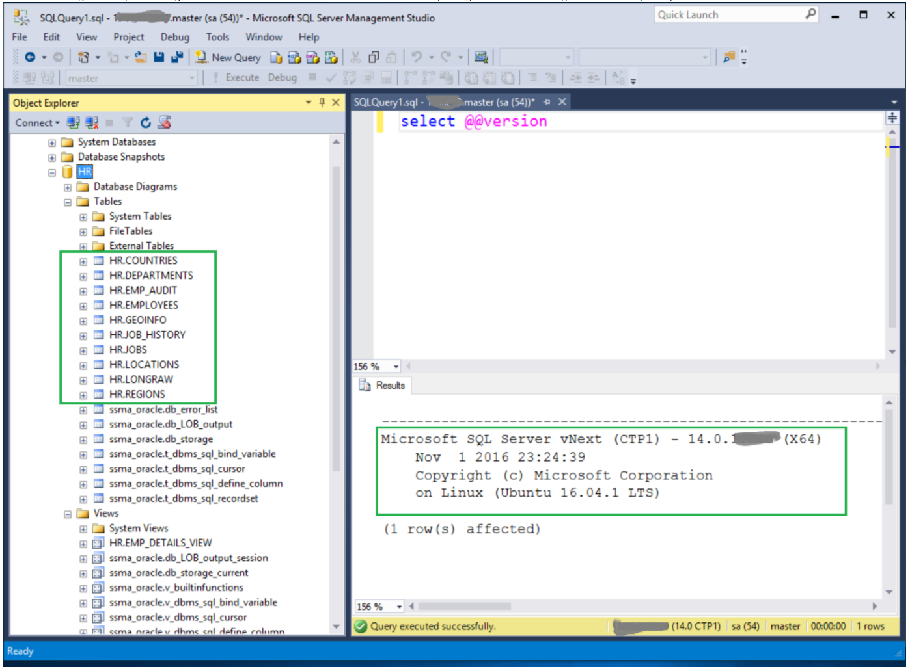

# Migration guide: Oracle to SQL Server on Azure VM
[!INCLUDE[appliesto-sqldb-sqlmi](../../includes/appliesto-sqldb.md)]

This guide teaches you to migrate your DB2 databases to Azure SQL Database using SQL Server Migration Assistant for DB2. 

For other scenarios, see the [Database Migration Guide](https://datamigration.microsoft.com/).

## Prerequisites 

To migrate your DB2 database to SQL Database, you need:

- to verify your source environment is supported.
- to download [SQL Server Migration Assistant (SSMA) for DB2](https://www.microsoft.com/download/details.aspx?id=54254).
- a target [Azure SQL Database](../../database/single-database-create-quickstart.md).

## Preparing for database migration

As you prepare for migrating your database to the cloud, verify that your source environment is supported and that you have addressed any prerequisites. This will help to ensure an efficient and successful migration.

### Overview

This scenario describes how to migrate an Oracle instance to SQL Server.

As you prepare for migrating to the cloud, verify that your source environment is supported and that you have addressed any prerequisites. This will help to ensure an efficient and successful migration.

### Migration assets from real-world engagements

For additional assistance with completing this migration scenario, please see the following resources, which were developed in support of a real-world migration project engagement.

| **Title/link**                                                                                                                                          | **Description**                                                                                                                                                                                                                                                                                                                                                                                       |
| ------------------------------------------------------------------------------------------------------------------------------------------------------- | ----------------------------------------------------------------------------------------------------------------------------------------------------------------------------------------------------------------------------------------------------------------------------------------------------------------------------------------------------------------------------------------------------- |
| [Data Workload Assessment Model and Tool](https://github.com/Microsoft/DataMigrationTeam/tree/master/Data%20Workload%20Assessment%20Model%20and%20Tool) | This tool provides suggested “best fit” target platforms, cloud readiness, and application/database remediation level for a given workload. It offers simple, one-click calculation and report generation that greatly helps to accelerate large estate assessments by providing and automated and uniform target platform decision process.                                                          |
| [Oracle Inventory Script Artifacts](https://github.com/Microsoft/DataMigrationTeam/tree/master/Oracle%20Inventory%20Script%20Artifacts)                 | This asset includes a PL/SQL query that hits Oracle system tables and provides a count of objects by schema type, object type, and status. It also provides a rough estimate of ‘Raw Data’ in each schema and the sizing of tables in each schema, with results stored in a CSV format.                                                                                                               |
| [SSMA Assessment Tool](https://github.com/Microsoft/DataMigrationTeam/tree/master/SSMA%20Assessment%20Tool)                                             | This set of resource uses a .csv file as entry (sources.csv in the project folders) to produce the xml files that are needed to run SSMA assessment in console mode. The source.csv is provided by the customer based on an inventory of existing Oracle instances. The output files are **AssessmentReportGeneration_source_1.xml**, **ServersConnectionFile.xml**, and **VariableValueFile.xml**. |
| [Oracle to SQL Server Migration Handbook](https://aka.ms/dmj-wp-oracle-sql-handbook)                                                                    | This document focuses on the tasks associated with migrating an Oracle database to the latest version of SQL Serverbase. If the migration requires changes to features/functionality, then the possible impact of each change on the applications that use the database must be considered carefully.                                                                                                 |
| [SSMA for Oracle Common Errors and how to fix them](https://aka.ms/dmj-wp-ssma-oracle-errors)                                                           | With Oracle, you can assign a non-scalar condition in the WHERE clause. However, SQL Server doesn’t support this type of condition. As a result, SQL Server Migration Assistant (SSMA) for Oracle doesn’t convert queries with a non-scalar condition in the WHERE clause, instead generating an error O2SS0001. This white paper provides more details on the issue and ways to resolve it.          |
| [Setting up Oracle 12c Enterprise and Getting It Working by Using the Azure Marketplace Template](https://aka.ms/dmj-wp-oracle12c-linux)                | This white paper provides a step-by-step walkthrough of setting up and implementing Oracle 12c Enterprise by using the Azure Marketplace Template.                                                                                                                                                                                                                                                    |

> [!Note]
> These resources were developed as part of the Data Migration Jumpstart Program (DM Jumpstart), which is sponsored by the Azure Data Group engineering team. The core charter DM Jumpstart is to unblock and accelerate complex modernization and compete data platform migration opportunities to Microsoft’s Azure Data platform. If you think your organization would be interested in participating in the DM Jumpstart program, please contact your account team and ask that they submit a nomination.

### Additional resources

  - Be sure to check out the [Azure Total Cost of Ownership (TCO) Calculator](https://aka.ms/azure-tco) to help estimate the cost savings you can realize by migrating your workloads to Azure.

  - For a matrix of the Microsoft and third-party services and tools that are available to assist you with various database and data migration scenarios as well as specialty tasks, see the article [Service and tools for data migration](https://docs.microsoft.com//azure/dms/dms-tools-matrix).

**Videos**

  - For an overview of the Azure Database Migration Guide and the information it contains, see the video [How to Use the Database Migration Guide](https://azure.microsoft.com/resources/videos/how-to-use-the-azure-database-migration-guide/).

  - For a walk through of the phases of the migration process and detail about the specific tools and services recommended to perform assessment and migration, see the video [Overview of the migration journey and the tools/services recommended for performing assessment and migration](https://azure.microsoft.com/resources/videos/overview-of-migration-and-recommended-tools-services/).

## Pre-migration overview

After verifying that your source environment is supported and ensuring that you have addressed any prerequisites, you are ready to start the Pre-migration stage. This part of the process involves conducting an inventory of the databases that you need to migrate, assessing those databases for potential migration issues or blockers, and then resolving any items you might have uncovered. For heterogenous migrations such as Oracle to Azure Database for PostgreSQL, this stage also involves converting the schema(s) in the source database(s) to be compatible with the target environment.

## Discover

The goal of the Discover phase is to identify existing data sources and details about the features that are being used to get a better understanding of and plan for the migration. This process involves scanning the network to identify all your organization’s Oracle instances together with the version and features in use.

### Steps

To use the MAP Toolkit to perform an inventory scan, perform the following steps.

  1. **Download the [MAP Toolkit](https://go.microsoft.com/fwlink/?LinkID=316883)**, and then install it.
  
  2. **Run the MAP toolkit**.
  
      1. Open the MAP toolkit, and then on the left pane, select **Database**.
      
          You will be on the following screen:
        
          
      
      2. Select **Create/Select database**.
      
                  
      
      3. Ensure that **Create an inventory database** is selected, enter a name for the database, a brief description, and then select **OK**.
      
          
      
          The next step is to collect data from the database created.
      
      4. Select **Collect inventory data**.
      
          
      
      5. In the Inventory and Assessment Wizard, select **Oracle**, and then select **Next**.
      
          
      
      6. Select the best method option to search the computers on which Microsoft Products are hosted, and then select **Next**.
      
          
      
      7. Enter credentianls or create new credentials for the systems that you want to explore, and then select **Next**.
      
          
      
      8. Set the order of the credentials.
      
            

      
          Now, you need to specify the credentials for each computer you want to discover. You can use unique credentials for every computer/machine, or you can choose to use the **All Computer Credentials** list.  

      
      9. After setting up the credentials, select **Save**, and then select **Next**.
      
          
      
      10. Verify your selection summary, and then select **Finish**.
      
          
      
      11. Wait for a few minutes (depending on the number of databases) for the Data Collection summary report.
      
          
      
      12. Select **Close**.
      
          The Main window of the tool appears, showing a summary of the Database Discovery completed so far.
  
  3. **Report generation and data collection**.
  
      On top right corner of the tool, an **Options** page appears, which you can use to generate a report about the Oracle Assessment and the Database Details.  

      
      1. Select both options (one by one) to generate the report.
      
          This will take a couple of seconds to a few minutes depending upon the size of the inventory comlpeted during discovery.
      
          

## Assess and convert

After identifying the data sources, the next step is to assess the Oracle instance(s) migrating to SQL Server database(s) so that you understand the gaps between the two.

By using the SQL Server Migration Assistant (SSMA) for Oracle, you can review database objects and data, assess databases for migration, migrate database objects to SQL Server, and then migrate data to SQL Server.

### Steps

To use SSMA for Oracle to create an assessment, perform the following steps.

  1. **Download [SSMA](https://www.microsoft.com/en-us/download/details.aspx?id=54258)**, and then install it.
  
  2. Create a new **Assessment project** to discover the conversion rate and effort to resolve any issues.
  
      1. On **File** menu, select **New Project**, specify the project name, a location to save your project, and the migration target.
      
          *Selecting the migration target is important to accurately assess the conversion rate and effort.*
      
      2. Select **OK**.
      
          
      
      3. Select **Connect to Oracle**, provide the connection details, and then select **Connect**.
      
          
      
      4. In the **Oracle Metadata Explorer**, select the Oracle schema, and then select **Create Report** to create the conversion report.
      
          
      
          This will generate an HTML report with conversion statistics and error/warnings, if any.
      
      5. Analyze this report to understand any conversion issues and their cause.
      
          
      
          You can also access this report from the SSMA projects folder as selected in the first screen.
      
      6. From the example above locate the report.xml file from:
      
          *drive:*\Users<username>\Documents\SSMAProjects\MyOracleMigration\report\report_2016_11_12T02_47_55\
      
          and then open it in Excel to get an inventory of Oracle objects and the effort required to perform schema conversions.
  
  3. **Perform schema conversion**.
  
      1. Before you perform schema conversion, validate the default datatype mappings or change them based on requirements.
      
          You could do this either by navigating to the **Tools** menu and selecting **Project Settings** or by changing the type mapping for each table by selecting the table in the **Oracle Metadata Explorer**.
      
          
      
          You can add dynamic or ad hoc queries to the **Statements** node by selecting that node and then selecting **Add Statement** on the right-click menu.
      
      2. To convert and move the schema to SQL Server, connect to the SQL server instance by providing the connection details in the **Connect to SQL Server** dialog box.
      
          You can choose to connect to an existing database or provide a new name, in which case a database will be created on the target server.
      
          
      
      3. Convert the schema by selecting **Convert Schema** from the right-click menu or the menu bar on the top.
      
          
      
      4. After schema conversion, compare and review the structure of the schema to identify potential problems.
      
          

## Migration overview

After you have the necessary prerequisites in place and have completed the tasks associated with the **Pre-migration** stage, you are ready to perform the schema and data migration.

## Migrate schema and data

After you have completed assessing your databases and addressing any discrepancies, the next step is to execute the migration process. Migration involves two steps – publishing the schema and migrating the data. SSMA for Oracle is the correct tool to use for this process.

### Steps

To use SSMA for Oracle to publish the database schema and migrate the data, perform the following steps.

  1. **Publish the schema to SQL Server**.
  
      1. After schema conversion, you can save the project locally for an offline schema remediation exercise. You can do so by selecting **Save Project** from the **File** menu. This gives you an opportunity to evaluate the source and target schemas offline and perform remediation before you can publish the schema to SQL Server.
      
      2. To publish the schema, select the database from the **Databases** node in the **SQL Server Metadata Explorer** and then selecting **Synchronize with Database** on the right-click menu.
      
          
      
          This action publishes the Oracle schema to the SQL Server instance.
  
  2. **Migrate data to SQL Server**.
  
      1. After publishing the schema to the SQL Server instance, select the Oracle schema from the **Oracle Metadata Explorer** and then selecting **Migrate Data** on the right-click menu.
      
      2. Provide connection details for Oracle and SQL Server in their respective connection dialogs to migrate the data.
      
          
      
      3. After the migration is complete, you can view the **Data Migration report**.
      
          
      
      4. Validate the migration by using SQL Server Management Studio (SSMS) to review the data and schema on the SQL Server instance.
      
          

> [!Important]
> SSMA does not support migration of all Oracle features. For associated workarounds, see the following resource:

  - [Migration approach for selected Oracle features](https://blogs.msdn.microsoft.com/datamigration/2017/05/10/migration-approach-for-oracle-features/)

In addition to using SSMA, you can also use SQL Server Integration Services (SSIS) to migrate the data.

> [!Note]
> For complete step-by-step guidance on publishing the schema and migrating the data, see the following resources:

  - The blog posting [SQL Server Migration Assistant: How to assess and migrate data from non-Microsoft data platforms to SQL Server](https://blogs.msdn.microsoft.com/datamigration/2016/11/16/sql-server-migration-assistant-how-to-assess-and-migrate-databases-from-non-microsoft-data-platforms-to-sql-server/).

  - The article [Getting Started with SQL Server Integration Services](https://docs.microsoft.com//sql/integration-services/sql-server-integration-services).

  - The white paper [SQL Server Integration Services: SSIS for Azure and Hybrid Data Movement](https://download.microsoft.com/download/D/2/0/D20E1C5F-72EA-4505-9F26-FEF9550EFD44/SSIS%20Hybrid%20and%20Azure.docx).

## Data sync and cutover

With minimal-downtime migrations, the source you are migrating continues to change, drifting from the target in terms of data and schema, after the one-time migration occurs. During the **Data sync** phase, you need to ensure that all changes in the source are captured and applied to the target in near real time. After you verify that all changes in source have been applied to the target, you can cutover from the source to the target environment.

The Azure Database Migration Service does not yet support minimal-downtime migrations for this scenario, so the **Data sync** and **Cutover** phases are not currently applicable.

## Post-migration overview

After you have successfully completed the **Migration** stage, you need to go through a series of post-migration tasks to ensure that everything is functioning as smoothly and efficiently as possible.

## Remediate applications

After the data is migrated to the target environment, all the applications that formerly consumed the source need to start consuming the target. Accomplishing this will in some cases require changes to the applications.

## Perform tests

The test approach for database migration consists of performing the following activities:

1. **Develop validation tests**. To test database migration, you need to use SQL queries. You must create the validation queries to run against both the source and the target databases. Your validation queries should cover the scope you have defined.

2. **Set up test environment**. The test environment should contain a copy of the source database and the target database. Be sure to isolate the test environment.

3. **Run validation tests**. Run the validation tests against the source and the target, and then analyze the results.

4. **Run performance tests**. Run performance test against the source and the target, and then analyze and compare the results.

> [!Note]
> For assistance with developing and running post-migration validation tests, consider the Data Quality Solution available from the partner [QuerySurge](http://www.querysurge.com/company/partners/microsoft).

## Optimize

The post-migration phase is crucial for reconciling any data accuracy issues and verifying completeness, as well as addressing performance issues with the workload.

> [!Note]
> For additional detail about these issues and specific steps to mitigate them, see the [Post-migration Validation and Optimization Guide](https://docs.microsoft.com//sql/relational-databases/post-migration-validation-and-optimization-guide).
