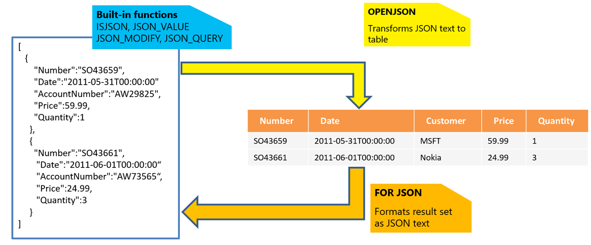

# Multi-model capabilities of Azure SQL Database and SQL Managed Instance
[!INCLUDE[appliesto-sqldb-sqlmi](includes/appliesto-sqldb-sqlmi.md)]

Multi-model databases enable you to store and work with data in multiple formats, such as relational data, graph, JSON or XML documents, spatial data, and key-value pairs.

The [Azure SQL family of products](azure-sql-iaas-vs-paas-what-is-overview.md) uses a relational model that provides the best performance for a variety of general-purpose applications. However, Azure SQL products like Azure SQL Database and SQL Managed Instance are not limited to relational data. They enable you to use non-relational formats that are tightly integrated into the relational model.

Consider using the multi-model capabilities of Azure SQL in the following cases:

- You have some information or structures that are a better fit for NoSQL models, and you don't want to use a separate NoSQL database.
- A majority of your data is suitable for a relational model, and you need to model some parts of your data in a NoSQL style.
- You want to use the Transact-SQL language to query and analyze both relational and NoSQL data, and then integrate that data with tools and applications that can use the SQL language.
- You want to apply database features such as [in-memory technologies](in-memory-oltp-overview.md) to improve the performance of your analytics or the processing of your NoSQL data structures. You can use [transactional replication](managed-instance/replication-transactional-overview.md) or [readable replicas](database/read-scale-out.md) to create copies of your data and offload some analytic workloads from the primary database.

The following sections describe the most important multi-model capabilities of Azure SQL.

> [!Note]
> You can use JSONPath expressions, XQuery/XPath expressions, spatial functions, and graph query expressions in the same Transact-SQL query to access any data that you stored in the database. Any tool or programming language that can execute Transact-SQL queries can also use that query interface to access multi-model data. This is the key difference from multi-model databases such as [Azure Cosmos DB](../cosmos-db/index.yml), which provide specialized APIs for data models.

## Graph features

Azure SQL products offer graph database capabilities to model many-to-many relationships in a database. A graph is a collection of nodes (or vertices) and edges (or relationships). A node represents an entity (for example, a person or an organization). An edge represents a relationship between the two nodes that it connects (for example, likes or friends). 

Here are some features that make a graph database unique:

- Edges are first-class entities in a graph database. They can have attributes or properties associated with them.
- A single edge can flexibly connect multiple nodes in a graph database.
- You can express pattern matching and multi-hop navigation queries easily.
- You can express transitive closure and polymorphic queries easily.

[Graph relationships and graph query capabilities](/sql/relational-databases/graphs/sql-graph-overview) are integrated into Transact-SQL and receive the benefits of using the SQL Server database engine as the foundational database management system. Graph features use standard Transact-SQL queries enhanced with the graph `MATCH` operator to query the graph data.

A relational database can achieve anything that a graph database can. However, a graph database can make it easier to express certain queries. Your decision to choose one over the other can be based on the following factors:

- You need to model hierarchical data where one node can have multiple parents, so you can't use [the hierarchyId data type](/sql/t-sql/data-types/hierarchyid-data-type-method-reference).
- Your application has complex many-to-many relationships. As the application evolves, new relationships are added.
- You need to analyze interconnected data and relationships.
- You want to use graph-specific T-SQL search conditions such as [SHORTEST_PATH](/sql/relational-databases/graphs/sql-graph-shortest-path).

## JSON features

In Azure SQL products, you can parse and query data represented in [JavaScript Object Notation (JSON)](https://www.json.org/) format, and export your relational data as JSON text. [JSON](/sql/relational-databases/json/json-data-sql-server) is a core feature of the SQL Server database engine.

JSON features enable you to put JSON documents in tables, transform relational data into JSON documents, and transform JSON documents into relational data. You can use the standard Transact-SQL language enhanced with JSON functions for parsing documents. You can also use non-clustered indexes, columnstore indexes, or memory-optimized tables to optimize your queries.

JSON is a popular data format for exchanging data in modern web and mobile applications. JSON is also used for storing semistructured data in log files or in NoSQL databases. Many REST web services return results formatted as JSON text or accept data formatted as JSON. 

Most Azure services have REST endpoints that return or consume JSON. These services include [Azure Cognitive Search](https://azure.microsoft.com/services/search/), [Azure Storage](https://azure.microsoft.com/services/storage/), and [Azure Cosmos DB](https://azure.microsoft.com/services/cosmos-db/).

If you have JSON text, you can extract data from JSON or verify that JSON is properly formatted by using the built-in functions [JSON_VALUE](/sql/t-sql/functions/json-value-transact-sql), [JSON_QUERY](/sql/t-sql/functions/json-query-transact-sql), and [ISJSON](/sql/t-sql/functions/isjson-transact-sql). The other functions are:

- [JSON_MODIFY](/sql/t-sql/functions/json-modify-transact-sql): Lets you update values inside JSON text. 
- [OPENJSON](/sql/t-sql/functions/openjson-transact-sql): Can transform an array of JSON objects into a set of rows, for more advanced querying and analysis. Any SQL query can be executed on the returned result set. 
- [FOR JSON](/sql/relational-databases/json/format-query-results-as-json-with-for-json-sql-server): Lets you format data stored in your relational tables as JSON text.



For more information, see [How to work with JSON data](database/json-features.md). 

You can use document models instead of the relational models in some specific scenarios:

- High normalization of the schema doesn't bring significant benefits because you access all the fields of the objects at once, or you never update normalized parts of the objects. However, the normalized model increases the complexity of your queries because you need to join a large number of tables to get the data.
- You're working with applications that natively use JSON documents for communication or data models, and you don't want to introduce more layers that transform relational data into JSON and vice versa.
- You need to simplify your data model by denormalizing child tables or Entity-Object-Value patterns.
- You need to load or export data stored in JSON format without an additional tool that parses the data.

## XML features

XML features enable you to store and index XML data in your database and use native XQuery/XPath operations to work with XML data. Azure SQL products have a specialized, built-in XML data type and query functions that process XML data.

The SQL Server database engine provides a powerful platform for developing applications to manage semistructured data. [Support for XML](/sql/relational-databases/xml/xml-data-sql-server) is integrated into all the components of the database engine and includes:

- The ability to store XML values natively in an XML data-type column that can be typed according to a collection of XML schemas or left untyped. You can index the XML column.
- The ability to specify an XQuery query against XML data stored in columns and variables of the XML type. You can use XQuery functionalities in any Transact-SQL query that accesses a data model that you use in your database.
- Automatic indexing of all elements in XML documents by using the [primary XML index](/sql/relational-databases/xml/xml-indexes-sql-server#primary-xml-index). Or you can specify the exact paths that should be indexed by using the [secondary XML index](/sql/relational-databases/xml/xml-indexes-sql-server#secondary-xml-indexes).
- `OPENROWSET`, which allows the bulk loading of XML data.
- The ability to transform relational data into XML format.

You can use document models instead of the relational models in some specific scenarios:

- High normalization of the schema doesn't bring significant benefits because you access all the fields of the objects at once, or you never update normalized parts of the objects. However, the normalized model increases the complexity of your queries because you need to join a large number of tables to get the data.
- You're working with applications that natively use XML documents for communication or data models, and you don't want to introduce more layers that transform relational data into JSON and vice versa.
- You need to simplify your data model by denormalizing child tables or Entity-Object-Value patterns.
- You need to load or export data stored in XML format without an additional tool that parses the data.

## Spatial features

Spatial data represents information about the physical location and shape of objects. These objects can be point locations or more complex objects such as countries/regions, roads, or lakes.

Azure SQL supports two spatial data types: 

- The geometry type represents data in a Euclidean (flat) coordinate system.
- The geography type represents data in a round-earth coordinate system.

Spatial features in Azure SQL enable you to store geometrical and geographical data. You can use spatial objects in Azure SQL to parse and query data represented in JSON format, and export your relational data as JSON text. These spatial objects include [Point](/sql/relational-databases/spatial/point), [LineString](/sql/relational-databases/spatial/linestring), and [Polygon](/sql/relational-databases/spatial/polygon). Azure SQL also provides specialized [spatial indexes](/sql/relational-databases/spatial/spatial-indexes-overview) that you can use to improve the performance of your spatial queries.

[Spatial support](/sql/relational-databases/spatial/spatial-data-sql-server) is a core feature of the SQL Server database engine.

## Key-value pairs

Azure SQL products don't have specialized types or structures that support key-value pairs, because key-value structures can be natively represented as standard relational tables:

```sql
CREATE TABLE Collection (
  Id int identity primary key,
  Data nvarchar(max)
)
```

You can customize this key-value structure to fit your needs without any constraints. As an example, the value can be an XML document instead of the `nvarchar(max)` type. If the value is a JSON document, you can use a `CHECK` constraint that verifies the validity of JSON content. You can put any number of values related to one key in the additional columns. For example:

- Add computed columns and indexes to simplify and optimize data access.
- Define the table as a memory-optimized, schema-only table to get better performance.

For an example of how a relational model can be effectively used as a key-value pair solution in practice, see [How bwin is using SQL Server 2016 In-Memory OLTP to achieve unprecedented performance and scale](/archive/blogs/sqlcat/how-bwin-is-using-sql-server-2016-in-memory-oltp-to-achieve-unprecedented-performance-and-scale). In this case study, bwin used a relational model for its ASP.NET caching solution to achieve 1.2 million batches per second.

## Next steps

Multi-model capabilities are core SQL Server database engine features that are shared among Azure SQL products. To learn more about these features, see these articles:

- [Graph processing with SQL Server and Azure SQL Database](/sql/relational-databases/graphs/sql-graph-overview)
- [JSON data in SQL Server](/sql/relational-databases/json/json-data-sql-server)
- [Spatial data in SQL Server](/sql/relational-databases/spatial/spatial-data-sql-server)
- [XML data in SQL Server](/sql/relational-databases/xml/xml-data-sql-server)
- [Key-value store performance in Azure SQL Database](https://devblogs.microsoft.com/azure-sql/azure-sql-database-as-a-key-value-store/)
