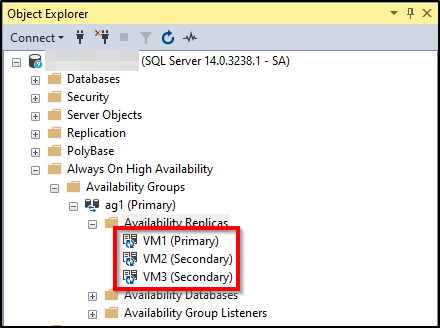

# Tutorial: Configure availability groups for SQL Server on RHEL virtual machines in Azure 
[!INCLUDE[appliesto-sqlvm](../../includes/appliesto-sqlvm.md)]

> [!NOTE]
> The tutorial presented is in **public preview**. 
>
> We use SQL Server 2017 with RHEL 7.6 in this tutorial, but it is possible to use SQL Server 2019 in RHEL 7 or RHEL 8 to configure high availability. The commands to configure availability group resources has changed in RHEL 8, and you'll want to look at the article [Create availability group resource](/sql/linux/sql-server-linux-availability-group-cluster-rhel#create-availability-group-resource) and RHEL 8 resources for more information on the correct commands.

In this tutorial, you learn how to:

> [!div class="checklist"]
> - Create a new resource group, availability set, and Linux virtual machines (VMs)
> - Enable high availability (HA)
> - Create a Pacemaker cluster
> - Configure a fencing agent by creating a STONITH device
> - Install SQL Server and mssql-tools on RHEL
> - Configure SQL Server Always On availability group
> - Configure availability group (AG) resources in the Pacemaker cluster
> - Test a failover and the fencing agent

This tutorial will use the Azure CLI to deploy resources in Azure.

If you don't have an Azure subscription, create a [free account](https://azure.microsoft.com/free/?WT.mc_id=A261C142F) before you begin.

[!INCLUDE [cloud-shell-try-it.md](../../../../includes/cloud-shell-try-it.md)]

If you prefer to install and use the CLI locally, this tutorial requires Azure CLI version 2.0.30 or later. Run `az --version` to find the version. If you need to install or upgrade, see [Install Azure CLI]( /cli/azure/install-azure-cli).

## Create a resource group

If you have more than one subscription, [set the subscription](/cli/azure/manage-azure-subscriptions-azure-cli) that you want deploy these resources to.

Use the following command to create a resource group `<resourceGroupName>` in a region. Replace `<resourceGroupName>` with a name of your choosing. We're using `East US 2` for this tutorial. For more information, see the following [Quickstart](../../../application-gateway/quick-create-cli.md).

```azurecli-interactive
az group create --name <resourceGroupName> --location eastus2
```

## Create an availability set

The next step is to create an availability set. Run the following command in Azure Cloud Shell, and replace `<resourceGroupName>` with your resource group name. Choose a name for `<availabilitySetName>`.

```azurecli-interactive
az vm availability-set create \
    --resource-group <resourceGroupName> \
    --name <availabilitySetName> \
    --platform-fault-domain-count 2 \
    --platform-update-domain-count 2
```

You should get the following results once the command completes:

```output
{
  "id": "/subscriptions/<subscriptionId>/resourceGroups/<resourceGroupName>/providers/Microsoft.Compute/availabilitySets/<availabilitySetName>",
  "location": "eastus2",
  "name": "<availabilitySetName>",
  "platformFaultDomainCount": 2,
  "platformUpdateDomainCount": 2,
  "proximityPlacementGroup": null,
  "resourceGroup": "<resourceGroupName>",
  "sku": {
    "capacity": null,
    "name": "Aligned",
    "tier": null
  },
  "statuses": null,
  "tags": {},
  "type": "Microsoft.Compute/availabilitySets",
  "virtualMachines": []
}
```

## Create RHEL VMs inside the availability set

> [!WARNING]
> If you choose a Pay-As-You-Go (PAYG) RHEL image, and configure high availability (HA), you may be required to register your subscription. This can cause you to pay twice for the subscription, as you will be charged for the Microsoft Azure RHEL subscription for the VM, and a subscription to Red Hat. For more information, see https://access.redhat.com/solutions/2458541.
>
> To avoid being "double billed", use a RHEL HA image when creating the Azure VM. Images offered as RHEL-HA images are also PAYG images with HA repo pre-enabled.

1. Get a list of virtual machine images that offer RHEL with HA:

    ```azurecli-interactive
    az vm image list --all --offer "RHEL-HA"
    ```

    You should see the following results:

    ```output
    [
            {
              "offer": "RHEL-HA",
              "publisher": "RedHat",
              "sku": "7.4",
              "urn": "RedHat:RHEL-HA:7.4:7.4.2019062021",
              "version": "7.4.2019062021"
            },
            {
              "offer": "RHEL-HA",
              "publisher": "RedHat",
              "sku": "7.5",
              "urn": "RedHat:RHEL-HA:7.5:7.5.2019062021",
              "version": "7.5.2019062021"
            },
            {
              "offer": "RHEL-HA",
              "publisher": "RedHat",
              "sku": "7.6",
              "urn": "RedHat:RHEL-HA:7.6:7.6.2019062019",
              "version": "7.6.2019062019"
            }
    ]
    ```

    For this tutorial, we're choosing the image `RedHat:RHEL-HA:7.6:7.6.2019062019`.

    > [!IMPORTANT]
    > Machine names must be less than 15 characters to set up availability group. Username cannot contain upper case characters, and passwords must have more than 12 characters.

1. We want to create 3 VMs in the availability set. Replace the following in the command below:

    - `<resourceGroupName>`
    - `<VM-basename>`
    - `<availabilitySetName>`
    - `<VM-Size>` - An example would be "Standard_D16_v3"
    - `<username>`
    - `<adminPassword>`

    ```azurecli-interactive
    for i in `seq 1 3`; do
           az vm create \
             --resource-group <resourceGroupName> \
             --name <VM-basename>$i \
             --availability-set <availabilitySetName> \
             --size "<VM-Size>"  \
             --image "RedHat:RHEL-HA:7.6:7.6.2019062019" \
             --admin-username "<username>" \
             --admin-password "<adminPassword>" \
             --authentication-type all \
             --generate-ssh-keys
    done
    ```

The above command creates the VMs, and creates a default VNet for those VMs. For more information on the different configurations, see the [az vm create](https://docs.microsoft.com/cli/azure/vm) article.

You should get results similar to the following once the command completes for each VM:

```output
{
  "fqdns": "",
  "id": "/subscriptions/<subscriptionId>/resourceGroups/<resourceGroupName>/providers/Microsoft.Compute/virtualMachines/<VM1>",
  "location": "eastus2",
  "macAddress": "<Some MAC address>",
  "powerState": "VM running",
  "privateIpAddress": "<IP1>",
  "publicIpAddress": "",
  "resourceGroup": "<resourceGroupName>",
  "zones": ""
}
```

> [!IMPORTANT]
> The default image that is created with the above command creates a 32GB OS disk by default. You could potentially run out of space with this default installation. You can use the following parameter added to the above `az vm create` command to create an OS disk with 128GB as an example: `--os-disk-size-gb 128`.
>
> You can then [configure Logical Volume Manager (LVM)](../../../virtual-machines/linux/configure-lvm.md) if you need to expand appropriate folder volumes to accomodate your installation.

### Test connection to the created VMs

Connect to VM1 or the other VMs using the following command in Azure Cloud Shell. If you are unable to find your VM IPs, follow this [Quickstart on Azure Cloud Shell](../../../cloud-shell/quickstart.md#ssh-into-your-linux-vm).

```azurecli-interactive
ssh <username>@publicipaddress
```

If the connection is successful, you should see the following output representing the Linux terminal:

```output
[<username>@<VM1> ~]$
```

Type `exit` to leave the SSH session.

## Enable high availability

> [!IMPORTANT]
> In order to complete this portion of the tutorial, you must have a subscription for RHEL and the High Availability Add-on. If you are using an image recommended in the previous section, you do not have to register another subscription.
 
Connect to each VM node and follow the guide below to enable HA. For more information, see [enable high availability subscription for RHEL](/sql/linux/sql-server-linux-availability-group-cluster-rhel#enable-the-high-availability-subscription-for-rhel).

> [!TIP]
> It will be easier if you open an SSH session to each of the VMs simultaneously as the same commands will need to be run on each VM throughout the article.
>
> If you are copying and pasting multiple `sudo` commands, and are prompted for a password, the additional commands will not run. Run each command separately.


1. Run the following commands on each VM to open the Pacemaker firewall ports:

    ```bash
    sudo firewall-cmd --permanent --add-service=high-availability
    sudo firewall-cmd --reload
    ```

1. Update and install Pacemaker packages on all nodes using the following commands:

    > [!NOTE]
    > **nmap** is installed as part of this command block as a tool to find available IP addresses in your network. You do not have to install **nmap**, but it will be useful later in this tutorial.

    ```bash
    sudo yum update -y
    sudo yum install -y pacemaker pcs fence-agents-all resource-agents fence-agents-azure-arm nmap
    sudo reboot
    ```

1. Set the password for the default user that is created when installing Pacemaker packages. Use the same password on all nodes.

    ```bash
    sudo passwd hacluster
    ```

1. Use the following command to open the hosts file and set up host name resolution. For more information, see [Configure AG](/sql/linux/sql-server-linux-availability-group-configure-ha#prerequisites) on configuring the hosts file.

    ```
    sudo vi /etc/hosts
    ```

    In the **vi** editor, enter `i` to insert text, and on a blank line, add the **Private IP** of the corresponding VM. Then add the VM name after a space next to the IP. Each line should have a separate entry.

    ```output
    <IP1> <VM1>
    <IP2> <VM2>
    <IP3> <VM3>
    ```

    > [!IMPORTANT]
    > We recommend that you use your **Private IP** address above. Using the Public IP address in this configuration will cause the setup to fail and we don't recommend exposing your VM to external networks.

    To exit the **vi** editor, first hit the **Esc** key, and then enter the command `:wq` to write the file and quit.

## Create the Pacemaker cluster

In this section, we will enable and start the pcsd service, and then configure the cluster. For SQL Server on Linux, the cluster resources are not created automatically. We'll need to enable and create the pacemaker resources manually. For more information, see the article on [configuring a failover cluster instance for RHEL](/sql/linux/sql-server-linux-shared-disk-cluster-red-hat-7-configure#install-and-configure-pacemaker-on-each-cluster-node)

### Enable and start pcsd service and Pacemaker

1. Run the commands on all nodes. These commands allow the nodes to rejoin the cluster after reboot.

    ```bash
    sudo systemctl enable pcsd
    sudo systemctl start pcsd
    sudo systemctl enable pacemaker
    ``` 

1. Remove any existing cluster configuration from all nodes. Run the following command:

    ```bash
    sudo pcs cluster destroy 
    sudo systemctl enable pacemaker 
    ```

1. On the primary node, run the following commands to set up the cluster.

    - When running the `pcs cluster auth` command to authenticate the cluster nodes, you will be prompted for a password. Enter the password for the **hacluster** user created earlier.

    ```bash
    sudo pcs cluster auth <VM1> <VM2> <VM3> -u hacluster
    sudo pcs cluster setup --name az-hacluster <VM1> <VM2> <VM3> --token 30000
    sudo pcs cluster start --all
    sudo pcs cluster enable --all
    ```

1. Run the following command to check that all nodes are online.

    ```bash
    sudo pcs status
    ```

    If all nodes are online, you will see an output similar to the following:

    ```output
    Cluster name: az-hacluster
     
    WARNINGS:
    No stonith devices and stonith-enabled is not false
     
    Stack: corosync
    Current DC: <VM2> (version 1.1.19-8.el7_6.5-c3c624ea3d) - partition with quorum
    Last updated: Fri Aug 23 18:27:57 2019
    Last change: Fri Aug 23 18:27:56 2019 by hacluster via crmd on <VM2>
     
    3 nodes configured
    0 resources configured
     
    Online: [ <VM1> <VM2> <VM3> ]
     
    No resources
     
     
    Daemon Status:
          corosync: active/enabled
          pacemaker: active/enabled
          pcsd: active/enabled
    ```

1. Set expected votes in the live cluster to 3. This command only affects the live cluster, and does not change the configuration files.

    On all nodes, set the expected votes with the following command:

    ```bash
    sudo pcs quorum expected-votes 3
    ```

## Configure the fencing agent

A STONITH device provides a fencing agent. The below instructions are modified for this tutorial. For more information, see [create a STONITH device](../../../virtual-machines/workloads/sap/high-availability-guide-rhel-pacemaker.md#create-stonith-device).
 
[Check the version of the Azure Fence Agent to ensure that it's updated](../../../virtual-machines/workloads/sap/high-availability-guide-rhel-pacemaker.md#cluster-installation). Use the following command:

```bash
sudo yum info fence-agents-azure-arm
```

You should see a similar output to the below example.

```output
Loaded plugins: langpacks, product-id, search-disabled-repos, subscription-manager
Installed Packages
Name        : fence-agents-azure-arm
Arch        : x86_64
Version     : 4.2.1
Release     : 11.el7_6.8
Size        : 28 k
Repo        : installed
From repo   : rhel-ha-for-rhel-7-server-eus-rhui-rpms
Summary     : Fence agent for Azure Resource Manager
URL         : https://github.com/ClusterLabs/fence-agents
License     : GPLv2+ and LGPLv2+
Description : The fence-agents-azure-arm package contains a fence agent for Azure instances.
```

### Register a new application in Azure Active Directory
 
 1. Go to https://portal.azure.com
 2. Open the [Azure Active Directory blade](https://ms.portal.azure.com/#blade/Microsoft_AAD_IAM/ActiveDirectoryMenuBlade/Properties). Go to Properties and write down the Directory ID. This is the `tenant ID`
 3. Click [**App registrations**](https://ms.portal.azure.com/#blade/Microsoft_AAD_RegisteredApps/ApplicationsListBlade)
 4. Click **New registration**
 5. Enter a **Name** like `<resourceGroupName>-app`, select **Accounts in this organization directory only**
 6. Select Application Type **Web**, enter a sign-on URL (for example http://localhost) and click Add. The sign-on URL is not used and can be any valid URL. Once done, Click **Register**
 7. Select **Certificates and secrets** for your new App registration, then click **New client secret**
 8. Enter a description for a new key (client secret), select **Never expires** and click **Add**
 9. Write down the value of the secret. It is used as the password for the Service Principal
10. Select **Overview**. Write down the Application ID. It is used as the username (login ID in the steps below) of the Service Principal
 
### Create a custom role for the fence agent

Follow the tutorial to [Create a custom role for Azure resources using Azure CLI](../../../role-based-access-control/tutorial-custom-role-cli.md#create-a-custom-role).

Your json file should look similar to the following:

- Replace `<username>` with a name of your choice. This is to avoid any duplication when creating this role definition.
- Replace `<subscriptionId>` with your Azure Subscription ID.

```json
{
  "Name": "Linux Fence Agent Role-<username>",
  "Id": null,
  "IsCustom": true,
  "Description": "Allows to power-off and start virtual machines",
  "Actions": [
    "Microsoft.Compute/*/read",
    "Microsoft.Compute/virtualMachines/powerOff/action",
    "Microsoft.Compute/virtualMachines/start/action"
  ],
  "NotActions": [
  ],
  "AssignableScopes": [
    "/subscriptions/<subscriptionId>"
  ]
}
```

To add the role, run the following command:

- Replace `<filename>` with the name of the file.
- If you are executing the command from a path other than the folder that the file is saved to, include the folder path of the file in the command.

```bash
az role definition create --role-definition "<filename>.json"
```

You should see the following output:

```output
{
  "assignableScopes": [
    "/subscriptions/<subscriptionId>"
  ],
  "description": "Allows to power-off and start virtual machines",
  "id": "/subscriptions/<subscriptionId>/providers/Microsoft.Authorization/roleDefinitions/<roleNameId>",
  "name": "<roleNameId>",
  "permissions": [
    {
      "actions": [
        "Microsoft.Compute/*/read",
        "Microsoft.Compute/virtualMachines/powerOff/action",
        "Microsoft.Compute/virtualMachines/start/action"
      ],
      "dataActions": [],
      "notActions": [],
      "notDataActions": []
    }
  ],
  "roleName": "Linux Fence Agent Role-<username>",
  "roleType": "CustomRole",
  "type": "Microsoft.Authorization/roleDefinitions"
}
```

### Assign the custom role to the Service Principal

Assign the custom role `Linux Fence Agent Role-<username>` that was created in the last step to the Service Principal. Do not use the Owner role anymore!
 
1. Go to https://portal.azure.com
2. Open the [All resources blade](https://ms.portal.azure.com/#blade/HubsExtension/BrowseAll)
3. Select the virtual machine of the first cluster node
4. Click **Access control (IAM)**
5. Click **Add a role assignment**
6. Select the role `Linux Fence Agent Role-<username>` from the **Role** list
7. In the **Select** list, enter the name of the application you created above, `<resourceGroupName>-app`
8. Click **Save**
9. Repeat the steps above for the all cluster node.

### Create the STONITH devices

Run the following commands on node 1:

- Replace the `<ApplicationID>` with the ID value from your application registration.
- Replace the `<servicePrincipalPassword>` with the value from the client secret.
- Replace the `<resourceGroupName>` with the resource group from your subscription used for this tutorial.
- Replace the `<tenantID>` and the `<subscriptionId>` from your Azure Subscription.

```bash
sudo pcs property set stonith-timeout=900
sudo pcs stonith create rsc_st_azure fence_azure_arm login="<ApplicationID>" passwd="<servicePrincipalPassword>" resourceGroup="<resourceGroupName>" tenantId="<tenantID>" subscriptionId="<subscriptionId>" power_timeout=240 pcmk_reboot_timeout=900
```

Since we already added a rule to our firewall to allow the HA service (`--add-service=high-availability`), there's no need to open the following firewall ports on all nodes: 2224, 3121, 21064, 5405. However, if you are experiencing any type of connection issues with HA, use the following command to open these ports that are associated with HA.

> [!TIP]
> You can optionally add all ports in this tutorial at once to save some time. The ports that need to be opened are explained in their relative sections below. If you would like to add all ports now, add the additional ports: 1433 and 5022.

```bash
sudo firewall-cmd --zone=public --add-port=2224/tcp --add-port=3121/tcp --add-port=21064/tcp --add-port=5405/tcp --permanent
sudo firewall-cmd --reload
```

## Install SQL Server and mssql-tools
 
Use the below section to install SQL Server and mssql-tools on the VMs. Perform each of these actions on all nodes. For more information, see [Install SQL Server on a Red Hat VM](/sql/linux/quickstart-install-connect-red-hat).

### Installing SQL Server on the VMs

The following commands are used to install SQL Server:

```bash
sudo curl -o /etc/yum.repos.d/mssql-server.repo https://packages.microsoft.com/config/rhel/7/mssql-server-2017.repo
sudo yum install -y mssql-server
sudo /opt/mssql/bin/mssql-conf setup
sudo yum install mssql-server-ha
```

### Open firewall port 1433 for remote connections

You'll need to open port 1433 on the VM in order to connect remotely. Use the following commands to open port 1433 in the firewall of each VM:

```bash
sudo firewall-cmd --zone=public --add-port=1433/tcp --permanent
sudo firewall-cmd --reload
```

### Installing SQL Server command-line tools

The following commands are used to install SQL Server command-line tools. For more information, see [install the SQL Server command-line tools](/sql/linux/quickstart-install-connect-red-hat#tools).

```bash
sudo curl -o /etc/yum.repos.d/msprod.repo https://packages.microsoft.com/config/rhel/7/prod.repo
sudo yum install -y mssql-tools unixODBC-devel
```
 
> [!NOTE] 
> For convenience, add /opt/mssql-tools/bin/ to your PATH environment variable. This enables you to run the tools without specifying the full path. Run the following commands to modify the PATH for both login sessions and interactive/non-login sessions:</br></br>
`echo 'export PATH="$PATH:/opt/mssql-tools/bin"' >> ~/.bash_profile`</br>
`echo 'export PATH="$PATH:/opt/mssql-tools/bin"' >> ~/.bashrc`</br>
`source ~/.bashrc`


### Check the status of the SQL Server

Once you are done with the configuration, you can check the status of SQL Server and verify that it is running:

```bash
systemctl status mssql-server --no-pager
```

You should see the following output:

```output
● mssql-server.service - Microsoft SQL Server Database Engine
   Loaded: loaded (/usr/lib/systemd/system/mssql-server.service; enabled; vendor preset: disabled)
   Active: active (running) since Thu 2019-12-05 17:30:55 UTC; 20min ago
     Docs: https://docs.microsoft.com/en-us/sql/linux
 Main PID: 11612 (sqlservr)
   CGroup: /system.slice/mssql-server.service
           ├─11612 /opt/mssql/bin/sqlservr
           └─11640 /opt/mssql/bin/sqlservr
```

## Configure an availability group

Use the following steps to configure a SQL Server Always On availability group for your VMs. For more information, see [Configure SQL Server Always On availability groups for high availability on Linux](/sql/linux/sql-server-linux-availability-group-configure-ha)

### Enable Always On availability groups and restart mssql-server

Enable Always On availability groups on each node that hosts a SQL Server instance. Then restart mssql-server. Run the following script:

```
sudo /opt/mssql/bin/mssql-conf set hadr.hadrenabled 1
sudo systemctl restart mssql-server
```

### Create a certificate

We currently don't support AD authentication to the AG endpoint. Therefore, we must use a certificate for AG endpoint encryption.

1. Connect to **all nodes** using SQL Server Management Studio (SSMS) or SQL CMD. Run the following commands to enable an AlwaysOn_health session and create a master key:

    > [!IMPORTANT]
    > If you are connecting remotely to your SQL Server instance, you will need to have port 1433 open on your firewall. You'll also need to allow inbound connections to port 1433 in your NSG for each VM. For more information, see [Create a security rule](../../../virtual-network/manage-network-security-group.md#create-a-security-rule) for creating an inbound security rule.

    - Replace the `<Master_Key_Password>` with your own password.


    ```sql
    ALTER EVENT SESSION  AlwaysOn_health ON SERVER WITH (STARTUP_STATE=ON);
    GO
    CREATE MASTER KEY ENCRYPTION BY PASSWORD = '<Master_Key_Password>';
    ```

 
1. Connect to the primary replica using SSMS or SQL CMD. The below commands will create a certificate at `/var/opt/mssql/data/dbm_certificate.cer` and a private key at `var/opt/mssql/data/dbm_certificate.pvk` on your primary SQL Server replica:

    - Replace the `<Private_Key_Password>` with your own password.
    
    ```sql
    CREATE CERTIFICATE dbm_certificate WITH SUBJECT = 'dbm';
    GO
    
    BACKUP CERTIFICATE dbm_certificate
       TO FILE = '/var/opt/mssql/data/dbm_certificate.cer'
       WITH PRIVATE KEY (
               FILE = '/var/opt/mssql/data/dbm_certificate.pvk',
               ENCRYPTION BY PASSWORD = '<Private_Key_Password>'
           );
    GO
    ```

Exit the SQL CMD session by running the `exit` command, and return back to your SSH session.
 
### Copy the certificate to the secondary replicas and create the certificates on the server

1. Copy the two files that were created to the same location on all servers that will host availability replicas.
 
    On the primary server, run the following `scp` command to copy the certificate to the target servers:

    - Replace `<username>` and `<VM2>` with the user name and target VM name that you are using.
    - Run this command for all secondary replicas.

    > [!NOTE]
    > You don't have to run `sudo -i`, which gives you the root environment. You could just run the `sudo` command in front of each command as we previously did in this tutorial.

    ```bash
    # The below command allows you to run commands in the root environment
    sudo -i
    ```

    ```bash
    scp /var/opt/mssql/data/dbm_certificate.* <username>@<VM2>:/home/<username>
    ```

1. On the target server, run the following command:

    - Replace `<username>` with your user name.
    - The `mv` command moves the files or directory from one place to another.
    - The `chown` command is used to change the owner and group of files, directories, or links.
    - Run these commands for all secondary replicas.

    ```bash
    sudo -i
    mv /home/<username>/dbm_certificate.* /var/opt/mssql/data/
    cd /var/opt/mssql/data
    chown mssql:mssql dbm_certificate.*
    ```

1. The following Transact-SQL script creates a certificate from the backup that you created on the primary SQL Server replica. Update the script with strong passwords. The decryption password is the same password that you used to create the .pvk file in the previous step. To create the certificate, run the following script using SQL CMD or SSMS on all secondary servers:

    ```sql
    CREATE CERTIFICATE dbm_certificate
        FROM FILE = '/var/opt/mssql/data/dbm_certificate.cer'
        WITH PRIVATE KEY (
        FILE = '/var/opt/mssql/data/dbm_certificate.pvk',
        DECRYPTION BY PASSWORD = '<Private_Key_Password>'
                );
    GO
    ```

### Create the database mirroring endpoints on all replicas

Run the following script on all SQL Server instances using SQL CMD or SSMS:

```sql
CREATE ENDPOINT [Hadr_endpoint]
    AS TCP (LISTENER_PORT = 5022)
    FOR DATABASE_MIRRORING (
    ROLE = ALL,
    AUTHENTICATION = CERTIFICATE dbm_certificate,
ENCRYPTION = REQUIRED ALGORITHM AES
);
GO

ALTER ENDPOINT [Hadr_endpoint] STATE = STARTED;
GO
```

### Create the availability group

Connect to the SQL Server instance that hosts the primary replica using SQL CMD or SSMS. Run the following command to create the availability group:

- Replace `ag1` with your desired Availability Group name.
- Replace the `<VM1>`, `<VM2>`, and `<VM3>` values with the names of the SQL Server instances that host the replicas.

```sql
CREATE AVAILABILITY GROUP [ag1]
     WITH (DB_FAILOVER = ON, CLUSTER_TYPE = EXTERNAL)
     FOR REPLICA ON
         N'<VM1>'
          WITH (
             ENDPOINT_URL = N'tcp://<VM1>:5022',
             AVAILABILITY_MODE = SYNCHRONOUS_COMMIT,
             FAILOVER_MODE = EXTERNAL,
             SEEDING_MODE = AUTOMATIC
             ),
         N'<VM2>'
          WITH (
             ENDPOINT_URL = N'tcp://<VM2>:5022',
             AVAILABILITY_MODE = SYNCHRONOUS_COMMIT,
             FAILOVER_MODE = EXTERNAL,
             SEEDING_MODE = AUTOMATIC
             ),
         N'<VM3>'
         WITH(
            ENDPOINT_URL = N'tcp://<VM3>:5022',
            AVAILABILITY_MODE = SYNCHRONOUS_COMMIT,
            FAILOVER_MODE = EXTERNAL,
            SEEDING_MODE = AUTOMATIC
            );
GO

ALTER AVAILABILITY GROUP [ag1] GRANT CREATE ANY DATABASE;
GO
```

### Create a SQL Server login for Pacemaker

On all SQL Server instances, create a SQL Server login for Pacemaker. The following Transact-SQL creates a login.

- Replace `<password>` with your own complex password.

```sql
USE [master]
GO

CREATE LOGIN [pacemakerLogin] with PASSWORD= N'<password>';
GO

ALTER SERVER ROLE [sysadmin] ADD MEMBER [pacemakerLogin];
GO
```

On all SQL Server instances, save the credentials used for the SQL Server login. 

1. Create the file:

    ```bash
    sudo vi /var/opt/mssql/secrets/passwd
    ```

1. Add the following 2 lines to the file:

    ```bash
    pacemakerLogin
    <password>
    ```

    To exit the **vi** editor, first hit the **Esc** key, and then enter the command `:wq` to write the file and quit.

1. Make the file only readable by root:

    ```bash
    sudo chown root:root /var/opt/mssql/secrets/passwd
    sudo chmod 400 /var/opt/mssql/secrets/passwd
    ```

### Join secondary replicas to the availability group

1. In order to join the secondary replicas to the AG, you'll need to open port 5022 on the firewall for all servers. Run the following command in your SSH session:

    ```bash
    sudo firewall-cmd --zone=public --add-port=5022/tcp --permanent
    sudo firewall-cmd --reload
    ```

1. On your secondary replicas, run the following commands to join them to the AG:

    ```sql
    ALTER AVAILABILITY GROUP [ag1] JOIN WITH (CLUSTER_TYPE = EXTERNAL);
    GO

    ALTER AVAILABILITY GROUP [ag1] GRANT CREATE ANY DATABASE;
    GO
    ```

1. Run the following Transact-SQL script on the primary replica and each secondary replica:

    ```sql
    GRANT ALTER, CONTROL, VIEW DEFINITION ON AVAILABILITY GROUP::ag1 TO pacemakerLogin;
    GO
    
    GRANT VIEW SERVER STATE TO pacemakerLogin;
    GO
    ```

1. Once the secondary replicas are joined, you can see them in SSMS Object Explorer by expanding the **Always On High Availability** node:

    

### Add a database to the availability group

We will follow the [configure availability group article on adding a database](/sql/linux/sql-server-linux-availability-group-configure-ha#add-a-database-to-the-availability-group).

The following Transact-SQL commands are used in this step. Run these commands on the primary replica:

```sql
CREATE DATABASE [db1]; -- creates a database named db1
GO

ALTER DATABASE [db1] SET RECOVERY FULL; -- set the database in full recovery mode
GO

BACKUP DATABASE [db1] -- backs up the database to disk
   TO DISK = N'/var/opt/mssql/data/db1.bak';
GO

ALTER AVAILABILITY GROUP [ag1] ADD DATABASE [db1]; -- adds the database db1 to the AG
GO
```

### Verify that the database is created on the secondary servers

On each secondary SQL Server replica, run the following query to see if the db1 database was created and is in a SYNCHRONIZED state:

```
SELECT * FROM sys.databases WHERE name = 'db1';
GO
SELECT DB_NAME(database_id) AS 'database', synchronization_state_desc FROM sys.dm_hadr_database_replica_states;
```

If the `synchronization_state_desc` lists SYNCHRONIZED for `db1`, this means the replicas are synchronized. The secondaries are showing `db1` in the primary replica.

## Create availability group resources in the Pacemaker cluster

We will be following the guide to [create the availability group resources in the Pacemaker cluster](/sql/linux/sql-server-linux-create-availability-group#create-the-availability-group-resources-in-the-pacemaker-cluster-external-only).

### Create the AG cluster resource

1. Use the following command to create the resource `ag_cluster` in the availability group `ag1`.

    ```bash
    sudo pcs resource create ag_cluster ocf:mssql:ag ag_name=ag1 meta failure-timeout=30s master notify=true
    ```

1. Check your resource and ensure that they are online before proceeding using the following command:

    ```bash
    sudo pcs resource
    ```

    You should see the following output:

    ```output
    [<username>@VM1 ~]$ sudo pcs resource
    Master/Slave Set: ag_cluster-master [ag_cluster]
    Masters: [ <VM1> ]
    Slaves: [ <VM2> <VM3> ]
    ```

### Create a virtual IP resource

1. Use an available static IP address from your network to create a virtual IP resource. You can find one using the command tool `nmap`.

    ```bash
    nmap -sP <IPRange>
    # For example: nmap -sP 10.0.0.*
    # The above will scan for all IP addresses that are already occupied in the 10.0.0.x space.
    ```

1. Set the **stonith-enabled** property to false

    ```bash
    sudo pcs property set stonith-enabled=false
    ```

1. Create the virtual IP resource by using the following command:

    - Replace the `<availableIP>` value below with an unused IP address.

    ```bash
    sudo pcs resource create virtualip ocf:heartbeat:IPaddr2 ip=<availableIP>
    ```

### Add constraints

1. To ensure that the IP address and the AG resource are running on the same node, a colocation constraint must be configured. Run the following command:

    ```bash
    sudo pcs constraint colocation add virtualip ag_cluster-master INFINITY with-rsc-role=Master
    ```

1. Create an ordering constraint to ensure that the AG resource is up and running before the IP address. While the colocation constraint implies an ordering constraint, this enforces it.

    ```bash
    sudo pcs constraint order promote ag_cluster-master then start virtualip
    ```

1. To verify the constraints, run the following command:

    ```bash
    sudo pcs constraint list --full
    ```

    You should see the following output:

    ```
    Location Constraints:
    Ordering Constraints:
          promote ag_cluster-master then start virtualip (kind:Mandatory) (id:order-ag_cluster-master-virtualip-mandatory)
    Colocation Constraints:
          virtualip with ag_cluster-master (score:INFINITY) (with-rsc-role:Master) (id:colocation-virtualip-ag_cluster-master-INFINITY)
    Ticket Constraints:
    ```

### Re-enable stonith

We're ready for testing. Re-enable stonith in the cluster by running the following command on Node 1:

```bash
sudo pcs property set stonith-enabled=true
```

### Check cluster status

You can check the status of your cluster resources using the following command:

```output
[<username>@VM1 ~]$ sudo pcs status
Cluster name: az-hacluster
Stack: corosync
Current DC: <VM3> (version 1.1.19-8.el7_6.5-c3c624ea3d) - partition with quorum
Last updated: Sat Dec  7 00:18:38 2019
Last change: Sat Dec  7 00:18:02 2019 by root via cibadmin on VM1

3 nodes configured
5 resources configured

Online: [ <VM1> <VM2> <VM3> ]

Full list of resources:

 Master/Slave Set: ag_cluster-master [ag_cluster]
     Masters: [ <VM2> ]
     Slaves: [ <VM1> <VM3> ]
 virtualip      (ocf::heartbeat:IPaddr2):       Started <VM2>
 rsc_st_azure   (stonith:fence_azure_arm):      Started <VM1>

Daemon Status:
  corosync: active/enabled
  pacemaker: active/enabled
  pcsd: active/enabled
```

## Test failover

To ensure that the configuration has succeeded so far, we will test a failover. For more information, see [Always On availability group failover on Linux](/sql/linux/sql-server-linux-availability-group-failover-ha).

1. Run the following command to manually fail over the primary replica to `<VM2>`. Replace `<VM2>` with the value of your server name.

    ```bash
    sudo pcs resource move ag_cluster-master <VM2> --master
    ```

1. If you check your constraints again, you'll see that another constraint was added because of the manual failover:

    ```output
    [<username>@VM1 ~]$ sudo pcs constraint list --full
    Location Constraints:
          Resource: ag_cluster-master
            Enabled on: VM2 (score:INFINITY) (role: Master) (id:cli-prefer-ag_cluster-master)
    Ordering Constraints:
            promote ag_cluster-master then start virtualip (kind:Mandatory) (id:order-ag_cluster-master-virtualip-mandatory)
    Colocation Constraints:
            virtualip with ag_cluster-master (score:INFINITY) (with-rsc-role:Master) (id:colocation-virtualip-ag_cluster-master-INFINITY)
    Ticket Constraints:
    ```

1. Remove the constraint with ID `cli-prefer-ag_cluster-master` using the following command:

    ```bash
    sudo pcs constraint remove cli-prefer-ag_cluster-master
    ```

1. Check your cluster resources using the command `sudo pcs resource`, and you should see that the primary instance is now `<VM2>`.

    ```output
    [<username>@<VM1> ~]$ sudo pcs resource
    Master/Slave Set: ag_cluster-master [ag_cluster]
         ag_cluster (ocf::mssql:ag):        FAILED <VM1> (Monitoring)
         Masters: [ <VM2> ]
         Slaves: [ <VM3> ]
    virtualip      (ocf::heartbeat:IPaddr2):       Started <VM2>
    [<username>@<VM1> ~]$ sudo pcs resource
    Master/Slave Set: ag_cluster-master [ag_cluster]
         Masters: [ <VM2> ]
         Slaves: [ <VM1> <VM3> ]
    virtualip      (ocf::heartbeat:IPaddr2):       Started <VM2>
    ```

## Test fencing

You can test STONITH by running the following command. Try running the below command from `<VM1>` for `<VM3>`.

```bash
sudo pcs stonith fence <VM3> --debug
```

> [!NOTE]
> By default, the fence action brings the node off and then on. If you only want to bring the node offline, use the option `--off` in the command.

You should get the following output:

```output
[<username>@<VM1> ~]$ sudo pcs stonith fence <VM3> --debug
Running: stonith_admin -B <VM3>
Return Value: 0
--Debug Output Start--
--Debug Output End--
 
Node: <VM3> fenced
```
For more information on testing a fence device, see the following [Red Hat](https://access.redhat.com/documentation/en-us/red_hat_enterprise_linux/7/html/high_availability_add-on_reference/s1-stonithtest-haar) article.

## Next steps

In order to utilize an availability group listener for your SQL Server instances, you will need to create and configure a load balancer.

> [!div class="nextstepaction"]
> [Tutorial: Configure an availability group listener for SQL Server on RHEL virtual machines in Azure](rhel-high-availability-listener-tutorial.md)
