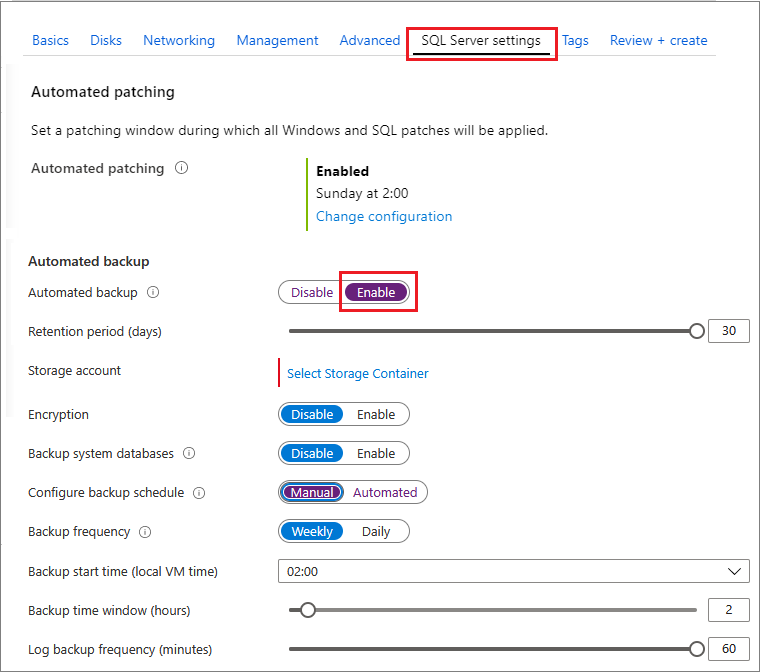
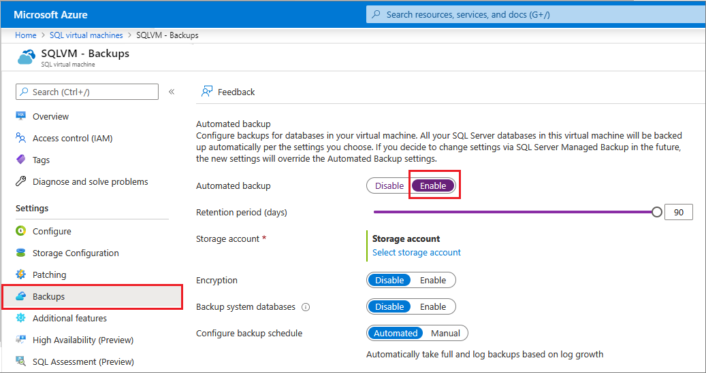

# Automated Backup v2 for Azure virtual machines (Resource Manager)
[!INCLUDE[appliesto-sqlvm](../../includes/appliesto-sqlvm.md)]

> [!div class="op_single_selector"]
> * [SQL Server 2014](automated-backup-sql-2014.md)
> * [SQL Server 2016/2017](automated-backup.md)

Automated Backup v2 automatically configures [Managed Backup to Microsoft Azure](https://msdn.microsoft.com/library/dn449496.aspx) for all existing and new databases on an Azure VM running SQL Server 2016/2017 Standard, Enterprise, or Developer editions. This enables you to configure regular database backups that utilize durable Azure blob storage. Automated Backup v2 depends on the [SQL Server infrastructure as a service (IaaS) Agent Extension](sql-server-iaas-agent-extension-automate-management.md).

[!INCLUDE [learn-about-deployment-models](../../../../includes/learn-about-deployment-models-rm-include.md)]

## Prerequisites
To use Automated Backup v2, review the following prerequisites:

**Operating system**:

- Windows Server 2012 R2 or higher

**SQL Server version/edition**:

- SQL Server 2016 or higher: Developer, Standard, or Enterprise

> [!IMPORTANT]
> Automated Backup v2 works with SQL Server 2016 or later. If you are using SQL Server 2014, you can use Automated Backup v1 to back up your databases. For more information, see [Automated Backup for SQL Server 2014 Azure virtual machines (VMs)](automated-backup-sql-2014.md).

**Database configuration**:

- Target databases must use the full recovery model. For more information about the impact of the full recovery model on backups, see [Backup under the full recovery model](https://technet.microsoft.com/library/ms190217.aspx).
- System databases do not have to use the full recovery model. However, if you require log backups to be taken for Model or MSDB, you must use the full recovery model.
- Target databases must be on either the default SQL Server instance or a [properly installed](frequently-asked-questions-faq.md#administration) named instance. 

> [!NOTE]
> Automated Backup relies on the **SQL Server IaaS Agent Extension**. Current SQL virtual machine gallery images add this extension by default. For more information, see [SQL Server IaaS Agent Extension](sql-server-iaas-agent-extension-automate-management.md).

## Settings
The following table describes the options that can be configured for Automated Backup v2. The actual configuration steps vary depending on whether you use the Azure portal or Azure Windows PowerShell commands.

### Basic Settings

| Setting | Range (Default) | Description |
| --- | --- | --- |
| **Automated Backup** | Enable/Disable (Disabled) | Enables or disables Automated Backup for an Azure VM running SQL Server 2016/2017 Developer, Standard, or Enterprise. |
| **Retention Period** | 1-30 days (30 days) | The number of days to retain backups. |
| **Storage Account** | Azure storage account | An Azure storage account to use for storing Automated Backup files in blob storage. A container is created at this location to store all backup files. The backup file naming convention includes the date, time, and database GUID. |
| **Encryption** |Enable/Disable (Disabled) | Enables or disables encryption. When encryption is enabled, the certificates used to restore the backup are located in the specified storage account. It uses the same **automatic backup** container with the same naming convention. If the password changes, a new certificate is generated with that password, but the old certificate remains to restore prior backups. |
| **Password** |Password text | A password for encryption keys. This password is only required if encryption is enabled. In order to restore an encrypted backup, you must have the correct password and related certificate that was used at the time the backup was taken. |

### Advanced Settings

| Setting | Range (Default) | Description |
| --- | --- | --- |
| **System Database Backups** | Enable/Disable (Disabled) | When enabled, this feature also backs up the system databases: Master, MSDB, and Model. For the MSDB and Model databases, verify that they are in full recovery mode if you want log backups to be taken. Log backups are never taken for Master. And no backups are taken for TempDB. |
| **Backup Schedule** | Manual/Automated (Automated) | By default, the backup schedule is automatically determined based on the log growth. Manual backup schedule allows the user to specify the time window for backups. In this case, backups only take place at the specified frequency and during the specified time window of a given day. |
| **Full backup frequency** | Daily/Weekly | Frequency of full backups. In both cases, full backups begin during the next scheduled time window. When weekly is selected, backups could span multiple days until all databases have successfully backed up. |
| **Full backup start time** | 00:00 – 23:00 (01:00) | Start time of a given day during which full backups can take place. |
| **Full backup time window** | 1 – 23 hours (1 hour) | Duration of the time window of a given day during which full backups can take place. |
| **Log backup frequency** | 5 – 60 minutes (60 minutes) | Frequency of log backups. |

## Understanding full backup frequency
It is important to understand the difference between daily and weekly full backups. Consider the following two example scenarios.

### Scenario 1: Weekly backups
You have a SQL Server VM that contains a number of large databases.

On Monday, you enable Automated Backup v2 with the following settings:

- Backup schedule: **Manual**
- Full backup frequency: **Weekly**
- Full backup start time: **01:00**
- Full backup time window: **1 hour**

This means that the next available backup window is Tuesday at 1 AM for 1 hour. At that time, Automated Backup begins backing up your databases one at a time. In this scenario, your databases are large enough that full backups complete for the first couple databases. However, after one hour not all of the databases have been backed up.

When this happens, Automated Backup begins backing up the remaining databases the next day, Wednesday at 1 AM for one hour. If not all databases have been backed up in that time, it tries again the next day at the same time. This continues until all databases have been successfully backed up.

After it reaches Tuesday again, Automated Backup begins backing up all databases again.

This scenario shows that Automated Backup only operates within the specified time window, and each database is backed up once per week. This also shows that it is possible for backups to span multiple days in the case where it is not possible to complete all backups in a single day.

### Scenario 2: Daily backups
You have a SQL Server VM that contains a number of large databases.

On Monday, you enable Automated Backup v2 with the following settings:

- Backup schedule: Manual
- Full backup frequency: Daily
- Full backup start time: 22:00
- Full backup time window: 6 hours

This means that the next available backup window is Monday at 10 PM for 6 hours. At that time, Automated Backup begins backing up your databases one at a time.

Then, on Tuesday at 10 for 6 hours, full backups of all databases start again.

> [!IMPORTANT]
> When scheduling daily backups, it is recommended that you schedule a wide time window to ensure all databases can be backed up within this time. This is especially important in the case where you have a large amount of data to back up.

## Configure new VMs

Use the Azure portal to configure Automated Backup v2 when you create a new SQL Server 2016 or 2017 virtual machine in the Resource Manager deployment model.

In the **SQL Server settings** tab, select **Enable** under **Automated backup**. The following Azure portal screenshot shows the **SQL Automated Backup** settings.



> [!NOTE]
> Automated Backup v2 is disabled by default.

## Configure existing VMs

[!INCLUDE [windows-virtual-machines-sql-use-new-management-blade](../../../../includes/windows-virtual-machines-sql-new-resource.md)]

For existing SQL Server virtual machines, go to the [SQL virtual machines resource](manage-sql-vm-portal.md#access-the-sql-virtual-machines-resource) and then select **Backups** to configure your automated backups.




When finished, click the **Apply** button on the bottom of the **Backups** settings page to save your changes.

If you are enabling Automated Backup for the first time, Azure configures the SQL Server IaaS Agent in the background. During this time, the Azure portal might not show that Automated Backup is configured. Wait several minutes for the agent to be installed, configured. After that, the Azure portal will reflect the new settings.

## Configure with PowerShell

You can use PowerShell to configure Automated Backup v2. Before you begin, you must:

- [Download and install the latest Azure PowerShell](https://aka.ms/webpi-azps).
- Open Windows PowerShell and associate it with your account with the **Connect-AzAccount** command.

[!INCLUDE [updated-for-az.md](../../../../includes/updated-for-az.md)]

### Install the SQL Server IaaS Extension
If you provisioned a SQL Server virtual machine from the Azure portal, the SQL Server IaaS Extension should already be installed. You can determine whether it is installed for your VM by calling **Get-AzVM** command and examining the **Extensions** property.

```powershell
$vmname = "vmname"
$resourcegroupname = "resourcegroupname"

(Get-AzVM -Name $vmname -ResourceGroupName $resourcegroupname).Extensions 
```

If the SQL Server IaaS Agent extension is installed, you should see it listed as "SqlIaaSAgent" or "SQLIaaSExtension." **ProvisioningState** for the extension should also show "Succeeded." 

If it is not installed or it has failed to be provisioned, you can install it with the following command. In addition to the VM name and resource group, you must also specify the region (**$region**) that your VM is located in.

```powershell
$region = "EASTUS2"
Set-AzVMSqlServerExtension -VMName $vmname `
    -ResourceGroupName $resourcegroupname -Name "SQLIaasExtension" `
    -Version "2.0" -Location $region 
```

### <a id="verifysettings"></a> Verify current settings
If you enabled Automated Backup during provisioning, you can use PowerShell to check your current configuration. Run the **Get-AzVMSqlServerExtension** command and examine the **AutoBackupSettings** property:

```powershell
(Get-AzVMSqlServerExtension -VMName $vmname -ResourceGroupName $resourcegroupname).AutoBackupSettings
```

You should get output similar to the following:

```
Enable                      : True
EnableEncryption            : False
RetentionPeriod             : 30
StorageUrl                  : https://test.blob.core.windows.net/
StorageAccessKey            :  
Password                    : 
BackupSystemDbs             : False
BackupScheduleType          : Manual
FullBackupFrequency         : WEEKLY
FullBackupStartTime         : 2
FullBackupWindowHours       : 2
LogBackupFrequency          : 60
```

If your output shows that **Enable** is set to **False**, then you have to enable Automated Backup. The good news is that you enable and configure Automated Backup in the same way. See the next section for this information.

> [!NOTE] 
> If you check the settings immediately after making a change, it is possible that you will get back the old configuration values. Wait a few minutes and check the settings again to make sure that your changes were applied.

### Configure Automated Backup v2
You can use PowerShell to enable Automated Backup as well as to modify its configuration and behavior at any time. 

First, select, or create a storage account for the backup files. The following script selects a storage account or creates it if it does not exist.

```powershell
$storage_accountname = "yourstorageaccount"
$storage_resourcegroupname = $resourcegroupname

$storage = Get-AzStorageAccount -ResourceGroupName $resourcegroupname `
    -Name $storage_accountname -ErrorAction SilentlyContinue
If (-Not $storage)
    { $storage = New-AzStorageAccount -ResourceGroupName $storage_resourcegroupname `
    -Name $storage_accountname -SkuName Standard_GRS -Location $region } 
```

> [!NOTE]
> Automated Backup does not support storing backups in premium storage, but it can take backups from VM disks which use Premium Storage.

Then use the **New-AzVMSqlServerAutoBackupConfig** command to enable and configure the Automated Backup v2 settings to store backups in the Azure storage account. In this example, the backups are set to be retained for 10 days. System database backups are enabled. Full backups are scheduled for weekly with a time window starting at 20:00 for two hours. Log backups are scheduled for every 30 minutes. The second command, **Set-AzVMSqlServerExtension**, updates the specified Azure VM with these settings.

```powershell
$autobackupconfig = New-AzVMSqlServerAutoBackupConfig -Enable `
    -RetentionPeriodInDays 10 -StorageContext $storage.Context `
    -ResourceGroupName $storage_resourcegroupname -BackupSystemDbs `
    -BackupScheduleType Manual -FullBackupFrequency Weekly `
    -FullBackupStartHour 20 -FullBackupWindowInHours 2 `
    -LogBackupFrequencyInMinutes 30 

Set-AzVMSqlServerExtension -AutoBackupSettings $autobackupconfig `
    -VMName $vmname -ResourceGroupName $resourcegroupname 
```

It could take several minutes to install and configure the SQL Server IaaS Agent. 

To enable encryption, modify the previous script to pass the **EnableEncryption** parameter along with a password (secure string) for the **CertificatePassword** parameter. The following script enables the Automated Backup settings in the previous example and adds encryption.

```powershell
$password = "P@ssw0rd"
$encryptionpassword = $password | ConvertTo-SecureString -AsPlainText -Force  

$autobackupconfig = New-AzVMSqlServerAutoBackupConfig -Enable `
    -EnableEncryption -CertificatePassword $encryptionpassword `
    -RetentionPeriodInDays 10 -StorageContext $storage.Context `
    -ResourceGroupName $storage_resourcegroupname -BackupSystemDbs `
    -BackupScheduleType Manual -FullBackupFrequency Weekly `
    -FullBackupStartHour 20 -FullBackupWindowInHours 2 `
    -LogBackupFrequencyInMinutes 30 

Set-AzVMSqlServerExtension -AutoBackupSettings $autobackupconfig `
    -VMName $vmname -ResourceGroupName $resourcegroupname
```

To confirm your settings are applied, [verify the Automated Backup configuration](#verifysettings).

### Disable Automated Backup
To disable Automated Backup, run the same script without the **-Enable** parameter to the **New-AzVMSqlServerAutoBackupConfig** command. The absence of the **-Enable** parameter signals the command to disable the feature. As with installation, it can take several minutes to disable Automated Backup.

```powershell
$autobackupconfig = New-AzVMSqlServerAutoBackupConfig -ResourceGroupName $storage_resourcegroupname

Set-AzVMSqlServerExtension -AutoBackupSettings $autobackupconfig `
    -VMName $vmname -ResourceGroupName $resourcegroupname
```

### Example script
The following script provides a set of variables that you can customize to enable and configure Automated Backup for your VM. In your case, you might need to customize the script based on your requirements. For example, you would have to make changes if you wanted to disable the backup of system databases or enable encryption.

```powershell
$vmname = "yourvmname"
$resourcegroupname = "vmresourcegroupname"
$region = "Azure region name such as EASTUS2"
$storage_accountname = "storageaccountname"
$storage_resourcegroupname = $resourcegroupname
$retentionperiod = 10
$backupscheduletype = "Manual"
$fullbackupfrequency = "Weekly"
$fullbackupstarthour = "20"
$fullbackupwindow = "2"
$logbackupfrequency = "30"

# ResourceGroupName is the resource group which is hosting the VM where you are deploying the SQL Server IaaS Extension 

Set-AzVMSqlServerExtension -VMName $vmname `
    -ResourceGroupName $resourcegroupname -Name "SQLIaasExtension" `
    -Version "2.0" -Location $region

# Creates/use a storage account to store the backups

$storage = Get-AzStorageAccount -ResourceGroupName $resourcegroupname `
    -Name $storage_accountname -ErrorAction SilentlyContinue
If (-Not $storage)
    { $storage = New-AzStorageAccount -ResourceGroupName $storage_resourcegroupname `
    -Name $storage_accountname -SkuName Standard_GRS -Location $region }

# Configure Automated Backup settings

$autobackupconfig = New-AzVMSqlServerAutoBackupConfig -Enable `
    -RetentionPeriodInDays $retentionperiod -StorageContext $storage.Context `
    -ResourceGroupName $storage_resourcegroupname -BackupSystemDbs `
    -BackupScheduleType $backupscheduletype -FullBackupFrequency $fullbackupfrequency `
    -FullBackupStartHour $fullbackupstarthour -FullBackupWindowInHours $fullbackupwindow `
    -LogBackupFrequencyInMinutes $logbackupfrequency

# Apply the Automated Backup settings to the VM

Set-AzVMSqlServerExtension -AutoBackupSettings $autobackupconfig `
    -VMName $vmname -ResourceGroupName $resourcegroupname
```

## Monitoring

To monitor Automated Backup on SQL Server 2016/2017, you have two main options. Because Automated Backup uses the SQL Server Managed Backup feature, the same monitoring techniques apply to both.

First, you can poll the status by calling [msdb.managed_backup.sp_get_backup_diagnostics](https://docs.microsoft.com/sql/relational-databases/system-stored-procedures/managed-backup-sp-get-backup-diagnostics-transact-sql). Or query the [msdb.managed_backup.fn_get_health_status](https://docs.microsoft.com/sql/relational-databases/system-functions/managed-backup-fn-get-health-status-transact-sql) table-valued function.

Another option is to take advantage of the built-in Database Mail feature for notifications.

1. Call the [msdb.managed_backup.sp_set_parameter](https://docs.microsoft.com/sql/relational-databases/system-stored-procedures/managed-backup-sp-set-parameter-transact-sql) stored procedure to assign an email address to the **SSMBackup2WANotificationEmailIds** parameter. 
1. Enable [SendGrid](../../../sendgrid-dotnet-how-to-send-email.md) to send the emails from the Azure VM.
1. Use the SMTP server and user name to configure Database Mail. You can configure Database Mail in SQL Server Management Studio or with Transact-SQL commands. For more information, see [Database Mail](https://docs.microsoft.com/sql/relational-databases/database-mail/database-mail).
1. [Configure SQL Server Agent to use Database Mail](https://docs.microsoft.com/sql/relational-databases/database-mail/configure-sql-server-agent-mail-to-use-database-mail).
1. Verify that the SMTP port is allowed both through the local VM firewall and the network security group for the VM.

## Next steps
Automated Backup v2 configures Managed Backup on Azure VMs. So it is important to [review the documentation for Managed Backup](https://msdn.microsoft.com/library/dn449496.aspx) to understand the behavior and implications.

You can find additional backup and restore guidance for SQL Server on Azure VMs in the following article: [Backup and restore for SQL Server on Azure virtual machines](backup-restore.md).

For information about other available automation tasks, see [SQL Server IaaS Agent Extension](sql-server-iaas-agent-extension-automate-management.md).

For more information about running SQL Server on Azure VMs, see [SQL Server on Azure virtual machines overview](sql-server-on-azure-vm-iaas-what-is-overview.md).

