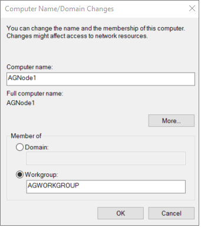
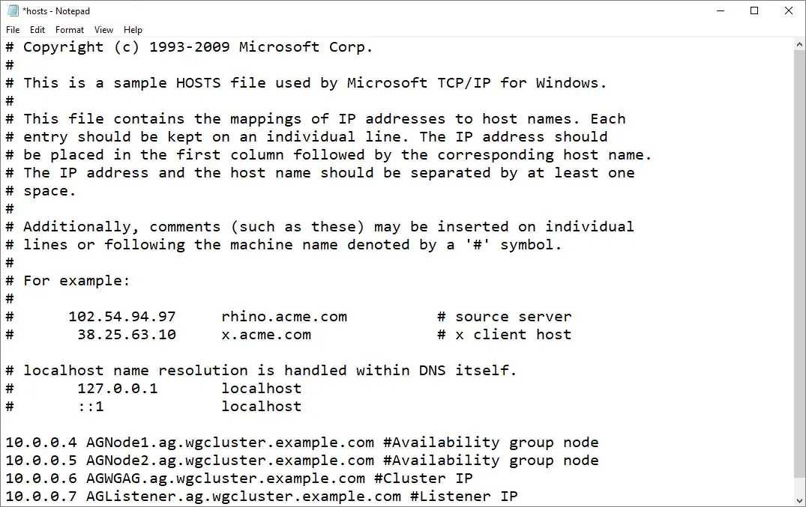
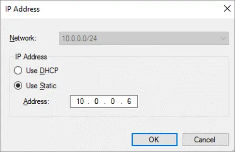
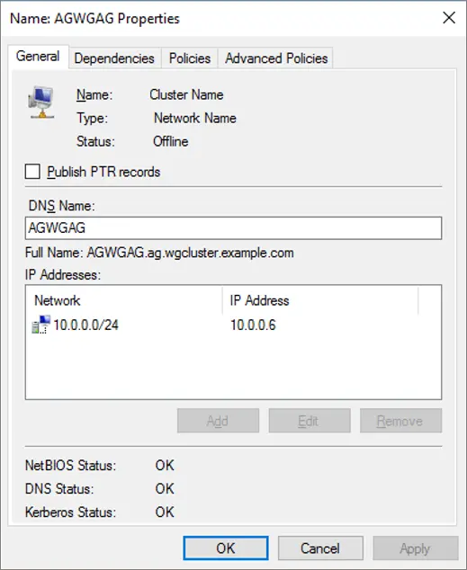

# Configure a workgroup availability group 
[!INCLUDE[appliesto-sqlvm](../../includes/appliesto-sqlvm.md)]

This article explains the steps necessary to create an Active Directory domain-independent cluster with an Always On availability group; this is also known as a workgroup cluster. This article focuses on the steps that are relevant to preparing and configuring the workgroup and availability group, and glosses over steps that are covered in other articles, such as how to create the cluster, or deploy the availability group. 


## Prerequisites

To configure a workgroup availability group, you need the following:
- At least two Windows Server 2016 (or higher) virtual machines running SQL Server 2016 (or higher), deployed to the same availability set, or different availability zones, using static IP addresses. 
- A local network with a minimum of 4 free IP addresses on the subnet. 
- An account on each machine in the administrator group that also has sysadmin rights within SQL Server. 
- Open ports: TCP 1433, TCP 5022, TCP 59999. 

For reference, the following parameters are used in this article, but can be modified as is necessary: 

| **Name** | **Parameter** |
| :------ | :---------------------------------- |
| **Node1**   | AGNode1 (10.0.0.4) |
| **Node2**   | AGNode2 (10.0.0.5) |
| **Cluster name** | AGWGAG (10.0.0.6) |
| **Listener** | AGListener (10.0.0.7) | 
| **DNS suffix** | ag.wgcluster.example.com | 
| **Work group name** | AGWorkgroup | 
| &nbsp; | &nbsp; |

## Set a DNS suffix 

In this step, configure the DNS suffix for both servers. For example, `ag.wgcluster.example.com`. This allows you to use the name of the object you want to connect to as a fully qualified address within your network, such as `AGNode1.ag.wgcluster.example.com`. 

To configure the DNS suffix, follow these steps:

1. RDP in to your first node and open Server Manager. 
1. Select **Local Server** and then select the name of your virtual machine under **Computer name**. 
1. Select **Change...** under **To rename this computer...**. 
1. Change the name of the workgroup name to be something meaningful, such as `AGWORKGROUP`: 

   

1. Select **More...** to open the **DNS Suffix and NetBIOS Computer Name** dialog box. 
1. Type the name of your DNS suffix under **Primary DNS suffix of this computer**, such as `ag.wgcluster.example.com` and then select **OK**: 

   

1. Confirm that the **Full computer name** is now showing the DNS suffix, and then select **OK** to save your changes: 

   

1. Reboot the server when you are prompted to do so. 
1. Repeat these steps on any other nodes to be used for the availability group. 

## Edit a host file

Since there is no active directory, there is no way to authenticate windows connections. As such, assign trust by editing the host file with a text editor. 

To edit the host file, follow these steps:

1. RDP in to your virtual machine. 
1. Use **File Explorer** to go to `c:\windows\system32\drivers\etc`. 
1. Right-click the **hosts** file and open the file with **Notepad** (or any other text editor).
1. At the end of the file, add an entry for each node, the availability group, and the listener in the form of `IP Address, DNS Suffix #comment` like: 

   ```
   10.0.0.4 AGNode1.ag.wgcluster.example.com #Availability group node
   10.0.0.5 AGNode2.ag.wgcluster.example.com #Availability group node
   10.0.0.6 AGWGAG.ag.wgcluster.example.com #Cluster IP
   10.0.0.7 AGListener.ag.wgcluster.example.com #Listener IP
   ```
 
   

## Set permissions

Since there is no Active Directory to manage permissions, you need to manually allow a non-builtin local administrator account to create the cluster. 

To do so, run the following PowerShell cmdlet in an administrative PowerShell session on every node: 

```PowerShell

new-itemproperty -path HKLM:\SOFTWARE\Microsoft\Windows\CurrentVersion\Policies\System -Name LocalAccountTokenFilterPolicy -Value 1
```

## Create the failover cluster

In this step, you will create the failover cluster. If you're unfamiliar with these steps, you can follow them from the [failover cluster tutorial](failover-cluster-instance-storage-spaces-direct-manually-configure.md#step-2-configure-the-windows-server-failover-cluster-with-storage-spaces-direct).

Notable differences between the tutorial and what should be done for a workgroup cluster:
- Uncheck **Storage**, and **Storage Spaces Direct** when running the cluster validation. 
- When adding the nodes to the cluster, add the fully qualified name, such as:
   - `AGNode1.ag.wgcluster.example.com`
   - `AGNode2.ag.wgcluster.example.com`
- Uncheck **Add all eligible storage to the cluster**. 

Once the cluster has been created, assign a static Cluster IP address. To do so, follow these steps:

1. On one of the nodes, open **Failover Cluster Manager**, select the cluster, right-click the **Name: \<ClusterNam>** under **Cluster Core Resources** and then select **Properties**. 

   

1. Select the IP address under **IP Addresses** and select **Edit**. 
1. Select **Use Static**, provide the IP address of the cluster, and then select **OK**: 

   

1. Verify that your settings look correct, and then select **OK** to save them:

   

## Create a cloud witness 

In this step, configure a cloud share witness. If you're unfamiliar with the steps, see the [failover cluster tutorial](failover-cluster-instance-storage-spaces-direct-manually-configure.md#create-a-cloud-witness). 

## Enable the availability group feature 

In this step, enable the availability group feature. If you're unfamiliar with the steps, see the [availability group tutorial](availability-group-manually-configure-tutorial.md#enable-availability-groups). 

## Create keys and certificates

In this step, create certificates that a SQL login uses on the encrypted endpoint. Create a folder on each node to hold the certificate backups, such as `c:\certs`. 

To configure the first node, follow these steps: 

1. Open **SQL Server Management Studio** and connect to your first node, such as `AGNode1`. 
1. Open a **New Query** window and run the following Transact-SQL (T-SQL) statement after updating to a complex and secure password:

   ```sql
   USE master;  
   CREATE MASTER KEY ENCRYPTION BY PASSWORD = 'PassWOrd123!';  
   GO

   --create a cert from the master key
   USE master;  
   CREATE CERTIFICATE AGNode1Cert   
      WITH SUBJECT = 'AGNode1 Certificate';  
   GO  

   --Backup the cert and transfer it to AGNode2
   BACKUP CERTIFICATE AGNode1Cert TO FILE = 'C:\certs\AGNode1Cert.crt';  
   GO  
   ```

1. Next, create the HADR endpoint, and use the certificate for authentication by running this Transact-SQL (T-SQL) statement:

   ```sql
   --CREATE or ALTER the mirroring endpoint
   CREATE ENDPOINT hadr_endpoint  
      STATE = STARTED  
      AS TCP (  
         LISTENER_PORT=5022  
         , LISTENER_IP = ALL  
      )   
      FOR DATABASE_MIRRORING (   
         AUTHENTICATION = CERTIFICATE AGNode1Cert  
         , ENCRYPTION = REQUIRED ALGORITHM AES  
         , ROLE = ALL  
      );  
   GO  
   ```

1. Use **File Explorer** to go to the file location where your certificate is, such as `c:\certs`. 
1. Manually make a copy of the certificate, such as `AGNode1Cert.crt`, from the first node, and transfer it to the same location on the second node. 

To configure the second node, follow these steps: 

1. Connect to the second node with **SQL Server Management Studio**, such as `AGNode2`. 
1. In a **New Query** window, run the following Transact-SQL (T-SQL) statement after updating to a complex and secure password: 

   ```sql
   USE master;  
   CREATE MASTER KEY ENCRYPTION BY PASSWORD = 'PassWOrd123!';  
   GO 
   
   --create a cert from the master key
   USE master;  
   CREATE CERTIFICATE AGNode2Cert   
      WITH SUBJECT = 'AGNode2 Certificate';  
   GO  
   --Backup the cert and transfer it to AGNode1
   BACKUP CERTIFICATE AGNode2Cert TO FILE = 'C:\certs\AGNode2Cert.crt';  
   GO
   ```

1. Next, create the HADR endpoint, and use the certificate for authentication by running this Transact-SQL (T-SQL) statement:

   ```sql
   --CREATE or ALTER the mirroring endpoint
   CREATE ENDPOINT hadr_endpoint  
      STATE = STARTED  
      AS TCP (  
         LISTENER_PORT=5022  
         , LISTENER_IP = ALL  
      )   
      FOR DATABASE_MIRRORING (   
         AUTHENTICATION = CERTIFICATE AGNode2Cert  
         , ENCRYPTION = REQUIRED ALGORITHM AES  
         , ROLE = ALL  
      );  
   GO  
   ```

1. Use **File Explorer** to go to the file location where your certificate is, such as `c:\certs`. 
1. Manually make a copy of the certificate, such as `AGNode2Cert.crt`, from the second node, and transfer it to the same location on the first node. 

If there are any other nodes in the cluster, repeat these steps there also, modifying the respective certificate names. 

## Create logins

Certificate authentication is used to synchronize data across nodes. To allow this, create a login for the other node, create a user for the login, create a certificate for the login to use the backed-up certificate, and then grant connect on the mirroring endpoint. 

To do so, first run the following Transact-SQL (T-SQL) query on the first node, such as `AGNode1`: 

```sql
--create a login for the AGNode2
USE master;  
CREATE LOGIN AGNode2_Login WITH PASSWORD = 'PassWord123!';  
GO  

--create a user from the login
CREATE USER AGNode2_User FOR LOGIN AGNode2_Login;  
GO  

--create a certificate that the login uses for authentication
CREATE CERTIFICATE AGNode2Cert  
   AUTHORIZATION AGNode2_User  
   FROM FILE = 'C:\certs\AGNode2Cert.crt'  
GO 

--grant connect for login
GRANT CONNECT ON ENDPOINT::hadr_endpoint TO [AGNode2_login];  
GO
```

Next, run the following Transact-SQL (T-SQL) query on the second node, such as `AGNode2`: 

```sql
--create a login for the AGNode1
USE master;  
CREATE LOGIN AGNode1_Login WITH PASSWORD = 'PassWord123!';  
GO  

--create a user from the login
CREATE USER AGNode1_User FOR LOGIN AGNode1_Login;  
GO  

--create a certificate that the login uses for authentication
CREATE CERTIFICATE AGNode1Cert  
   AUTHORIZATION AGNode1_User  
   FROM FILE = 'C:\certs\AGNode1Cert.crt'  
GO 

--grant connect for login
GRANT CONNECT ON ENDPOINT::hadr_endpoint TO [AGNode1_login];  
GO
```

If there are any other nodes in the cluster, repeat these steps there also, modifying the respective certificate and user names. 

## Configure an availability group

In this step, configure your availability group, and add your databases to it. Do not create a listener at this time. If you're not familiar with the steps, see the [availability group tutorial](availability-group-manually-configure-tutorial.md#create-the-availability-group). Be sure to initiate a failover and failback to verify that everything is working as it should be. 

   > [!NOTE]
   > If there is a failure during the synchronization process, you may need to grant `NT AUTHORITY\SYSTEM` sysadmin rights to create cluster resources on the first node, such as `AGNode1` temporarily. 

## Configure a load balancer

In this final step, configure the load balancer using either the [Azure portal](availability-group-load-balancer-portal-configure.md) or [PowerShell](availability-group-listener-powershell-configure.md).


## Next steps

You can also use [Az SQL VM CLI](availability-group-az-cli-configure.md) to configure an availability group. 


