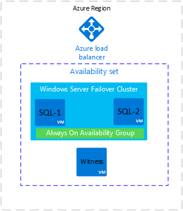
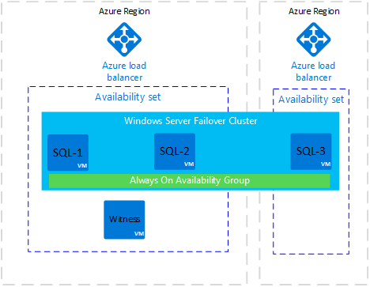
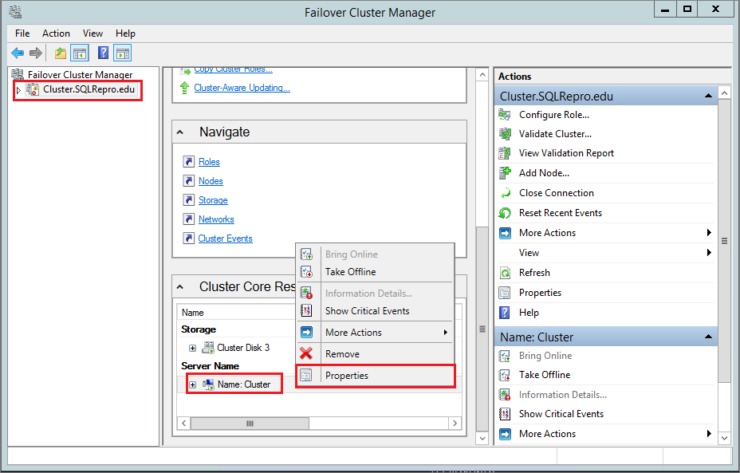
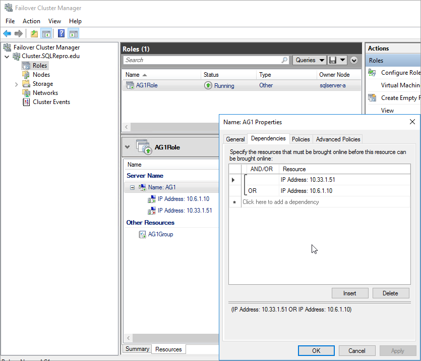

# Configure a SQL Server Always On availability group across different Azure regions

[!INCLUDE[appliesto-sqlvm](../../includes/appliesto-sqlvm.md)]

This article explains how to configure a SQL Server Always On availability group replica on Azure virtual machines in a remote Azure location. Use this configuration to support disaster recovery.

This article applies to Azure Virtual Machines in Resource Manager mode.

The following image shows a common deployment of an availability group on Azure virtual machines:

   

In this deployment, all virtual machines are in one Azure region. The availability group replicas can have synchronous commit with automatic failover on SQL-1 and SQL-2. To build this architecture, see [Availability Group template or tutorial](availability-group-overview.md).

This architecture is vulnerable to downtime if the Azure region becomes inaccessible. To overcome this vulnerability, add a replica in a different Azure region. The following diagram shows how the new architecture would look:

   

The preceding diagram shows a new virtual machine called SQL-3. SQL-3 is in a different Azure region. SQL-3 is added to the Windows Server Failover Cluster. SQL-3 can host an availability group replica. Finally, notice that the Azure region for SQL-3 has a new Azure load balancer.

>[!NOTE]
> An Azure availability set is required when more than one virtual machine is in the same region. If only one virtual machine is in the region, then the availability set is not required. You can only place a virtual machine in an availability set at creation time. If the virtual machine is already in an availability set, you can add a virtual machine for an additional replica later.

In this architecture, the replica in the remote region is normally configured with asynchronous commit availability mode and manual failover mode.

When availability group replicas are on Azure virtual machines in different Azure regions, each region requires:

* A virtual network gateway
* A virtual network gateway connection

The following diagram shows how the networks communicate between data centers.

   

>[!IMPORTANT]
>This architecture incurs outbound data charges for data replicated between Azure regions. See [Bandwidth Pricing](https://azure.microsoft.com/pricing/details/bandwidth/).  

## Create remote replica

To create a replica in a remote data center, do the following steps:

1. [Create a virtual network in the new region](../../../virtual-network/manage-virtual-network.md#create-a-virtual-network).

1. [Configure a VNet-to-VNet connection using the Azure portal](../../../vpn-gateway/vpn-gateway-howto-vnet-vnet-resource-manager-portal.md).

   >[!NOTE]
   >In some cases, you may have to use PowerShell to create the VNet-to-VNet connection. For example, if you use different Azure accounts you cannot configure the connection in the portal. In this case see, [Configure a VNet-to-VNet connection using the Azure portal](../../../vpn-gateway/vpn-gateway-vnet-vnet-rm-ps.md).

1. [Create a domain controller in the new region](../../../active-directory/active-directory-new-forest-virtual-machine.md).

   This domain controller provides authentication if the domain controller in the primary site is not available.

1. [Create a SQL Server virtual machine in the new region](create-sql-vm-portal.md).

1. [Create an Azure load balancer in the network on the new region](availability-group-manually-configure-tutorial.md#configure-internal-load-balancer).

   This load balancer must:

   - Be in the same network and subnet as the new virtual machine.
   - Have a static IP address for the availability group listener.
   - Include a backend pool consisting of only the virtual machines in the same region as the load balancer.
   - Use a TCP port probe specific to the IP address.
   - Have a load balancing rule specific to the SQL Server in the same region.  
   - Be a Standard Load Balancer if the virtual machines in the backend pool are not part of either a single availability set or virtual machine scale set. For additional information review [Azure Load Balancer Standard overview](https://docs.microsoft.com/azure/load-balancer/load-balancer-standard-overview).

1. [Add Failover Clustering feature to the new SQL Server](availability-group-manually-configure-prerequisites-tutorial.md#add-failover-clustering-features-to-both-sql-server-vms).

1. [Join the new SQL Server to the domain](availability-group-manually-configure-prerequisites-tutorial.md#joinDomain).

1. [Set the new SQL Server service account to use a domain account](availability-group-manually-configure-prerequisites-tutorial.md#setServiceAccount).

1. [Add the new SQL Server to the Windows Server Failover Cluster](availability-group-manually-configure-tutorial.md#addNode).

1. Add an IP address resource to the cluster.

   You can create the IP address resource in Failover Cluster Manager. Select the name of the cluster, then right-click the cluster name under **Cluster Core Resources** and select **Properties**: 

   

   On the **Properties** dialog box, select **Add** under **IP Address**, and then add the IP address of the cluster name from the remote network region. Select **OK** on the **IP Address** dialog box, and then select **OK** again on the **Cluster Properties** dialog box to save the new IP address. 

   


1. Add the IP address as a dependency for the core cluster name.

   Open the cluster properties once more and select the **Dependencies** tab. Configure an OR dependency for the two IP addresses: 

   

1. Add an IP address resource to the availability group role in the cluster. 

   Right-click the availability group role in Failover Cluster Manager, choose **Add Resource**, **More Resources**, and select **IP Address**.

   

   Configure this IP address as follows:

   - Use the network from the remote data center.
   - Assign the IP address from the new Azure load balancer. 

1. Add the IP address resource as a dependency for the listener client access point (network name) cluster.

   The following screenshot shows a properly configured IP address cluster resource:

   

   >[!IMPORTANT]
   >The cluster resource group includes both IP addresses. Both IP addresses are dependencies for the listener client access point. Use the **OR** operator in the cluster dependency configuration.

1. [Set the cluster parameters in PowerShell](availability-group-manually-configure-tutorial.md#setparam).

   Run the PowerShell script with the cluster network name, IP address, and probe port that you configured on the load balancer in the new region.

   ```powershell
   $ClusterNetworkName = "<MyClusterNetworkName>" # The cluster name for the network in the new region (Use Get-ClusterNetwork on Windows Server 2012 of higher to find the name).
   $IPResourceName = "<IPResourceName>" # The cluster name for the new IP Address resource.
   $ILBIP = "<n.n.n.n>" # The IP Address of the Internal Load Balancer (ILB) in the new region. This is the static IP address for the load balancer you configured in the Azure portal.
   [int]$ProbePort = <nnnnn> # The probe port you set on the ILB.

   Import-Module FailoverClusters

   Get-ClusterResource $IPResourceName | Set-ClusterParameter -Multiple @{"Address"="$ILBIP";"ProbePort"=$ProbePort;"SubnetMask"="255.255.255.255";"Network"="$ClusterNetworkName";"EnableDhcp"=0}
   ```

1. On the new SQL Server in SQL Server Configuration Manager, [enable Always On Availability Groups](/sql/database-engine/availability-groups/windows/enable-and-disable-always-on-availability-groups-sql-server).

1. [Open firewall ports on the new SQL Server](availability-group-manually-configure-prerequisites-tutorial.md#endpoint-firewall).

   The port numbers you need to open depend on your environment. Open ports for the mirroring endpoint and Azure load balancer health probe.


1. [Add a replica to the availability group on the new SQL Server](/sql/database-engine/availability-groups/windows/use-the-add-replica-to-availability-group-wizard-sql-server-management-studio).

   For a replica in a remote Azure region, set it for asynchronous replication with manual failover.  

## Set connection for multiple subnets

The replica in the remote data center is part of the availability group but it is in a different subnet. If this replica becomes the primary replica, application connection time-outs may occur. This behavior is the same as an on-premises availability group in a multi-subnet deployment. To allow connections from client applications, either update the client connection or configure name resolution caching on the cluster network name resource.

Preferably, update the client connection strings to set `MultiSubnetFailover=Yes`. See [Connecting With MultiSubnetFailover](https://msdn.microsoft.com/library/gg471494#Anchor_0).

If you cannot modify the connection strings, you can configure name resolution caching. See [Time-out error and you cannot connect to a SQL Server 2012 AlwaysOn availability group listener in a multi-subnet environment](https://support.microsoft.com/help/2792139/time-out-error-and-you-cannot-connect-to-a-sql-server-2012-alwayson-av).

## Fail over to remote region

To test listener connectivity to the remote region, you can fail over the replica to the remote region. While the replica is asynchronous, failover is vulnerable to potential data loss. To fail over without data loss, change the availability mode to synchronous and set the failover mode to automatic. Use the following steps:

1. In **Object Explorer**, connect to the instance of SQL Server that hosts the primary replica.
1. Under **AlwaysOn Availability Groups**, **Availability Groups**, right-click your availability group and select **Properties**.
1. On the **General** page, under **Availability Replicas**, set the secondary replica in the DR site to use **Synchronous Commit** availability mode and **Automatic** failover mode.
1. If you have a secondary replica in same site as your primary replica for high availability, set this replica to **Asynchronous Commit** and **Manual**.
1. Select OK.
1. In **Object Explorer**, right-click the availability group, and select **Show Dashboard**.
1. On the dashboard, verify that the replica on the DR site is synchronized.
1. In **Object Explorer**, right-click the availability group, and select **Failover...**. SQL Server Management Studios opens a wizard to fail over SQL Server.  
1. Select **Next**, and select the SQL Server instance in the DR site. Select **Next** again.
1. Connect to the SQL Server instance in the DR site and select **Next**.
1. On the **Summary** page, verify the settings and select **Finish**.

After testing connectivity, move the primary replica back to your primary data center and set the availability mode back to their normal operating settings. The following table shows the normal operational settings for the architecture described in this document:

| Location | Server Instance | Role | Availability Mode | Failover Mode
| ----- | ----- | ----- | ----- | -----
| Primary data center | SQL-1 | Primary | Synchronous | Automatic
| Primary data center | SQL-2 | Secondary | Synchronous | Automatic
| Secondary or remote data center | SQL-3 | Secondary | Asynchronous | Manual


### More information about planned and forced manual failover

For more information, see the following topics:

- [Perform a Planned Manual Failover of an Availability Group (SQL Server)](https://msdn.microsoft.com/library/hh231018.aspx)
- [Perform a Forced Manual Failover of an Availability Group (SQL Server)](https://msdn.microsoft.com/library/ff877957.aspx)

## Next steps

* [Always On Availability Groups](https://msdn.microsoft.com/library/hh510230.aspx)
* [Azure Virtual Machines](https://docs.microsoft.com/azure/virtual-machines/windows/)
* [Azure Load Balancers](availability-group-manually-configure-tutorial.md#configure-internal-load-balancer)
* [Azure Availability Sets](../../../virtual-machines/linux/manage-availability.md)
