# Tutorial: Prerequisites for creating availability groups on SQL Server on Azure Virtual Machines in multiple subnets. 

[!INCLUDE[appliesto-sqlvm](../../includes/appliesto-sqlvm.md)]

This tutorial shows how to complete the prerequisites for creating a [SQL Server Always On availability group on Azure Virtual Machines (VMs)](availability-group-manually-configure-tutorial-multiple-subnet.md). When you've completed the prerequisites, you'll have a domain controller, two SQL Server VMs, and a storage account in a single resource group.

**Creating Azure SQL Server VMs in multiple subnets with in the same Azure Virtual Network eliminates the need of using Azure Load Balancer for Windows Server Failover Cluster and Availability Group Listener.**

**Time estimate**: It might take a couple of hours to complete the prerequisites. Much of this time is spent creating virtual machines.

The following diagram illustrates what you build in the tutorial.

RSETLEM - Need to add new architecture diagram


## Review availability group documentation

This tutorial assumes that you have a basic understanding of SQL Server Always On availability groups. If you're not familiar with this technology, see [Overview of Always On availability groups (SQL Server)](/sql/database-engine/availability-groups/windows/overview-of-always-on-availability-groups-sql-server).


## Create an Azure account

You need an Azure account. You can [open a free Azure account](https://signup.azure.com/signup?offer=ms-azr-0044p&appId=102&ref=azureplat-generic) or [activate Visual Studio subscriber benefits](/visualstudio/subscriptions/subscriber-benefits).

## Create a resource group

1. Sign in to the [Azure portal](https://portal.azure.com).
2. Select **+ Create a resource** to create a new resource in the portal.

   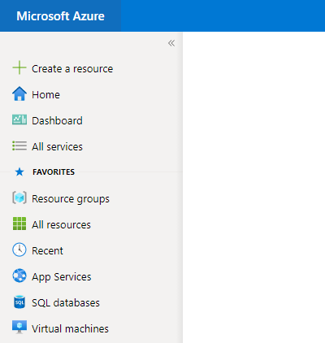

3. Type **resource group** in the **Marketplace** search window.

   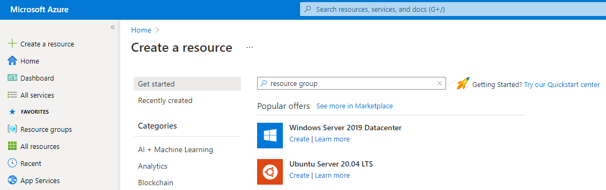

4. Select **Resource group**.
5. Select **Create**.
    
    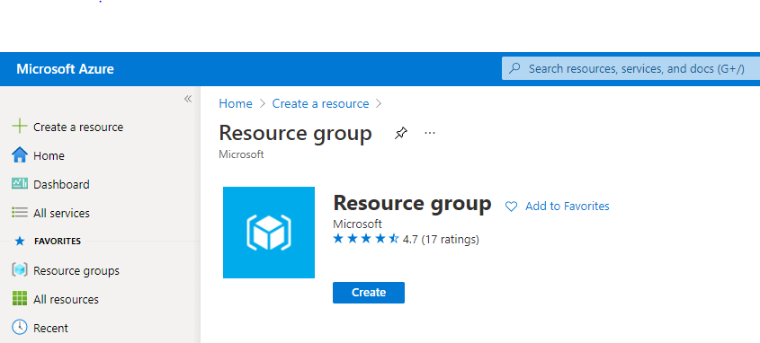

6. Under **Resource group name**, type a name for the resource group. For example, type **SQL-HA-RG**.
7. If you have multiple Azure subscriptions, verify that the subscription is the Azure subscription that you want to create the availability group in.
8. Select a location. The location is the Azure region where you want to create the availability group. This article builds all resources in one Azure location.
9. Select **Review + create** and select **Create** to create the resource group.

    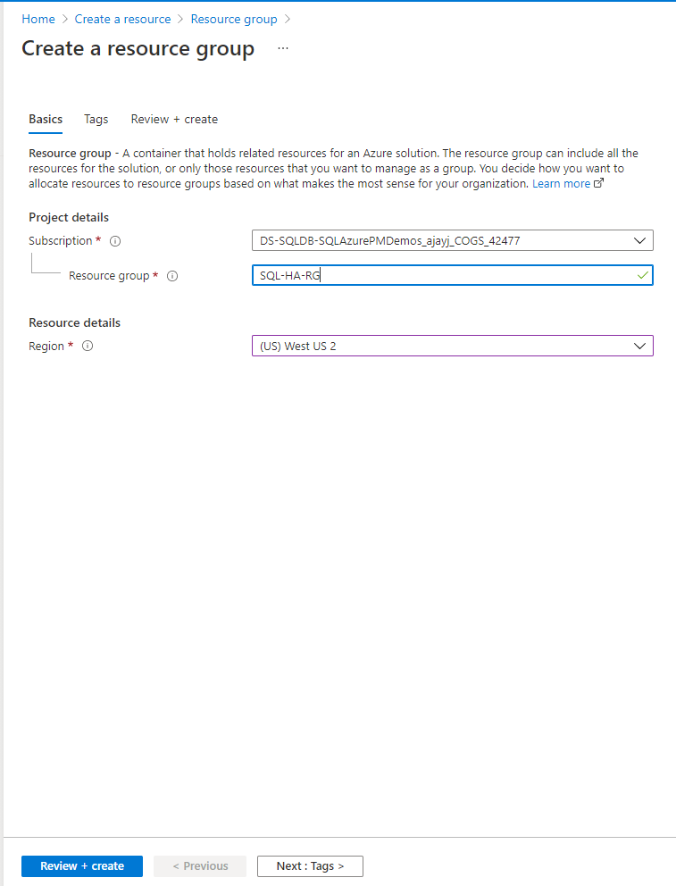

## Create the network and subnets

The next step is to create the network and subnets in the Azure resource group.

The solution uses one virtual network and three subnets. The [Virtual network overview](../../../virtual-network/virtual-networks-overview.md) provides more information about networks in Azure.

To create the virtual network in the Azure portal:

1. In your resource group, select **+ Create**. 

   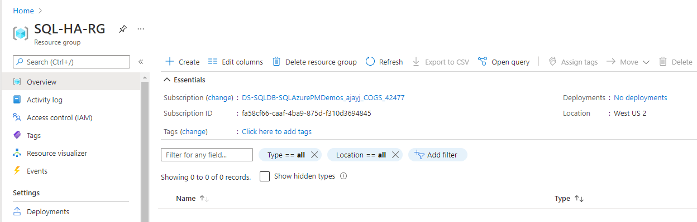
2. Search for **virtual network**.   
3. Select **Virtual network** and select **Create**.
4. In **Create virtual network** enter this information in the **Basics** tab.

   | **Field** | Value |
   | --- | --- |
   | *Project details* |   |
   | **Subscription** |Specify the subscription that you intend to use.| 
   | **Resource group** | Name of the resource group should be the one created earlier (SQL-HA-RG).|
   | *Instance details* |   |
   | **Name** |SQLHAVNET |
   | **Region** |Specify the Azure region. |
   
    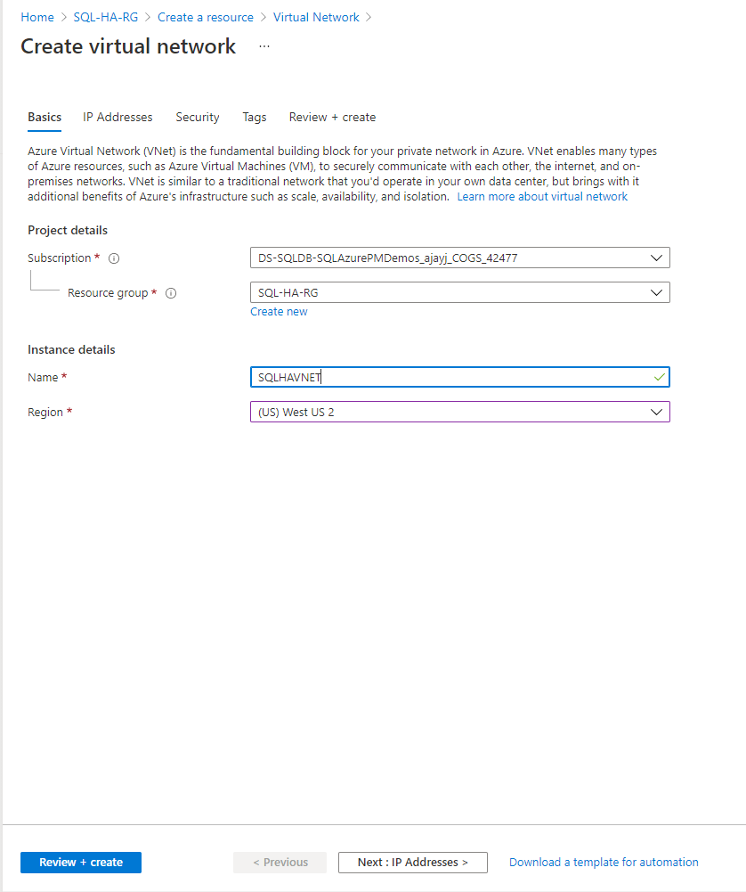

5. Select the **IP Addresses** tab, or select the **Next: IP Addresses** button at the bottom of the page.
6. In **IP Addresses** tab, click on **default** subnet and change the name to **DC-subnet** to be used for domain controller VMs. Select **Save**.

    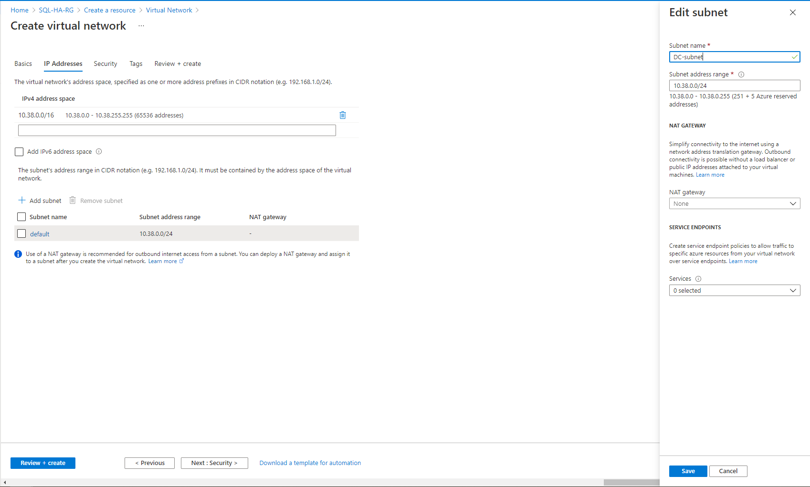

7. Select **+ Add subnet**, then enter SQL-subnet-1 for **Subnet name** and 10.38.1.0/24 for **Subnet address range** to be used for the first Azure SQL VM. Select **Add**

     

8. Select **+ Add subnet**, then enter SQL-subnet-2 for **Subnet name** and 10.38.2.0/24 for **Subnet address range** to be used for the second Azure SQL VM. Select **Add**

     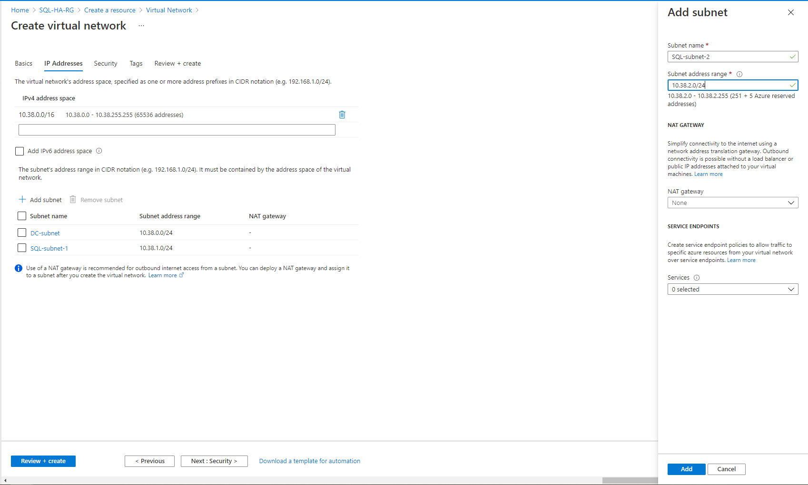

9. The following screenshot shows the three subnets and their address range. 

      

   > [!NOTE]
   > Your address space and subnet address range might be different from the table. Depending on your subscription, the portal suggests an available address space and corresponding subnet address range. If no sufficient address space is available, use a different subscription.   
   >

10. Select **Review + create**.
11. Select **Create**

Azure returns you to the portal dashboard and notifies you when the new network is created.

## Create domain controllers

After you've created the network, and subnets, you're ready to create the virtual machines for the domain controllers.

### Create virtual machines for the domain controllers

To create and configure the domain controllers, return to the **SQL-HA-RG** resource group.

1. Select **+ Create**. 
2. Search for **Windows Server**.
3. Select **Windows Server**, select **Windows Server 2016 Datacenter** under plan and select **Create**

Repeat the preceding steps to create two virtual machines. Name the two virtual machines:

* DC-VM-1
* DC-VM-2

  > [!NOTE]
  > The **DC-VM-2** virtual machine is optional, to provide high availability for Active Directory Domain Services.
  >

The following table shows the settings for these two machines:

| **Field** | Value |
| --- | --- |
| **Subscription** |*Your subscription* |
| **Resource group** |SQL-HA-RG |
| **Virtual machine name** |First domain controller: *DC-VM-1*.</br>Second domain controller *DC-VM-2*. |
| **Region** |*Your Region* |
| **Availability options** |Availability zone </br> *In Azure regions that do not have support for Availability Zones yet, use Availability Sets instead. Create a new Availability Set to place all the VMs created in this tutorial.* |
| **Availability zone** |Specify 1 for DC-VM-1. </br> Specify 2 for DC-VM-2 |
| **Size** |D2s_v3 (2 vCPUs, 8 GB RAM) |
| **User name** |DomainAdmin |
| **Password** |Contoso!0000 |
| **Public inbound ports** | *Allow selected ports*
| **Select inbound ports** | *RDP (3389)*
| **OS disk type** | Premium SSD (locally redundant storage)
| **Virtual network** |SQLHAVNET |
| **Subnet** |DC-subnet |
| **Public IP** |*Same name as the VM* |
| **NIC network security group**| Basic |
| **Public inbound ports**| Allow selected ports |
| **Select inbound ports**| RDP (3389) |
| **Boot diagnostics** |Enable with managed storage account (recommended) |

Azure creates the virtual machines.

After the virtual machines are created, configure the domain controller.

### Configure the domain controller

In the following steps, configure the **DC-VM-1** machine as a domain controller for corp.contoso.com.

1. In the portal, open the **SQL-HA-RG** resource group and select the **DC-VM-1** machine. On **DC-VM-1**, select **Connect** to open an RDP file for remote desktop access.

    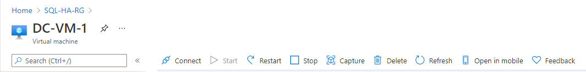

2. Sign in with your configured administrator account (**DomainAdmin**) and password (**Contoso!0000**).
3. By default, the **Server Manager** dashboard should be displayed.
4. Select the **Add roles and features** link on the dashboard.

    

5. Select **Next** until you get to the **Server Roles** section.
6. Select the **Active Directory Domain Services** and **DNS Server** roles. When you're prompted, add any additional features that are required by these roles.

   > [!NOTE]
   > Windows warns you that there is no static IP address. If you're testing the configuration, select **Continue**. For production scenarios, set the IP address to static in the Azure portal, or [use PowerShell to set the static IP address of the domain controller machine](/azure/virtual-network/virtual-networks-static-private-ip-arm-ps).
   >

    

7. Select **Next** until you reach the **Confirmation** section. Select the **Restart the destination server automatically if required** check box.
8. Select **Install**.
9. After the features finish installing, return to the **Server Manager** dashboard.
10. Select the new **AD DS** option on the left-hand pane.
11. Select the **More** link on the yellow warning bar.

    
    
12. In the **Action** column of the **All Server Task Details** dialog, select **Promote this server to a domain controller**.
13. In the **Active Directory Domain Services Configuration Wizard**, use the following values:

    | **Page** | Setting |
    | --- | --- |
    | **Deployment Configuration** |**Add a new forest**<br/> **Root domain name** = corp.contoso.com |
    | **Domain Controller Options** |**DSRM Password** = Contoso!0000<br/>**Confirm Password** = Contoso!0000 |

14. Select **Next** to go through the other pages in the wizard. On the **Prerequisites Check** page, verify that you see the following message: **All prerequisite checks passed successfully**. You can review any applicable warning messages, but it's possible to continue with the installation.
15. Select **Install**. The **DC-VM-1** virtual machine automatically reboots.

### Note the IP address of the primary domain controller

Use the primary domain controller for DNS. Note the primary domain controller IP address.

One way to get the primary domain controller IP address is through the Azure portal.

1. On the Azure portal, open the resource group.

2. Select the primary domain controller **DC-VM-1**.

3. On the primary domain controller, select **Network interfaces**.

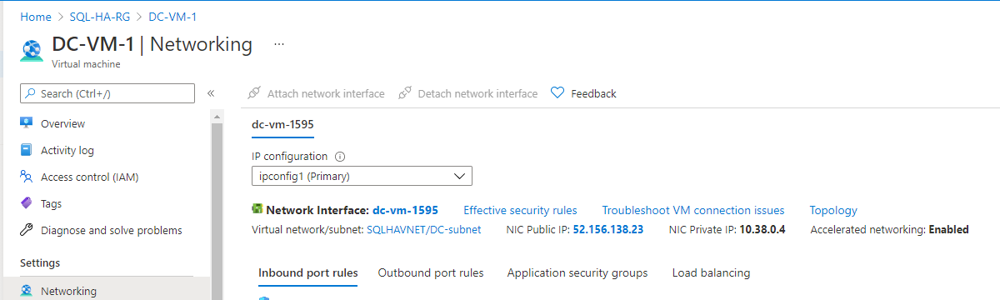

Note the private IP address for this server.

### Configure the virtual network DNS

After you create the first domain controller and enable DNS on the first server, configure the virtual network to use this server for DNS.

1. In the Azure portal, select on the virtual network.

2. Under **Settings**, select **DNS Server**.

3. Select **Custom**, and type the private IP address of the primary domain controller **DC-VM-1**.

4. Select **Save**.

### Configure the second domain controller

After the primary domain controller reboots, you can configure the second domain controller. This optional step is for high availability. Follow these steps to configure the second domain controller:

1. In the portal, open the **SQL-HA-RG** resource group and select the **DC-VM-2** machine. On **DC-VM-2**, select **Connect** to open an RDP file for remote desktop access.
2. Sign in to the VM by using your configured administrator account (**BUILTIN\DomainAdmin**) and password (**Contoso!0000**).
3. Change the preferred DNS server address to the address of the domain controller.
4. In **Network and Sharing Center**, select the network interface.

   

5. Select **Properties**.
6. Select **Internet Protocol Version 4 (TCP/IPv4)** and then select **Properties**.
7. Select **Use the following DNS server addresses** and then specify the address of the primary domain controller in **Preferred DNS server**.
8. Select **OK**, and then **Close** to commit the changes. You are now able to join the VM to **corp.contoso.com**.

   >[!IMPORTANT]
   >If you lose the connection to your remote desktop after changing the DNS setting, go to the Azure portal and restart the virtual machine.

9. From the remote desktop to the secondary domain controller, open **Server Manager Dashboard**.
10. Select the **Add roles and features** link on the dashboard.

    
11. Select **Next** until you get to the **Server Roles** section.
12. Select the **Active Directory Domain Services** and **DNS Server** roles. When you're prompted, add any additional features that are required by these roles.
13. After the features finish installing, return to the **Server Manager** dashboard.
14. Select the new **AD DS** option on the left-hand pane.
15. Select the **More** link on the yellow warning bar.
16. In the **Action** column of the **All Server Task Details** dialog, select **Promote this server to a domain controller**.
17. Under **Deployment Configuration**, select **Add a domain controller to an existing domain**.
18. Click **Select**.
19. Connect by using the administrator account (**CORP.CONTOSO.COM\domainadmin**) and password (**Contoso!0000**).
20. In **Select a domain from the forest**, choose your domain and then select **OK**.
21. In **Domain Controller Options**, use the default values and set a DSRM password.

    >[!NOTE]
    >The **DNS Options** page might warn you that a delegation for this DNS server can't be created. You can ignore this warning in non-production environments.
    >

22. Select **Next** until the dialog reaches the **Prerequisites** check. Then select **Install**.

After the server finishes the configuration changes, restart the server.

### Add the private IP address to the second domain controller to the VPN DNS Server

In the Azure portal, under virtual network, change the DNS Server to include the IP address of the secondary domain controller. This setting allows the DNS service redundancy.

### <a name="DomainAccounts"></a> Configure the domain accounts

In the next steps, you configure the Active Directory accounts. The following table shows the accounts:

| |Installation account<br/> |SQL-VM-1 <br/>SQL Server and SQL Agent Service account |SQL-VM-2<br/>SQL Server and SQL Agent Service account
| --- | --- | --- | ---
|**First Name** |Install |SQLSvc1 | SQLSvc2
|**User SamAccountName** |Install |SQLSvc1 | SQLSvc2

Use the following steps to create each account.

1. Sign in to the **DC-VM-1** machine.
2. In **Server Manager**, select **Tools**, and then select **Active Directory Administrative Center**.   
3. Select **corp (local)** from the left pane.
4. On the right **Tasks** pane, select **New**, and then select **User**.

   

   >[!TIP]
   >Set a complex password for each account.<br/> For non-production environments, set the user account to never expire.
   >

5. Select **OK** to create the user.
6. Repeat the preceding steps for each of the three accounts.

### Grant the required permissions to the installation account

1. In the **Active Directory Administrative Center**, select **corp (local)** in the left pane. Then in the right-hand **Tasks** pane, select **Properties**.

    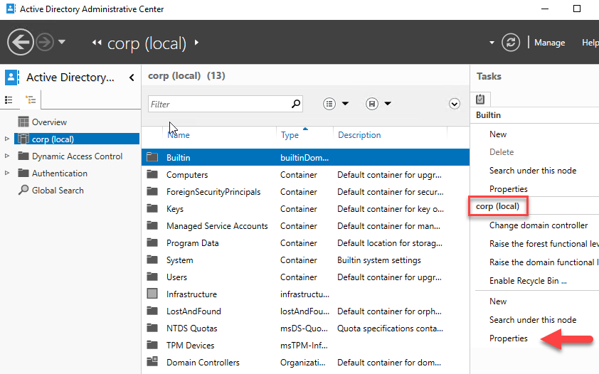

2. Select **Extensions**, and then select the **Advanced** button on the **Security** tab.
3. In the **Advanced Security Settings for corp** dialog, select **Add**.
4. Click **Select a principal**, search for **CORP\Install**, and then select **OK**.
5. Select the **Read all properties** check box.

6. Select the **Create Computer objects** check box.

     

7. Select **OK**, and then select **OK** again. Close the **corp** properties window.

Now that you've finished configuring Active Directory and the user objects, create two SQL Server VMs. Then join the two VMs to the domain.

## Create SQL Server VMs

Create two additional virtual machines. The solution requires two virtual machines with SQL Server instances.

Before you proceed consider the following design decisions.

* **Availability - Availability Zones**
   For highest levels of redundancy, resiliency and availability deploy the VMs in Availability Zones. Availability Zones are unique physical locations within an Azure region. Each zone is made up of one or more datacenters with independent power, cooling, and networking. In Azure regions that do not have support for Availability Zones yet, use Availability Sets instead.

* **Storage - Azure Managed Disks**

   For the virtual machine storage, use Azure Managed Disks. Microsoft recommends Managed Disks for SQL Server virtual machines. Managed Disks handles storage behind the scenes. For more information, see [Azure Managed Disks Overview](../../../virtual-machines/managed-disks-overview.md). 

* **Network - Private IP addresses in production**

   For the virtual machines, this tutorial uses public IP addresses. A public IP address enables remote connection directly to the virtual machine over the internet and makes configuration steps easier. In production environments, Microsoft recommends only private IP addresses in order to reduce the vulnerability footprint of the SQL Server instance VM resource.

* **Network - Recommend a single NIC per server** 

    Use a single NIC per server (cluster node). Azure networking has physical redundancy, which makes additional NICs unnecessary on an Azure virtual machine guest cluster. The cluster validation report will warn you that the nodes are reachable only on a single network. You can ignore this warning on Azure virtual machine guest failover clusters.

### Create and configure the SQL Server VMs

Next, create two SQL Server VMs. To create each of the VMs, go back to the **SQL-HA-RG** resource group, and then select **+ Create**. Search for **Azure SQL** and select **Create**. Under **SQL virtual machines** select **SQL Server 2016 SP1 Enterprise on Windows Server 2016** and select **Create**. Use the information in the following table to help you create the VMs:


| Page | SQL-VM-1 | SQL-VM-2 |
| --- | --- | --- |
| Select the appropriate gallery item |**SQL Server 2016 SP2 Enterprise on Windows Server 2016** |**SQL Server 2016 SP2 Enterprise on Windows Server 2016** |
| Virtual machine configuration **Basics** |**Name** = SQL-VM-1<br/>**User Name** = DomainAdmin<br/>**Password** = Contoso!0000<br/>**Subscription** = Your subscription<br/>**Resource group** = SQL-HA-RG<br/>**Location** = Your Azure location |**Name** = SQL-VM-2<br/>**User Name** = DomainAdmin<br/>**Password** = Contoso!0000<br/>**Subscription** = Your subscription<br/>**Resource group** = SQL-HA-RG<br/>**Location** = Your Azure location |
| Virtual machine configuration **Size** |**SIZE** = E2ds_v4 (2 vCPUs, 16 GB RAM)</br> |**SIZE** = E2ds_v4 (2 vCPUs, 16 GB RAM) |
| Virtual machine configuration **Settings** |**Availability options** = Availability zone<br/>**Availability zone** = 1<br/>**Public inbound ports** = Allow selected ports<br/>**Select inbound ports** = RDP (3389)<br/>**OS disk type** = Premium SSD (locally-redundant storage)<br/>**Virtual network** = SQLHAVNET<br/>**Subnet** = SQL-subnet-1(10.38.1.0/24)<br/>**Public IP address** = Automatically generated.<br/>**NIC network security group** = Basic<br/>**Public inbound ports** = Allow selected ports <br/> **Select inbound ports** = RDP (3389)<br/>**Boot Diagnostics** = Enable with managed storage account (recommended)<br/>|**Availability options** = Availability zone<br/>**Availability zone** = 2<br/>**Public inbound ports** = Allow selected ports<br/>**Select inbound ports** = RDP (3389)<br/>**OS disk type** = Premium SSD (locally-redundant storage)<br/>**Virtual network** = SQLHAVNET<br/>**Subnet** = SQL-subnet-2(10.38.2.0/24)<br/>**Public IP address** = Automatically generated.<br/>**NIC network security group** = Basic<br/>**Public inbound ports** = Allow selected ports <br/> **Select inbound ports** = RDP (3389)<br/>**Boot Diagnostics** = Enable with managed storage account (recommended)<br/> |
| Virtual machine configuration **SQL Server settings** |**SQL connectivity** = Private (within Virtual Network)<br/>**Port** = 1433<br/>**SQL Authentication** = Disable<br/>**Azure Key Vault integration** = Disable <br/>**Storage optimization** = Transactional processing<br/>**SQL Data** = 1024 GiB, 5000 IOPS, 200 MB/s<br/>**SQL Log** = 1024 GiB, 5000 IOPS, 200 MB/s<br/>**SQL TempDb** = Use local SSD drive<br/>**Automated patching** = Sunday at 2:00<br/>**Automated backup** = Disable |**SQL connectivity** = Private (within Virtual Network)<br/>**Port** = 1433<br/>**SQL Authentication** = Disable<br/>**Azure Key Vault integration** = Disable <br/>**Storage optimization** = Transactional processing<br/>**SQL Data** = 1024 GiB, 5000 IOPS, 200 MB/s<br/>**SQL Log** = 1024 GiB, 5000 IOPS, 200 MB/s<br/>**SQL TempDb** = Use local SSD drive<br/>**Automated patching** = Sunday at 2:00<br/>**Automated backup** = Disable |

<br/>

> [!NOTE]
> The machine sizes suggested here are meant for testing availability groups in Azure Virtual Machines. For the best performance on production workloads, see the recommendations for SQL Server machine sizes and configuration in [Performance best practices for SQL Server in Azure Virtual Machines](./performance-guidelines-best-practices-checklist.md?toc=%2fazure%2fvirtual-machines%2fwindows%2ftoc.json).
>


## <a name="Secondary IP"></a> Add secondary IPs on each SQL Server VM
After the two VMs are fully provisioned, you need to assign two secondary IPs on each of the SQL Server VM, one will be used for Windows Server Failover Cluster IP and another one will be used for Availability Group Listener. 

1. On the Azure portal, open the resource group **SQL-HA-RG**
2. Select the first SQL Server VM **SQL-VM-1**
3. Select **Networking** under **Settigns** and select the **Network Interface**

    

4. In the **Network Interface**, select **IP configurations** under **Settings** and select **+ Add**

    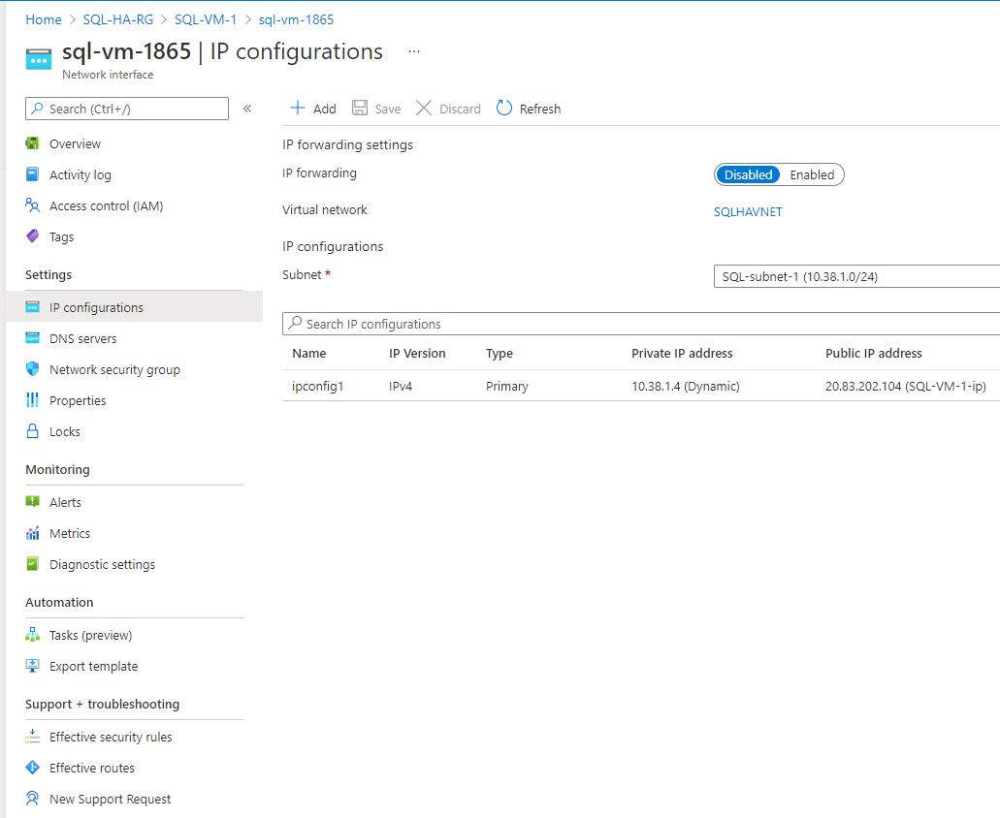

5. In **Add IP configuration**, specify **Name** as windows-cluster-ip. Select **Allocation** to Static and specify an unused **IP address** 10.38.1.10 with in the range of **SQL-VM-1** subnet **SQL-subnet-1**. Select **Ok** to finish adding the IP configuration. 

    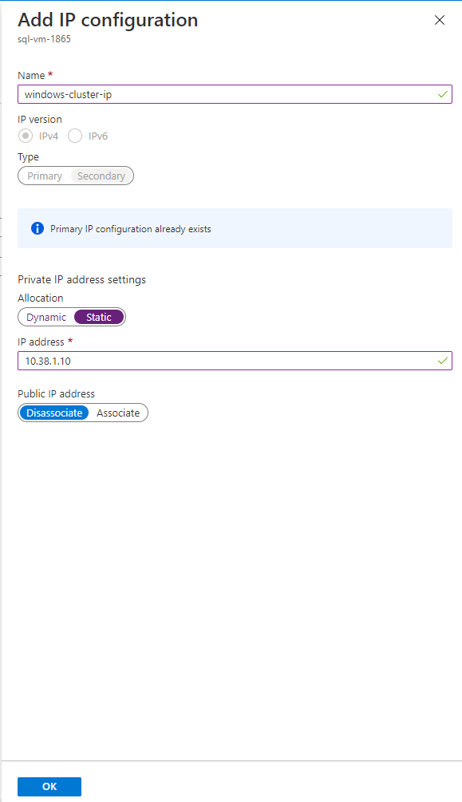

6. Select **+ Add** again to add secondary IP for Availability Group Listener. 
    
    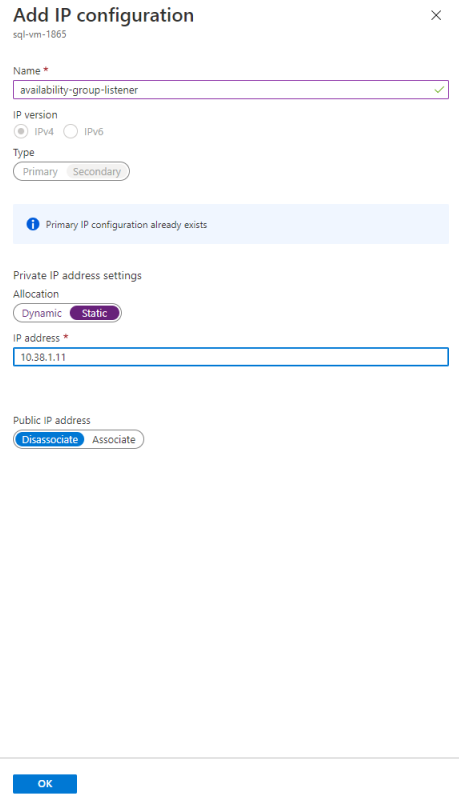   

7. Repeat the steps for the second SQL Server VM **SQL-VM-2** to assign two secondary IPs with in the range of **SQL-VM-2** subnet **SQL-subnet-2**

   Use the following from following table for adding IP Configuration:
    | **Field** | Value | Value
    | --- | --- | --- |
    | **Name** |windows-cluster-ip | availability-group-listener |
    | **Allocation** | Static | Static |
    | **IP address** | 10.38.2.10 | 10.38.2.11 | 

>[!NOTE]
> Ensure the two secondary private IPs assigned for each of the SQL Server VM from their respective subnet are unused. 
Assigning secondary IPs from two different subnets allows you to completely avoid Azure Load Balancer. 


Now, you need to join the VMs to the **corp.contoso.com** domain and grant CORP\Install administrative rights to the machines.

### <a name="joinDomain"></a>Join the servers to the domain

You're now able to join the VMs to **corp.contoso.com**. Do the following steps for both the SQL Server VMs:

1. Remotely connect to the virtual machine with **BUILTIN\DomainAdmin**.
2. In **Server Manager**, select **Local Server**.
3. Select the **WORKGROUP** link.
4. In the **Computer Name** section, select **Change**.
5. Select the **Domain** check box and type **corp.contoso.com** in the text box. Select **OK**.
6. In the **Windows Security** popup dialog, specify the credentials for the default domain administrator account (**CORP\DomainAdmin**) and the password (**Contoso!0000**).
7. When you see the "Welcome to the corp.contoso.com domain" message, select **OK**.
8. Select **Close**, and then select **Restart Now** in the popup dialog.

## Add accounts

Add the installation account as an administrator on each VM, grant permission to the installation account and local accounts within SQL Server, and update the SQL Server service account. 

### Add the Corp\Install user as an administrator on each cluster VM

After each virtual machine restarts as a member of the domain, add **CORP\Install** as a member of the local administrators group.

1. Wait until the VM is restarted, then launch the RDP file again from the first SQL Server VM to sign in to **SQL-VM-1** by using the **CORP\DomainAdmin** account.

   >[!TIP]
   >Make sure that you sign in with the domain administrator account. In the previous steps, you were using the BUILT IN administrator account. Now that the server is in the domain, use the domain account. In your RDP session, specify *DOMAIN*\\*username*.
   >

2. In **Server Manager**, select **Tools**, and then select **Computer Management**.
3. In the **Computer Management** window, expand **Local Users and Groups**, and then select **Groups**.
4. Double-click the **Administrators** group.
5. In the **Administrators Properties** dialog, select the **Add** button.
6. Enter the user **CORP\Install**, and then select **OK**.
7. Select **OK** to close the **Administrator Properties** dialog.
8. Repeat the previous steps on **SQL-VM-2**.


### Create a sign-in on each SQL Server VM for the installation account

Use the installation account (CORP\install) to configure the availability group. This account needs to be a member of the **sysadmin** fixed server role on each SQL Server VM. The following steps create a sign-in for the installation account:

1. Connect to the server through the Remote Desktop Protocol (RDP) by using the *\<MachineName\>\DomainAdmin* account.

1. Open SQL Server Management Studio and connect to the local instance of SQL Server.

1. In **Object Explorer**, select **Security**.

1. Right-click **Logins**. Select **New Login**.

1. In **Login - New**, select **Search**.

1. Select **Locations**.

1. Enter the domain administrator network credentials.

1. Use the installation account (CORP\install).

1. Set the sign-in to be a member of the **sysadmin** fixed server role.

1. Select **OK**.

Repeat the preceding steps on the other SQL Server VM.

### Configure system account permissions

To create an account for the system account and grant appropriate permissions, complete the following steps on each SQL Server instance:

1. Create an account for `[NT AUTHORITY\SYSTEM]` on each SQL Server instance. The following script creates this account:

   ```sql
   USE [master]
   GO
   CREATE LOGIN [NT AUTHORITY\SYSTEM] FROM WINDOWS WITH DEFAULT_DATABASE=[master]
   GO 
   ```

1. Grant the following permissions to `[NT AUTHORITY\SYSTEM]` on each SQL Server instance:

   - `ALTER ANY AVAILABILITY GROUP`
   - `CONNECT SQL`
   - `VIEW SERVER STATE`

   The following script grants these permissions:

   ```sql
   GRANT ALTER ANY AVAILABILITY GROUP TO [NT AUTHORITY\SYSTEM]
   GO
   GRANT CONNECT SQL TO [NT AUTHORITY\SYSTEM]
   GO
   GRANT VIEW SERVER STATE TO [NT AUTHORITY\SYSTEM]
   GO 
   ```

### <a name="setServiceAccount"></a>Set the SQL Server service accounts

On each SQL Server VM, set the SQL Server service account. Use the accounts that you created when you configured the domain accounts.

1. Open **SQL Server Configuration Manager**.
2. Right-click the SQL Server service, and then select **Properties**.
3. Set the account and password.
4. Repeat these steps on the other SQL Server VM.  

For SQL Server availability groups, each SQL Server VM needs to run as a domain account.

## Create an Azure Storage Account to use as a Cloud Witness
You need an Azure Storage Account to be used as cloud witness. For details on this, see [Deploy a Cloud Witness for a Failover Cluster](/windows-server/failover-clustering/deploy-cloud-witness).

To create the Azure Storage Account in the portal:

1. In the portal, open the **SQL-HA-RG** resource group and select **+ Create**
2. Search for **storage account**.   
3. Select **Storage account** and select **Create**.
   Use the settings below for creating a storage account:

    a. Select your subscription and select the resource group **SQL-HA-RG.**

    b. Enter a **Storage Account Name** for your storage account.
       Storage account names must be between 3 and 24 characters in length and may contain numbers and lowercase letters only. The storage account name must also be unique within Azure.
    
    c. Select your **Region.**

    d. For **Performance**, select **Standard: Recommended for most scenarios (general-pupose v2 account)**
       You can't use Azure Premium Storage for a Cloud Witness.

    e. For **Redundancy**, select **Locally-redundant storage (LRS).**
       Failover Clustering uses the blob file as the arbitration point, which requires some consistency guarantees when reading the data. Therefore you must select Locally-redundant storage for Replication type.
    
    f. Select **Review + create**


## Add Failover Clustering features to both SQL Server VMs

To add Failover Clustering features, do the following steps on both SQL Server VMs:

1. Connect to the SQL Server virtual machine through the Remote Desktop Protocol (RDP) by using the *CORP\install* account. Open **Server Manager Dashboard**.
2. Select the **Add roles and features** link on the dashboard.

    

3. Select **Next** until you get to the **Server Features** section.
4. In **Features**, select **Failover Clustering**.
5. Add any additional required features.
6. Select **Install** to add the features.

Repeat the steps on the other SQL Server VM. 

### Tuning Failover Cluster Network Thresholds

When running Windows Failover Cluster nodes in Azure VMs with SQL Server availability groups, change the cluster setting to a more relaxed monitoring state.  This will make the cluster much more stable and reliable.  For details on this, see [SQL Server VM - HADR configuration best practices](/azure/azure-sql/virtual-machines/windows/hadr-cluster-best-practices?tabs=windows2012#checklist).


## <a name="endpoint-firewall"></a> Configure the firewall on each SQL Server VM

The solution requires the following TCP ports to be open in the firewall:

- **SQL Server VM**: Port 1433 for a default instance of SQL Server.
- **Database mirroring endpoint:** Any available port. Examples frequently use 5022.

The firewall ports need to be open on both SQL Server VMs.

The method of opening the ports depends on the firewall solution that you use. The next section explains how to open the ports in Windows Firewall. Open the required ports on each of your SQL Server VMs.

### Open a TCP port in the firewall

1. On the first SQL Server **Start** screen, launch **Windows Firewall with Advanced Security**.
2. On the left pane, select **Inbound Rules**. On the right pane, select **New Rule**.
3. For **Rule Type**, choose **Port**.
4. For the port, specify **TCP** and type the appropriate port numbers. See the following example:

   

5. Select **Next**.
6. On the **Action** page, keep **Allow the connection** selected, and then select **Next**.
7. On the **Profile** page, accept the default settings, and then select **Next**.
8. On the **Name** page, specify a rule name (such as **SQL Inbound**) in the **Name** text box, and then select **Finish**.

Repeat these steps on the second SQL Server VM.


## Next steps

Now that you've configured the prerequisites, get started with [configuring your availability group](availability-group-manually-configure-tutorial-multi-subnet.md)

To learn more, see:

- [Windows Server Failover Cluster with SQL Server on Azure VMs](hadr-windows-server-failover-cluster-overview.md)
- [Always On availability groups with SQL Server on Azure VMs](availability-group-overview.md)
- [Always On availability groups overview](/sql/database-engine/availability-groups/windows/overview-of-always-on-availability-groups-sql-server)
- [HADR settings for SQL Server on Azure VMs](hadr-cluster-best-practices.md)