# Tutorial: Manually configure an availability group in multiple subnets (SQL Server on Azure VMs)
[!INCLUDE[appliesto-sqlvm](../../includes/appliesto-sqlvm.md)]

This tutorial shows how to create an Always On availability group for SQL Server on Azure Virtual Machines (VMs) that are in multiple subnets. The complete tutorial creates an availability group with a database replica on two SQL Servers.

**Time estimate**: Takes about 30 minutes to complete once the [prerequisites](availability-group-manually-configure-prerequisites-tutorial.md) are met.

## Prerequisites

The tutorial assumes you have a basic understanding of SQL Server Always On availability groups. If you need more information, see [Overview of Always On availability groups (SQL Server)](/sql/database-engine/availability-groups/windows/overview-of-always-on-availability-groups-sql-server).

Before you begin the tutorial, you need to [Complete prerequisites for creating Always On availability groups in Azure Virtual Machines](availability-group-manually-configure-prerequisites-tutorial-multi-subnet.md). If these prerequisites are completed already, you can jump to [Create Cluster](#CreateCluster).

The following table lists the prerequisites that you need to complete before starting this tutorial:

| Requirement | Description |
|----- |----- |
|:::image type="icon" source="./media/availability-group-manually-configure-tutorial-multi-subnet/square.png" border="false":::   **Two SQL Server instances** | - In an Azure availability zone or availability set   - In separate subnets within an Azure Virtual Network   - With two secondary IPs assigned to each VM   - In a single domain   - With Failover Clustering feature installed   |
|:::image type="icon" source="./media/availability-group-manually-configure-tutorial-multi-subnet/square.png" border="false":::   **SQL Server service account** | Domain account | 
|:::image type="icon" source="./media/availability-group-manually-configure-tutorial-multi-subnet/square.png" border="false":::   **Firewall ports open** | - SQL Server: **1433** for default instance   - Database mirroring endpoint: **5022** or any available port   |
|:::image type="icon" source="./media/availability-group-manually-configure-tutorial-multi-subnet/square.png" border="false":::   **Add Failover Clustering Feature** | Both SQL Server instances require this feature |
|:::image type="icon" source="./media/availability-group-manually-configure-tutorial-multi-subnet/square.png" border="false":::   **Installation domain account** | - Local administrator on each SQL Server   - Member of SQL Server sysadmin fixed server role for each instance of SQL Server  |

<!--**Procedure**: *This is the first "step". Make titles H2's and short and clear – H2's appear in the right pane on the web page and are important for navigation.*-->

## Create the cluster

After the prerequisites are completed, the first step is to create a Windows Server Failover Cluster that includes two SQL Server VMs and a cloud witness.

1. Use Remote Desktop Protocol (RDP) to connect to the first SQL Server VM **SQL-VM-1**. Use a domain account that is an administrator on both the SQL Server VMs. 

   >[!TIP]
   >If you followed the [prerequisites document](availability-group-manually-configure-prerequisites-tutorial-multi-subnet.md), you created an account called **CORP\Install**. Use this account.

2. In the **Server Manager** dashboard, select **Tools**, and then select **Failover Cluster Manager**.
3. In the left pane, right-click **Failover Cluster Manager**, and then select **Create a Cluster**.

   

4. In the Create Cluster Wizard, create a two-node cluster by stepping through the pages with the settings in the following table:

   | Page | Settings |
   | --- | --- |
   | Before You Begin |Use defaults |
   | Select Servers |Type the first SQL Server name **SQL-VM-1** in **Enter server name** and select **Add**. Type the second SQL Server name **SQL-VM-2** in **Enter server name** and select **Add**. |
   | Validation Warning |Select **Yes. When I click Next, run configuration validation tests, and then return to the process of creating the cluster**. |
   | Before you Begin | Select Next |
   | Testing Options | Run only the tests I select |
   | Test Selection | Uncheck Storage. Ensure **Inventory**, **Network** and **System Configuration** are selected. 
   | Confirmation | Select Next. Wait for the validation to complete. Select **View Report** to review the report. You can safely ignore the warning regarding VMs being reacheable on only one network interface. Azure infrastructure has physical redundancy and therefore it is not required to add additional network interfaces.  Select **Finish**|
   | Access Point for Administering the Cluster |Type a cluster name, for example **SQLAGCluster1** in **Cluster Name**.|
   | Confirmation | Uncheck **Add all eligible storage to the cluster** and select **Next**. |
   | Summary | Select **Finish** | 
   >[!WARNING]
   >If you are using Storage Spaces and do not uncheck **Add all eligible storage to the cluster**, Windows detaches the virtual disks during the clustering process. As a result, they don't appear in Disk Manager or Explorer until the storage spaces are removed from the cluster and reattached using PowerShell. Storage Spaces groups multiple disks in to storage pools. For more information, see [Storage Spaces](/previous-versions/windows/it-pro/windows-server-2012-R2-and-2012/hh831739(v=ws.11)).
   > 
   

### Set the Windows server failover cluster IP address

  > [!NOTE]
  > On Windows Server 2019, the cluster creates a **Distributed Server Name** instead of the **Cluster Network Name**. If you're using Windows Server 2019, skip any steps that refer to the cluster core name in this tutorial. You can create a cluster network name using [PowerShell](failover-cluster-instance-storage-spaces-direct-manually-configure.md#create-failover-cluster). Review the blog [Failover Cluster: Cluster Network Object](https://blogs.windows.com/windowsexperience/2018/08/14/announcing-windows-server-2019-insider-preview-build-17733/#W0YAxO8BfwBRbkzG.97) for more information. 

1. In **Failover Cluster Manager**, scroll down to **Cluster Core Resources** and expand the cluster details. You should see the **Name** and the two **IP Address** resources from each subnet in the **Failed** state. The IP address resource cannot be brought online because the cluster is assigned the same IP addresses as the VMs itself, therefore it is a duplicate address.

2. If you followed the [prerequisites document](availability-group-manually-configure-prerequisites-tutorial-multi-subnet.md), you added following secondary IPs to the two SQL Server VMs to be used for Windows Server Failover Cluster. 
   
   | VM Name | Subnet name | Subnet address range | Secondary IP name | Secondary IP address |
   | --- | --- | --- | --- | --- |
   | SQL-VM-1 | SQL-subnet-1 | 10.38.1.0/24 | windows-cluster-ip | 10.38.1.10 |
   | SQL-VM-2 | SQL-subnet-2 | 10.38.2.0/24 | windows-cluster-ip | 10.38.2.10

3. Right-click the first failed **IP Address** resource, and then select **Properties**.

   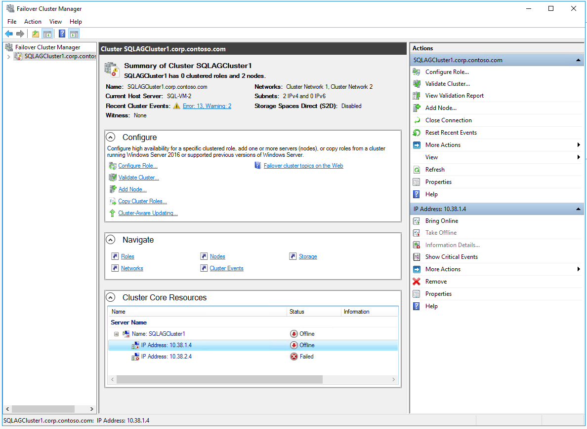

4. Select **Static IP Address** and specify the secondary IP that was dedicated for windows cluster from the same subnet and select **Ok** 
   
    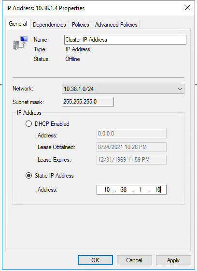

5. Repeat the steps for the second failed **IP Address** resource. 

    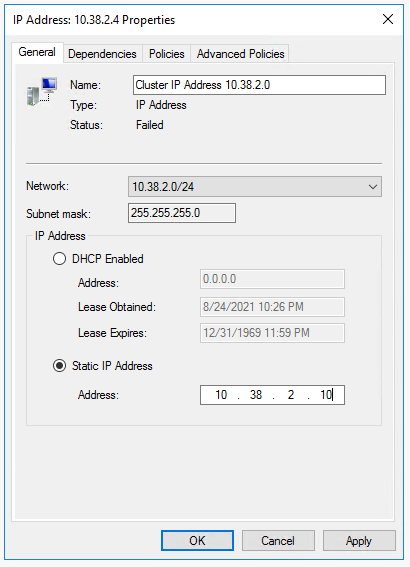

6. In the **Cluster Core Resources** section, right-click cluster name and select **Bring Online**. Wait until the name and one of the IP address resource are online. Since the VMs are in different subnets the cluster created will have an OR dependency on the two IP addresses. When the cluster name resource comes online, it updates the domain controller (DC) server with a new Active Directory (AD) computer account. 

### View and copy access keys for cloud witness Azure Storage Account

When you create a Microsoft Azure Storage Account, it is associated with two Access Keys that are automatically generated - Primary Access key and Secondary Access key. For a first-time creation of Cloud Witness, use the Primary Access Key. There is no restriction regarding which key to use for Cloud Witness.

To view and copy storage access keys for the Azure Storage Account created in [prerequisites document](availability-group-manually-configure-prerequisites-tutorial-multi-subnet.md)

1. In the portal, open the **SQL-HA-RG** resource group and select the storage account you created. 
2. Under **Security + networking** select **Access Keys**
3. Select **Show Keys** and copy the key

    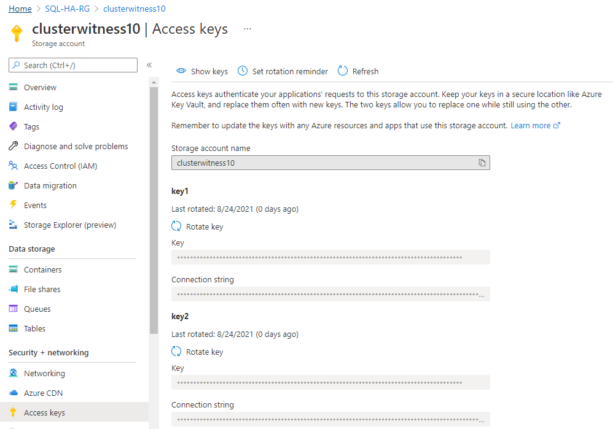

### Configure the cluster quorum

Next, set the cluster quorum.

1. Connect to the first SQL Server VM **SQL-VM-1** with remote desktop.

2. In **Failover Cluster Manager**, right-click the cluster, point to **More Actions**, and select **Configure Cluster Quorum Settings...**.

   

3. In **Configure Cluster Quorum Wizard**, select **Next**.

4. In **Select Quorum Configuration Option**, choose **Select the quorum witness**, and select **Next**.

5. On **Select Quorum Witness**, select **Configure a cloud witness**.
  
6. On **Configure cloud Witness**, type the **Azure storage account name** and the **Azure storage account key** you copied earlier. Select **Next**.

7. Verify the settings on **Confirmation**. Select **Next**.

8. Select **Finish**.

RSETLEM - Had to set minimum TLS version for the storage account to 1.0. Need to review this

The cluster core resources are configured with a cloud witness.

## Enable availability groups

Next, enable the **AlwaysOn availability groups** feature. Do these steps on both SQL Servers.

1. From the **Start** screen, launch **SQL Server Configuration Manager**.
2. In the browser tree, select **SQL Server Services**, then right-click the **SQL Server (MSSQLSERVER)** service and select **Properties**.
3. Select the **AlwaysOn High Availability** tab, then select **Enable AlwaysOn availability groups**, as follows:

    

4. Select **Apply**. Select **OK** in the pop-up dialog.

5. Restart the SQL Server service.

Repeat these steps on the other SQL Server.

## Create a database on the first SQL Server

1. Launch the RDP file to the first SQL Server VM **SQL-VM-1** with a domain account that is a member of sysadmin fixed server role.
   >[!TIP]
   >If you followed the [prerequisites document](availability-group-manually-configure-prerequisites-tutorial-multi-subnet.md), you created an account called **CORP\Install**. Use this account.
2. Open SQL Server Management Studio and connect to the SQL Server instance.
3. In **Object Explorer**, right-click **Databases** and select **New Database**.
4. In **Database name**, type **MyDB1**, then select **OK**.

###  Create a backup share

1. On the first SQL Server in **Server Manager**, select **Tools**. Open **Computer Management**.

2. Select **Shared Folders**.

3. Right-click **Shares**, and select **New Share...**.

   

   Use **Create a Shared Folder Wizard** to create a share.

4. On **Folder Path**, select **Browse** and locate or create a path for the database backup shared folder. Select **Next**.

5. In **Name, Description, and Settings** verify the share name and path. Select **Next**.

6. On **Shared Folder Permissions** set **Customize permissions**. Select **Custom...**.

7. On **Customize Permissions**, select **Add...**.

8. Make sure that the SQL Server service accounts for both servers have full control.

   

9. Select **OK**.

10. In **Shared Folder Permissions**, select **Finish**. Select **Finish** again.  

### Take a full backup of the database

You need to back up the new database to initialize the log chain. If you do not take a backup of the new database, it cannot be included in an availability group.

1. In **Object Explorer**, right-click the database, point to **Tasks**, select **Back Up...**.

2. Select **OK** to take a full backup to the default backup location.

## Create the availability group

You are now ready to configure an availability group using the following steps:

* Create a database on the first SQL Server.
* Take both a full backup and a transaction log backup of the database.
* Restore the full and log backups to the second SQL Server with the **NORECOVERY** option.
* Create the availability group (**AG1**) with synchronous commit, automatic failover, and readable secondary replicas.

### Create the availability group:

1. On remote desktop session to the first SQL Server VM **SQL-VM-1**. In **Object Explorer** in SSMS, right-click **Always On High Availability** and select **New availability group Wizard**.

    

2. In the **Introduction** page, select **Next**. In the **Specify availability group Name** page, type a name for the availability group in **Availability group name**. For example, **AG1**. Select **Next**.

    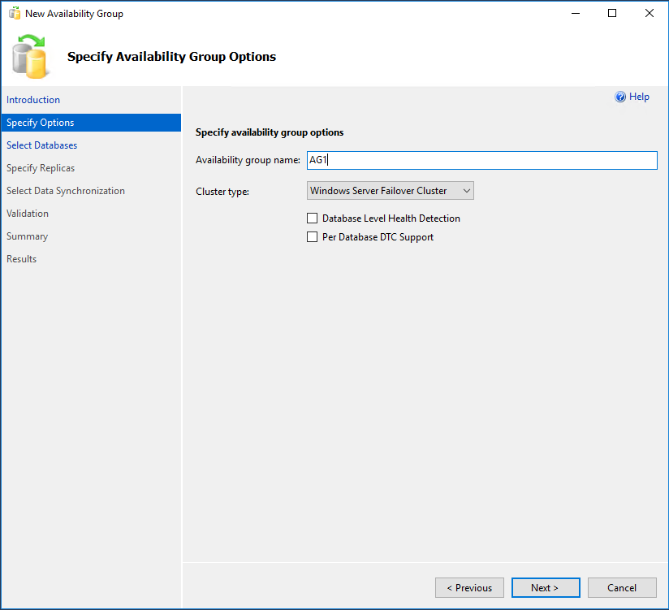

3. In the **Select Databases** page, select your database, and then select **Next**.

   >[!NOTE]
   >The database meets the prerequisites for an availability group because you have taken at least one full backup on the intended primary replica.
   >

   

4. In the **Specify Replicas** page, select **Add Replica**.

   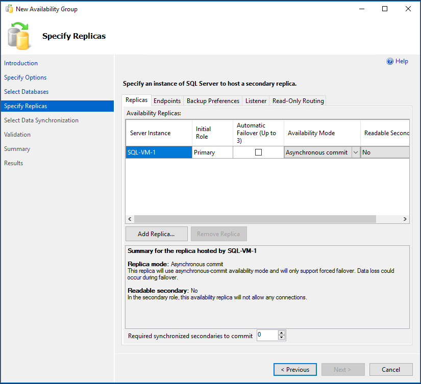

5. The **Connect to Server** dialog pops up. Type the name of the second server in **Server name**. Select **Connect**.

   Back in the **Specify Replicas** page, you should now see the second server listed in **Availability Replicas**. Configure the replicas as follows.

   

6. Select **Endpoints** to see the database mirroring endpoint for this availability group. Use the same port that you used when you set the [firewall rule for database mirroring endpoints](availability-group-manually-configure-prerequisites-tutorial.md#endpoint-firewall).

    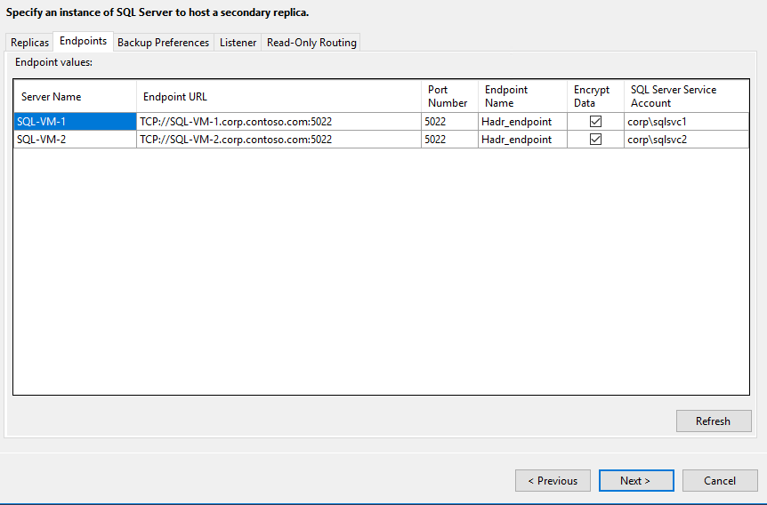

7. Select **Listener** and select **Create an availability group listener**. 
   Following table shows the settings for the Listener
   Field | Value |
   | --- | --- |
   | Listener DNS Name: | AG1-Listener |
   | Port | Use the default SQL Server port. 1433 |
   | Network Mode: | Static IP |

8. Select **Add** to provide the secondary IP address from each of the two SQL Server VM's subnet that's dedicated for Availability Group Listener 

   If you followed the [prerequisites document](availability-group-manually-configure-prerequisites-tutorial-multi-subnet.md), you added following secondary IPs to the two SQL Server VMs to be used for Availability Group Listener.
   
   | VM Name | Subnet name | Subnet address range | Secondary IP name | Secondary IP address |
   | --- | --- | --- | --- | --- |
   | SQL-VM-1 | SQL-subnet-1 | 10.38.1.0/24 | availability-group-listener | 10.38.1.11 |
   | SQL-VM-2 | SQL-subnet-2 | 10.38.2.0/24 | availability-group-listener | 10.38.2.11

   In **Add IP Address** select the first subnet range 10.38.1.0/24 and in **IPv4 Address** provide the address 10.38.1.11.Select **Ok**. 
    
    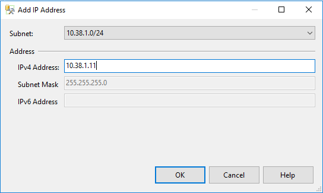    

   Repeat the steps to add the IP address from the second subnet range 10.38.2.0/24. 

        

9. **Listener** page should look similar to the following image. Select **Next**

    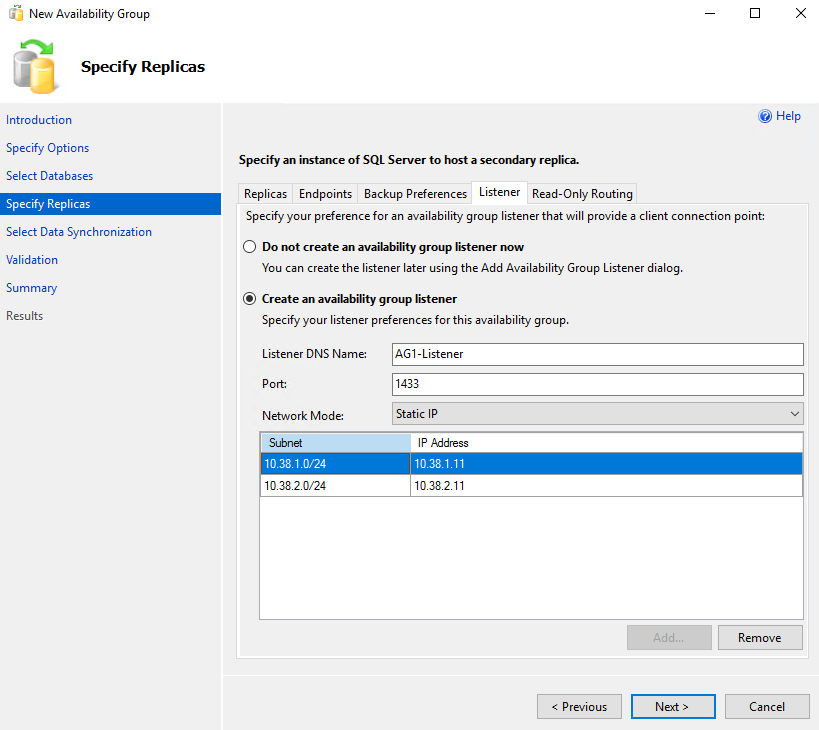

10. In the **Select Initial Data Synchronization** page, select **Full database and log backup** and specify a shared network location. For the location, use the [backup share that you created](#backupshare). In the example it was, **\\\\<First SQL Server\>\Backup\\**. Select **Next**.

   >[!NOTE]
   >Full synchronization takes a full backup of the database on the first instance of SQL Server and restores it to the second instance. For large databases, full synchronization is not recommended because it may take a long time. You can reduce this time by manually taking a backup of the database and restoring it with `NO RECOVERY`. If the database is already restored with `NO RECOVERY` on the second SQL Server before configuring the availability group, choose **Join only**. If you want to take the backup after configuring the availability group, choose **Skip initial data synchronization**.
   >

   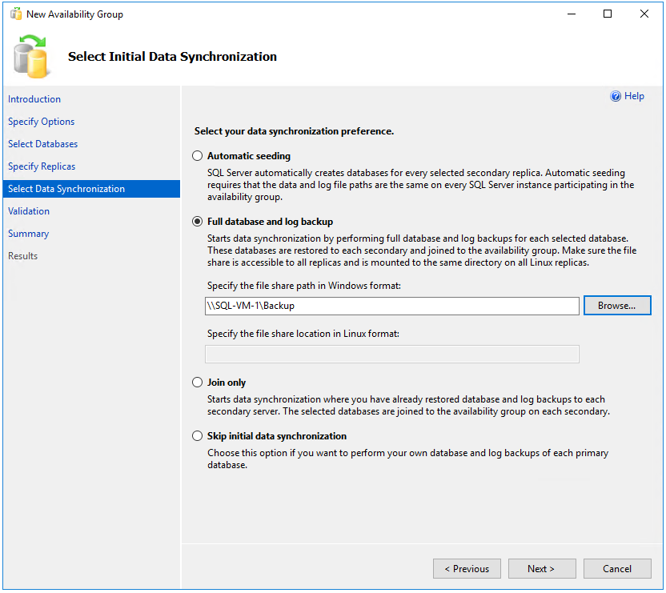

11. In the **Validation** page, select **Next**. This page should look similar to the following image:

    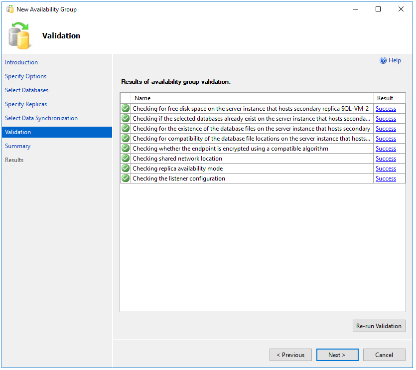

   
12. In the **Summary** page, select **Finish**, then wait while the wizard configures the new availability group. In the **Progress** page, you can select **More details** to view the detailed progress. Once the wizard is finished, inspect the **Results** page to verify that the availability group and the listener is successfully created.

     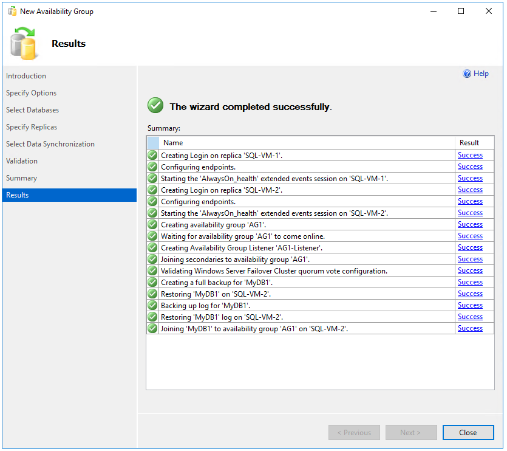

13. Select **Close** to exit the wizard.

### Check the availability group

1. In **Object Explorer**, expand **AlwaysOn High Availability**, and then expand **availability groups**. You should now see the new availability group in this container. Right-click the availability group and select **Show Dashboard**.

   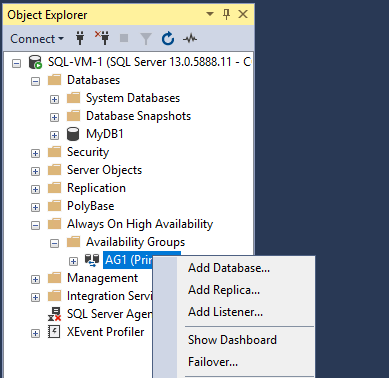

   Your **AlwaysOn Dashboard** should look similar to the following screenshot:

   

   You can see the replicas, the failover mode of each replica, and the synchronization state.

2. In **Failover Cluster Manager**, select your cluster. Select **Roles**. The availability group name you used is a role on the cluster. Select the role **AG1** and select **Resources** in the bottom window. You should see the Availbaility Group Listener name and the IPs associated with it. 

   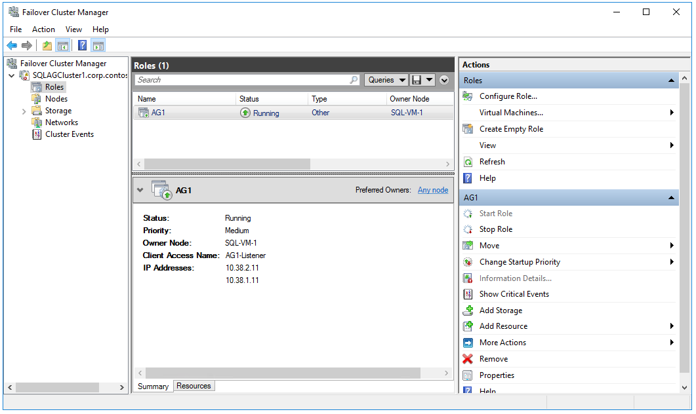

   > [!WARNING]
   > Do not try to fail over the availability group from the Failover Cluster Manager. All failover operations should be performed from within **AlwaysOn Dashboard** in SSMS. For more information, see [Restrictions on Using The Failover Cluster Manager with availability groups](/sql/database-engine/availability-groups/windows/failover-clustering-and-always-on-availability-groups-sql-server).
    >

At this point, you have an availability group with replicas on two instances of SQL Server and a corresponding availability group listener as well. You can connect using listener and you can move the availability group between instances. 

## Test connection to listener

To test the connection:

1. Use RDP to connect to a SQL Server that is in the same virtual network, but does not own the replica. You can use the other SQL Server in the cluster. Th following steps establishes a connection to the primary replica through the listener with Windows authentication. 

2. Open SQL Server Management Studio and in **Server name:** type the name of the listener **AG1-Listener**

    

3. Select **Options** and select **Additional Connection Parameters** and enter **MultiSubnetFailover=True**. 

    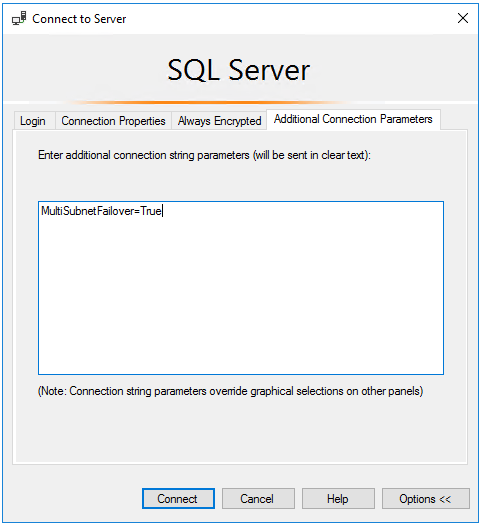

   The connection automatically connects to whichever instance of SQL Server hosts the primary replica.

> [!NOTE]
> While connecting to availability group on different subnets, setting MultiSubnetFailover=true provides faster detection of and connection to the (currently) active server. See [Connecting with MultiSubnetFailover](/dotnet/framework/data/adonet/sql/sqlclient-support-for-high-availability-disaster-recovery#connecting-with-multisubnetfailover)
>

> [!NOTE]
> Setting MultiSubnetFailover=True isn't required with .NET Framework 4.6.1 or later versions.
>

## Next steps

To learn more, see:

- [Windows Server Failover Cluster with SQL Server on Azure VMs](hadr-windows-server-failover-cluster-overview.md)
- [Always On availability groups with SQL Server on Azure VMs](availability-group-overview.md)
- [Always On availability groups overview](/sql/database-engine/availability-groups/windows/overview-of-always-on-availability-groups-sql-server)
- [HADR settings for SQL Server on Azure VMs](hadr-cluster-best-practices.md)