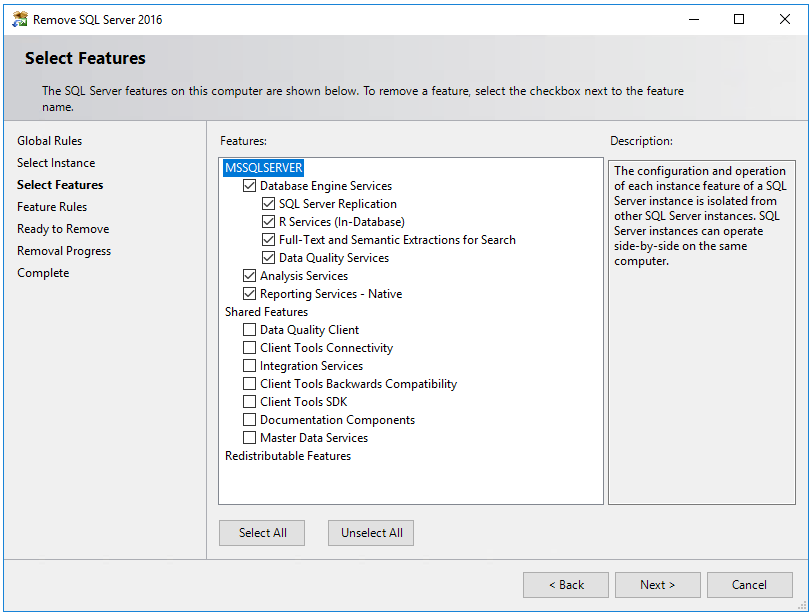

# Prepare virtual machines for an FCI (SQL Server on Azure VMs)
[!INCLUDE[appliesto-sqlvm](../../includes/appliesto-sqlvm.md)]

This article describes how to prepare Azure virtual machines (VMs) to use them with a SQL Server failover cluster instance (FCI). Configuration settings vary depending on the FCI storage solution, so validate that you're choosing the correct configuration to suit your environment and business. 

To learn more, see an overview of [FCI with SQL Server on Azure VMs](failover-cluster-instance-overview.md) and [cluster best practices](hadr-cluster-best-practices.md). 

> [!NOTE]
> It's now possible to lift and shift your failover cluster instance solution to SQL Server on Azure VMs using Azure Migrate. See [Migrate failover cluster instance](../../migration-guides/virtual-machines/sql-server-failover-cluster-instance-to-sql-on-azure-vm.md) to learn more. 

## Prerequisites 

- A Microsoft Azure subscription. Get started for [free](https://azure.microsoft.com/free/). 
- A Windows domain on Azure virtual machines or an on-premises active directory extended to Azure with virtual network pairing.
- An account that has permissions to create objects on Azure virtual machines and in Active Directory.
- An Azure virtual network and one or more subnets with enough IP address space for these components:
   - Both virtual machines
   - An IP address for the Windows failover cluster
   - An IP address for each FCI
- DNS configured on the Azure network, pointing to the domain controllers.

## Choose an FCI storage option

The configuration settings for your virtual machine vary depending on the storage option you're planning to use for your SQL Server failover cluster instance. Before you prepare the virtual machine, review the [available FCI storage options](failover-cluster-instance-overview.md#storage) and choose the option that best suits your environment and business need. Then carefully select the appropriate VM configuration options throughout this article based on your storage selection. 

## Choose VM availability 

The failover cluster feature requires virtual machines to be placed in an [availability set](../../../virtual-machines/linux/tutorial-availability-sets.md) or an [availability zone](../../../availability-zones/az-overview.md#availability-zones).

Carefully select the VM availability option that matches your intended cluster configuration: 

- **Azure shared disks**: the availability option varies if you're using Premium SSD or UltraDisk:
   - **Premium SSD Zone Redundant Storage (ZRS)**:
   [Availability Zone](../../../availability-zones/az-overview.md#availability-zones) in different zones. [Premium SSD ZRS](../../../virtual-machines/disks-redundancy.md#zone-redundant-storage-for-managed-disks) replicates your Azure managed disk synchronously across three Azure availability zones in the selected region. VMs part of failover cluster can be placed in different availability zones, helping you achieve a zone-redundant SQL Server FCI that provides a VM availability SLA of 99.99%. Disk latency for ZRS is higher due to the cross-zonal copy of data.
   - **Premium SSD Locally Redundant Storage (LRS)**: 
   [Availability Set](../../../virtual-machines/windows/tutorial-availability-sets.md#create-an-availability-set) in different fault/update domains for [Premium SSD LRS](../../../virtual-machines/disks-redundancy.md#locally-redundant-storage-for-managed-disks). You can also choose to place the VMs inside a [proximity placement group](../../../virtual-machines/windows/proximity-placement-groups-portal.md) to locate them closer to each other. Combining availability set and proximity placement group provides the lowest latency for shared disks as data is replicated locally within one data center and provides VM availability SLA of 99.95%.
   - **Ultra Disk Locally Redundant Storage (LRS)**: 
   [Availability zone](../../../virtual-machines/windows/create-portal-availability-zone.md#confirm-zone-for-managed-disk-and-ip-address) but the VMs must be placed in the same availability zone. [Ultra disks](../../../virtual-machines/disks-enable-ultra-ssd.md) offers lowest disk latency and is best for IO intensive workloads. Since all VMs part of the FCI have be in the same availability zone, the VM availability is only 99.9%. 
- **Premium file shares**: [Availability set](../../../virtual-machines/windows/tutorial-availability-sets.md#create-an-availability-set) or [Availability Zone](../../../virtual-machines/windows/create-portal-availability-zone.md#confirm-zone-for-managed-disk-and-ip-address).
- **Storage Spaces Direct**: [Availability Set](../../../virtual-machines/windows/tutorial-availability-sets.md#create-an-availability-set).

> [!IMPORTANT]
> You can't set or change the availability set after you've created a virtual machine.

## Subnets 

For SQL Server on Azure VMs, you have the option to deploy your SQL Server VMs to a single subnet, or to multiple subnets. 

Deploying your VMs to multiple subnets leverages the cluster OR dependency for IP addresses and matches the on-premises experience when connecting to your failover cluster instance. The multi-subnet approach is recommend for SQL Server on Azure VMs for simpler manageability, and faster failover times. 

Deploying your VMs to a single subnet requires an additional dependency on an Azure Load Balancer or distributed network name (DNN) to route traffic to your FCI. 

If you deploy your SQL Server VMs to multiple subnets, follow the steps in this section to create your virtual networks with additional subnets, and then once the SQL Server VMs are created, [assign secondary IP addresses](#assign-secondary-ip-addresses) within those subnets to the VMs. Deploying your SQL Server VMs to a single subnet does not require any additional network configuration. 

# [Single subnet](#tab/single-subnet)

Place both virtual machines in a single subnet that has enough IP addresses for both virtual machines and all FCIs that you might eventually install to the cluster. This approach requires an extra component to route connections to your FCI, such as an Azure Load Balancer or a distributed network name (DNN). 

If you choose to deploy your SQL Server VMs to a single subnet [review the differences between the Azure Load Balancer and DNN connectivity options](hadr-windows-server-failover-cluster-overview.md#distributed-network-name-dnn) and decide which option works best for you before preparing the rest of your environment for your FCI.

Deploying your SQL Server VMs to a single subnet does not require any additional network configuration. 

# [Multi-subnet](#tab/multi-subnet)

If you want to route connections directly to your SQL Server FCI, place both virtual machines in separate subnets within a virtual network. Assign a secondary IP address to the SQL Server VM for the failover cluster instance - and, if you're on Windows Server 2016 and below, assign an additional secondary IP address for the Windows Server Failover Cluster as well. Windows Server 2019 and later uses a distributed network name (DNN) for the cluster name so a secondary IP address for the cluster is not necessary. 

This approach eliminates the need for an Azure Load Balancer or a distributed network name (DNN) when connecting to your SQL Server FCI. 

If you choose to deploy your SQL Server VMs to multiple subnets, you'll first need to create the virtual network with two extra subnets, and once your SQL Server VMs are created, [assign secondary IP addresses to the VM](#assign-secondary-ip-addresses).  To learn more, see [Virtual network overview](../../../virtual-network/virtual-networks-overview.md). The subnet names and IP addresses in this section are provided as just an example, and may vary in your environment. 
To create the virtual network in the Azure portal, follow these steps:

1. Go to your resource group in the [Azure portal](https://portal.azure.com) and select **+ Create**

   :::image type="content" source="./media/availability-group-manually-configure-prerequisites-tutorial-multi-subnet/02-create-resource-rg.png" alt-text="Create new resource in your resource group":::

1. Search for **virtual network** in the **Marketplace** search box and choose the **virtual network** tile from Microsoft. Select **Create** on the **Virtual network** page.  
1. On the **Create virtual network** page, enter the following information on the **Basics** tab: 
   1. Under **Project details**, choose the appropriate Azure **Subscription**, and the **Resource group** where you plan to deploy your SQL Server VMs. 
   1. Under **Instance details**, provide a name for your virtual network and choose the same region as your resource group from the drop-down.

   :::image type="content" source="./media/availability-group-manually-configure-prerequisites-tutorial-multi-subnet/03-create-vnet-basics.png" alt-text="Choose the resource group you made previously, then provide a name for your virtual network":::

1. On the **IP addresses** tab, select **+ Add subnet** to add an additional subnet for your first SQL Server VM, and fill in the following values: 
   1. Provide a value for the **Subnet name**, such as **SQL-subnet-1**. 
   1. Provide a unique subnet address range within the virtual network address space. For example, you can iterate the third octet of DC-subnet address range by 1. 
      - For example, if your **default** range is *10.38.0.0/24*, enter the IP address range `10.38.1.0/24` for **SQL-subnet-1**. 
      - Likewise, if your **default** IP range is *10.5.0.0/24*, then enter `10.5.1.0/24` for the new subnet. 
   1. Select **Add** to add your new subnet. 

     :::image type="content" source="./media/failover-cluster-instance-prepare-vm/05-create-vnet-ip-address-add-sql-subnet-1.png" alt-text="Name your first subnet, such as sql-subnet-1, and then iterate the third octet by 1, so that if your DC-subnet IP address is 10.5.0.0, your new subnet should be 10.5.1.0":::

1. Repeat the previous step to add an additional unique subnet range for your second SQL Server VM with a name such as **SQL-subnet-2**. You can iterate the third octet by one again. 
   - For example, if your **default** IP range is *10.38.0.0/24*, and your **SQL-subnet-1** is *10.38.1.0/24*, then enter `10.38.2.0/24` for the new subnet
   - Likewise, if your **default** IP range is *10.5.0.0/24*, and your **SQL-subnet-1** is *10.5.1.0/24*, then enter the IP address range `10.5.2.0/24` for **SQL-subnet-2** . 

   :::image type="content" source="./media/availability-group-manually-configure-prerequisites-tutorial-multi-subnet/06-create-vnet-ip-address-add-sql-subnet-2.png" alt-text="Name your second subnet, such as sql-subnet-2, and then iterate the third octet by 2, so that if your DC-subnet IP address is 10.38.0.0/24, your new subnet should be 10.38.2.0/24":::

1. After you've added the second subnet, review your subnet names and ranges (your IP address ranges may differ from the image). If everything looks correct, select **Review + create**, then **Create** to create your new virtual network. 

   :::image type="content" source="./media/failover-cluster-instance-prepare-vm/07-create-vnet-ip-address.png" alt-text="After you've added the second subnet, review your subnet names and ranges, like the image example (though your IP addresses may be different). If everything looks correct, select Review + create, then Create to create your new virtual network.":::

   Azure returns you to the portal dashboard and notifies you when the new network is created.

---

## Configure DNS

Configure your virtual network to use your DNS server. First, identify the DNS IP address, and then add it to your virtual network. 

### Identify DNS IP address

Identify the IP address of the DNS server, and then add it to the virtual network configuration. This section demonstrates how to identify the DNS IP address if the DNS server is on a virtual machine in Azure. 

To identify the IP address of the DNS server VM in the Azure portal, follow these steps: 

1. Go to your resource group in the [Azure portal](https://portal.azure.com) and select the DNS server VM. 
1. On the VM page, choose **Networking** in the **Settings** pane. 
1. Note the **NIC Private IP** address as this is the IP address of the DNS server. In the example image, the private IP address is **10.38.0.4**. 

:::image type="content" source="./media/availability-group-manually-configure-prerequisites-tutorial-multi-subnet/12-dc-vm-1-private-ip.png" alt-text="On the DC-VM-1 page, choose Networking in the Settings pane, and then note the NIC private IP address. Use this IP address as the DNS server. ":::

### Configure virtual network DNS

Configure the virtual network to use this the DNS server IP address. 

To configure your virtual network for DNS, follow these steps: 

1. Go to your resource group in the [Azure portal](https://portal.azure.com), and select your virtual network. 
1. Select **DNS servers** under the **Settings** pane and then select **Custom**. 
1. Enter the private IP address you identified previously in the **IP Address** field, such as `10.38.0.4`, or provide the internal IP address of your internal DNS server. 
1. Select **Save**. 

:::image type="content" source="./media/availability-group-manually-configure-prerequisites-tutorial-multi-subnet/12-identify-dns-ip-address.png" alt-text=" Select DNS servers under the Settings pane and then select Custom. Enter the private IP address you identified previously in the IP Address field, such as 10.38.0.4. ":::

## Create the virtual machines

After you've configured your VM virtual network and chosen VM availability, you're ready to create your virtual machines. You can choose to use an Azure Marketplace image that does or doesn't have SQL Server already installed on it. However, if you choose an image for SQL Server on Azure VMs, you'll need to uninstall SQL Server from the virtual machine before configuring the failover cluster instance. 

### NIC considerations

On an Azure VM guest failover cluster, we recommend a single NIC per server (cluster node). Azure networking has physical redundancy, which makes additional NICs unnecessary on an Azure IaaS VM guest cluster. Although the cluster validation report will issue a warning that the nodes are only reachable on a single network, this warning can be safely ignored on Azure IaaS VM guest failover clusters.

Place both virtual machines:

- In the same Azure resource group as your availability set, if you're using availability sets.
- On the same virtual network as your domain controller and DNS server or on a virtual network that has suitable connectivity to your domain controller.
- In the Azure availability set or availability zone.

You can create an Azure virtual machine by using an image [with](sql-vm-create-portal-quickstart.md) or [without](../../../virtual-machines/windows/quick-create-portal.md) SQL Server preinstalled to it. If you choose the SQL Server image, you'll need to manually uninstall the SQL Server instance before installing the failover cluster instance.  

### Assign secondary IP addresses

If you deployed your SQL Server VMs to a single subnet, skip this step. If you deployed your SQL Server VMs to multiple subnets for improved connectivity to your FCI, you need to assign the secondary IP addresses to each VM. 

Assign secondary IP addresses to each SQL Server VM to use for the failover cluster instance network name, and for Windows Server 2016 and earlier, assign secondary IP addresses to each SQL Server VM for the cluster network name as well. Doing this negates the need for an Azure Load Balancer, as is the requirement in a single subnet environment.  

On Windows Server 2016 and earlier, you need to assign an additional secondary IP address to each SQL Server VM to use for the windows cluster IP since the cluster uses the **Cluster Network Name** rather than the default distributed network name (DNN) introduced in Windows Server 2019. With a DNN, the cluster name object (CNO) is automatically registered with the IP addresses for all the nodes of the cluster, eliminating the need for a dedicated windows cluster IP address.

If you're on Windows Server 2016 and prior, follow the steps in this section to assign a secondary IP address to each SQL Server VM for *both* the FCI network name, *and* the cluster. 

If you're on Windows Server 2019 or later, only assign a secondary IP address for the FCI network name, and skip the steps to assign a windows cluster IP, unless you plan to configure your cluster with a virtual network name (VNN), in which case assign both IP addresses to each SQL Server VM as you would for Windows Server 2016. 

To assign additional secondary IPs to the VMs, follow these steps: 

1. Go to your resource group in the [Azure portal](https://portal.azure.com/) and select the first SQL Server VM. 
1. Select **Networking** in the **Settings** pane, and then select the **Network Interface**: 

    :::image type="content" source="./media/availability-group-manually-configure-prerequisites-tutorial-multi-subnet/19-sql-vm-network-interface.png" alt-text="Select Networking in the Settings pane, and then select the Network Interface":::

1. On the **Network Interface** page, select **IP configurations** in the **Settings** pane and then choose **+ Add** to add an additional IP address: 

    :::image type="content" source="./media/availability-group-manually-configure-prerequisites-tutorial-multi-subnet/20-ip-configurations-add.png" alt-text="IP configurations":::

1. On the **Add IP configuration** page, do the following: 
   1. Specify the **Name** for the Windows Cluster IP address, such as **windows-cluster-ip** for Windows 2016 and earlier. Skip this step if you're on Windows Server 2019 or later. 
   1. Set the **Allocation** to **Static**.
   1. Enter an unused **IP address** in the same subnet (**SQL-subnet-1**) as the SQL Server VM, such as `10.38.1.10`. 
   1. Leave the **Public IP address** at the default of **Disassociate**. 
   1. Select **OK** to finish adding the IP configuration. 

   :::image type="content" source="./media/availability-group-manually-configure-prerequisites-tutorial-multi-subnet/21-add-ip-windows-cluster.png" alt-text="Add Cluster IP by entering in an used IP address in the subnet of the first SQL Server VM":::

1. Select **+ Add** again to configure an additional IP address for the FCI network name (with a name such as **FCI-network-name**), again specifying an unused IP address in **SQL-subnet-1** such as `10.38.1.11`: 

   :::image type="content" source="./media/failover-cluster-instance-prepare-vm/22-add-fci-ip-address.png" alt-text="Select + Add again to configure an additional IP address for the availability group listener (with a name such as availability-group-listener), again using an unused IP address in SQL-subnet-1 such as 10.31.1.11":::

1. Repeat these steps again for the second SQL Server VM. Assign two unused secondary IP addresses within **SQL-subnet-2**. Use the values from the following table to add the IP configuration (though the IP addresses are just examples, yours may vary): 

   
    | **Field** | Input | Input | 
    | --- | --- | --- |
    | **Name** |windows-cluster-ip | FCI-network-name |
    | **Allocation** | Static | Static |
    | **IP address** | 10.38.2.10 | 10.38.2.11 | 

## Uninstall SQL Server

As part of the FCI creation process, you'll install SQL Server as a clustered instance to the failover cluster. *If you deployed a virtual machine with an Azure Marketplace image without SQL Server, you can skip this step.* If you deployed an image with SQL Server preinstalled, you'll need to unregister the SQL Server VM from the SQL IaaS Agent extension, and then uninstall SQL Server. 

### Unregister from the SQL IaaS Agent extension

SQL Server VM images from Azure Marketplace are automatically registered with the SQL IaaS Agent extension. Before you uninstall the preinstalled SQL Server instance, you must first [unregister each SQL Server VM from the SQL IaaS Agent extension](sql-agent-extension-manually-register-single-vm.md#unregister-from-extension). 

### Uninstall SQL Server

After you've unregistered from the extension, you can uninstall SQL Server. Follow these steps on each virtual machine: 

1. Connect to the virtual machine by using RDP. When you first connect to a virtual machine by using RDP, a prompt asks you if you want to allow the PC to be discoverable on the network. Select **Yes**.
1. Open **Programs and Features** in the **Control Panel**. 
1. In **Programs and Features**, right-click **Microsoft SQL Server 201_ (64-bit)** and select **Uninstall/Change**.
1. Select **Remove**.
1. Select the default instance.
1. Remove all features under **Database Engine Services**, **Analysis Services** and **Reporting Services - Native**. Don't remove anything under **SharedFeatures**. You'll see something like the following screenshot:
   
1. Select **Next**, and then select **Remove**.
1. After the instance is successfully removed, restart the virtual machine. 

## Open the firewall 

On each virtual machine, open the Windows Firewall TCP port that SQL Server uses. By default SQL Server uses port 1433, but if you changed this in your environment, open the port you've configured your SQL Server instance to use. Port 1433 is automatically open on SQL Server images deployed from Azure Marketplace. 

If you use a [load balancer](failover-cluster-instance-vnn-azure-load-balancer-configure.md) for single subnet scenario, you'll also need to open the port that the health probe uses. By default, the health probe uses port 59999, but it can be any TCP port that you specify when you create the load balancer. 

This table details the ports that you might need to open, depending on your FCI configuration: 

   | Purpose | Port | Notes
   | ------ | ------ | ------
   | SQL Server | TCP 1433 | Normal port for default instances of SQL Server. If you used an image from the gallery, this port is automatically opened.     **Used by**: All FCI configurations. |
   | Health probe | TCP 59999 | Any open TCP port. Configure the load balancer [health probe](failover-cluster-instance-vnn-azure-load-balancer-configure.md#configure-health-probe) and the cluster  to use this port.     **Used by**: FCI with load balancer in single subnet scenario. |
   | File share | UDP 445 | Port that the file share service uses.     **Used by**: FCI with Premium file share. |

## Join the domain

You also need to join your virtual machines to the domain. You can do so by using a [quickstart template](../../../active-directory-domain-services/join-windows-vm-template.md#join-an-existing-windows-server-vm-to-a-managed-domain). 

## Review storage configuration

Virtual machines created from Azure Marketplace come with attached storage. If you plan to configure your FCI storage by using Premium file shares or Azure shared disks, you can remove the attached storage to save on costs because local storage is not used for the failover cluster instance. However, it's possible to use the attached storage for Storage Spaces Direct FCI solutions, so removing them in this case might be unhelpful. Review your FCI storage solution to determine if removing attached storage is optimal for saving costs. 

## Next steps

Now that you've prepared your virtual machine environment, you're ready to configure your failover cluster instance. 

Choose one of the following guides to configure the FCI environment that's appropriate for your business: 
- [Configure FCI with Azure shared disks](failover-cluster-instance-azure-shared-disks-manually-configure.md)
- [Configure FCI with a Premium file share](failover-cluster-instance-premium-file-share-manually-configure.md)
- [Configure FCI with Storage Spaces Direct](failover-cluster-instance-storage-spaces-direct-manually-configure.md)

To learn more, see:

- [Windows Server Failover Cluster with SQL Server on Azure VMs](hadr-windows-server-failover-cluster-overview.md)
- [Failover cluster instances with SQL Server on Azure VMs](failover-cluster-instance-overview.md)
- [Failover cluster instance overview](/sql/sql-server/failover-clusters/windows/always-on-failover-cluster-instances-sql-server)
- [HADR settings for SQL Server on Azure VMs](hadr-cluster-best-practices.md)
