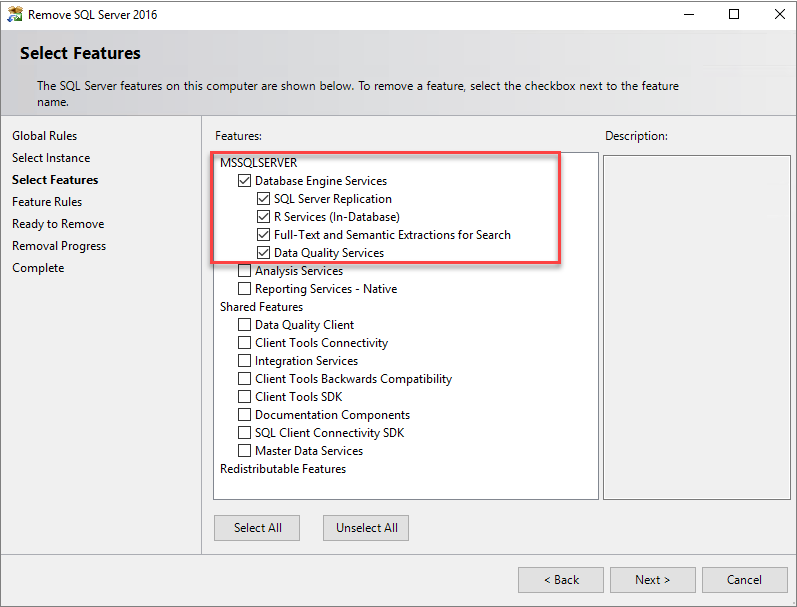

# Prepare virtual machines for FCI (SQL Server on Azure VMs)
[!INCLUDE[appliesto-sqlvm](../../includes/appliesto-sqlvm.md)]

This article describes how to prepare two Azure Virtual Machines (VMs) to use with a SQL Server failover cluster instance (FCI). Configuration settings vary depending on the FCI storage solution so validate you're choosing the correct configuration to suit your environment and business. 

To learn more, see an overview of [FCI with SQL Server on Azure VMs](failover-cluster-instance-overview.md) and [supported configurations](hadr-cluster-best-practices.md). 

## Prerequisites 

- A Microsoft Azure subscription.
- A Windows domain on Azure virtual machines.
- An account that has permissions to create objects on both Azure virtual machines and in Active Directory.
- An Azure virtual network and subnet with enough IP address space for these components:
   - Both virtual machines.
   - The failover cluster IP address.
   - An IP address for each FCI.
- DNS configured on the Azure network, pointing to the domain controllers.

## Choose FCI storage option

The configuration settings for your virtual machine vary depending on the storage option you're planning to use for your SQL Server failover cluster instance. Before preparing the virtual machine, review the [available FCI storage options](failover-cluster-instance-overview.md#storage) and choose the option that best suits your environment and business need. Then carefully select the appropriate VM configuration options throughout this article based on your intended storage selection. 

## Configure VM availability 

The failover cluster feature requires virtual machines to be placed in an [availability set](../../../virtual-machines/linux/tutorial-availability-sets.md), an [availability zone](../../../availability-zones/az-overview.md#availability-zones), or [proximity placement group](../../../virtual-machines/windows/co-location.md#proximity-placement-groups.md).

Carefully select the VM availability option that matches your intended cluster configuration. The following VM availability options are available when you plan to configure your SQL Server failover cluster instance with: 

 - **Shared Managed Disks** [Proximity placement group](../../../virtual-machines/windows/proximity-placement-groups-portal.md)
 - **Premium File Shares**: [Availability set](../../../virtual-machines/windows/tutorial-availability-sets.md#create-an-availability-set), [availability zone](../../../virtual-machines/windows/create-portal-availability-zone.md#confirm-zone-for-managed-disk-and-ip-address)
 - **Storage Spaces Direct**: [Availability set](../../../virtual-machines/windows/tutorial-availability-sets.md#create-an-availability-set), [availability zone](../../../virtual-machines/windows/create-portal-availability-zone.md#confirm-zone-for-managed-disk-and-ip-address)

   >[!IMPORTANT]
   >You can't set or change the availability set after you've created a virtual machine.

## Create the virtual machine

Once you've configured your VM availability, you're ready to create your virtual machines. You can choose to use an Azure Marketplace image that does or does not have SQL Server already installed on it. However, if you choose a SQL Server on Azure VM image, you will need to uninstall SQL Server from the virtual machine before configuring the failover cluster instance. 

If you're deploying a virtual machine with storage already attached, be sure to select at least 2 premium SSDs. We recommend at least P30 (1-TB) disks.

   Place both virtual machines:

   - In the same Azure resource group as your availability set, if you're using availability sets.
   - On the same network as your domain controller.
   - On a subnet that has enough IP address space for both virtual machines and all FCIs that you might eventually use on the cluster.
   - In the Azure availability set or availability zone.

You can create an Azure Virtual Machine using an image [with](sql-vm-create-portal-quickstart.md) or [without](../../../virtual-machines/windows/quick-create-portal.md) SQL Server pre-installed to it, but if you choose the SQL Server image you will need manually uninstall the SQL Server instance before installing the failover cluster instance. 

## Uninstall SQL Server

As part of the FCI creation process, you will install SQL Server as a clustered instance to the failover cluster. *If you deployed a virtual machine with an Azure marketplace image without SQL Server, you can skip this step.* If you deployed an image with SQL Server pre-installed, you will need to unregister the SQL Server VM from the SQL VM resource provider, and then uninstall SQL Server. 

### Unregister from the SQL VM resource provider

SQL Server VM images from the Azure marketplace are automatically registered with the SQL VM resource provider. Before uninstalling the pre-installed SQL Server instance, you must first unregister each SQL Server VM from the SQL VM resource provider. See [unregister from SQL VM resource provider](sql-vm-resource-provider-register.md#unregister-from-the-rp) to learn more. 

### Uninstall SQL Server

Once you've unregistered from the resource provider, you can proceed with uninstalling SQL Server from the virtual machine. 

To uninstall SQL Server, follow these steps on each virtual machine: 

1. After Azure creates your virtual machines, connect to each one by using RDP.

   When you first connect to a virtual machine by using RDP, a prompt asks you if you want to allow the PC to be discoverable on the network. Select **Yes**.

1. If you're using one of the SQL Server-based virtual machine images, remove the SQL Server instance.

   1. In **Programs and Features**, right-click **Microsoft SQL Server 201_ (64-bit)** and select **Uninstall/Change**.
   1. Select **Remove**.
   1. Select the default instance.
   1. Remove all features under **Database Engine Services**. Don't remove **Shared Features**. You'll see something like the following screenshot:

      

   1. Select **Next**, and then select **Remove**.
   1. Once the instance is successfully removed, restart the virtual machine. 

## Open firewall 

On each virtual machine, open the Windows Firewall TCP port used by SQL Server. By default, this is port 1433, but you have the option to change the port SQL Server on Azure VM deployment so open the port SQL Server uses in your environment. This port is automatically open on SQL Server images deployed from the marketplace. 

Additionally, if you use a [load balancer](failover-cluster-instance-connectivity-configure.md#azure-load-balancer), you will also need to open the port used by the health probe. By default, this is port 59999, but it can be any TCP port that you specify at the time of load balancer creation. 

This table details the ports you may need to open depending on your FCI configuration: 

   | Purpose | Port | Notes
   | ------ | ------ | ------
   | SQL Server | TCP 1433 | Normal port for default instances of SQL Server. If you used an image from the gallery, this port is automatically opened.     **Used by**: All FCI configurations. |
   | Health probe | TCP 59999 | Any open TCP port. In a later step, configure the load balancer [health probe](#probe) and the cluster to use this port.     **Used by**: FCI with load balancer. |
   | File share | UDP 445 | Port used by the file share service. **Used by**: FCI with premium file share. |

## Join the domain

You will also need to join your virtual machines to the domain. You can do so using a [quickstart template](../../../active-directory-domain-services/join-windows-vm-template.md#join-an-existing-windows-server-vm-to-a-managed-domain). 

## Attach storage 

-----------------------------
-----------------------------
to discuss: do we even need this section?? do we care about storage for any VMs other than SSD FCI? if so, maybe we can keep this stuff in the s2d tutorial?

-----------------------------
-----------------------------

If you deployed a non-SQL Server image from Azure Marketplace, you may need to attach storage. For detailed information, see [add storage](../../../virtual-machines/linux/disks-types.md). SQL Server images come with storage already attached, but you can modify the tier of disk to suit your business need during deployment. 

Both virtual machines need at least two premium SSD raw (not NTFS-formatted) disks. We recommend at least P30 (1-TB) disks. Set host caching to **Read-only**.

## Next steps

Now that you've prepared your virtual machine environment, you are ready to configure your failover cluster instance. 

Choose one of the following guides to configure the FCI environment appropriate for your business: 
- [Configure FCI with Azure Shared Disks](failover-cluster-instance-azure-shared-disks-manually-configure.md)
- [Configure FCI with Premium File Share](failover-cluster-instance-premium-file-share-manually-configure.md)
- [Configure FCI with Storage Spaces Direct](failover-cluster-instance-storage-spaces-direct-manually-configure.md)

See an overview of [FCI with SQL Server on Azure VMs](failover-cluster-instance-overview.md) and [supported HADR configurations](hadr-cluster-best-practices.md) to learn more. 

For additional information see: 
- [Windows cluster technologies](/windows-server/failover-clustering/failover-clustering-overview)   
- [SQL Server failover cluster instances](/sql/sql-server/failover-clusters/windows/always-on-failover-cluster-instances-sql-server)
