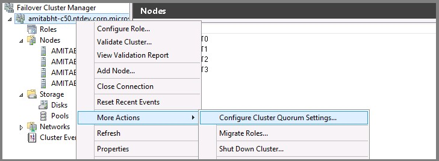
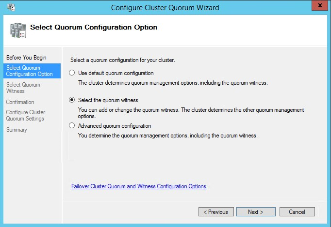
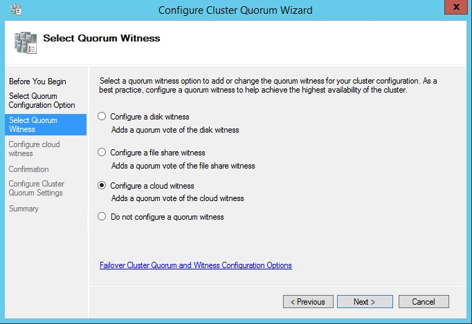
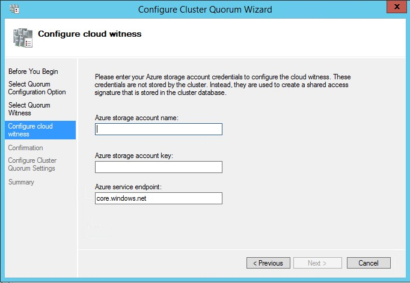
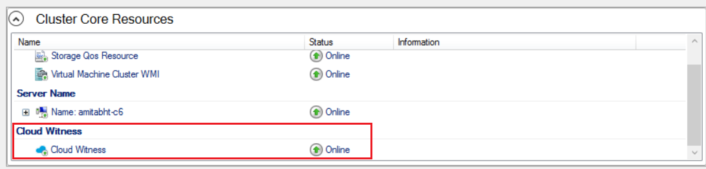

# Configure cluster quorum for SQL Server on Azure VMs
[!INCLUDE[appliesto-sqlvm](../../includes/appliesto-sqlvm.md)]

This article teaches you to configure one of the three quorum options for a Windows Server Failover Cluster running on SQL Server on Azure Virtual Machines (VMs) - a disk witness, a cloud witness, and a file share witness.


## Overview

The quorum for a cluster is determined by the number of voting elements that must be part of active cluster membership for the cluster to start properly or continue running. Configuring a quorum resource allows a two-node cluster to continue with only one node online. The Windows Server Failover Cluster is the underlying technology for the SQL Server on Azure VMs high availability options: [failover cluster instances (FCIs)](failover-cluster-instance-overview.md) and [availability groups (AGs)](availability-group-overview.md). 

The disk witness is the most resilient quorum option, but to use a disk witness on a SQL Server on Azure VM, you must use an Azure shared disk which imposes some limitations to the high availability solution. As such, use a disk witness when you're configuring your failover cluster instance with Azure shared disks, otherwise use a cloud witness whenever possible. If you are using Windows Server 2012 R2 or older which does not support cloud witness, you can use a file share witness. 

The following quorum options are available to use for SQL Server on Azure VMs: 

|  |[Cloud witness](/windows-server/failover-clustering/deploy-cloud-witness) |[Disk witness](/windows-server/failover-clustering/manage-cluster-quorum#configure-the-cluster-quorum) |[File share witness](/windows-server/failover-clustering/manage-cluster-quorum#configure-the-cluster-quorum)  |
|---------|---------|---------|---------|
|**Supported OS**| Windows Server 2016+ |All | All|

To learn more about quorum, see the [Windows Server Failover Cluster overview](hadr-windows-server-failover-cluster-overview.md). 

## Cloud witness

A cloud witness is a type of failover cluster quorum witness that uses Microsoft Azure storage to provide a vote on cluster quorum. 


The following table provides additional information and considerations about the cloud witness: 

| Witness type  | Description  | Requirements and recommendations  |
| ---------    |---------        |---------                        |
| Cloud witness     |  <ul><li> Uses Azure storage as the cloud witness, contains just the time stamp. </li><li> Ideal for deployments in multiple sites, multiple zones, and multiple regions.</li> <li> Creates well-known container `msft-cloud-witness` under the Microsoft Storage Account. </li> <li> Writes a single blob file with corresponding cluster's unique ID used as the file name of the blob file under the container </li>      |  <ul><li>Default size is 1 MB.</li><li> Use **General Purpose** for the account kind. Blob storage is not supported. </li><li> Use Standard storage. Azure Premium Storage is not supported. </li><li> Failover Clustering uses the blob file as the arbitration point, which requires some consistency guarantees when reading the data. Therefore you must select **Locally redundant storage** for **Replication** type.</li><li> Should be excluded from backups and antivirus scanning</li><li> A Disk witness isn't supported with Storage Spaces Direct</li> <li> Cloud Witness uses HTTPS (default port 443) to establish communication with Azure blob service. Ensure that HTTPS port is accessible via network Proxy. </li>|

When configuring a Cloud Witness quorum resource for your Failover Cluster, consider:
- Instead of storing the Access Key, your Failover Cluster will generate and securely store a Shared Access Security (SAS) token.
- The generated SAS token is valid as long as the Access Key remains valid. When rotating the Primary Access Key, it is important to first update the Cloud Witness (on all your clusters that are using that Storage Account) with the Secondary Access Key before regenerating the Primary Access Key.
- Cloud Witness uses HTTPS REST interface of the Azure Storage Account service. This means it requires the HTTPS port to be open on all cluster nodes.


A cloud witness requires an Azure Storage Account. To configure a storage account, follow these steps: 

1. Sign in to the [Azure portal](https://portal.azure.com).
2. On the Hub menu, select New -> Data + Storage -> Storage account.
3. In the Create a storage account page, do the following:
    1. Enter a name for your storage account. Storage account names must be between 3 and 24 characters in length and may contain numbers and lowercase letters only. The storage account name must also be unique within Azure.
    2. For **Account kind**, select **General purpose**.
    3. For **Performance**, select **Standard**.
    2. For **Replication**, select **Local-redundant storage (LRS)**.


Once your storage account is created, follow these steps to configure your cloud witness quorum resource for your failover cluster: 


# [PowerShell](#tab/powershell)

The existing Set-ClusterQuorum PowerShell command has new parameters corresponding to Cloud Witness.

You can configure cloud witness with the cmdlet [`Set-ClusterQuorum`](/powershell/module/failoverclusters/set-clusterquorum) using the PowerShell command:

```PowerShell
Set-ClusterQuorum -CloudWitness -AccountName <StorageAccountName> -AccessKey <StorageAccountAccessKey>
```

In the rare instance you need to use a different endpoint, use this PowerShell command: 

```PowerShell
Set-ClusterQuorum -CloudWitness -AccountName <StorageAccountName> -AccessKey <StorageAccountAccessKey> -Endpoint <servername>
```

See the [cloud witness documentation](/windows-server/failover-clustering/deploy-cloud-witness) for help for finding the Storage Account AccessKey. 


# [Failover Cluster Manager](#tab/fcm-gui)

Use the Quorum Configuration Wizard built into Failover Cluster Manager to configure your cloud witness. To do so, follow these steps: 

1. Open Failover Cluster Manager.

2. Right-click the cluster -> **More Actions** -> **Configure Cluster Quorum Settings**. This launches the Configure Cluster Quorum wizard.

    
    
3. On the **Select Quorum Configurations** page, select **Select the quorum witness**.

    
   
4. On the **Select Quorum Witness** page, select **Configure a cloud witness**.

    
    
5. On the **Configure Cloud Witness** page, enter the Azure Storage Account information. For help with finding this information, see the [cloud witness documentation](/windows-server/failover-clustering/deploy-cloud-witness). 
   1. (Required parameter) Azure Storage Account Name.
   2. (Required parameter) Access Key corresponding to the Storage Account.
       1. When creating for the first time, use Primary Access Key 
       2. When rotating the Primary Access Key, use Secondary Access Key
   3. (Optional parameter) If you intend to use a different Azure service endpoint (for example the Microsoft Azure service in China), then update the endpoint server name.

    
      

6. Upon successful configuration of the cloud witness, you can view the newly created witness resource in the Failover Cluster Manager snap-in.

    
    


---


## Disk witness

A disk witness is a small clustered disk in the Cluster Available Storage group. This disk is highly available and can fail over between nodes. 

The disk witness is the recommended quorum option when used with a shared storage high availability solution, such as the failover cluster instance with Azure shared disks. 

The following table provides additional information and considerations about the quorum disk witness: 

| Witness type  | Description  | Requirements and recommendations  |
| ---------    |---------        |---------                        |
| Disk witness     |  <ul><li> Dedicated LUN that stores a copy of the cluster database</li><li> Most useful for clusters with shared (not replicated) storage</li>       |  <ul><li>Size of LUN must be at least 512 MB</li><li> Must be dedicated to cluster use and not assigned to a clustered role</li><li> Must be included in clustered storage and pass storage validation tests</li><li> Can't be a disk that is a Cluster Shared Volume (CSV)</li><li> Basic disk with a single volume</li><li> Doesn't need to have a drive letter</li><li> Can be formatted with NTFS or ReFS</li><li> Can be optionally configured with hardware RAID for fault tolerance</li><li> Should be excluded from backups and antivirus scanning</li><li> A Disk witness isn't supported with Storage Spaces Direct</li>|

To use an Azure shared disk for the disk witness, you must first create the disk and mount it. To do so, follow the steps in the [Mount disk](failover-cluster-instance-azure-shared-disks-manually-configure.md#add-azure-shared-disk) section of the Azure shared disk failover cluster instance guide. The disk does not need to be premium. 

After your disk has been mounted, add it to the cluster storage with the following steps: 

1. Open Failover Cluster Manager. 
1. Select **Disks** under **Storage** on the left navigation pane. 
1. Select **Add Disk** under **Actions** on the right navigation pane. 
1. Select the Azure shared drive you just mounted and note the name, such as `Cluster Disk 3`. 

After your disk has been added as clustered storage, configure it as the disk witness using PowerShell:  


The existing Set-ClusterQuorum PowerShell command has new parameters corresponding to Cloud Witness.

Use the path for the file share as the parameter for the disk witness when using the  PowerShell cmdlet [`Set-ClusterQuorum`](/powershell/module/failoverclusters/set-clusterquorum):

```PowerShell
Set-ClusterQuorum -NodeAndDiskMajority "Cluster Disk 3"
```

You can also use the Failover Cluster manager; follow the same steps as for the cloud witness, but choose the disk witness as the quorum option instead. 


## File share witness

A file share witness is an SMB file share that's typically configured on a file server running Windows Server. It maintains clustering information in a witness.log file, but doesn't store a copy of the cluster database. In Azure, you can configure a file share on a separate virtual machine. 

Configure a file share witness if a disk witness or a cloud witness are unavailable or unsupported in your environment. 

The following table provides additional information and considerations about the quorum file share witness: 

| Witness type  | Description  | Requirements and recommendations  |
| ---------    |---------        |---------                        |
| File share witness     | <ul><li>SMB file share that is configured on a file server running Windows Server</li><li> Does not store a copy of the cluster database</li><li> Maintains cluster information only in a witness.log file</li><li> Most useful for multisite clusters with replicated storage </li>       |  <ul><li>Must have a minimum of 5 MB of free space</li><li> Must be dedicated to the single cluster and not used to store user or application data</li><li> Must have write permissions enabled for the computer object for the cluster name</li></ul><br>The following are additional considerations for a file server that hosts the file share witness:<ul><li>A single file server can be configured with file share witnesses for multiple clusters.</li><li> The file server must be on a site that is separate from the cluster workload. This allows equal opportunity for any cluster site to survive if site-to-site network communication is lost. If the file server is on the same site, that site becomes the primary site, and it is the only site that can reach the file share.</li><li> The file server can run on a virtual machine if the virtual machine is not hosted on the same cluster that uses the file share witness.</li><li> For high availability, the file server can be configured on a separate failover cluster. </li>      |

Once you have created your file share and properly configured permissions, mount the file share to your clustered nodes. You can follow the same general steps to mount the file share as described in the [mount file share](failover-cluster-instance-premium-file-share-manually-configure.md) section of the premium file share failover cluster instance how-to guide. 

After your file share has been properly configured and mounted, use PowerShell to add the file share as the quorum witness resource: 

```powershell
Set-ClusterQuorum -FileShareWitness <UNC path to file share> -Credential $(Get-Credential)
```

You will be prompted for an account and password for a local (to the file share) non-admin account that has full admin rights to the share.  The cluster will keep the name and password encrypted and not accessible by anyone.

You can also use the Failover Cluster manager; follow the same steps as for the cloud witness, but choose the file share witness as the quorum option instead. 

## Change quorum voting


It's possible to change the quorum vote of a node participating in a Windows Server Failover Cluster. 

When modifying the node vote settings, follow these guidelines: 

| Qurom voting guidelines |
|-|
| Start with each node having no vote by default. Each node should only have a vote with explicit justification.|
| Enable votes for cluster nodes that host the primary replica of an availability group, or the preferred owners of a failover cluster instance. |
| Enable votes for automatic failover owners. Each node that may host a primary replica or FCI as a result of an automatic failover should have a vote. | 
| If an availability group has more than one secondary replica, only enable votes for the replicas that have automatic failover. | 
| Disable votes for nodes that are in secondary disaster recovery sites. Nodes in secondary sites should not contribute to the decision of taking a cluster offline if there's nothing wrong with the primary site. | 
| Have an odd number of votes, with three quorum votes minimum. Add a [quorum witness](hadr-cluster-quorum-configure-how-to.md) for an additional vote if necessary in a two-node cluster. | 
| Reassess vote assignments post-failover. You don't want to fail over into a cluster configuration that doesn't support a healthy quorum. |


## Next Steps

To learn more, see:

- [HADR settings for SQL Server on Azure VMs](hadr-cluster-best-practices.md)
- [Windows Server Failover Cluster with SQL Server on Azure VMs](hadr-windows-server-failover-cluster-overview.md)
- [Always On availability groups with SQL Server on Azure VMs](availability-group-overview.md)
- [Windows Server Failover Cluster with SQL Server on Azure VMs](hadr-windows-server-failover-cluster-overview.md)
- [Failover cluster instances with SQL Server on Azure VMs](failover-cluster-instance-overview.md)
- [Failover cluster instance overview](/sql/sql-server/failover-clusters/windows/always-on-failover-cluster-instances-sql-server)
