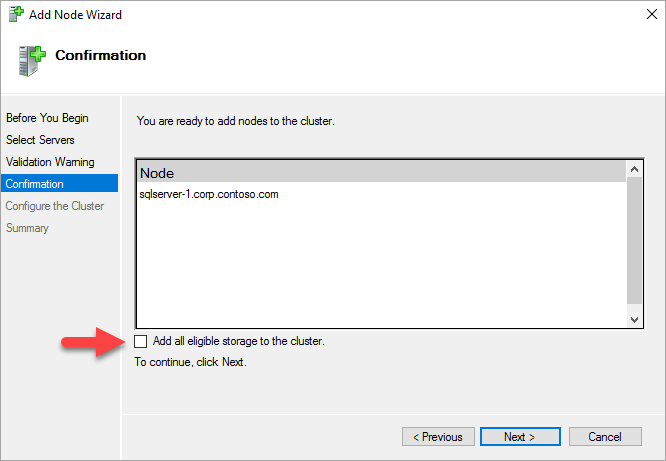

# Create Windows Server Failover Cluster - SQL Server on Azure VMs
[!INCLUDE[appliesto-sqlvm](../../includes/appliesto-sqlvm.md)]

In this article, learn to configure Windows Server Failover Cluster for SQL Server on Azure Virtual Machines (VMs)

## Prerequisites

Before you complete the instructions in this article, you should already have:

- An Azure subscription. Get started for [free](https://azure.microsoft.com/free/). 
- [Two or more Windows Azure virtual machines](failover-cluster-instance-prepare-vm.md). [Availability sets](../../../virtual-machines/windows/tutorial-availability-sets.md).
- An account that has permissions to create objects on both Azure virtual machines and in Active Directory.
- The latest version of [PowerShell](/powershell/azure/install-az-ps).

After the prerequisites are completed, the first step is to create a Windows Server Failover Cluster that includes two SQL Server Virtual Machines and a witness server.

1. Use Remote Desktop Protocol (RDP) to connect to the first SQL Server. Use a domain account that is an administrator 
on both SQL Servers and the witness server.

   >[!TIP]
   >If you followed the [prerequisites document](availability-group-manually-configure-prerequisites-tutorial.md), you 
created an account called **CORP\Install**. Use this account.

2. In the **Server Manager** dashboard, select **Tools**, and then select **Failover Cluster Manager**.
3. In the left pane, right-click **Failover Cluster Manager**, and then select **Create a Cluster**.

   

4. In the Create Cluster Wizard, create a one-node cluster by stepping through the pages with the settings in the 
following table:

   | Page | Settings |
   | --- | --- |
   | Before You Begin |Use defaults |
   | Select Servers |Type the first SQL Server name in **Enter server name** and select **Add**. |
   | Validation Warning |Select **No. I do not require support from Microsoft for this cluster, and therefore do not 
want to run the validation tests. When I select Next, continue Creating the cluster**. |
   | Access Point for Administering the Cluster |Type a cluster name, for example **SQLAGCluster1** in **Cluster 
Name**.|
   | Confirmation |Use defaults unless you are using Storage Spaces. See the note following this table. |

### Set the Windows server failover cluster IP address

  > [!NOTE]
  > On Windows Server 2019, the cluster creates a **Distributed Server Name** instead of the **Cluster Network Name**. 
If you're using Windows Server 2019, skip any steps that refer to the cluster core name in this tutorial. You can 
create a cluster network name using [PowerShell](failover-cluster-instance-storage-spaces-direct-manually-configure.
md#create-failover-cluster). Review the blog [Failover Cluster: Cluster Network Object](https://blogs.windows.com/
windowsexperience/2018/08/14/announcing-windows-server-2019-insider-preview-build-17733/#W0YAxO8BfwBRbkzG.97) for 
more information. 

1. In **Failover Cluster Manager**, scroll down to **Cluster Core Resources** and expand the cluster details. You 
should see both the **Name** and the **IP Address** resources in the **Failed** state. The IP address resource cannot 
be brought online because the cluster is assigned the same IP address as the machine itself, therefore it is a 
duplicate address.

2. Right-click the failed **IP Address** resource, and then select **Properties**.

   

3. Select **Static IP Address** and specify an available address from the same subnet as your virtual machines.

4. In the **Cluster Core Resources** section, right-click cluster name and select **Bring Online**. Wait until both 
resources are online. When the cluster name resource comes online, it updates the domain controller (DC) server with a 
new Active Directory (AD) computer account. Use this AD account to run the availability group clustered service later.

### <a name="addNode"></a>Add the other SQL Server to cluster

Add the other SQL Server to the cluster.

1. In the browser tree, right-click the cluster and select **Add Node**.

    

1. In the **Add Node Wizard**, select **Next**. In the **Select Servers** page, add the second SQL Server. Type the 
server name in **Enter server name** and then select **Add**. When you are done, select **Next**.

1. In the **Validation Warning** page, select **No** (in a production scenario you should perform the validation tests)
Then, select **Next**.

8. In the **Confirmation** page if you are using Storage Spaces, clear the checkbox labeled **Add all eligible storage 
to the cluster.**

   

   >[!WARNING]
   >If you are using Storage Spaces and do not uncheck **Add all eligible storage to the cluster**, Windows detaches 
the virtual disks during the clustering process. As a result, they don't appear in Disk Manager or Explorer until 
the storage spaces are removed from the cluster and reattached using PowerShell. Storage Spaces groups multiple 
disks in to storage pools. For more information, see [Storage Spaces](/previous-versions/windows/it-pro/
windows-server-2012-R2-and-2012/hh831739(v=ws.11)).
   >

1. Select **Next**.

1. Select **Finish**.

   Failover Cluster Manager shows that your cluster has a new node and lists it in the **Nodes** container.

10. Log out of the remote desktop session.
## PowerShell

The cluster needs a storage account to act as the cloud witness. You can use any existing storage account, or you can create a new storage account. If you want to use an existing storage account, skip ahead to the next section. 

```powershell-interactive
# Create the storage account
# example: New-AzStorageAccount -ResourceGroupName SQLVM-RG -Name cloudwitness `
#    -SkuName Standard_LRS -Location West US -Kind StorageV2 `
#    -AccessTier Hot -EnableHttpsTrafficOnly

New-AzStorageAccount -ResourceGroupName <resource group name> -Name <name> `
    -SkuName Standard_LRS -Location <region> -Kind StorageV2 `
    -AccessTier Hot -EnableHttpsTrafficOnly
```

The following code snippet defines the metadata for the cluster:

```powershell-interactive
# Define the cluster metadata
# example: $group = New-AzSqlVMGroup -Name Cluster -Location West US ' 
#  -ResourceGroupName SQLVM-RG -Offer SQL2017-WS2016
#  -Sku Enterprise -DomainFqdn domain.com -ClusterOperatorAccount vmadmin@domain.com
#  -ClusterBootstrapAccount vmadmin@domain.com  -SqlServiceAccount sqlservice@domain.com 
#  -StorageAccountUrl '<ex:https://cloudwitness.blob.core.windows.net/>' `
#  -StorageAccountPrimaryKey '4Z4/i1Dn8/bpbseyWX'

$group = New-AzSqlVMGroup -Name <name> -Location <regio> 
  -ResourceGroupName <resource group name> -Offer <SQL201?-WS201?> 
  -Sku Enterprise -DomainFqdn <FQDN> -ClusterOperatorAccount <domain account> 
  -ClusterBootstrapAccount <domain account>  -SqlServiceAccount <service account> 
  -StorageAccountUrl '<ex:StorageAccountUrl>' `
  -StorageAccountPrimaryKey '<PublicKey>'
```

The following code snippet creates the cluster and adds the first SQL Server VM to it: 

```powershell-interactive
# Add SQL Server VMs to cluster
# example: $sqlvm1 = Get-AzSqlVM -Name SQLVM1 -ResourceGroupName SQLVM-RG
# $sqlvm2 = Get-AzSqlVM -Name SQLVM2  -ResourceGroupName SQLVM-RG

# $sqlvmconfig1 = Set-AzSqlVMConfigGroup -SqlVM $sqlvm1 `
#  -SqlVMGroup $group -ClusterOperatorAccountPassword Str0ngAzur3P@ssword! `
#  -SqlServiceAccountPassword Str0ngAzur3P@ssword! `
#  -ClusterBootstrapAccountPassword Str0ngAzur3P@ssword!

# $sqlvmconfig2 = Set-AzSqlVMConfigGroup -SqlVM $sqlvm2 `
#  -SqlVMGroup $group -ClusterOperatorAccountPassword Str0ngAzur3P@ssword! `
#  -SqlServiceAccountPassword Str0ngAzur3P@ssword! `
#  - ClusterBootstrapAccountPassword Str0ngAzur3P@ssword!

$sqlvm1 = Get-AzSqlVM -Name <VM1 Name> -ResourceGroupName <Resource Group Name>
$sqlvm2 = Get-AzSqlVM -Name <VM2 Name> -ResourceGroupName <Resource Group Name>

$sqlvmconfig1 = Set-AzSqlVMConfigGroup -SqlVM $sqlvm1 `
   -SqlVMGroup $group -ClusterOperatorAccountPassword <operator account password> `
   -SqlServiceAccountPassword <service account password> `
   -ClusterBootstrapAccountPassword <bootstrap account password>

Update-AzSqlVM -ResourceId $sqlvm1.ResourceId -SqlVM $sqlvmconfig1

$sqlvmconfig2 = Set-AzSqlVMConfigGroup -SqlVM $sqlvm2 `
   -SqlVMGroup $group -ClusterOperatorAccountPassword <operator account password> `
   -SqlServiceAccountPassword <service account password> `
   -ClusterBootstrapAccountPassword <bootstrap account password>

Update-AzSqlVM -ResourceId $sqlvm2.ResourceId -SqlVM $sqlvmconfig2
```
https://docs.microsoft.com/en-us/azure/azure-sql/virtual-machines/windows/sql-agent-extension-automatic-registration-all-vms

## Azure PowerShell

To use Azure Powershell to create the cluster, register your SQL Server VM with the SQL IaaS extension.
[register your SQL Server VM with the SQL IaaS extension.](https://docs.microsoft.com/en-us/azure/azure-sql/virtual-machines/windows/sql-agent-extension-automatic-registration-all-vms)

Install the latest version of [Azure Powershell](https://docs.microsoft.com/powershe
install-az-ps)

### Create storage account

```powershell-interactive
# Create the storage account
# example: New-AzStorageAccount -ResourceGroupName SQLVM-RG -Name cloudwitness `
#    -SkuName Standard_LRS -Location West US -Kind StorageV2 `
#    -AccessTier Hot -EnableHttpsTrafficOnly

New-AzStorageAccount -ResourceGroupName <resource group name> -Name <name> `
    -SkuName Standard_LRS -Location <region> -Kind StorageV2 `
    -AccessTier Hot -EnableHttpsTrafficOnly
```

### Define cluster metadata

```powershell-interactive
# Define the cluster metadata
# example: $group = New-AzSqlVMGroup -Name Cluster -Location West US ' 
#  -ResourceGroupName SQLVM-RG -Offer SQL2017-WS2016
#  -Sku Enterprise -DomainFqdn domain.com -ClusterOperatorAccount vmadmin@domain.com
#  -ClusterBootstrapAccount vmadmin@domain.com  -SqlServiceAccount sqlservice@domain
#  -StorageAccountUrl '<ex:https://cloudwitness.blob.core.windows.net/>' `
#  -StorageAccountPrimaryKey '4Z4/i1Dn8/bpbseyWX'

$group = New-AzSqlVMGroup -Name <name> -Location <regio> 
  -ResourceGroupName <resource group name> -Offer <SQL201?-WS201?> 
  -Sku Enterprise -DomainFqdn <FQDN> -ClusterOperatorAccount <domain account> 
  -ClusterBootstrapAccount <domain account>  -SqlServiceAccount <service account> 
  -StorageAccountUrl '<ex:StorageAccountUrl>' `
  -StorageAccountPrimaryKey '<PublicKey>'
```

### Add VMs to the cluster

Adding the first SQL Server VM to the cluster creates the cluster. The [az sql vm ad
azure/sql/vm#az-sql-vm-add-to-group) command creates the cluster with the name previ
installs the cluster role on the SQL Server VMs, and adds them to the cluster. Subse
`az sql vm add-to-group` command add more SQL Server VMs to the newly created cluste

The following code snippet creates the cluster and adds the first SQL Server VM:

```powershell-interactive
# Add SQL Server VMs to cluster
# example: $sqlvm1 = Get-AzSqlVM -Name SQLVM1 -ResourceGroupName SQLVM-RG
# $sqlvm2 = Get-AzSqlVM -Name SQLVM2  -ResourceGroupName SQLVM-RG

# $sqlvmconfig1 = Set-AzSqlVMConfigGroup -SqlVM $sqlvm1 `
#  -SqlVMGroup $group -ClusterOperatorAccountPassword Str0ngAzur3P@ssword! `
#  -SqlServiceAccountPassword Str0ngAzur3P@ssword! `
#  -ClusterBootstrapAccountPassword Str0ngAzur3P@ssword!

# $sqlvmconfig2 = Set-AzSqlVMConfigGroup -SqlVM $sqlvm2 `
#  -SqlVMGroup $group -ClusterOperatorAccountPassword Str0ngAzur3P@ssword! `
#  -SqlServiceAccountPassword Str0ngAzur3P@ssword! `
#  - ClusterBootstrapAccountPassword Str0ngAzur3P@ssword!

$sqlvm1 = Get-AzSqlVM -Name <VM1 Name> -ResourceGroupName <Resource Group Name>
$sqlvm2 = Get-AzSqlVM -Name <VM2 Name> -ResourceGroupName <Resource Group Name>

$sqlvmconfig1 = Set-AzSqlVMConfigGroup -SqlVM $sqlvm1 `
   -SqlVMGroup $group -ClusterOperatorAccountPassword <operator account password> `
   -SqlServiceAccountPassword <service account password> `
   -Cluster

BootstrapAccountPassword <bootstrap account password>

Update-AzSqlVM -ResourceId $sqlvm1.ResourceId -SqlVM $sqlvmconfig1

$sqlvmconfig2 = Set-AzSqlVMConfigGroup -SqlVM $sqlvm2 `
   -SqlVMGroup $group -ClusterOperatorAccountPassword <operator account password> `
   -SqlServiceAccountPassword <service account password> `
   -ClusterBootstrapAccountPassword <bootstrap account password>

Update-AzSqlVM -ResourceId $sqlvm2.ResourceId -SqlVM $sqlvmconfig2
```


## [Azure CLI](#tab/azure-cli)

The cluster needs a storage account to act as the cloud witness. You can use any existing storage account, or you can create a new storage account. If you want to use an existing storage account, skip ahead to the next section. 

The following code snippet creates the storage account: 

```azurecli-interactive
# Create the storage account
# example: az storage account create -n 'cloudwitness' -g SQLVM-RG -l 'West US' `
#  --sku Standard_LRS --kind StorageV2 --access-tier Hot --https-only true

az storage account create -n <name> -g <resource group name> -l <region> `
  --sku Standard_LRS --kind StorageV2 --access-tier Hot --https-only true
```

>[!TIP]
> You might see the error `az sql: 'vm' is not in the 'az sql' command group` if you're using an outdated version of the Azure CLI. Download the [latest version of Azure CLI](/cli/azure/install-azure-cli-windows) to get past this error.

### Define cluster metadata

The Azure CLI [az sql vm group](/cli/azure/sql/vm/group) command group manages the metadata of the Windows Server Failover Cluster (WSFC) service that hosts the availability group. Cluster metadata includes the Active Directory domain, cluster accounts, storage accounts to be used as the cloud witness, and SQL Server version. Use [az sql vm group create](/cli/azure/sql/vm/group#az-sql-vm-group-create) to define the metadata for WSFC so that when the first SQL Server VM is added, the cluster is created as defined. 

The following code snippet defines the metadata for the cluster:

```azurecli-interactive
# Define the cluster metadata
# example: az sql vm group create -n Cluster -l 'West US' -g SQLVM-RG `
#  --image-offer SQL2017-WS2016 --image-sku Enterprise --domain-fqdn domain.com `
#  --operator-acc vmadmin@domain.com --bootstrap-acc vmadmin@domain.com --service-acc sqlservice@domain.com `
#  --sa-key '4Z4/i1Dn8/bpbseyWX' `
#  --storage-account 'https://cloudwitness.blob.core.windows.net/'

az sql vm group create -n <cluster name> -l <region ex:eastus> -g <resource group name> `
  --image-offer <SQL2016-WS2016 or SQL2017-WS2016> --image-sku Enterprise --domain-fqdn <FQDN ex: domain.com> `
  --operator-acc <domain account ex: testop@domain.com> --bootstrap-acc <domain account ex:bootacc@domain.com> `
  --service-acc <service account ex: testservice@domain.com> `
  --sa-key '<PublicKey>' `
  --storage-account '<ex:https://cloudwitness.blob.core.windows.net/>'
```
#### Add SQL VM to cluster

Adding the first SQL Server VM to the cluster creates the cluster. 
The [az sql vm add-to-group](/cli/azure/sql/vm#az-sql-vm-add-to-group) command creates the cluster with the name previously given, installs the cluster role on the SQL Server VMs, and adds them to the cluster. Subsequent uses of the `az sql vm add-to-group` command add more SQL Server VMs to the newly created cluster. 

The following code snippet creates the cluster and adds the first SQL Server VM to it: 

```azurecli-interactive
# Add SQL Server VMs to cluster
# example: az sql vm add-to-group -n SQLVM1 -g SQLVM-RG --sqlvm-group Cluster `
#  -b Str0ngAzur3P@ssword! -p Str0ngAzur3P@ssword! -s Str0ngAzur3P@ssword!
# example: az sql vm add-to-group -n SQLVM2 -g SQLVM-RG --sqlvm-group Cluster `
#  -b Str0ngAzur3P@ssword! -p Str0ngAzur3P@ssword! -s Str0ngAzur3P@ssword!

az sql vm add-to-group -n <VM1 Name> -g <Resource Group Name> --sqlvm-group <cluster name> `
  -b <bootstrap account password> -p <operator account password> -s <service account password>
az sql vm add-to-group -n <VM2 Name> -g <Resource Group Name> --sqlvm-group <cluster name> `
  -b <bootstrap account password> -p <operator account password> -s <service account password>
```

Use this command to add any other SQL Server VMs to the cluster. Modify only the `-n` parameter for the SQL Server VM name.

## Azure Quickstart Templates

Two Azure quickstart templates are used in this process: 

   | Template | Description |
   | --- | --- |
   | [101-sql-vm-ag-setup](https://github.com/Azure/azure-quickstart-templates/tree/master/101-sql-vm-ag-setup) | Creates the Windows failover cluster and joins the SQL Server VMs to it. |
   | [101-sql-vm-aglistener-setup](https://github.com/Azure/azure-quickstart-templates/tree/master/101-sql-vm-aglistener-setup) | Creates the availability group listener and configures the internal load balancer. This template can be used only if the Windows failover cluster was created with the **101-sql-vm-ag-setup** template. |
   | &nbsp; | &nbsp; |

Other parts of the availability group configuration must be done manually, such as creating the availability group and creating the internal load balancer. 

## Create an FCI with Azure shared disks
Deploy a managed Premium SSD disk with the shared disk feature enabled. Set `maxShares` to **align with the number of cluster nodes** to make the disk shareable across all FCI nodes. 

Add an Azure shared disk by doing the following: 

1. Save the following script as *SharedDiskConfig.json*: 

   ```JSON
   { 
     "$schema": "https://schema.management.azure.com/schemas/2015-01-01/deploymentTemplate.json#",
     "contentVersion": "1.0.0.0",
     "parameters": {
       "dataDiskName": {
         "type": "string",
         "defaultValue": "mySharedDisk"
       },
       "dataDiskSizeGB": {
         "type": "int",
         "defaultValue": 1024
       },
       "maxShares": {
         "type": "int",
         "defaultValue": 2
       }
     },
     "resources": [
       {
         "type": "Microsoft.Compute/disks",
         "name": "[parameters('dataDiskName')]",
         "location": "[resourceGroup().location]",
         "apiVersion": "2019-07-01",
         "sku": {
           "name": "Premium_LRS"
         },
         "properties": {
           "creationData": {
             "createOption": "Empty"
           },
           "diskSizeGB": "[parameters('dataDiskSizeGB')]",
           "maxShares": "[parameters('maxShares')]"
         }
       }
     ] 
   }
   ```

2. Run *SharedDiskConfig.json* by using PowerShell: 

   ```powershell
   $rgName = < specify your resource group name>
       $location = 'westcentralus'
       New-AzResourceGroupDeployment -ResourceGroupName $rgName `
   -TemplateFile "SharedDiskConfig.json"
   ```

3. For each VM, initialize the attached shared disks as GUID partition table (GPT) and format them as New Technology File System (NTFS) by running this command: 

    ```powershell
    $resourceGroup = "<your resource group name>"
    $location = "<region of your shared disk>"
    $ppgName = "<your proximity placement groups name>"
    $vm = Get-AzVM -ResourceGroupName "<your resource group name>" `
        -Name "<your VM node name>"
    $dataDisk = Get-AzDisk -ResourceGroupName $resourceGroup `
        -DiskName "<your shared disk name>"
    $vm = Add-AzVMDataDisk -VM $vm -Name "<your shared disk name>" `
        -CreateOption Attach -ManagedDiskId $dataDisk.Id `
        -Lun <available LUN - check disk setting of the VM>
    Update-AzVm -VM $vm -ResourceGroupName $resourceGroup
    ```

## Create an FCI with Storage Spaces Direct

[Storage Spaces Direct (S2D)](/windows-server/storage/storage-spaces/storage-spaces-direct-overview) 
supports two types of architectures: converged and hyperconverged. A hyperconverged infrastructure 
places the storage on the same servers that host the clustered application, so that storage is on each 
SQL Server FCI node. 

The following diagram shows the complete solution, which uses hyperconverged Storage Spaces Direct with 
SQL Server on Azure VMs: 


The preceding diagram shows the following resources in the same resource group:

- Two virtual machines in a Windows Server failover cluster. When a virtual machine is in a failover 
cluster, it's also called a *cluster node* or *node*.
- Each virtual machine has two or more data disks.
- Storage Spaces Direct synchronizes the data on the data disks and presents the synchronized storage as 
a storage pool.
- The storage pool presents a Cluster Shared Volume (CSV) to the failover cluster.
- The SQL Server FCI cluster role uses the CSV for the data drives.
- An Azure load balancer to hold the IP address for the SQL Server FCI.
- An Azure availability set holds all the resources.

   > [!NOTE]
   > You can create this entire solution in Azure from a template. An example of a template is available 
on the GitHub [Azure quickstart templates](https://github.com/MSBrett/azure-quickstart-templates/tree/
master/sql-server-2016-fci-existing-vnet-and-ad) page. This example isn't designed or tested for any 
specific workload. You can run the template to create a SQL Server FCI with Storage Spaces Direct 
storage connected to your domain. You can evaluate the template and modify it for your purposes.

## Create failover cluster

To create the failover cluster, you need:

- The names of the virtual machines that will become the cluster nodes.
- A name for the failover cluster.
- An IP address for the failover cluster. You can use an IP address that's not used on the same Azure virtual network and subnet as the cluster nodes.

# [Windows Server 2012-2016](#tab/windows2012)

The following PowerShell script creates a failover cluster. Update the script with the names of the nodes (the virtual machine names) and an available IP address from the Azure virtual network.

```powershell
New-Cluster -Name -Node ("","") –StaticAddress <n.n.n.n> -NoStorage
```   

# [Windows Server 2019](#tab/windows2019)

The following PowerShell script creates a failover cluster. Update the script with the names of the nodes (the virtual machine names) and an available IP address from the Azure virtual network.

```powershell
New-Cluster -Name -Node ("","") –StaticAddress <n.n.n.n> -NoStorage -ManagementPointNetworkType SingletonNew-Cluster -Name -Node ("","") –StaticAddress <n.n.n.n> -NoStorage -ManagementPointNetworkType Singleton
```

## Add the Windows cluster feature

1. Connect to the first virtual machine by using Remote Desktop Protocol (RDP) with a domain account that's a member of the local administrators and that has permission to create objects in Active Directory. Use this account for the rest of the configuration.

1. Add failover clustering to each virtual machine.

   To install failover clustering from the UI, do the following on both virtual machines:

   1. In **Server Manager**, select **Manage**, and then select **Add Roles and Features**.
   1. In the **Add Roles and Features** wizard, select **Next** until you get to **Select Features**.
   1. In **Select Features**, select **Failover Clustering**. Include all required features and the management tools. 
   1. Select **Add Features**.
   1. Select **Next**, and then select **Finish** to install the features.

   To install failover clustering by using PowerShell, run the following script from an administrator PowerShell session on one of the virtual machines:

   ```powershell
   $nodes = ("<node1>","<node2>")
   Invoke-Command  $nodes {Install-WindowsFeature Failover-Clustering -IncludeAllSubFeature -IncludeManagementTools}
   ```

For more information about the next steps, see the instructions in the "Step 3: Configure Storage Spaces Direct" section of [Hyperconverged solution using Storage Spaces Direct in Windows Server 2016](/windows-server/storage/storage-spaces/deploy-storage-spaces-direct#step-3-configure-storage-spaces-direct).

## Create failover cluster

To create the failover cluster, you need:

- The names of the virtual machines that will become the cluster nodes.
- A name for the failover cluster.
- An IP address for the failover cluster. You can use an IP address that's not used on the same Azure virtual network and subnet as the cluster nodes.

## Validate cluster

For a failover cluster to be supported by Microsoft, it must pass cluster validation. Connect to the VM using your preferred method, such as Remote Desktop Protocol (RDP) and validate that your cluster passes validation before proceeding further. Failure to do so leaves your cluster in an unsupported state. 

You can validate the cluster using Failover Cluster Manager (FCM) or the following PowerShell command:

   ```powershell
   Test-Cluster –Node ("<node1>","<node2>") –Include "Inventory", "Network", "System Configuration"
   ```

## Test cluster failover

Test the failover of your cluster. In **Failover Cluster Manager**, right-click your cluster, select **More Actions** > **Move Core Cluster Resource** > **Select node**, and then select the other node of the cluster. Move the core cluster resource to every node of the cluster, and then move it back to the primary node. If you can successfully move the cluster to each node, you're ready to install SQL Server.  

:::image type="content" source="media/failover-cluster-instance-premium-file-share-manually-configure/test-cluster-failover.png" alt-text="Test cluster failover by moving the core resource to the other nodes":::

## Configure quorum

Although a two-node cluster will function without a [quorum resource](/windows-server/storage/
storage-spaces/understand-quorum), customers are strictly required to use a quorum resource to have 
production support. Cluster validation won't pass any cluster without a quorum resource. 

Technically, a three-node cluster can survive a single node loss (down to two nodes) without a quorum
resource. But after the cluster is down to two nodes, there's a risk that the clustered resources 
will go offline if a node loss or communication failure to prevent a split-brain scenario.

Configuring a quorum resource will allow the cluster to continue online with only one node online.

### Cloud witness

A cloud witness is a type of failover cluster quorum witness that uses Microsoft Azure to provide a 
vote on cluster quorum. The default size is about 1 MB and contains just the time stamp. A cloud 
witness is ideal for deployments in multiple sites, multiple zones, and multiple regions.

To get started, see [Configure a cloud witness](hadr-create-quorum-windows-failover-cluster-how-to.md#cloud-witness)

### File share witness

A file share witness is an SMB file share that's typically configured on a file server running 
Windows Server. It maintains clustering information in a witness.log file, but doesn't store a copy 
of the cluster database. In Azure, you can configure a file share on a separate virtual machine.

To get started, see [Configure a file share witness](hadr-create-quorum-windows-failover-cluster-how-to.md#file-share-witness).

### Disk witness

A disk witness is a small clustered disk in the Cluster Available Storage group. This disk is highly 
available and can fail over between nodes. It contains a copy of the cluster database, with a default
size that's less than 1 GB. The disk witness is the preferred quorum option for any cluster that uses
Azure Shared Disks (or any shared-disk solution like shared SCSI, iSCSI, or fiber channel SAN).  A 
Clustered Shared Volume cannot be used as a disk witness.

Configure an Azure shared disk as the disk witness.

To get started, see [Configure a disk witness](hadr-create-quorum-windows-failover-cluster-how-to.md#disk-witness).

## Set cluster parameters

For more info, see [cluster parameters](hadr-cluster-best-practices.md)

For Windows Server 2012 or later

Following PowerShell changes both SameSubnetThreshold and CrossSubnetThreshold to 40, when run as administrator.
C:\Windows\system32> (get-cluster).SameSubnetThreshold = 40
C:\Windows\system32> (get-cluster).CrossSubnetThreshold = 40

For Windows Server 2008 or 2008 R2  

Following PowerShell changes SameSubnetThreshold to 10 and CrossSubnetThreshold to 20 and SameSubnetDelay to 2 seconds and CrossSubnetDelay to 2 seconds when run as administrator
C:\Windows\system32> (get-cluster).SameSubnetThreshold = 10
C:\Windows\system32> (get-cluster).CrossSubnetThreshold = 20 C:\Windows\system32> (get-cluster). SameSubnetDelay = 2000
C:\Windows\system32> (get-cluster). CrossSubnetDelay = 2000

>[!Note]
Changing the cluster threshold will take effect immediately, you don't have to restart the cluster or any resources.

To verify changes, you can run following PowerShell as administrator 
C:\Windows\system32> get-cluster | fl *subnet*

## Next steps

[Configure an availability group for SQL Server on Azure VMs.](availability-group-azure-portal-configure.md)
[Use PowerShell or the Azure CLI to deploy a Windows failover cluster.](availability-group-az-commandline-configure.md)
[Use Azure quickstart templates to configure availability](availability-group-quickstart-template-configure.md)

## Availability group

[Availability group tutorial](availability-group-manually-configure-tutorial.md)
[Manually configure availability groups](availability-group-manually-configure-prerequisites-tutorial.md)
[Failover Cluster Manager snap-in or Windows PowerShell](https://docs.microsoft.com/windows-server/failover-clustering/create-failover-cluster.md)
[Configure availability group load balancer](availability-group-load-balancer-portal-configure.md)

If you haven't already done so, configure connectivity to your FCI with a [virtual network name and an Azure load balancer](failover-cluster-instance-vnn-azure-load-balancer-configure.md) or [distributed network name (DNN)](failover-cluster-instance-distributed-network-name-dnn-configure.md). 

If Storage Spaces Direct isn't the appropriate FCI storage solution for you, consider creating your FCI by using [Azure shared disks](failover-cluster-instance-azure-shared-disks-manually-configure.md) or [Premium File Shares](failover-cluster-instance-premium-file-share-manually-configure.md) instead. 

To learn more, see an overview of [FCI with SQL Server on Azure VMs](failover-cluster-instance-overview.md) and [cluster configuration best practices](hadr-cluster-best-practices.md). 

For more information, see: 
- [Windows cluster technologies](/windows-server/failover-clustering/failover-clustering-overview)   
- [SQL Server failover cluster instances](/sql/sql-server/failover-clusters/windows/always-on-failover-cluster-instances-sql-server)
