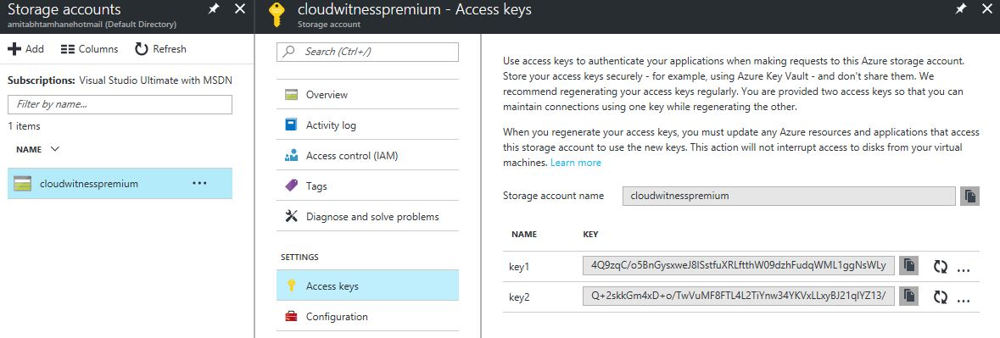

# Quorum configuration options (SQL Server on Azure VMs)
[!INCLUDE[appliesto-sqlvm](../../includes/appliesto-sqlvm.md)]

This article provides quorum configuration practices for both [failover cluster instances (FCIs)](failover-cluster-instance-overview.md) and [availability groups](availability-group-overview.md) when you use them with SQL Server on Azure VMs. The quorum for a cluster is determined by the number of voting elements that must be part of active cluster membership for that cluster to start properly or continue running.

## Overview

Configuring a quorum resource will allow the cluster to continue online with only one node online.

The following quorum options available are recommended to use with an Azure VM, with the disk witness being the preferred choice:

||[Disk witness](/windows-server/failover-clustering/manage-cluster-quorum#configure-the-cluster-quorum)  |[Cloud witness](/windows-server/failover-clustering/deploy-cloud-witness)  |[File share witness](/windows-server/failover-clustering/manage-cluster-quorum#configure-the-cluster-quorum)  |
|---------|---------|---------|---------|
|**Supported OS**| All |Windows Server 2016+| All|

## Disk Witness

A disk witness is a small clustered disk in the Cluster Available 
Storage group. This disk is highly available and can fail over 
between nodes. It contains a copy of the cluster database, with a 
default size that's less than 1 GB. The disk witness is the
preferred quorum option for any cluster that uses Azure Shared 
Disks (or any shared-disk solution like shared SCSI, iSCSI, or 
fiber channel SAN).  A Clustered Shared Volume cannot be used as a 
disk witness. Configure an Azure shared disk as the disk witness. 

The following table provides additional information and considerations about the quorum disk witness.

| Witness type  | Description  | Requirements and recommendations  |
| ---------    |---------        |---------                        |
| Disk witness     |  <ul><li> Dedicated LUN that stores a copy of the cluster database</li><li> Most useful for clusters with shared (not replicated) storage</li>       |  <ul><li>Size of LUN must be at least 512 MB</li><li> Must be dedicated to cluster use and not assigned to a clustered role</li><li> Must be included in clustered storage and pass storage validation tests</li><li> Can't be a disk that is a Cluster Shared Volume (CSV)</li><li> Basic disk with a single volume</li><li> Doesn't need to have a drive letter</li><li> Can be formatted with NTFS or ReFS</li><li> Can be optionally configured with hardware RAID for fault tolerance</li><li> Should be excluded from backups and antivirus scanning</li><li> A Disk witness isn't supported with Storage Spaces Direct</li>|

## Cloud Witness

A cloud witness is a type of failover cluster quorum witness that 
uses Microsoft Azure to provide a vote on cluster quorum. The default 
size is about 1 MB and contains just the time stamp. A cloud witness 
is ideal for deployments in multiple sites, multiple zones, and 
multiple regions.

**Supported OS**: Windows Server 2016 and later   


If you have a Failover Cluster deployment, where all nodes can reach the internet (by extension of Azure) it's recommended that you configure a Cloud Witness as your quorum witness resource.

Some of the scenarios that are supported use of Cloud Witness as a quorum witness are as follows:

- Disaster recovery stretched multi-site clusters (see figure 2).
- Failover Clusters without shared storage (SQL Always On etc.).
- Failover Clusters running inside Guest OS hosted in Microsoft Azure Virtual Machine Role (or any other public cloud).
- Failover Clusters running inside Guest OS of Virtual Machines hosted in private clouds.
- Storage clusters with or without shared storage, such as Scale-out File Server clusters.
- Small branch-office clusters (even two-node clusters)
- Starting with Windows Server 2012 R2, it is recommended to always configure a witness as the cluster automatically 
manages the witness vote and the nodes vote with Dynamic Quorum.

### <a name="CloudWitnessSetUp"></a> Set up a Cloud Witness for a cluster

To set up a Cloud Witness as a quorum witness for your cluster, complete the following steps:
1. Create an Azure Storage Account to use as a Cloud Witness
2. Configure the Cloud Witness as a quorum witness for your cluster.

#### Create an Azure Storage Account to use as a Cloud Witness

This section describes how to create a storage account and view and copy endpoint URLs and access keys for that account.

To configure Cloud Witness, you must have a valid Azure Storage account that can be used to store the blob file (used for arbitration). Cloud Witness creates a well-known Container **msft-cloud-witness** under the Microsoft Storage Account. Cloud Witness writes a single blob file with corresponding cluster's unique ID used as the file name of the blob file under this **msft-cloud-witness** container. This means that you can use the same Microsoft Azure Storage Account to configure a Cloud Witness for multiple different clusters.

When you use the same Azure Storage Account for configuring Cloud Witness for multiple different clusters, a single **msft-cloud-witness** container gets created automatically. This container will contain one-blob file per cluster.

##### To create an Azure storage account

1. Sign in to the [Azure portal](https://portal.azure.com).
2. On the Hub menu, select New -> Data + Storage -> Storage account.
3. In the Create a storage account page, do the following:
    1. Enter a name for your storage account.
    <br>Storage account names must be between 3 and 24 characters in length and may contain numbers and lowercase letters only. The storage account name must also be unique within Azure.

    2. For **Account kind**, select **General purpose**.
    <br>You can't use a Blob storage account for a Cloud Witness.
    3. For **Performance**, select **Standard**.
    <br>You can't use Azure Premium Storage for a Cloud Witness.
    2. For **Replication**, select **Local-redundant storage (LRS).
    <br>Failover Clustering uses the blob file as the arbitration point, which requires some consistency guarantees when reading the data. Therefore you must select **Locally redundant storage** for **Replication** type.

#### View and copy storage access keys for your Azure Storage Account

When you create a Microsoft Azure Storage Account, it's associated with two Access Keys that are automatically generated - Primary Access key and Secondary Access key. For a first-time creation of Cloud Witness, use the **Primary Access Key**. There is no restriction regarding which key to use for Cloud Witness.

##### To view and copy storage access keys

In the Azure portal, navigate to your storage account, select **All settings** and, then  **Access Keys** to view, copy, and regenerate your account access keys. The Access Keys blade also includes pre-configured connection strings using your primary and secondary keys that you can copy to use in your applications (see figure 4).


**Figure 4: Storage Access Keys**

#### View and copy endpoint URL Links

When you create a Storage Account, the following URLs are generated using the format: `https://<Storage Account Name>.<Storage Type>.<Endpoint>`

Cloud Witness always uses **Blob** as the storage type. Azure uses **.core.windows.net** as the Endpoint. When configuring Cloud Witness, it is possible that you configure it with a different endpoint as per your scenario (for example the Microsoft Azure datacenter in China has a different endpoint).

> [!NOTE]
> The endpoint URL is generated automatically by Cloud Witness resource and there is no extra step of configuration necessary for the URL.

##### To view and copy endpoint URL links

In the Azure portal, navigate to your storage account, select **All settings** and, then select **Properties** to view and copy your endpoint URLs (see figure 5).


**Figure 5: Cloud Witness endpoint URL links**

For more information about creating and managing Azure Storage Accounts, see [About Azure Storage Accounts](/azure/storage/common/storage-account-create)

#### Configure Cloud Witness as a quorum witness for your cluster

Cloud Witness configuration is well integrated within the existing Quorum Configuration Wizard built into the Failover Cluster Manager.

1. Launch Failover Cluster Manager.

2. Right-click the cluster -> **More Actions** -> **Configure Cluster Quorum Settings** (see figure 6). This launches the Configure Cluster Quorum wizard.

    
    **Figure 6. Cluster Quorum Settings**

3. On the **Select Quorum Configurations** page, select **Select the quorum witness** (see figure 7).

    
    **Figure 7. Select the Quorum Configuration**

4. On the **Select Quorum Witness** page, select **Configure a cloud witness** (see figure 8).

    
    **Figure 8. Select the Quorum Witness**

5. On the **Configure Cloud Witness** page, enter the following information:
   1. (Required parameter) Azure Storage Account Name.
   2. (Required parameter) Access Key corresponding to the Storage Account.
       1. When creating for the first time, use Primary Access Key (see figure 5)
       2. When rotating the Primary Access Key, use Secondary Access Key (see figure 5)
   3. (Optional parameter) If you intend to use a different Azure service endpoint (for example the Microsoft Azure service in China), then update the endpoint server name.

      
      **Figure 9: Configure your Cloud Witness**

6. Upon successful configuration of Cloud Witness, you can view the newly created witness resource in the Failover Cluster Manager snap-in (see figure 10).

    
    **Figure 10: Successful configuration of Cloud Witness**

#### Configuring Cloud Witness using PowerShell

The existing Set-ClusterQuorum PowerShell command has new parameters corresponding to Cloud Witness.

You can configure Cloud Witness with the cmdlet [`Set-ClusterQuorum`](https://docs.microsoft.com/powershell/module/failoverclusters/set-clusterquorum) using the PowerShell command:

```PowerShell
Set-ClusterQuorum -CloudWitness -AccountName <StorageAccountName> -AccessKey <StorageAccountAccessKey>
```

In case you need to use a different endpoint (rare):

```PowerShell
Set-ClusterQuorum -CloudWitness -AccountName <StorageAccountName> -AccessKey <StorageAccountAccessKey> -Endpoint <servername>
```

#### Azure Storage Account considerations with Cloud Witness

When configuring a Cloud Witness as a quorum witness for your Failover Cluster, consider::
- Instead of storing the Access Key, your Failover Cluster will generate and securely store a Shared Access Security (SAS) token.
- The generated SAS token is valid as long as the Access Key remains valid. When rotating the Primary Access Key, it is important to first update the Cloud Witness (on all your clusters that are using that Storage Account) with the Secondary Access Key before regenerating the Primary Access Key.
- Cloud Witness uses HTTPS REST interface of the Azure Storage Account service. This means it requires the HTTPS port to be open on all cluster nodes.

#### Proxy considerations with Cloud Witness

Cloud Witness uses HTTPS (default port 443) to establish communication with Azure blob service. Ensure that HTTPS port is accessible via network Proxy.

## File share witness

A file share witness is an SMB file share that's typically configured on a file server running Windows 
Server. It maintains clustering information in a witness.log file, but doesn't store a copy of the 
cluster database. In Azure, you can configure a file share on a separate virtual machine.

Uses a local user account on the server the FSW is connected to.
On the Windows Server you wish to place the FSW, create a local (not administrative) user account, give that local account full rights to the share, connect the cluster to the share.
For example, a server called SERVER and a share called SHARE want to be utilized as the File Share Witness.  For creating this type of File Share Witness can only be done through PowerShell.  The steps for setting this up are:

* Log on to SERVER and create a local user account (FSW-ACCT)
* Create a folder on SERVER and share it out
* Give the local user account (FSW-ACCT) full rights to the share
* Log in to one of your cluster nodes and run the PowerShell command:

```powershell
Set-ClusterQuorum -FileShareWitness \\SERVER\SHARE -Credential $(Get-Credential)
```

* You will be prompted for the account and password for which you should enter SERVER\FSW-ACCT and the password. The cluster will keep the name and password encrypted and not accessible by anyone.

For those scenarios where an additional server is not available, connect a USB drive.

Plug the USB drive into the port in the router and get into the router's interface. Set up your share name, username, and password for access.  Use the PowerShell command above pointing it to the router and share.

**Supported OS**: Windows Server 2012 and later

### Recommended Adjustments to Quorum Voting

When enabling or disabling a given WSFC node's vote, follow these guidelines:
* No vote by default. Assume that each node shouldn't vote without explicit justification.
* Include all primary replicas. Each WSFC node that hosts an availability group primary replica or is the preferred owner of an FCI should have a vote.
* Include possible automatic failover owners. Each node that could host a primary replica, as the result of an automatic availability group failover or FCI failover, should have a vote. If there is only one availability group in the WSFC cluster and availability replicas are hosted only by standalone instances, this rule includes only the secondary replica that is the automatic failover target.
* Exclude secondary site nodes. In general, do not give votes to WSFC nodes that reside at a secondary disaster recovery site. You do not want nodes in the secondary site to contribute to a decision to take the cluster offline when there is nothing wrong with the primary site.
* Number of votes. If necessary, add a cloud witness, file share witness, a witness node, or a witness disk to the cluster and adjust the quorum mode to prevent possible ties in the quorum vote. It is recommended to have three or more quorum votes. 
* Reassess vote assignments post-failover. You do not want to fail over into a cluster configuration that does not support a healthy quorum.

## Next Steps

After you've determined the appropriate best practices for your solution, get started by [preparing your SQL Server VM for FCI](failover-cluster-instance-prepare-vm.md) or by creating your availability group by using the [Azure portal](availability-group-azure-portal-configure.md), the [Azure CLI / PowerShell](./availability-group-az-commandline-configure.md), or [Azure quickstart templates](availability-group-quickstart-template-configure.md).
