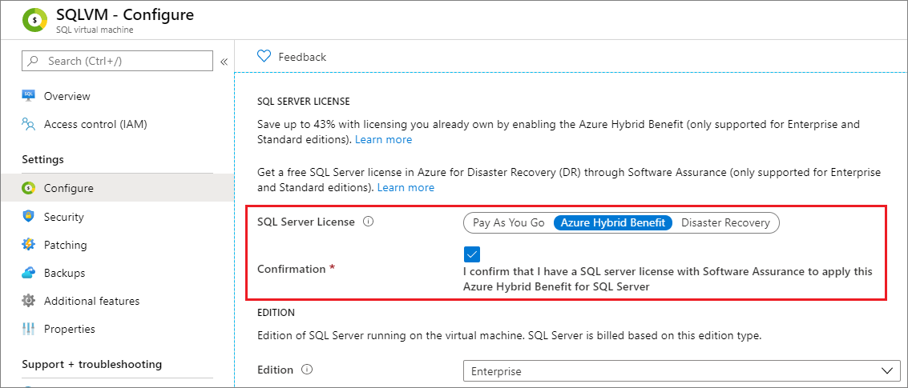

# Change the license model for a SQL virtual machine in Azure
[!INCLUDE[appliesto-sqlvm](../../includes/appliesto-sqlvm.md)]


This article describes how to change the license model for a SQL Server virtual machine (VM) in Azure by using the new SQL Server VM resource provider, **Microsoft.SqlVirtualMachine**.

There are three license models for a VM that's hosting SQL Server: pay-as-you-go, Azure Hybrid Benefit (AHB), and disaster recovery (DR). You can modify the license model of your SQL Server VM by using the Azure portal, the Azure CLI, or PowerShell. 

- The **pay-as-you-go** model means that the per-second cost of running the Azure VM includes the cost of the SQL Server license.
- [Azure Hybrid Benefit](https://azure.microsoft.com/pricing/hybrid-benefit/) allows you to use your own SQL Server license with a VM that's running SQL Server. 
- The **disaster recovery** license type is used for the [free DR replica](business-continuity-high-availability-disaster-recovery-hadr-overview.md#free-dr-replica-in-azure) in Azure. 

Azure Hybrid Benefit allows the use of SQL Server licenses with Software Assurance ("Qualified License") on Azure virtual machines. With Azure Hybrid Benefit, customers aren't charged for the use of a SQL Server license on a VM. But they must still pay for the cost of the underlying cloud compute (that is, the base rate), storage, and backups. They must also pay for I/O associated with their use of the services (as applicable).

According to the Microsoft Product Terms: "Customers must indicate that they are using Azure SQL Database (Managed Instance, Elastic Pool, and Single Database), Azure Data Factory, SQL Server Integration Services, or SQL Server Virtual Machines under Azure Hybrid Benefit for SQL Server when configuring workloads on Azure."

To indicate the use of Azure Hybrid Benefit for SQL Server on Azure VM and be compliant, you have three options:

- Provision a virtual machine by using a bring-your-own-license SQL Server image from Azure Marketplace. This option is available only for customers who have an Enterprise Agreement.
- Provision a virtual machine by using a pay-as-you-go SQL Server image from Azure Marketplace and activate the Azure Hybrid Benefit.
- Self-install SQL Server on Azure VM, manually [register with the SQL VM resource provider](sql-vm-resource-provider-register.md), and activate Azure Hybrid Benefit.

The license type of SQL Server can be configured when the VM is provisioned, or anytime afterward. Switching between license models incurs no downtime, does not restart the VM or the SQL Server service, doesn't add any additional costs, and is effective immediately. In fact, activating Azure Hybrid Benefit *reduces* cost.

## Prerequisites

Changing the licensing model of your SQL Server VM has the following requirements: 

- An [Azure subscription](https://azure.microsoft.com/free/).
- A [SQL Server VM](https://docs.microsoft.com/azure/virtual-machines/windows/sql/virtual-machines-windows-portal-sql-server-provision) registered with the [SQL VM resource provider](sql-vm-resource-provider-register.md).
- [Software Assurance](https://www.microsoft.com/licensing/licensing-programs/software-assurance-default) is a requirement to utilize the [Azure Hybrid Benefit](https://azure.microsoft.com/pricing/hybrid-benefit/). 


## VMs already registered with the resource provider 

# [The Azure portal](#tab/azure-portal)

[!INCLUDE [windows-virtual-machines-sql-use-new-management-blade](../../../../includes/windows-virtual-machines-sql-new-resource.md)]

You can modify the license model directly from the portal: 

1. Open the [Azure portal](https://portal.azure.com) and open the [SQL virtual machines resource](manage-sql-vm-portal.md#access-the-sql-virtual-machines-resource) for your SQL Server VM. 
1. Select **Configure** under **Settings**. 
1. Select the **Azure Hybrid Benefit** option, and select the check box to confirm that you have a SQL Server license with Software Assurance. 
1. Select **Apply** at the bottom of the **Configure** page. 




# [The Azure CLI](#tab/azure-cli)

You can use the Azure CLI to change your license model.  


**Azure Hybrid Benefit**

```azurecli-interactive
# Switch your SQL Server VM license from pay-as-you-go to bring-your-own
# example: az sql vm update -n AHBTest -g AHBTest --license-type AHUB

az sql vm update -n <VMName> -g <ResourceGroupName> --license-type AHUB
```

**Pay as you go**: 

```azurecli-interactive
# Switch your SQL Server VM license from bring-your-own to pay-as-you-go
# example: az sql vm update -n AHBTest -g AHBTest --license-type PAYG

az sql vm update -n <VMName> -g <ResourceGroupName> --license-type PAYG
```

**Disaster recovery (DR)**

```azurecli-interactive
# Switch your SQL Server VM license from bring-your-own to pay-as-you-go
# example: az sql vm update -n AHBTest -g AHBTest --license-type DR

az sql vm update -n <VMName> -g <ResourceGroupName> --license-type DR
```

# [PowerShell](#tab/azure-powershell)

You can use PowerShell to change your license model.

**Azure Hybrid Benefit**

```powershell-interactive
# Switch your SQL Server VM license from pay-as-you-go to bring-your-own
Update-AzSqlVM -ResourceGroupName <resource_group_name> -Name <VM_name> -LicenseType AHUB
```

**Pay as you go**

```powershell-interactive
# Switch your SQL Server VM license from bring-your-own to pay-as-you-go
Update-AzSqlVM -ResourceGroupName <resource_group_name> -Name <VM_name> -LicenseType PAYG
```

**Disaster Recovery** 

```powershell-interactive
# Switch your SQL Server VM license from bring-your-own to pay-as-you-go
Update-AzSqlVM -ResourceGroupName <resource_group_name> -Name <VM_name> -LicenseType DR
```

---

## VMs not registered with the resource provider

If you provisioned a SQL Server VM from pay-as-you-go Azure Marketplace images, the SQL Server license type will be pay-as-you-go. If you provisioned a SQL Server VM by using a bring-your-own-license image from Azure Marketplace, the license type will be AHUB. All SQL Server VMs provisioned from default (pay-as-you-go) or bring-your-own-license Azure Marketplace images will automatically be registered with the SQL VM resource provider, so they can change the [license type](#vms-already-registered-with-the-resource-provider).

You are only eligible to self-install SQL Server on Azure VM via Azure Hybrid Benefit. You should [register these VMs with the SQL VM resource provider](sql-vm-resource-provider-register.md) by setting the SQL Server license as Azure Hybrid Benefit, to indicate the Azure Hybrid Benefit usage according to Microsoft Product Terms.

You can change the license type of a SQL Server VM as pay-as-you-go or Azure Hybrid Benefit only if the SQL Server VM is registered with the SQL VM resource provider.

## Remarks

- Azure Cloud Solution Provider (CSP) customers can use the Azure Hybrid Benefit by first deploying a pay-as-you-go VM and then converting it to bring-your-own-license, if they have active Software Assurance.
- If you drop your SQL Server VM resource, you will go back to the hard-coded license setting of the image. 
- The ability to change the license model is a feature of the SQL VM resource provider. Deploying an Azure Marketplace image through the Azure portal automatically registers a SQL Server VM with the resource provider. But customers who are self-installing SQL Server will need to manually [register their SQL Server VM](sql-vm-resource-provider-register.md). 
- Adding a SQL Server VM to an availability set requires re-creating the VM. As such, any VMs added to an availability set will go back to the default pay-as-you-go license type. Azure Hybrid Benefit will need to be enabled again. 


## Limitations

Changing the license model is:
   - Only available to customers with [Software Assurance](https://www.microsoft.com/en-us/licensing/licensing-programs/software-assurance-overview).
   - Only supported for the Standard and Enterprise editions of SQL Server. License changes for Express, Web, and Developer are not supported. 
   - Only supported for virtual machines deployed through the Azure Resource Manager model. Virtual machines deployed through the classic model are not supported. 
   - Available only for the public or Azure Government clouds. 
   - Only supported on virtual machines that have a single network interface (NIC). 


## Known errors

### The Resource 'Microsoft.SqlVirtualMachine/SqlVirtualMachines/\<resource-group>' under resource group '\<resource-group>' was not found.

This error occurs when you try to change the license model on a SQL Server VM that has not been registered with the SQL VM resource provider:

`The Resource 'Microsoft.SqlVirtualMachine/SqlVirtualMachines/\<resource-group>' under resource group '\<resource-group>' was not found. The property 'sqlServerLicenseType' cannot be found on this object. Verify that the property exists and can be set.`

You'll need to register your subscription with the resource provider, and then [register your SQL Server VM with the resource provider](sql-vm-resource-provider-register.md). 


### The virtual machine '\<vmname\>' has more than one NIC associated

This error occurs on virtual machines that have more than one NIC. Remove one of the NICs before you change the licensing model. Although you can add the NIC back to the VM after you change the license model, operations in the Azure portal such as automatic backup and patching will no longer be supported. 


## Next steps

For more information, see the following articles: 

* [Overview of SQL Server on a Windows VM](sql-server-on-azure-vm-iaas-what-is-overview.md)
* [FAQ for SQL Server on a Windows VM](frequently-asked-questions-faq.md)
* [Pricing guidance for SQL Server on a Windows VM](pricing-guidance.md)
* [Release notes for SQL Server on a Windows VM](../../database/doc-changes-updates-release-notes.md)


