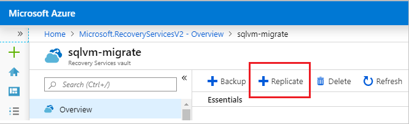
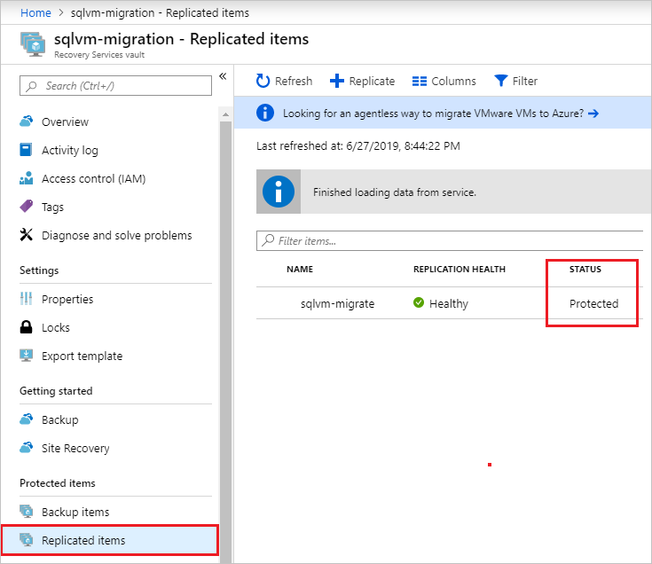
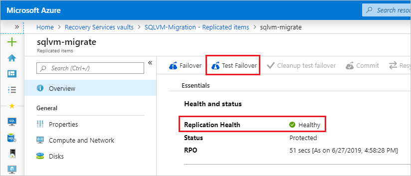
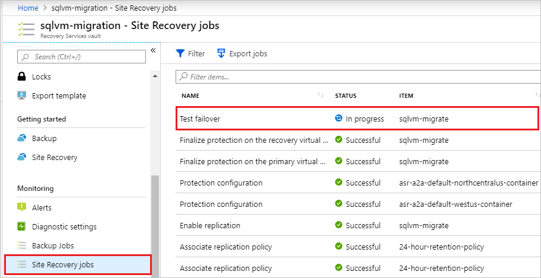
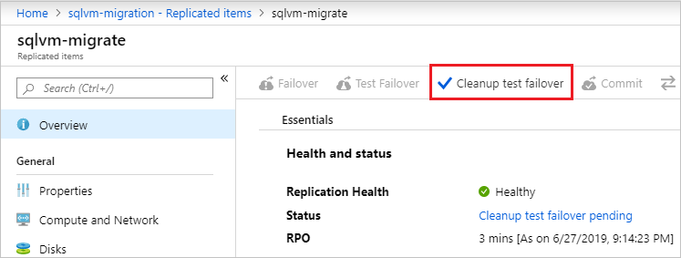

# Move a SQL Server VM to another region within Azure with Azure Site Recovery
[!INCLUDE[appliesto-sqlvm](../../includes/appliesto-sqlvm.md)]

This article teaches you how to use Azure Site Recovery to migrate your SQL Server virtual machine (VM) from one region to another within Azure. 

Moving a SQL Server VM to a different region requires doing the following:
1. [Preparing](#prepare-to-move): Confirm that both your source SQL Server VM and target region are adequately prepared for the move. 
1. [Configuring](#configure-azure-site-recovery-vault): Moving your SQL Server VM requires that it is a replicated object within the Azure Site Recovery vault. You need to add your SQL Server VM to the Azure Site Recovery vault. 
1. [Testing](#test-move-process): Migrating the SQL Server VM requires failing it over from the source region to the replicated target region. To ensure that the move process will succeed, you need to first test that your SQL Server VM can successfully fail over to the target region. This will help expose any issues and avoid them when performing the actual move. 
1. [Moving](#move-the-sql-server-vm): Once your test failover passed, and you know that you are safe to migrate your SQL Server VM, you can perform the move of the VM to the target region. 
1. [Cleaning up](#clean-up-source-resources): To avoid billing charges, remove the SQL Server VM from the vault, and any unnecessary resources that are left over in the resource group. 

## Verify prerequisites 

- Confirm that moving from your source region to your target region [is supported](../../../site-recovery/azure-to-azure-support-matrix.md#region-support).  
- Review the [scenario architecture and components](../../../site-recovery/azure-to-azure-architecture.md) as well as the [support limitations and requirements](../../../site-recovery/azure-to-azure-support-matrix.md). 
- Verify account permissions. If you created your free Azure account, you're the administrator of your subscription. If you're not the subscription administrator, work with the administrator to assign the permissions that you need. To enable replication for a VM and copy data using Azure Site Recovery, you must have: 
    - Permissions to create a VM. The *Virtual Machine Contributor* built-in role has these permissions, which include: 
        - Permissions to create a VM in the selected resource group. 
        - Permissions to create a VM in the selected virtual network. 
        - Permissions to write to the selected storage account. 
      - Permissions to manage Azure Site Recovery operations. The *Site Recovery Contributor* role has all the permissions that are required to manage Site Recovery operations in a Recovery Services vault.  

## Prepare to move
Prepare both the source SQL Server VM and the target region for the move. 

### Prepare the source SQL Server VM

- Ensure that all the latest root certificates are on the SQL Server VM that you want to move. If the latest root certificates are not there, security constraints will prevent data copy to the target region. 
- For Windows VMs, install all of the latest Windows updates on the VM, so that all the trusted root certificates are on the machine. In a disconnected environment, follow the standard Windows Update and certificate update process for your organization. 
- For Linux VMs, follow the guidance provided by your Linux distributor to get the latest trusted root certificates and certificate revocation list on the VM. 
- Make sure you're not using an authentication proxy to control network connectivity for the VMs that you want to move. 
- If the VM that you're trying to move doesn't have access to the internet, or it's using a firewall proxy to control outbound access, check the requirements. 
- Identify the source networking layout and all the resources that you're currently using. This includes but isn't limited to load balancers, network security groups (NSGs), and public IPs. 

### Prepare the target region

- Verify that your Azure subscription allows you to create VMs in the target region that's used for disaster recovery. Contact support to enable the required quota. 
- Make sure that your subscription has enough resources to support VMs with size that match your source VMs. If you're using Site Recovery to copy data to the target, Site Recovery chooses the same size, or the closest possible size for the target VM. 
- Make sure that you create a target resource for every component that's identified in the source networking layout. This step is important to ensure that your VMs have all the functionality and features in the target region that you had in the source region. 
    - Azure Site Recovery automatically discovers and creates a virtual network when you enable replication for the source VM. You can also pre-create a network and assign it to the VM in the user flow for enabling replication. You need to manually create any other resources in the target region.
- To create the most commonly used network resources that are relevant for you based on the source VM configuration, see the following documentation: 
    - [Network security groups](../../../virtual-network/tutorial-filter-network-traffic.md) 
    - [Load balancer](../../../load-balancer/tutorial-load-balancer-basic-internal-portal.md)
    - [Public IP address](../../../virtual-network/virtual-network-public-ip-address.md)
    - For any additional networking components, see the [networking documentation](../../../virtual-network/virtual-networks-overview.md).
- Manually create a non-production network in the target region if you want to test the configuration before you perform the final move to the target region. We recommend this step because it ensures minimal interference with the production network. 

## Configure Azure Site Recovery vault

The following steps show you how to use Azure Site Recovery to copy data to the target region. Create the Recovery Services vault in any region other than the source region. 

1. Sign in to the [Azure portal](https://portal.azure.com). 
1. Choose to **Create a resource** from the upper-left hand corner of the navigation pane. 
1. Select **IT & Management tools** and then select **Backup and Site Recovery**. 
1. On the **Basics** tab, under **Project details**, either create a new resource group in the target region, or select an existing resource group in the target region. 
1. Under **Instance Details**, specify a name for your vault, and then select your target **Region** from the drop-down. 
1. Select **Review + Create** to create your Recovery Services vault. 
1. Select **All services** from the upper-left hand corner of the navigation pane and in the search box type `recovery services`. 
1. (Optionally) Select the star next to **Recovery Services vaults** to add it to your quick navigation bar. 
1. Select **Recovery services vaults** and then select the Recovery Services vault you created. 
1. On the **Overview** pane, select **Replicate**. 

   

1. Select **Source** and then select **Azure** as the source. Select the appropriate values for the other drop-down fields, such as the location for your source VMs. Only resources groups located in the **Source location** region will be visible in the **Source resource group** field. 
1. Select **Virtual machines** and then choose the virtual machines you want to migrate. Select **OK** to save your VM selection. 
1. Select **Settings**, and then choose your **Target location** from the drop-down. This should be the resource group you prepared earlier. 
1. Once you have customized replication, select **Create target resources** to create the resources in the new location. 
1. Once resource creation is complete, select **Enable replication** to start replication of your SQL Server VM from the source to the target region.
1. You can check the status of replication by navigating to your recovery vault, selecting **Replicated items** and viewing the **Status** of your SQL Server VM. A status of **Protected** indicates that replication has completed. 

   

## Test move process
The following steps show you how to use Azure Site Recovery to test the move process. 

1. Navigate to your **Recovery Services vault** in the [Azure portal](https://portal.azure.com) and select **Replicated items**. 
1. Select the SQL Server VM you would like to move, verify that the **Replication Health** shows as **Healthy** and then select **Test Failover**. 

   

1. On the **Test Failover** page, select the **Latest app-consistent** recovery point to use for the failover, as that is the only type of snapshot that can guarantee SQL Server data consistency. 
1. Select the virtual network under **Azure virtual network** and then select **OK** to test failover. 
   
   >[!IMPORTANT]
   > We recommend that you use a separate Azure VM network for the failover test. Don't use the production network that was set up when you enabled replication and that you want to move your VMs into eventually. 

1. To monitor progress, navigate to your vault, select **Site Recovery jobs** under **Monitoring**, and then select the **Test failover** job that's in progress.

   

1. Once the test completes, navigate to **Virtual machines** in the portal and review the newly created virtual machine. Make sure the SQL Server VM is running, is sized appropriately, and is connected to the appropriate network. 
1. Delete the VM that was created as part of the test, as the **Failover** option will be grayed out until the failover test resources are cleaned up. Navigate back to the vault, select **Replicated items**, select the SQL Server VM, and then select **Cleanup test failover**. Record and save any observations associated with the test in the **Notes** section and select the checkbox next to **Testing is complete. Delete test failover virtual machines**. Select **OK** to clean up resources after the test. 

   

## Move the SQL Server VM 
The following steps show you how to move the SQL Server VM from your source region to your target region. 

1. Navigate to the **Recovery Services** vault, select **Replicated items**, select the VM, and then select **Failover**. 

   

1. Select the **latest app-consistent** recover point under **Recovery Point**. 
1. Select the check box next to **Shut down the machine before beginning failover**. Site Recovery will attempt to shut down the source VM before triggering the failover. Failover will continue even if shut down fails. 
1. Select **OK** to start the failover.
1. You can monitor the failover process from the same **Site Recovery jobs** page you viewed when monitoring the failover test in the previous section. 
1. After the job completes, check that the SQL Server VM appears in the target region as expected. 
1. Navigate back to the vault, select **Replicated Items**, select the SQL Server VM, and select **Commit** to finish the move process to the target region. Wait until the commit job finishes. 
1. Register your SQL Server VM with the SQL VM resource provider to enable **SQL virtual machine** manageability in the Azure portal and features associated with the resource provider. For more information, see [Register SQL Server VM with the SQL VM resource provider](sql-vm-resource-provider-register.md). 

  > [!WARNING]
  > SQL Server data consistency is only guaranteed with app-consistent snapshots. The **latest processed** snapshot can't be used for SQL Server failover as a crash recovery snapshot can't guarantee SQL Server data consistency. 

## Clean up source resources
To avoid billing charges, remove the SQL Server VM from the vault, and delete any unnecessary associated resources. 

1. Navigate back to the **Site Recovery** vault, select **Replicated items**, and select the SQL Server VM. 
1. Select **Disable Replication**. Select a reason for disabling protection, and then select **OK** to disable replication. 

   >[!IMPORTANT]
   > It is important to perform this step to avoid being charged for Azure Site Recovery replication. 

1. If you have no plans to reuse any of the resources in the source region, delete all relevant network resources, and corresponding storage accounts. 

## Next steps

For more information, see the following articles: 

* [Overview of SQL Server on a Windows VM](sql-server-on-azure-vm-iaas-what-is-overview.md)
* [SQL Server on a Windows VM FAQ](frequently-asked-questions-faq.md)
* [SQL Server on a Windows VM pricing guidance](pricing-guidance.md)
* [SQL Server on a Windows VM release notes](doc-changes-updates-release-notes.md)

