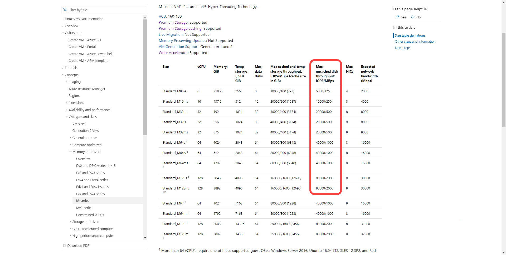
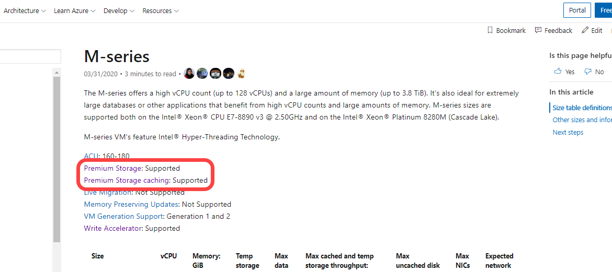
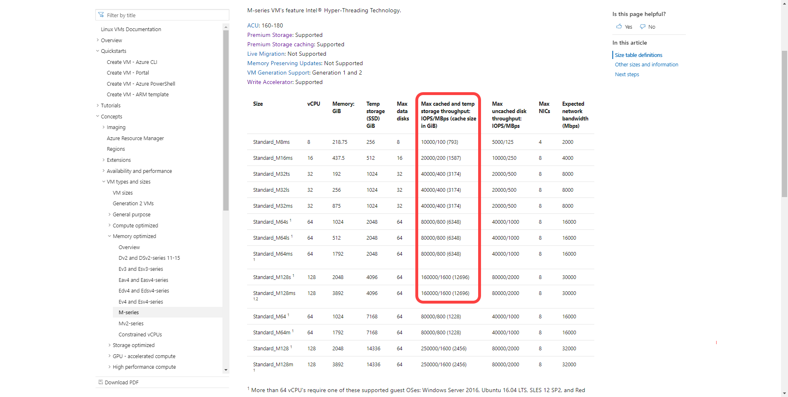

# Storage: Performance best practices for SQL Server on Azure VMs
[!INCLUDE[appliesto-sqlvm](../../includes/appliesto-sqlvm.md)]

This article provides storage best practices and guidelines to optimize performance for your SQL Server on Azure Virtual Machines (VMs).

There is typically a trade-off between optimizing for costs and optimizing for performance. This performance best practices series is focused on getting the *best* performance for SQL Server on Azure Virtual Machines. If your workload is less demanding, you might not require every recommended optimization. Consider your performance needs, costs, and workload patterns as you evaluate these recommendations.

To lean more, see the other articles in this series: [Checklist](performance-guidelines-best-practices-checklist.md), [VM size](performance-guidelines-best-practices-vm-size.md), and [Collect baseline](performance-guidelines-best-practices-collect-baseline.md). 

## Check list

Review the following checklist for a brief overview of the storage best practices that the rest of the article covers in greater detail: 

- Monitor the application and [determine storage bandwidth and latency requirements](../../../virtual-machines/premium-storage-performance.md#counters-to-measure-application-performance-requirements) for SQL Server data, log, and tempdb files before choosing the disk type. 
- To optimize storage performance, plan for highest uncached IOPS available and use data caching as a performance feature for data reads while avoiding [virtual machine and disks capping](../../../virtual-machines/premium-storage-performance.md#throttling).
- Place data, log, and tempdb files on separate drives.
    - For the data drive, only use [premium P30 and P40 disks](../../../virtual-machines/disks-types.md#premium-ssd) to ensure the availability of cache support
    - For the log drive plan for capacity and test performance versus cost while evaluating the [premium P30 - P80 disks](../../../virtual-machines/disks-types.md#premium-ssd)
      - If 1-ms storage latencies are required, use [Ultra SSD Disks](../../../virtual-machines/disks-types.md#ultra-disk) for the transaction log. 
      - For M-series virtual machine deployments consider [write accelerator](../../../virtual-machines/how-to-enable-write-accelerator.md) over using Ultra SSD disks.
    - Place [tempdb](/sql/relational-databases/databases/tempdb-database) on the local ephemeral SSD `D:\` drive for most SQL Server workloads after choosing the optimal VM size. 
      - If the capacity of the local drive is not enough for tempdb, see [Data file caching policies](#data-file-caching-policies) for more information.
- Stripe multiple Azure data disks using [Storage Spaces](/windows-server/storage/storage-spaces/overview) to increase I/O bandwidth up to the target virtual machine's IOPS and throughput limits.
- Set [host caching](../../../virtual-machines/disks-performance.md#virtual-machine-uncached-vs-cached-limits) to read-only for data file disks.
- Set [host caching](../../../virtual-machines/disks-performance.md#virtual-machine-uncached-vs-cached-limits) to none for log file disks.
    - Do not enable read/write caching on disks that contain SQL Server files. 
    - Always stop the SQL Server service before changing the cache settings of your disk.
- For development and test workloads, and long-term backup archival consider using standard storage. It is not recommended to use Standard HDD/SDD for production workloads.
- [Credit-based Disk Bursting](../../../virtual-machines/disk-bursting.md#credit-based-bursting) (P1-P20) should only be considered for smaller dev/test workloads and departmental systems.
- Provision the storage account in the same region as the SQL Server VM. 
- Disable Azure geo-redundant storage (geo-replication) and use LRS (local redundant storage) on the storage account.
- Format your data disk to use 64-KB allocation unit size for all data files placed on a drive other than the temporary `D:\` drive (which has a default of 4 KB). SQL Server VMs deployed through Azure Marketplace come with data disks formatted with allocation unit size and interleave for the storage pool set to 64 KB. 

To compare the storage checklist with the others, see the comprehensive [Performance best practices checklist](performance-guidelines-best-practices-checklist.md). 

## Overview

To find the most effective configuration for SQL Server workloads on an Azure VM, start by [measuring the storage performance of your business application](performance-guidelines-best-practices-collect-baseline.md#storage). Once storage requirements are known, select a virtual machine that supports the necessary IOPS and throughput with the appropriate memory-to-vCore ratio. 

Choose a VM size with enough storage scalability for your workload and a mixture of disks (usually in a storage pool) that meet the capacity and performance requirements of your business. 

The type of disk depends on both the file type that's hosted on the disk and your peak performance requirements.

> [!TIP]
> Provisioning a SQL Server VM through the Azure portal helps guide you through the storage configuration process and implements most storage best practices such as creating separate storage pools for your data and log files, targeting tempdb to the `D:\` drive, and enabling the optimal caching policy. For more information about provisioning and configuring storage, see [SQL VM storage configuration](storage-configuration.md). 

## VM disk types

You have a choice in the performance level for your disks. The types of managed disks available as underlying storage (listed by increasing performance capabilities) are standard hard disk drives (HDD), standard SSDs, premium solid-state drives (SSD), and Ultra Disks. 

The performance of the disk increases with the capacity, grouped by [premium disk labels](../../../virtual-machines/disks-types.md#premium-ssd) such as the P1 with 4 GiB of space and 120 IOPS to the P80 with 32 TiB of storage and 20,000 IOPS. Premium storage supports a storage cache that helps improve read and write performance for some workloads. For more information, see [Managed disks overview](../../../virtual-machines/managed-disks-overview.md). 

There are also three main [disk types](../../../virtual-machines/managed-disks-overview.md#disk-roles) to consider for your SQL Server on Azure VM -  an OS disk, a temporary disk, and your data disks. Carefully choose what is stored on the operating system drive `(C:\)` and the ephemeral temporary drive `(D:\)`. 

### Operating system disk

An operating system disk is a VHD that can be booted and mounted as a running version of an operating system and is labeled as the `C:\` drive. When you create an Azure virtual machine, the platform will attach at least one disk to the VM for the operating system disk. The `C:\` drive is the default location for application installs and file configuration. 

For production SQL Server environments, do not use the operating system disk for data files, log files, error logs. 

### Temporary disk

Many Azure virtual machines contain another disk type called the temporary disk (labeled as the `D:\` drive). Depending on the virtual machine series and size the capacity of this disk will vary. The temporary disk is ephemeral, which means the disk storage is recreated (as in, it is deallocated and allocated again), when the virtual machine is restarted, or moved to a different host (for [service healing](/troubleshoot/azure/virtual-machines/understand-vm-reboot), for example). 

The temporary storage drive is not persisted to remote storage and therefore should not store user database files, transaction log files, or anything that must be preserved. 

Place tempdb on the local temporary SSD `D:\` drive for SQL Server workloads unless consumption of local cache is a concern. To learn more, see [tempdb data caching policies](performance-guidelines-best-practices-storage.md#data-file-caching-policies)

> [!NOTE]
> If you are using a virtual machine that [does not have a temporary disk](../../../virtual-machines/azure-vms-no-temp-disk.md) then it is recommended to place tempdb on its own isolated disk or storage pool with caching set to read-only.

### Data disks

Data disks are remote storage disks that are often created in [storage pools](/windows-server/storage/storage-spaces/overview) in order to exceed the capacity and performance that any single disk could offer to the virtual machine.

Attach the minimum number of disks that satisfies the IOPS, throughput, and capacity requirements of your workload. Do not exceed the maximum number of data disks of the smallest virtual machine you plan to resize to.

Place data and log files on data disks provisioned to best suit performance requirements. 

Format your data disk to use 64-KB allocation unit size for all data files placed on a drive other than the temporary `D:\` drive (which has a default of 4 KB). SQL Server VMs deployed through Azure Marketplace come with data disks formatted with allocation unit size and interleave for the storage pool set to 64 KB. 

## Premium disks

Use premium SSD disks for data and log files for production SQL Server workloads. Premium SSD IOPS and bandwidth varies based on the [disk size and type](../../../virtual-machines/disks-types.md). 

For production workloads, use the P30 and/or P40 disks for SQL Server data files to ensure caching support and use the P30 up to P80 for SQL Server transaction log files.  For the best total cost of ownership, start with P30s (5000 IOPS/200 MBPS) for data and log files and only choose higher capacities when you need to control the virtual machine disk count.

For OLTP workloads, match the target IOPS per disk (or storage pool) with your performance requirements using workloads at peak times and the `Disk Reads/sec` + `Disk Writes/sec` performance counters. For data warehouse and reporting workloads, match the target throughput using workloads at peak times and the `Disk Read Bytes/sec` + `Disk Write Bytes/sec`. 

Use Storage Spaces to achieve optimal performance, configure two pools, one for the log file(s) and the other for the data files. If you are not using disk striping, use two premium SSD disks mapped to separate drives, where one drive contains the log file and the other contains the data.

The [provisioned IOPS and throughput](../../../virtual-machines/disks-types.md#premium-ssd) per disk that is used as part of your storage pool. The combined IOPS and throughput capabilities of the disks is the maximum capability up to the throughput limits of the virtual machine.

The best practice is to use the least number of disks possible while meeting the minimal requirements for IOPS (and throughput) and capacity. However, the balance of price and performance tends to be better with a large number of small disks rather than a small number of large disks.

### Scaling premium disks

When an Azure Managed Disk is first deployed, the performance tier for that disk is based on the provisioned disk size. Designate the performance tier at deployment or change it afterwards, without changing the size of the disk. If demand increases, you can increase the performance level to meet your business needs. 

Changing the performance tier allows administrators to prepare for and meet higher demand without relying on [disk bursting](../../../virtual-machines/disk-bursting.md#credit-based-bursting). 

Use the higher performance for as long as needed where billing is designed to meet the storage performance tier. Upgrade the tier to match the performance requirements without increasing the capacity. Return to the original tier when the extra performance is no longer required.

This cost-effective and temporary expansion of performance is a strong use case for targeted events such as shopping, performance testing, training events and other brief windows where greater performance is needed only for a short term. 

For more information, see [Performance tiers for managed disks](../../../virtual-machines/disks-change-performance.md). 

## Ultra-Disk SSD

If there is a need for submillisecond response times with reduced latency consider using [Ultra-Disk SSD](../../../virtual-machines/disks-types.md#ultra-disk) for the SQL Server log drive, or even the data drive for applications that are extremely sensitive to I/O latency. 

Ultra-Disk SSD can be configured where capacity and IOPS can scale independently. With Ultra-Disk SSD administrators can provision a disk with the capacity, IOPS, and throughput requirements based on application needs. 

Ultra disk is not supported on all VM series and has other limitations such as region availability, redundancy, and support for Azure Backup. To learn more, see [Using Ultra Disks](../../../virtual-machines/disks-enable-ultra-ssd.md) for a full list of limitations. 

## Standard HDDs and SSDs

[Standard HDDs](../../../virtual-machines/disks-types.md#standard-hdd) and SSDs have varying latencies and bandwidth and are only recommended for dev/test workloads. Production workloads should use premium SSDs. If you are using Standard SSD (dev/test scenarios), the recommendation is to add the maximum number of data disks supported by your [VM size](../../../virtual-machines/sizes.md?toc=/azure/virtual-machines/windows/toc.json) and use disk striping with Storage Spaces for the best performance.

## Caching

Virtual machines that support premium storage caching can take advantage of an additional feature called the Azure BlobCache or host caching to extend the IOPS and throughput capabilities of a virtual machine. Virtual machines enabled for both premium storage and premium storage caching have these two different storage bandwidth limits that can be used together to improve storage performance.

The IOPS and MBps throughput without caching counts against a virtual machine's uncached disk throughput limits. The maximum cached limits provide an additional buffer for reads that helps address growth and unexpected peaks.

Enable premium caching whenever the option is supported to significantly improve performance for reads against the data drive without additional cost. 

Reads and writes to the Azure BlobCache (cached IOPS and throughput) do not count against the uncached IOPS and throughput limits of the virtual machine.

> [!NOTE]
> Disk Caching is not supported for disks 4 TiB and larger (P50 and larger). If multiple disks are attached to your VM, each disk that is smaller than 4 TiB will support caching. For more information, see [Disk caching](../../../virtual-machines/premium-storage-performance.md#disk-caching). 

### Uncached throughput

The max uncached disk IOPS and throughput is the maximum remote storage limit that the virtual machine can handle. This limit is defined at the virtual machine and is not a limit of the underlying disk storage. This limit applies only to I/O against data drives remotely attached to the VM, not the local I/O against the temp drive (`D:\` drive) or the OS drive.

The amount of uncached IOPS and throughput that is available for a VM can be verified in the documentation for your virtual machine.

For example, the [M-series](../../../virtual-machines/m-series.md) documentation shows that the max uncached throughput for the Standard_M8ms VM is 5000 IOPS and 125 MBps of uncached disk throughput. 

Likewise, you can see that the Standard_M32ts supports 20,000 uncached disk IOPS and 500 MBps uncached disk throughput. This limit is governed at the virtual machine level regardless of the underlying premium disk storage.

For more information, see [uncached and cached limits](../../../virtual-machines/linux/disk-performance-linux.md#virtual-machine-uncached-vs-cached-limits).

### Cached and temp storage throughput

The max cached and temp storage throughput limit is a separate limit from the uncached throughput limit on the virtual machine. The Azure BlobCache consists of a combination of the virtual machine host's random-access memory and locally attached SSD. The temp drive (`D:\` drive) within the virtual machine is also hosted on this local SSD.

The max cached and temp storage throughput limit governs the I/O against the local temp drive (`D:\` drive) and the Azure BlobCache **only if** host caching is enabled. 

When caching is enabled on premium storage, virtual machines can scale beyond the limitations of the remote storage uncached VM IOPS and throughput limits.  

Only certain virtual machines support both premium storage and premium storage caching (which needs to be verified in the virtual machine documentation). For example, the [M-series](../../../virtual-machines/m-series.md) documentation indicates that both premium storage, and premium storage caching is supported: 

The limits of the cache will vary based on the virtual machine size. For example, the Standard_M8ms VM supports 10000 cached disk IOPS and 1000 MBps cached disk throughput with a total cache size of 793 GiB. Similarly, the Standard_M32ts VM supports 40000 cached disk IOPS and 400 MBps cached disk throughput with a total cache size of 3174 GiB. 

You can manually enable host caching on an existing VM. Stop all application workloads and the SQL Server services before any changes are made to your virtual machine's caching policy. Changing any of the virtual machine cache settings results in the target disk being detached and reattached after the settings are applied.

### Data file caching policies

Your storage caching policy varies depending on the type of SQL Server data files that are hosted on the drive. 

The following table provides a summary of the recommended caching policies based on the type of SQL Server data: 

|SQL Server disk |Recommendation |
|---------|---------|
| **Data disk** | Enable `Read-only` caching for the disks hosting SQL Server data files.   Reads from cache will be faster than the uncached reads from the data disk.   Uncached IOPS and throughput plus Cached IOPS and throughput will yield the total possible performance available from the virtual machine within the VMs limits, but actual performance will vary based on the workload's ability to use the cache (cache hit ratio).  |
|**Transaction log disk**|Set the caching policy to `None` for disks hosting the transaction log.  There is no performance benefit to enabling caching for the Transaction log disk, and in fact having either `Read-only` or `Read/Write` caching enabled on the log drive can degrade performance of the writes against the drive and decrease the amount of cache available for reads on the data drive.  |
|**Operating OS disk** | The default caching policy could be `read-only` or `Read/write` for the OS drive.   It is not recommended to change the caching level of the OS drive.  |
| **tempdb**| If tempdb cannot be placed on the ephemeral drive `D:\` due to capacity reasons, either resize the virtual machine to get a larger ephemeral drive or place tempdb on a separate data drive with `Read-only` caching configured.   The virtual machine cache and ephemeral drive both use the local SSD, so keep this in mind when sizing as tempdb I/O will count against the cached IOPS and throughput virtual machine limits when hosted on the ephemeral drive.| 
| | | 

To learn more, see [Disk caching](../../../virtual-machines/premium-storage-performance.md#disk-caching). 

## Disk striping

Analyze the throughput and bandwidth required for your SQL data files to determine the number of data disks, including the log file and tempdb. Throughput and bandwidth limits vary by VM size. To learn more, see [VM Size](../../../virtual-machines/sizes.md)

Add additional data disks and use disk striping for more throughput. For example, an application that needs 12,000 IOPS and 180 MB/s throughput can use three striped P30 disks to deliver 15,000 IOPS and 600 MB/s throughput. 

To configure disk striping, see [disk striping](storage-configuration.md#disk-striping). 

## Disk capping 

There are throughput limits at both the disk and virtual machine level. The maximum IOPS limits per VM and per disk differ and are independent of each other.

Applications that consume resources beyond these limits will be throttled (also known as capped). Select a virtual machine and disk size in a disk stripe that meets application requirements and will not face capping limitations. To address capping, use caching, or tune the application so that less throughput is required.

For example, an application that needs 12,000 IOPS and 180 MB/s can: 
- Use the [Standard_M32ms](../../../virtual-machines/m-series.md) which has a max uncached disk throughput of 20,000 IOPS and 500 MBps.
- Stripe three P30 disks to deliver 15,000 IOPS and 600-MB/s throughput.
- Use a [Standard_M16ms](../../../virtual-machines/m-series.md) virtual machine and use host caching to utilize local cache over consuming throughput. 

Virtual machines configured to scale up during times of high utilization should provision storage with enough IOPS and throughput to support the maximum size VM while keeping the overall number of disks less than or equal to the maximum number supported by the smallest VM SKU targeted to be used.

For more information on disk capping limitations and using caching to avoid capping, see [Disk IO capping](../../../virtual-machines/disks-performance.md).

> [!NOTE] 
> Some disk capping may still result in satisfactory performance to users; tune and maintain workloads rather than resize to a larger VM to balance managing cost and performance for the business. 

## Write Acceleration

Write Acceleration is a disk feature that is only available for the [M-Series](https://docs.microsoft.com/azure/virtual-machines/m-series) Virtual Machines (VMs). The purpose of write acceleration is to improve the I/O latency of writes against Azure Premium Storage when you need single digit I/O latency due to high volume mission critical OLTP workloads or data warehouse environments. 

Use Write Acceleration to improve write latency to the drive hosting the log files. Do not use Write Acceleration for SQL Server data files. 

Write Accelerator disks share the same IOPS limit as the virtual machine. Attached disks cannot exceed the write accelerator IOPS limit for a VM.  

The follow table outlines the number of data disks and IOPS supported per virtual machine: 

| VM SKU  | # Write Accelerator disks  | Write Accelerator disk IOPS per VM  |
|---|---|---|
| M416ms_v2, M416s_v2  | 16  | 20000  |
| M128ms, M128s  | 16  | 20000  |
| M208ms_v2, M208s_v2  | 8  | 10000  |
| M64ms, M64ls, M64s  |  8 | 10000 |
| M32ms, M32ls, M32ts, M32s  | 4  | 5000  |
| M16ms, M16s  | 2 | 2500 |
| M8ms, M8s  | 1 | 1250 |

There are a number of restrictions to using Write Acceleration. To learn more, see [Restrictions when using Write Accelerator](../../../virtual-machines/how-to-enable-write-accelerator.md#restrictions-when-using-write-accelerator).

### Comparing to Ultra Disk

The biggest difference between Write Acceleration and Azure Ultra Disks is that Write Acceleration is a virtual machine feature only available for the M-Series and Azure Ultra Disks is a storage option. Write Acceleration is a write-optimized cache with its own limitations based on the virtual machine size. Azure ultra-disks are a low latency disk storage option for Azure Virtual Machines. 

If possible, use Write Acceleration over Ultra Disks for the transaction log disk. For virtual machines that do not support Write Acceleration but require low latency to the transaction log, use Azure Ultra Disks. 

## Monitor storage performance

To assess storage needs, and determine how well storage is performing, you need to understand what to measure, and what those indicators mean. 

[IOPS (Input/Output per second)](../../../virtual-machines/premium-storage-performance.md#iops) is the number of requests the application is making to storage per second. Measure IOPS using Performance Monitor counters `Disk Reads/sec` and `Disk Writes/sec`. [OLTP (Online transaction processing)](/azure/architecture/data-guide/relational-data/online-transaction-processing) applications need to drive higher IOPS in order to achieve optimal performance. Applications such as payment processing systems, online shopping, and retail point-of-sale systems are all examples of OLTP applications.

[Throughput](../../../virtual-machines/premium-storage-performance.md#throughput) is the volume of data that is being sent to the underlying storage, often measured by megabytes per second. Measure throughput with the Performance Monitor counters `Disk Read Bytes/sec` and `Disk Write Bytes/sec`. [Data warehousing](/azure/architecture/data-guide/relational-data/data-warehousing) is optimized around maximizing throughput over IOPS. Applications such as data stores for analysis, reporting, ETL workstreams, and other business intelligence targets are all examples of data warehousing applications.

I/O unit sizes influence IOPS and throughput capabilities as smaller I/O sizes yield higher IOPS and larger I/O sizes yield higher throughput. SQL Server chooses the optimal I/O size automatically. For more information about, see [Optimize IOPS, throughput, and latency for your applications](../../../virtual-machines/premium-storage-performance.md#optimize-iops-throughput-and-latency-at-a-glance). 

There are specific Azure Monitor metrics that are invaluable for discovering capping at the virtual machine and disk level as well as the consumption and the health of the AzureBlob cache. To identify key counters to add to your monitoring solution and Azure portal dashboard, see [Storage utilization metrics](../../../virtual-machines/disks-metrics.md#storage-io-utilization-metrics). 

> [!NOTE]
> Azure Monitor does not currently offer disk-level metrics for the ephemeral temp drive `(D:\)`. VM Cached IOPS Consumed Percentage and VM Cached Bandwidth Consumed Percentage will reflect IOPS and throughput from both the ephemeral temp drive `(D:\)` and host caching together.

## Next steps

To learn more about performance best practices, see the other articles in this series:
- [Quick checklist](performance-guidelines-best-practices-checklist.md)
- [VM size](performance-guidelines-best-practices-vm-size.md)
- [Collect baseline](performance-guidelines-best-practices-collect-baseline.md)

For security best practices, see [Security considerations for SQL Server on Azure Virtual Machines](security-considerations-best-practices.md).

For detailed testing of SQL Server performance on Azure VMs with TPC-E and TPC_C benchmarks, refer to the blog [Optimize OLTP performance](https://techcommunity.microsoft.com/t5/sql-server/optimize-oltp-performance-with-sql-server-on-azure-vm/ba-p/916794).

Review other SQL Server Virtual Machine articles at [SQL Server on Azure Virtual Machines Overview](sql-server-on-azure-vm-iaas-what-is-overview.md). If you have questions about SQL Server virtual machines, see the [Frequently Asked Questions](frequently-asked-questions-faq.md).
