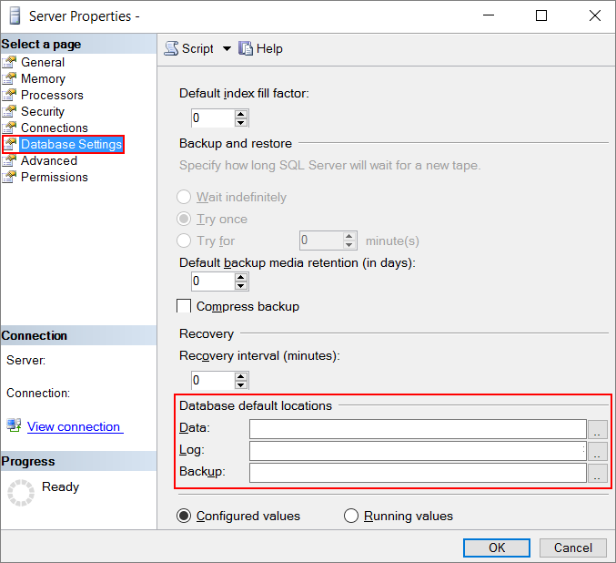
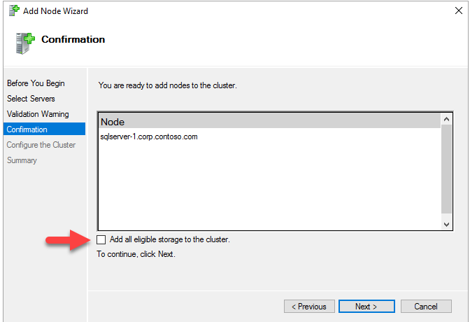

# Performance guidelines for SQL Server on Azure Virtual Machines
[!INCLUDE[appliesto-sqlvm](../../includes/appliesto-sqlvm.md)]

This article provides guidance for optimizing SQL Server performance in Microsoft Azure Virtual Machines.

## Overview

 While running SQL Server on Azure Virtual Machines, we recommend that you continue using the same database performance tuning options that are applicable to SQL Server in on-premises server environments. However, the performance of a relational database in a public cloud depends on many factors such as the size of a virtual machine, and the configuration of the data disks.

[SQL Server images provisioned in the Azure portal](sql-vm-create-portal-quickstart.md) follow general storage configuration best practices (for more information on how storage is configured, see [Storage configuration for SQL Server virtual machines (VMs)](storage-configuration.md)). After provisioning, consider applying other optimizations discussed in this article. Base your choices on your workload and verify through testing.

> [!TIP]
> There is typically a trade-off between optimizing for costs and optimizing for performance. This article is focused on getting the *best* performance for SQL Server on Azure Virtual Machines. If your workload is less demanding, you might not require every optimization listed below. Consider your performance needs, costs, and workload patterns as you evaluate these recommendations.

## Quick checklist

The following is a quick checklist for optimal performance of SQL Server on Azure Virtual Machines:

| Area | Optimizations |
| --- | --- |
| [VM size](#vm-size-guidance) | - Use VM sizes with 4 or more vCPU like [E4S_v3](../../../virtual-machines/ev3-esv3-series.md) or higher, or [DS12_v2](../../../virtual-machines/dv2-dsv2-series-memory.md) or higher.<br/><br/> - [Es, Eas, Ds and Das Series](../../../virtual-machines/sizes-general.md) offers the optimum memory to vCPU ratio required for OLTP workload performance. <br/><br/> - [M Series](../../../virtual-machines/m-series.md) offers the highest memory to vCPU ratio required for mission critical performance and is ideal for data warehouse workloads. <br/><br/> - Collect the target workload's [IOPS](../../../virtual-machines/windows/premium-storage-performance.md#iops), [throughput](../../../virtual-machines/windows/premium-storage-performance.md#throughput)  and [latency](../../../virtual-machines/windows/premium-storage-performance.md#latency) requirements at peak times by following the [application performance requirements checklist](../../../virtual-machines/windows/premium-storage-performance.md#application-performance-requirements-checklist) and then select the [VM Size](../../../virtual-machines/sizes-general.md) that can scale to your workload's performance requirements.|
| [Storage](#storage-guidance) | - For detailed testing of SQL Server performance on Azure Virtual Machines with TPC-E and TPC_C benchmarks, refer to the blog [Optimize OLTP performance](https://techcommunity.microsoft.com/t5/SQL-Server/Optimize-OLTP-Performance-with-SQL-Server-on-Azure-VM/ba-p/916794). <br/><br/> - Use [premium SSDs](https://techcommunity.microsoft.com/t5/SQL-Server/Optimize-OLTP-Performance-with-SQL-Server-on-Azure-VM/ba-p/916794) for the best price/performance advantages. Configure [ReadOnly cache](../../../virtual-machines/windows/premium-storage-performance.md#disk-caching) for data files and no cache for the log file. <br/><br/> - Use [Ultra Disks](../../../virtual-machines/windows/disks-types.md#ultra-disk) if less than 1 ms storage latencies are required by the workload. <br/><br/> - Collect the storage latency requirements for SQL Server data, log, and Temp DB files by [monitoring the application](../../../virtual-machines/windows/premium-storage-performance.md#application-performance-requirements-checklist) before choosing the disk type. If <1ms storage latencies are required, then use Ultra Disks, otherwise use premium SSD. If low latencies are only required for the log file and not for data files, then [provision the Ultra Disk](../../../virtual-machines/windows/disks-enable-ultra-ssd.md) at required IOPS and throughput levels only for the log File. <br/><br/> -  [Premium file shares](failover-cluster-instance-premium-file-share-manually-configure.md) are recommended as shared storage for a SQL Server failover cluster instance. Premium file shares do not support caching, and offer limited performance compared to premium SSD disks. Choose premium SSD-managed disks over premium file shares for standalone SQL instances; but leverage premium file shares for failover cluster instance shared storage for ease of maintenance and flexible scalability. <br/><br/> -  Standard storage is only recommended for development and test purposes or for backup files and should not be used for production workloads. <br/><br/> - Keep the [storage account](../../../storage/common/storage-create-storage-account.md) and SQL Server VM in the same region.<br/><br/> - Disable Azure [geo-redundant storage](../../../storage/common/storage-redundancy.md) (geo-replication) on the storage account.  |
| [Disks](#disks-guidance) | - Use a minimum of 2 [premium SSD disks](../../../virtual-machines/windows/disks-types.md#premium-ssd) (1 for log file and 1 for data files). <br/><br/> - For workloads requiring <1 ms IO latencies, enable write accelerator for M series and consider using Ultra SSD disks for Es and DS series. <br/><br/> - Enable [read only caching](../../../virtual-machines/windows/premium-storage-performance.md#disk-caching) on the disk(s) hosting the data files.<br/><br/> - Add an additional 20% premium IOPS/throughput capacity than your workload requires when [configuring storage for SQL Server data, log, and TempDB files](storage-configuration.md) <br/><br/> - Avoid using operating system or temporary disks for database storage or logging.<br/><br/> - Do not enable caching on disk(s) hosting the log file.  **Important**: Stop the SQL Server service when changing the cache settings for an Azure Virtual Machines disk.<br/><br/> - Stripe multiple Azure data disks to get increased storage throughput.<br/><br/> - Format with documented allocation sizes. <br/><br/> - Place TempDB on the local SSD `D:\` drive for mission critical SQL Server workloads (after choosing correct VM size). If you create the VM from the Azure portal or Azure quickstart templates and [place Temp DB on the Local Disk](https://techcommunity.microsoft.com/t5/SQL-Server/Announcing-Performance-Optimized-Storage-Configuration-for-SQL/ba-p/891583) then you do not need any further action; for all other cases follow the steps in the blog for  [Using SSDs to store TempDB](https://cloudblogs.microsoft.com/sqlserver/2014/09/25/using-ssds-in-azure-vms-to-store-sql-server-tempdb-and-buffer-pool-extensions/) to prevent failures after restarts. If the capacity of the local drive is not enough for your Temp DB size, then place Temp DB on a storage pool [striped](../../../virtual-machines/windows/premium-storage-performance.md) on premium SSD disks with [read-only caching](../../../virtual-machines/windows/premium-storage-performance.md#disk-caching). |
| [I/O](#io-guidance) |- Enable database page compression.<br/><br/> - Enable instant file initialization for data files.<br/><br/> - Limit autogrowth of the database.<br/><br/> - Disable autoshrink of the database.<br/><br/> - Move all databases to data disks, including system databases.<br/><br/> - Move SQL Server error log and trace file directories to data disks.<br/><br/> - Configure default backup and database file locations.<br/><br/> - [Enable locked pages in memory](/sql/database-engine/configure-windows/enable-the-lock-pages-in-memory-option-windows?view=sql-server-2017).<br/><br/> - Apply SQL Server performance fixes. |
| [Feature-specific](#feature-specific-guidance) | - Back up directly to Azure Blob storage.<br/><br/>- Use [file snapshot backups](/sql/relational-databases/backup-restore/file-snapshot-backups-for-database-files-in-azure) for databases larger than 12 TB. <br/><br/>- Use multiple Temp DB files, 1 file per core, up to 8 files.<br/><br/>- Set max server memory at 90% or up to 50 GB left for the Operating System. <br/><br/>- Enable soft NUMA. |

For more information on *how* and *why* to make these optimizations, please review the details and guidance provided in the following sections.

## VM size guidance

Start by collecting the cpu, memory, and storage throughput requirements of the workload at peak times. \LogicalDisk\Disk Reads/Sec and \LogicalDisk\Disk Writes/Sec performance counters can be used to collect read and write IOPS requirements and \LogicalDisk\Disk Bytes/Sec counter can be used to collect [storage throughput requirements](../../../virtual-machines/windows/premium-storage-performance.md#disk-caching) for Data, Log, and Temp DB files. After IOPS and throughput requirements at peak are defined then evaluate VM sizes offers that capacity. For example if your workload requires 20 K read IOPS and 10K write IOPS at peak, you can either choose E16s_v3 (with up to 32 K cached and 25600 uncached IOPS) or M16_s (with up to 20 K cached and 10K uncached IOPS) with 2 P30 disks. Make sure to understand both throughput and IOPS requirements of the workload as VMs has different scale limits for IOPS and throughput.<br/><br/>[DSv_3](../../../virtual-machines/dv3-dsv3-series.md) and [Es_v3-series](../../../virtual-machines/ev3-esv3-series.md) are hosted on general purpose hardware with Intel Haswell or Broadwell processors. [M-series](../../../virtual-machines/m-series.md) offers the highest vCPU count and memory for the largest SQL Server workloads and hosted on memory optimized hardware with Skylake processor family. These VM series support premium storage, which is recommended for the best performance with host level read cache. Both Es_v3 and M series are also available in [constrained core sizes](../../../virtual-machines/windows/constrained-vcpu.md), which saves money for workloads with lower compute and high storage capacity demands. 

## Storage guidance

For detailed testing of SQL Server performance on Azure Virtual Machines with TPC-E and TPC_C benchmarks, refer to the blog [Optimize OLTP performance](https://techcommunity.microsoft.com/t5/SQL-Server/Optimize-OLTP-Performance-with-SQL-Server-on-Azure-VM/ba-p/916794). 

Azure blob cache with premium SSDs is recommended for all production workloads. 

> [!WARNING]
> Standard HDDs and SSDs have varying latencies and bandwidth and are only recommended for dev/test workloads. Production workloads should use premium SSDs.

In addition, we recommend that you create your Azure storage account in the same data center as your SQL Server virtual machines to reduce transfer delays. When creating a storage account, disable geo-replication as consistent write order across multiple disks is not guaranteed. Instead, consider configuring a SQL Server disaster recovery technology between two Azure data centers. For more information, see [High Availability and Disaster Recovery for SQL Server on Azure Virtual Machines](business-continuity-high-availability-disaster-recovery-hadr-overview.md).

## Disks guidance

There are three main disk types on Azure virtual machines:

* **OS disk**: When you create an Azure virtual machine, the platform will attach at least one disk (labeled as the **C** drive) to the VM for your operating system disk. This disk is a VHD stored as a page blob in storage.
* **Temporary disk**: Azure virtual machines contain another disk called the temporary disk (labeled as the **D**: drive). This is a disk on the node that can be used for scratch space.
* **Data disks**: You can also attach additional disks to your virtual machine as data disks, and these will be stored in storage as page blobs.

The following sections describe recommendations for using these different disks.

### Operating system disk

An operating system disk is a VHD that you can boot and mount as a running version of an operating system and is labeled as the **C** drive.

Default caching policy on the operating system disk is **Read/Write**. For performance sensitive applications, we recommend that you use data disks instead of the operating system disk. See the section on Data Disks below.

### Temporary disk

The temporary storage drive, labeled as the **D** drive, is not persisted to Azure Blob storage. Do not store your user database files or user transaction log files on the **D**: drive.

Place TempDB on the local SSD `D:\` drive for mission critical SQL Server workloads (after choosing correct VM size). If you create the VM from the Azure portal or Azure quickstart templates and [place Temp DB on the Local Disk](https://techcommunity.microsoft.com/t5/SQL-Server/Announcing-Performance-Optimized-Storage-Configuration-for-SQL/ba-p/891583), then you do not need any further action; for all other cases follow the steps in the blog for  [Using SSDs to store TempDB](https://cloudblogs.microsoft.com/sqlserver/2014/09/25/using-ssds-in-azure-vms-to-store-sql-server-tempdb-and-buffer-pool-extensions/) to prevent failures after restarts. If the capacity of the local drive is not enough for your Temp DB size, then place Temp DB on a storage pool [striped](../../../virtual-machines/windows/premium-storage-performance.md) on premium SSD disks with [read-only caching](../../../virtual-machines/windows/premium-storage-performance.md#disk-caching).

For VMs that support premium SSDs, you can also store TempDB on a disk that supports premium SSDs with read caching enabled.


### Data disks

* **Use premium SSD disks for data and log files**: If you are not using disk striping, use two premium SSD disks where one disk contains the log file and the other contains the data. Each premium SSD provides a number of IOPS and bandwidth (MB/s) depending on its size, as depicted in the article, [Select a disk type](../../../virtual-machines/windows/disks-types.md). If you are using a disk striping technique, such as Storage Spaces, you achieve optimal performance by having two pools, one for the log file(s) and the other for the data files. However, if you plan to use SQL Server failover cluster instances (FCI), you must configure one pool, or utilize [premium file shares](failover-cluster-instance-premium-file-share-manually-configure.md) instead.

   > [!TIP]
   > - For test results on various disk and workload configurations, see the following blog post: [Storage Configuration Guidelines for SQL Server on Azure Virtual Machines](https://blogs.msdn.microsoft.com/sqlserverstorageengine/2018/09/25/storage-configuration-guidelines-for-sql-server-on-azure-vm/).
   > - For mission critical performance for SQL Servers that need ~ 50,000 IOPS, consider replacing 10 -P30 disks with an Ultra SSD. For more information, see the following blog post: [Mission critical performance with Ultra SSD](https://azure.microsoft.com/blog/mission-critical-performance-with-ultra-ssd-for-sql-server-on-azure-vm/).

   > [!NOTE]
   > When you provision a SQL Server VM in the portal, you have the option of editing your storage configuration. Depending on your configuration, Azure configures one or more disks. Multiple disks are combined into a single storage pool with striping. Both the data and log files reside together in this configuration. For more information, see [Storage configuration for SQL Server VMs](storage-configuration.md).

* **Disk striping**: For more throughput, you can add additional data disks and use disk striping. To determine the number of data disks, you need to analyze the number of IOPS and bandwidth required for your log file(s), and for your data and TempDB file(s). Notice that different VM sizes have different limits on the number of IOPs and bandwidth supported, see the tables on IOPS per [VM size](../../../virtual-machines/windows/sizes.md?toc=%2fazure%2fvirtual-machines%2fwindows%2ftoc.json). Use the following guidelines:

  * For Windows 8/Windows Server 2012 or later, use [Storage Spaces](https://technet.microsoft.com/library/hh831739.aspx) with the following guidelines:

      1. Set the interleave (stripe size) to 64 KB (65,536 bytes) for OLTP workloads and 256 KB (262,144 bytes) for data warehousing workloads to avoid performance impact due to partition misalignment. This must be set with PowerShell.
      2. Set column count = number of physical disks. Use PowerShell when configuring more than 8 disks (not Server Manager UI). 

    For example, the following PowerShell creates a new storage pool with the interleave size to 64 KB and the number of columns to 2:

    ```powershell
    $PoolCount = Get-PhysicalDisk -CanPool $True
    $PhysicalDisks = Get-PhysicalDisk | Where-Object {$_.FriendlyName -like "*2" -or $_.FriendlyName -like "*3"}

    New-StoragePool -FriendlyName "DataFiles" -StorageSubsystemFriendlyName "Storage Spaces*" -PhysicalDisks $PhysicalDisks | New-VirtualDisk -FriendlyName "DataFiles" -Interleave 65536 -NumberOfColumns 2 -ResiliencySettingName simple –UseMaximumSize |Initialize-Disk -PartitionStyle GPT -PassThru |New-Partition -AssignDriveLetter -UseMaximumSize |Format-Volume -FileSystem NTFS -NewFileSystemLabel "DataDisks" -AllocationUnitSize 65536 -Confirm:$false 
    ```

  * For Windows 2008 R2 or earlier, you can use dynamic disks (OS striped volumes) and the stripe size is always 64 KB. This option is deprecated as of Windows 8/Windows Server 2012. For information, see the support statement at [Virtual Disk Service is transitioning to Windows Storage Management API](https://msdn.microsoft.com/library/windows/desktop/hh848071.aspx).

  * If you are using [Storage Spaces Direct (S2D)](/windows-server/storage/storage-spaces/storage-spaces-direct-in-vm) with [SQL Server Failover Cluster Instances](failover-cluster-instance-storage-spaces-direct-manually-configure.md), you must configure a single pool. Although different volumes can be created on that single pool, they will all share the same characteristics, such as the same caching policy.

  * Determine the number of disks associated with your storage pool based on your load expectations. Keep in mind that different VM sizes allow different numbers of attached data disks. For more information, see [Sizes for virtual machines](../../../virtual-machines/windows/sizes.md?toc=%2fazure%2fvirtual-machines%2fwindows%2ftoc.json).

  * If you are not using premium SSDs (dev/test scenarios), the recommendation is to add the maximum number of data disks supported by your [VM size](../../../virtual-machines/windows/sizes.md?toc=%2fazure%2fvirtual-machines%2fwindows%2ftoc.json) and use disk striping.

* **Caching policy**: Note the following recommendations for caching policy depending on your storage configuration.

  * If you are using separate disks for data and log files, enable read caching on the data disks hosting your data files and TempDB data files. This can result in a significant performance benefit. Do not enable caching on the disk holding the log file as this causes a minor decrease in performance.

  * If you are using disk striping in a single storage pool, most workloads will benefit from read caching. If you have separate storage pools for the log and data files, enable read caching only on the storage pool for the data files. In certain heavy write workloads, better performance might be achieved with no caching. This can only be determined through testing.

  * The previous recommendations apply to premium SSDs. If you are not using premium SSDs, do not enable any caching on any data disks.

  * For instructions on configuring disk caching, see the following articles. For the classic (ASM) deployment model see: [Set-AzureOSDisk](https://msdn.microsoft.com/library/azure/jj152847) and [Set-AzureDataDisk](https://msdn.microsoft.com/library/azure/jj152851.aspx). For the Azure Resource Manager deployment model, see: [Set-AzOSDisk](https://docs.microsoft.com/powershell/module/az.compute/set-azvmosdisk) and [Set-AzVMDataDisk](https://docs.microsoft.com/powershell/module/az.compute/set-azvmdatadisk).

     > [!WARNING]
     > Stop the SQL Server service when changing the cache setting of Azure Virtual Machines disks to avoid the possibility of any database corruption.

* **NTFS allocation unit size**: When formatting the data disk, it is recommended that you use a 64-KB allocation unit size for data and log files as well as TempDB. If TempDB is placed on the temporary disk (D:\ drive) the performance gained by leveraging this drive outweighs the need for a 64K allocation unit size. 

* **Disk management best practices**: When removing a data disk or changing its cache type, stop the SQL Server service during the change. When the caching settings are changed on the OS disk, Azure stops the VM, changes the cache type, and restarts the VM. When the cache settings of a data disk are changed, the VM is not stopped, but the data disk is detached from the VM during the change and then reattached.

  > [!WARNING]
  > Failure to stop the SQL Server service during these operations can cause database corruption.


## I/O guidance

* The best results with premium SSDs are achieved when you parallelize your application and requests. Premium SSDs are designed for scenarios where the IO queue depth is greater than 1, so you will see little or no performance gains for single-threaded serial requests (even if they are storage intensive). For example, this could impact the single-threaded test results of performance analysis tools, such as SQLIO.

* Consider using [database page compression](https://msdn.microsoft.com/library/cc280449.aspx) as it can help improve performance of I/O intensive workloads. However, the data compression might increase the CPU consumption on the database server.

* Consider enabling instant file initialization to reduce the time that is required for initial file allocation. To take advantage of instant file initialization, you grant the SQL Server (MSSQLSERVER) service account with SE_MANAGE_VOLUME_NAME and add it to the **Perform Volume Maintenance Tasks** security policy. If you are using a SQL Server platform image for Azure, the default service account (NT Service\MSSQLSERVER) isn’t added to the **Perform Volume Maintenance Tasks** security policy. In other words, instant file initialization is not enabled in a SQL Server Azure platform image. After adding the SQL Server service account to the **Perform Volume Maintenance Tasks** security policy, restart the SQL Server service. There could be security considerations for using this feature. For more information, see [Database File Initialization](https://msdn.microsoft.com/library/ms175935.aspx).

* Be aware that **autogrow** is considered to be merely a contingency for unexpected growth. Do not manage your data and log growth on a day-to-day basis with autogrow. If autogrow is used, pre-grow the file using the Size switch.

* Make sure **autoshrink** is disabled to avoid unnecessary overhead that can negatively affect performance.

* Move all databases to data disks, including system databases. For more information, see [Move System Databases](https://msdn.microsoft.com/library/ms345408.aspx).

* Move SQL Server error log and trace file directories to data disks. This can be done in SQL Server Configuration Manager by right-clicking your SQL Server instance and selecting properties. The error log and trace file settings can be changed in the **Startup Parameters** tab. The Dump Directory is specified in the **Advanced** tab. The following screenshot shows where to look for the error log startup parameter.

    

* Set up default backup and database file locations. Use the recommendations in this article, and make the changes in the Server properties window. For instructions, see [View or Change the Default Locations for Data and Log Files (SQL Server Management Studio)](https://msdn.microsoft.com/library/dd206993.aspx). The following screenshot demonstrates where to make these changes.

    
* Enable locked pages to reduce IO and any paging activities. For more information, see [Enable the Lock Pages in Memory Option (Windows)](https://msdn.microsoft.com/library/ms190730.aspx).

* If you are running SQL Server 2012, install Service Pack 1 Cumulative Update 10. This update contains the fix for poor performance on I/O when you execute select into temporary table statement in SQL Server 2012. For information, see this [knowledge base article](https://support.microsoft.com/kb/2958012).

* Consider compressing any data files when transferring in/out of Azure.

## Feature-specific guidance

Some deployments may achieve additional performance benefits using more advanced configuration techniques. The following list highlights some SQL Server features that can help you to achieve better performance:

### Back up to Azure Storage
When performing backups for SQL Server running in Azure Virtual Machines, you can use [SQL Server Backup to URL](https://msdn.microsoft.com/library/dn435916.aspx). This feature is available starting with SQL Server 2012 SP1 CU2 and recommended for backing up to the attached data disks. When you backup/restore to/from Azure Storage, follow the recommendations provided at [SQL Server Backup to URL Best Practices and Troubleshooting and Restoring from Backups Stored in Azure Storage](https://msdn.microsoft.com/library/jj919149.aspx). You can also automate these backups using [Automated Backup for SQL Server on Azure Virtual Machines](../../../azure-sql/virtual-machines/windows/automated-backup-sql-2014.md).

Prior to SQL Server 2012, you can use [SQL Server Backup to Azure Tool](https://www.microsoft.com/download/details.aspx?id=40740). This tool can help to increase backup throughput using multiple backup stripe targets.

### SQL Server Data Files in Azure

This new feature, [SQL Server Data Files in Azure](https://msdn.microsoft.com/library/dn385720.aspx), is available starting with SQL Server 2014. Running SQL Server with data files in Azure demonstrates comparable performance characteristics as using Azure data disks.

### Failover cluster instance and Storage Spaces

If you are using Storage Spaces, when adding nodes to the cluster on the **Confirmation** page, clear the check box labeled **Add all eligible storage to the cluster**. 



If you are using Storage Spaces and do not uncheck **Add all eligible storage to the cluster**, Windows detaches the virtual disks during the clustering process. As a result, they do not appear in Disk Manager or Explorer until the storage spaces are removed from the cluster and reattached using PowerShell. Storage Spaces groups multiple disks in to storage pools. For more information, see [Storage Spaces](/windows-server/storage/storage-spaces/overview).

## Next steps

For more information about storage and performance, see [Storage Configuration Guidelines for SQL Server on Azure Virtual Machines](https://blogs.msdn.microsoft.com/sqlserverstorageengine/2018/09/25/storage-configuration-guidelines-for-sql-server-on-azure-vm/)

For security best practices, see [Security Considerations for SQL Server on Azure Virtual Machines](security-considerations-best-practices.md).

Review other SQL Server Virtual Machine articles at [SQL Server on Azure Virtual Machines Overview](sql-server-on-azure-vm-iaas-what-is-overview.md). If you have questions about SQL Server virtual machines, see the [Frequently Asked Questions](frequently-asked-questions-faq.md).
