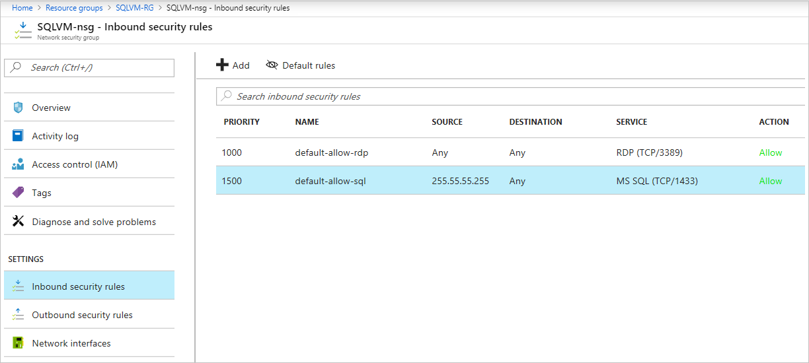
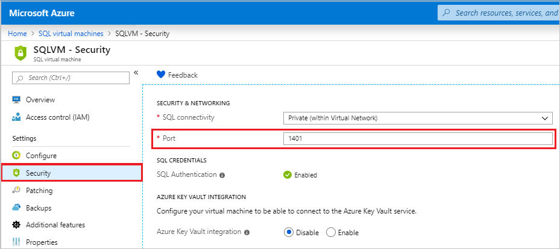

# Security considerations for SQL Server on Azure Virtual Machines
[!INCLUDE[appliesto-sqlvm](../../includes/appliesto-sqlvm.md)]

This topic includes overall security guidelines that help establish secure access to SQL Server instances in an Azure virtual machine (VM).

Azure complies with several industry regulations and standards that can enable you to build a compliant solution with SQL Server running in a virtual machine. For information about regulatory compliance with Azure, see [Azure Trust Center](https://azure.microsoft.com/support/trust-center/).

In addition to the practices described in this topic, we recommend that you review and implement the security best practices from both traditional on-premises security practices, as well as virtual machine security best practices. 

## Azure Defender for SQL 

[Azure Defender for SQL](../../../security-center/defender-for-sql-introduction.md) enables Azure Security Center security features such as vulnerability assessments and security alerts. See [enable Azure Defender for SQL](../../../security-center/defender-for-sql-usage.md) to learn more. 

## Portal management

After you've [registered your SQL Server VM with the SQL IaaS extension](sql-agent-extension-manually-register-single-vm.md), you can configure a number of security settings using the [SQL virtual machines resource](manage-sql-vm-portal.md) in the Azure portal, such as enabling Azure Key Vault integration, or SQL authentication. 

Additionally, after you've enabled [Azure Defender for SQL](../../../security-center/defender-for-sql-usage.md) you can view Security Center features directly within the [SQL virtual machines resource](manage-sql-vm-portal.md) in the Azure portal, such as vulnerability assessments and security alerts. 

See [manage SQL Server VM in the portal](manage-sql-vm-portal.md) to learn more. 

## Azure Key Vault integration 

There are multiple SQL Server encryption features, such as transparent data encryption (TDE), column level encryption (CLE), and backup encryption. These forms of encryption require you to manage and store the cryptographic keys you use for encryption. The Azure Key Vault service is designed to improve the security and management of these keys in a secure and highly available location. The SQL Server Connector enables SQL Server to use these keys from Azure Key Vault.
For comprehensive details, see the other articles in this series: [Checklist](performance-guidelines-best-practices-checklist.md), [VM size](performance-guidelines-best-practices-vm-size.md), [Storage](performance-guidelines-best-practices-storage.md), [HADR configuration](hadr-cluster-best-practices.md), [Collect baseline](performance-guidelines-best-practices-collect-baseline.md). 

See [Azure Key Vault integration](azure-key-vault-integration-configure.md) to learn more.

## Access control 

When you create your SQL Server virtual machine, consider how to carefully control who has access to the machine and to SQL Server. In general, you should do the following:

- Restrict access to SQL Server to only the applications and clients that need it.
- Follow best practices for managing user accounts and passwords.

The following sections provide suggestions on thinking through these points.

## Secure connections

When you create a SQL Server virtual machine with a gallery image, the **SQL Server Connectivity** option gives you the choice of **Local (inside VM)**, **Private (within Virtual Network)**, or **Public (Internet)**.

For the best security, choose the most restrictive option for your scenario. For example, if you are running an application that accesses SQL Server on the same VM, then **Local** is the most secure choice. If you are running an Azure application that requires access to the SQL Server, then **Private** secures communication to SQL Server only within the specified [Azure virtual network](../../../virtual-network/virtual-networks-overview.md). If you require **Public** (internet) access to the SQL Server VM, then make sure to follow other best practices in this topic to reduce your attack surface area.

The selected options in the portal use inbound security rules on the VM's [network security group](../../../active-directory/identity-protection/concept-identity-protection-security-overview.md) (NSG) to allow or deny network traffic to your virtual machine. You can modify or create new inbound NSG rules to allow traffic to the SQL Server port (default 1433). You can also specify specific IP addresses that are allowed to communicate over this port.

In addition to NSG rules to restrict network traffic, you can also use the Windows Firewall on the virtual machine.

If you are using endpoints with the classic deployment model, remove any endpoints on the virtual machine if you do not use them. For instructions on using ACLs with endpoints, see [Manage the ACL on an endpoint](/previous-versions/azure/virtual-machines/windows/classic/setup-endpoints#manage-the-acl-on-an-endpoint). This is not necessary for VMs that use the Azure Resource Manager.

Finally, consider enabling encrypted connections for the instance of the SQL Server Database Engine in your Azure virtual machine. Configure SQL server instance with a signed certificate. For more information, see [Enable Encrypted Connections to the Database Engine](/sql/database-engine/configure-windows/enable-encrypted-connections-to-the-database-engine) and [Connection String Syntax](/dotnet/framework/data/adonet/connection-string-syntax).

## Encryption

Managed disks offer Server-Side Encryption, and Azure Disk Encryption. [Server-Side Encryption](../../../virtual-machines/disk-encryption.md) provides encryption-at-rest and safeguards your data to meet your organizational security and compliance commitments. [Azure Disk Encryption](../../../security/fundamentals/azure-disk-encryption-vms-vmss.md) uses either BitLocker or DM-Crypt technology, and integrates with Azure Key Vault to encrypt both the OS and data disks. 

## Non-default port

By default, SQL Server listens on a well-known port, 1433. For increased security, configure SQL Server to listen on a non-default port, such as 1401. If you provision a SQL Server gallery image in the Azure portal, you can specify this port in the **SQL Server settings** blade.

To configure this after provisioning, you have two options:

- For Resource Manager VMs, you can select **Security** from the [SQL virtual machines resource](manage-sql-vm-portal.md#access-the-resource). This provides an option to change the port.

  

- For Classic VMs or for SQL Server VMs that were not provisioned with the portal, you can manually configure the port by connecting remotely to the VM. For the configuration steps, see [Configure a Server to Listen on a Specific TCP Port](/sql/database-engine/configure-windows/configure-a-server-to-listen-on-a-specific-tcp-port). If you use this manual technique, you also need to add a Windows Firewall rule to allow incoming traffic on that TCP port.

> [!IMPORTANT]
> Specifying a non-default port is a good idea if your SQL Server port is open to public internet connections.

When SQL Server is listening on a non-default port, you must specify the port when you connect. For example, consider a scenario where the server IP address is 13.55.255.255 and SQL Server is listening on port 1401. To connect to SQL Server, you would specify `13.55.255.255,1401` in the connection string.

## Manage accounts

You don't want attackers to easily guess account names or passwords. Use the following tips to help:

- Create a unique local administrator account that is not named **Administrator**.

- Use complex strong passwords for all your accounts. For more information about how to create a strong password, see [Create a strong password](https://support.microsoft.com/account-billing/how-to-create-a-strong-password-for-your-microsoft-account-f67e4ddd-0dbe-cd75-cebe-0cfda3cf7386) article.

- By default, Azure selects Windows Authentication during SQL Server virtual machine setup. Therefore, the **SA** login is disabled and a password is assigned by setup. We recommend that the **SA** login should not be used or enabled. If you must have a SQL login, use one of the following strategies:

  - Create a SQL account with a unique name that has **sysadmin** membership. You can do this from the portal by enabling **SQL Authentication** during provisioning.

    > [!TIP] 
    > If you do not enable SQL Authentication during provisioning, you must manually change the authentication mode to **SQL Server and Windows Authentication Mode**. For more information, see [Change Server Authentication Mode](/sql/database-engine/configure-windows/change-server-authentication-mode).

  - If you must use the **SA** login, enable the login after provisioning and assign a new strong password.

## Next steps

If you are also interested in best practices around performance, see [Performance Best Practices for SQL Server on Azure Virtual Machines](./performance-guidelines-best-practices-checklist.md).

For other topics related to running SQL Server in Azure VMs, see [SQL Server on Azure Virtual Machines overview](sql-server-on-azure-vm-iaas-what-is-overview.md). If you have questions about SQL Server virtual machines, see the [Frequently Asked Questions](frequently-asked-questions-faq.yml).

To learn more, see the other articles in this series:

- [Quick checklist](performance-guidelines-best-practices-checklist.md)
- [VM size](performance-guidelines-best-practices-vm-size.md)
- [Storage](performance-guidelines-best-practices-storage.md)
- [Security](security-considerations-best-practices.md)
- [HADR settings](hadr-cluster-best-practices.md)
- [Collect baseline](performance-guidelines-best-practices-collect-baseline.md)

