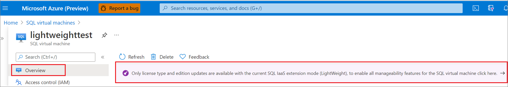
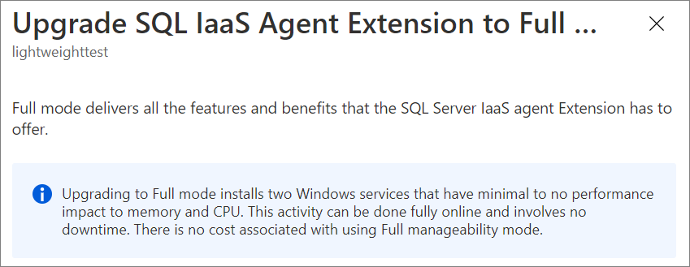
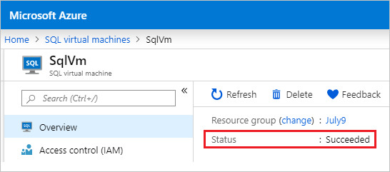
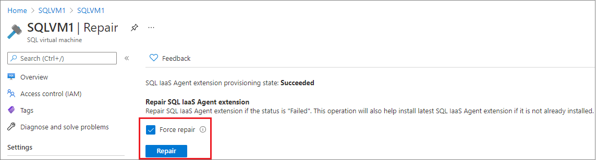
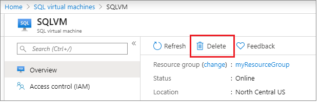

# Register Windows SQL Server VM with SQL IaaS Extension
[!INCLUDE[appliesto-sqlvm](../../includes/appliesto-sqlvm.md)]

> [!div class="op_single_selector"]
> * [Windows](sql-agent-extension-manually-register-single-vm.md)
> * [Linux](../linux/sql-iaas-agent-extension-register-vm-linux.md)

Register your SQL Server VM with the [SQL IaaS Agent extension](sql-server-iaas-agent-extension-automate-management.md) to unlock a wealth of feature benefits for your SQL Server on Windows Azure VM. 

This article teaches you to register a single SQL Server VM with the SQL IaaS Agent extension. Alternatively, you can register all SQL Server VMs in a subscription [automatically](sql-agent-extension-automatic-registration-all-vms.md) or [multiple VMs in bulk using a script](sql-agent-extension-manually-register-vms-bulk.md).

> [!NOTE]
> Starting in September 2021, registering with the SQL IaaS extension in full mode no longer requires restarting the SQL Server service. 

## Overview

Registering with the [SQL Server IaaS Agent extension](sql-server-iaas-agent-extension-automate-management.md) creates the [**SQL virtual machine** _resource_](manage-sql-vm-portal.md) within your subscription, which is a _separate_ resource from the virtual machine resource. Unregistering your SQL Server VM from the extension will remove the **SQL virtual machine** _resource_ but will not drop the actual virtual machine.

Deploying a SQL Server VM Azure Marketplace image through the Azure portal automatically registers the SQL Server VM with the extension. However, if you choose to self-install SQL Server on an Azure virtual machine, or provision an Azure virtual machine from a custom VHD, then you must register your SQL Server VM with the SQL IaaS Agent extension to to unlock full feature benefits and manageability.

To utilize the SQL IaaS Agent extension, you must first [register your subscription with the **Microsoft.SqlVirtualMachine** provider](#register-subscription-with-rp), which gives the SQL IaaS extension the ability to create resources within that specific subscription. Then you can register your SQL Server VM with the extension. 

By default, Azure VMs that have SQL Server 2016 or later installed will be automatically registered with the SQL IaaS Agent extension when detected by the [CEIP service](/sql/sql-server/usage-and-diagnostic-data-configuration-for-sql-server).  See the [SQL Server privacy supplement](/sql/sql-server/sql-server-privacy#non-personal-data) for more information.

> [!IMPORTANT]
> The SQL IaaS Agent extension collects data for the express purpose of giving customers optional benefits when using SQL Server within Azure Virtual Machines. Microsoft will not use this data for licensing audits without the customer's advance consent. See the [SQL Server privacy supplement](/sql/sql-server/sql-server-privacy#non-personal-data) for more information.

## Prerequisites

To register your SQL Server VM with the extension, you'll need:

- An [Azure subscription](https://azure.microsoft.com/free/).
- An Azure Resource Model [Windows Server 2008 (or greater) virtual machine](../../../virtual-machines/windows/quick-create-portal.md) with [SQL Server 2008 (or greater)](https://www.microsoft.com/sql-server/sql-server-downloads) deployed to the public or Azure Government cloud.
- The latest version of [Azure CLI](/cli/azure/install-azure-cli) or [Azure PowerShell (5.0 minimum)](/powershell/azure/install-az-ps).
- A minimum of .NET Framework 4.5.1 or later.

## Register subscription with RP

To register your SQL Server VM with the SQL IaaS Agent extension, you must first register your subscription with the **Microsoft.SqlVirtualMachine** resource provider (RP). This gives the SQL IaaS Agent extension the ability to create resources within your subscription. You can do so by using the Azure portal, the Azure CLI, or Azure PowerShell.

### Azure portal

Register your subscription with the resource provider by using the Azure portal:

1. Open the Azure portal and go to **All Services**.
1. Go to **Subscriptions** and select the subscription of interest.
1. On the **Subscriptions** page, select **Resource providers** under **Settings**.
1. Enter **sql** in the filter to bring up the SQL-related resource providers.
1. Select **Register**, **Re-register**, or **Unregister** for the  **Microsoft.SqlVirtualMachine** provider, depending on your desired action.

   

### Command line

Register your Azure subscription with the **Microsoft.SqlVirtualMachine** provider using either Azure CLI or Azure PowerShell.

# [Azure CLI](#tab/bash)

Register your subscription with the resource provider by using the Azure CLI:

```azurecli-interactive
# Register the SQL IaaS Agent extension to your subscription 
az provider register --namespace Microsoft.SqlVirtualMachine 
```

# [Azure PowerShell](#tab/powershell)

Register your subscription with the resource provider by using Azure PowerShell:

```powershell-interactive
# Register the SQL IaaS Agent extension to your subscription
Register-AzResourceProvider -ProviderNamespace Microsoft.SqlVirtualMachine
```

---

## Full mode

It's possible to either register your SQL Server VM directly in full mode by using the Azure CLI and Azure PowerShell or upgrade to full mode from lightweight mode by using the Azure portal, the Azure CLI, or Azure PowerShell. Upgrading VMs in _NoAgent_ mode is not supported until the OS is upgraded to Windows 2008 R2 and above.  

Starting with September 2021, registering your SQL Server VM in full mode no longer requires restarting the SQL Server service. 

To learn more about full mode, see [management modes](sql-server-iaas-agent-extension-automate-management.md#management-modes).

### Register in full mode

Provide the SQL Server license type as either pay-as-you-go (`PAYG`) to pay per usage, Azure Hybrid Benefit (`AHUB`) to use your own license, or disaster recovery (`DR`) to activate the [free DR replica license](business-continuity-high-availability-disaster-recovery-hadr-overview.md#free-dr-replica-in-azure).


# [Azure CLI](#tab/bash)

Register a SQL Server VM in full mode with the Azure CLI:

```azurecli-interactive
# Register Enterprise or Standard self-installed VM in Lightweight mode
az sql vm create --name <vm_name> --resource-group <resource_group_name> --location <vm_location> --license-type <license_type> --sql-mgmt-type Full
```

# [Azure PowerShell](#tab/powershell)

Register a SQL Server VM in FULL mode with Azure PowerShell:

```powershell-interactive
# Get the existing Compute VM
$vm = Get-AzVM -Name <vm_name> -ResourceGroupName <resource_group_name>

New-AzSqlVM -Name $vm.Name -ResourceGroupName $vm.ResourceGroupName -Location $vm.Location `
-LicenseType <license_type> -SqlManagementType Full
```

---


### Upgrade to full

SQL Server VMs that have registered the extension in *lightweight* mode can upgrade to _full_ using the Azure portal, the Azure CLI, or Azure PowerShell. SQL Server VMs in _NoAgent_ mode can upgrade to _full_ after the OS is upgraded to Windows 2008 R2 and above. It is not possible to downgrade - to do so, you will need to [unregister](#unregister-from-extension) the SQL Server VM from the SQL IaaS Agent extension. Doing so will remove the **SQL virtual machine** _resource_, but will not delete the actual virtual machine.

#### Azure portal

Upgrade the extension to full mode with the Azure portal:

1. Sign in to the [Azure portal](https://portal.azure.com).
1. Go to your [SQL virtual machines](manage-sql-vm-portal.md#access-the-resource) resource.
1. Select your SQL Server VM, and navigate to the **Overview** page.
1. For SQL Server VMs with the NoAgent or lightweight IaaS extension mode, select the **Only license type and edition updates are available with the current SQL IaaS extension mode...** message.

   

1. Select **Confirm** to upgrade your SQL Server IaaS extension mode to full.

  

#### Command line

# [Azure CLI](#tab/bash)

Upgrade the extension to full mode with the Azure CLI:

```azurecli-interactive
# Update to full mode
az sql vm update --name <vm_name> --resource-group <resource_group_name> --sql-mgmt-type full  
```

# [Azure PowerShell](#tab/powershell)

Upgrade the extension to full mode with Azure PowerShell: 

```powershell-interactive
# Get the existing  Compute VM
$vm = Get-AzVM -Name <vm_name> -ResourceGroupName <resource_group_name>
# Register with SQL IaaS Agent extension in full mode
Update-AzSqlVM -Name $vm.Name -ResourceGroupName $vm.ResourceGroupName -SqlManagementType Full
```

---

## Lightweight mode

Use the Azure CLI or Azure PowerShell to register your SQL Server VM with the extension in lightweight mode for limited functionality. 

Provide the SQL Server license type as either pay-as-you-go (`PAYG`) to pay per usage, Azure Hybrid Benefit (`AHUB`) to use your own license, or disaster recovery (`DR`) to activate the [free DR replica license](business-continuity-high-availability-disaster-recovery-hadr-overview.md#free-dr-replica-in-azure).

Failover cluster instances and SQL Server VMs with multiple instances can only be registered with the SQL IaaS Agent extension in lightweight mode.

To learn more about lightweight mode, see [management modes](sql-server-iaas-agent-extension-automate-management.md#management-modes).

# [Azure CLI](#tab/bash)

Register a SQL Server VM in lightweight mode with the Azure CLI:

```azurecli-interactive
# Register Enterprise or Standard self-installed VM in Lightweight mode
az sql vm create --name <vm_name> --resource-group <resource_group_name> --location <vm_location> --license-type <license_type> 
```

# [Azure PowerShell](#tab/powershell)

Register a SQL Server VM in lightweight mode with Azure PowerShell:

```powershell-interactive
# Get the existing compute VM
$vm = Get-AzVM -Name <vm_name> -ResourceGroupName <resource_group_name>

# Register SQL VM with 'Lightweight' SQL IaaS agent
New-AzSqlVM -Name $vm.Name -ResourceGroupName $vm.ResourceGroupName -Location $vm.Location `
  -LicenseType <license_type>  -SqlManagementType LightWeight  
```

---

## NoAgent mode

SQL Server 2008 and 2008 R2 installed on Windows Server 2008 (_not R2_) can only be registered with the SQL IaaS Agent extension in the [NoAgent mode](sql-server-iaas-agent-extension-automate-management.md#management-modes). This option assures compliance and allows the SQL Server VM to be monitored in the Azure portal with limited functionality.

For the **license type**, specify either: `AHUB`, `PAYG`, or `DR`. 
For the **image offer**, specify either `SQL2008-WS2008` or `SQL2008R2-WS2008`

Use the Azure CLI or Azure PowerShell to register your SQL Server 2008 (`SQL2008-WS2008`) or 2008 R2 (`SQL2008R2-WS2008`) instance on your Windows Server 2008 VM. 

# [Azure CLI](#tab/bash)

Register your SQL Server virtual machine in NoAgent mode with the Azure CLI:

```azurecli-interactive
az sql vm create -n sqlvm -g myresourcegroup -l eastus |
--license-type <license type>  --sql-mgmt-type NoAgent 
--image-sku Enterprise --image-offer <image offer> 
```

# [Azure PowerShell](#tab/powershell)

Register your SQL Server virtual machine in NoAgent mode with Azure PowerShell:

```powershell-interactive
# Get the existing compute VM
$vm = Get-AzVM -Name <vm_name> -ResourceGroupName <resource_group_name>

New-AzSqlVM -Name $vm.Name -ResourceGroupName $vm.ResourceGroupName -Location $vm.Location `
  -LicenseType <license type> -SqlManagementType NoAgent -Sku Standard -Offer <image offer>
```

---


## Check management mode

Use Azure PowerShell to check what management mode your SQL Server IaaS agent extension is in. 

Check the mode of the extension with Azure PowerShell:  

```powershell-interactive
# Get the SqlVirtualMachine
$sqlvm = Get-AzSqlVM -Name $vm.Name  -ResourceGroupName $vm.ResourceGroupName
$sqlvm.SqlManagementType
```


## Verify registration status

You can verify if your SQL Server VM has already been registered with the SQL IaaS Agent extension by using the Azure portal, the Azure CLI, or Azure PowerShell.

### Azure portal

Verify the registration status with the Azure portal:

1. Sign in to the [Azure portal](https://portal.azure.com).
1. Go to your [SQL Server VMs](manage-sql-vm-portal.md).
1. Select your SQL Server VM from the list. If your SQL Server VM is not listed here, it likely hasn't been registered with the SQL IaaS Agent extension.
1. View the value under **Status**. If **Status** is **Succeeded**, then the SQL Server VM has been registered with the SQL IaaS Agent extension successfully.

   

Alternatively, you can check the status by choosing **Repair** under the **Support + troubleshooting** pane in the **SQL virtual machine** resource. The provisioning state for the SQL IaaS agent extension can be **Succeeded** or **Failed**. 

### Command line

Verify current SQL Server VM registration status using either Azure CLI or Azure PowerShell. `ProvisioningState` shows as `Succeeded` if registration was successful.

# [Azure CLI](#tab/bash)

Verify the registration status with the Azure CLI: 

  ```azurecli-interactive
  az sql vm show -n <vm_name> -g <resource_group>
  ```

# [Azure PowerShell](#tab/powershell)

Verify the registration status with Azure PowerShell: 

  ```powershell-interactive
  Get-AzSqlVM -Name <vm_name> -ResourceGroupName <resource_group>
  ```

---

An error indicates that the SQL Server VM has not been registered with the extension.

## Repair extension

It's possible for your SQL IaaS agent extension to be in a failed state. Use the Azure portal to repair the SQL IaaS agent extension. 

To repair the extension with the Azure portal:  

1. Sign in to the [Azure portal](https://portal.azure.com).
1. Go to your [SQL Server VMs](manage-sql-vm-portal.md).
1. Select your SQL Server VM from the list. If your SQL Server VM is not listed here, it likely hasn't been registered with the SQL IaaS Agent extension.
1. Select **Repair** under **Support + Troubleshooting** in the **SQL virtual machine** resource page. 

   :::image type="content" source="media/sql-agent-extension-manually-register-single-vm/repair-extension.png" alt-text="Select **Repair** under **Support + Troubleshooting** in the **SQL virtual machine** resource page":::   

1. If your provisioning state shows as **Failed**, choose **Repair** to repair the extension. If your state is **Succeeded** you can check the box next to **Force repair** to repair the extension regardless of state. 

   


## Unregister from extension

To unregister your SQL Server VM with the SQL IaaS Agent extension, delete the SQL virtual machine *resource* using the Azure portal or Azure CLI. Deleting the SQL virtual machine *resource* does not delete the SQL Server VM. Unregistering the SQL virtual machine with the SQL IaaS Agent extension is necessary to downgrade the management mode from full.

>[!CAUTION]
> **Use extreme caution** when unregistering your SQL Server VM from the extension. Follow the steps carefully because **it is possible to inadvertently delete the virtual machine** when attempting to remove the *resource*.


### Azure portal

Unregister your SQL Server VM from the extension using the Azure portal:

1. Sign into the [Azure portal](https://portal.azure.com).
1. Navigate to the SQL VM resource.

   

1. Select **Delete**.

   

1. Type the name of the SQL virtual machine and **clear the check box next to the virtual machine**.

   

   > [!WARNING]
   > Failure to clear the checkbox next to the virtual machine name will *delete* the virtual machine entirely. Clear the checkbox to unregister the SQL Server VM from the extension but *not delete the actual virtual machine*.

1. Select **Delete** to confirm the deletion of the SQL virtual machine *resource*, and not the SQL Server VM.

### Command line

# [Azure CLI](#tab/azure-cli)

To unregister your SQL Server VM from the extension with the Azure CLI, use the [az sql vm delete](/cli/azure/sql/vm#az_sql_vm_delete) command. This removes the SQL Server VM *resource* but does not delete the virtual machine.

To unregister your SQL Server VM with the Azure CLI: 

```azurecli-interactive
az sql vm delete 
  --name <SQL VM resource name> |
  --resource-group <Resource group name> |
  --yes 
```

# [PowerShell](#tab/azure-powershell)

To unregister your SQL Server VM from the extension with Azure PowerShell, use the [Remove-AzSqlVM](/powershell/module/az.sqlvirtualmachine/remove-azsqlvm) command. This removes the SQL Server VM *resource* but will not delete the virtual machine.

To unregister your SQL Server VM with Azure PowerShell: 

```powershell-interactive
Remove-AzSqlVM -ResourceGroupName <resource_group_name> -Name <SQL VM resource name>
```

---

## Next steps

For more information, see the following articles:

* [Overview of SQL Server on a Windows VM](sql-server-on-azure-vm-iaas-what-is-overview.md)
* [FAQ for SQL Server on a Windows VM](frequently-asked-questions-faq.yml)
* [Pricing guidance for SQL Server on a Azure VMs](../windows/pricing-guidance.md)
* [What's new for SQL Server on Azure VMs](../windows/doc-changes-updates-release-notes-whats-new.md)
