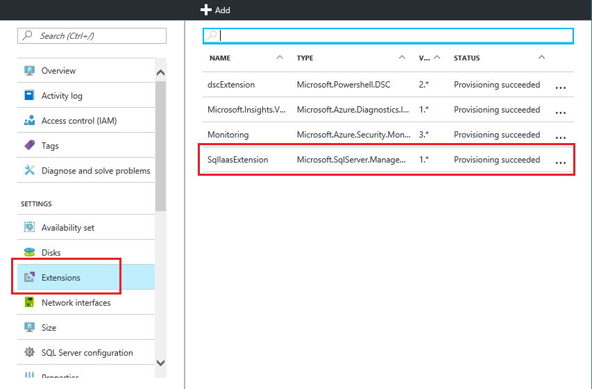

# Automate management tasks on Azure virtual machines by using the SQL Server IaaS Agent Extension
[!INCLUDE[appliesto-sqlvm](../../includes/appliesto-sqlvm.md)]


> [!div class="op_single_selector"]
> * [Resource Manager](sql-server-iaas-agent-extension-automate-management.md)
> * [Classic](../../../virtual-machines/windows/sqlclassic/virtual-machines-windows-classic-sql-server-agent-extension.md)

The SQL Server IaaS Agent Extension (SqlIaasExtension) runs on Azure virtual machines to automate administration tasks. This article provides an overview of the services that the extension supports. This article also provides instructions for installation, status, and removal of the extension.

[!INCLUDE [learn-about-deployment-models](../../../../includes/learn-about-deployment-models-rm-include.md)]

To view the classic version of this article, see [SQL Server IaaS Agent Extension for SQL Server VMs (classic)](../../../virtual-machines/windows/sqlclassic/virtual-machines-windows-classic-sql-server-agent-extension.md).


## Supported services
The SQL Server IaaS Agent Extension supports the following administration tasks:

| Administration feature | Description |
| --- | --- |
| **SQL Server automated backup** |Automates the scheduling of backups for all databases for either the default instance or a [properly installed](frequently-asked-questions-faq.md#administration) named instance of SQL Server on the VM. For more information, see [Automated backup for SQL Server in Azure virtual machines (Resource Manager)](automated-backup-sql-2014.md). |
| **SQL Server automated patching** |Configures a maintenance window during which important Windows updates to your VM can take place, so  you can avoid updates during peak times for your workload. For more information, see [Automated patching for SQL Server in Azure virtual machines (Resource Manager)](automated-patching.md). |
| **Azure Key Vault integration** |Enables you to automatically install and configure Azure Key Vault on your SQL Server VM. For more information, see [Configure Azure Key Vault integration for SQL Server on Azure Virtual Machines (Resource Manager)](azure-key-vault-integration-configure.md). |

After the SQL Server Iaas Agent Extension is installed and running, it makes the administration features available:

* On the SQL Server panel of the virtual machine in the Azure portal and through Azure PowerShell for SQL Server images on Azure Marketplace.
* Through Azure PowerShell for manual installations of the extension. 

## Prerequisites
Here are the requirements to use the SQL Server IaaS Agent Extension on your VM:

**Operating system**:

* Windows Server 2008 R2
* Windows Server 2012
* Windows Server 2012 R2
* Windows Server 2016
* Windows Server 2019 

**SQL Server version**:

* SQL Server 2008 
* SQL Server 2008 R2
* SQL Server 2012
* SQL Server 2014
* SQL Server 2016
* SQL Server 2017
* SQL Server 2019

**Azure PowerShell**:

* [Download and configure the latest Azure PowerShell commands](/powershell/azure/overview)

[!INCLUDE [updated-for-az.md](../../../../includes/updated-for-az.md)]


##  Installation
The SQL Server IaaS extension is installed when you register your SQL Server VM with the [SQL Server VM resource provider](sql-vm-resource-provider-register.md). If necessary, you can install the SQL Server IaaS agent manually using the below PowerShell command: 

  ```powershell-interactive
    Set-AzVMSqlServerExtension -VMName "sql2017" `
    -ResourceGroupName "LabsqlIAASagent" -Name "SQLIaasExtension" `
    -Version "2.0" -Location "Central US";  
  ```

> [!NOTE]
> Installing the extension restarts the SQL Server service. 


### Install on a VM with a single named SQL Server instance
The SQL Server IaaS extension will work with a named instance on SQL Server if the default instance is uninstalled and the IaaS extension is reinstalled.

To use a named instance of SQL Server, follow these steps:
   1. Deploy a SQL Server VM from Azure Marketplace. 
   1. Uninstall the IaaS extension from the [Azure portal](https://portal.azure.com).
   1. Uninstall SQL Server completely within the SQL Server VM.
   1. Install SQL Server with a named instance within the SQL Server VM. 
   1. Install the IaaS extension from the Azure portal.  


## Get the status of the SQL Server IaaS extension
One way to verify that the extension is installed is to view the agent status in the Azure portal. Select **All settings** in the virtual machine window, and then select **Extensions**. You should see the **SqlIaasExtension** extension listed.



You can also use the **Get-AzVMSqlServerExtension** Azure PowerShell cmdlet:

   ```powershell-interactive
   Get-AzVMSqlServerExtension -VMName "vmname" -ResourceGroupName "resourcegroupname"
   ```

The previous command confirms that the agent is installed and provides general status information. You can get specific status information about automated backup and patching by using the following commands:

   ```powershell-interactive
    $sqlext = Get-AzVMSqlServerExtension -VMName "vmname" -ResourceGroupName "resourcegroupname"
    $sqlext.AutoPatchingSettings
    $sqlext.AutoBackupSettings
   ```

## Removal
In the Azure portal, you can uninstall the extension by selecting the ellipsis in the **Extensions** window of your virtual machine properties. Then select **Delete**.


You can also use the **Remove-AzVMSqlServerExtension** PowerShell cmdlet:

   ```powershell-interactive
    Remove-AzVMSqlServerExtension -ResourceGroupName "resourcegroupname" -VMName "vmname" -Name "SqlIaasExtension"
   ```

## Next steps
Begin using one of the services that the extension supports. For more information, see the articles referenced in the [Supported services](#supported-services) section of this article.

For more information about running SQL Server on Azure Virtual Machines, see the [What is SQL Server on Azure Virtual Machines?](sql-server-on-azure-vm-iaas-what-is-overview.md).
