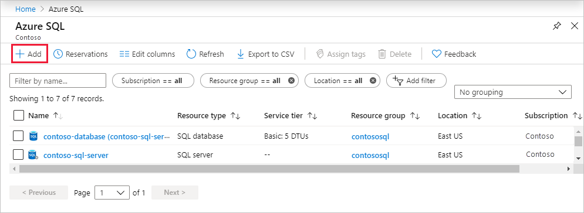

# What is SQL Server on Azure Virtual Machines (Windows)
[!INCLUDE[appliesto-sqlvm](../../includes/appliesto-sqlvm.md)]

> [!div class="op_single_selector"]
> * [Windows](sql-server-on-azure-vm-iaas-what-is-overview.md)
> * [Linux](../linux/sql-server-on-linux-vm-what-is-iaas-overview.md)

[SQL Server on Azure Virtual Machines](https://azure.microsoft.com/services/virtual-machines/sql-server/) enables you to use full versions of SQL Server in the cloud without having to manage any on-premises hardware. SQL Server virtual machines (VMs) also simplify licensing costs when you pay as you go.

Azure virtual machines run in many different [geographic regions](https://azure.microsoft.com/regions/) around the world. They also offer a variety of [machine sizes](../../../virtual-machines/windows/sizes.md). The virtual machine image gallery allows you to create a SQL Server VM with the right version, edition, and operating system. This makes virtual machines a good option for many different SQL Server workloads.

## Automated updates

SQL Server on Azure Virtual Machines can use [Automated Patching](automated-patching.md) to schedule a maintenance window for installing important windows and SQL Server updates automatically.

## Automated backups

SQL Server on Azure Virtual Machines can take advantage of [Automated Backup](automated-backup.md), which regularly creates backups of your database to blob storage. You can also manually use this technique. For more information, see [Use Azure Storage for SQL Server Backup and Restore](azure-storage-sql-server-backup-restore-use.md).

Azure also offers an enterprise-class backup solution for SQL Server running in Azure VMs. A fully-managed backup solution, it supports Always On availability groups, long-term retention, point-in-time recovery, and central management and monitoring. For more information, see [Azure Backup for SQL Server in Azure VMs](https://docs.microsoft.com/azure/backup/backup-azure-sql-database).
  

## High availability

If you require high availability, consider configuring SQL Server Availability Groups. This involves multiple instances of SQL Server on Azure Virtual Machines in a virtual network. You can configure your high-availability solution manually, or you can use templates in the Azure portal for automatic configuration. For an overview of all high-availability options, see [High Availability and Disaster Recovery for SQL Server in Azure Virtual Machines](business-continuity-high-availability-disaster-recovery-hadr-overview.md).

## Performance

Azure virtual machines offer different machine sizes to meet various workload demands. SQL Server VMs also provide automated storage configuration, which is optimized for your performance requirements. For more information about configuring storage for SQL Server VMs, see [Storage configuration for SQL Server VMs](storage-configuration.md). To fine-tune performance, see the [Performance best practices for SQL Server on Azure Virtual Machines](performance-guidelines-best-practices.md).

## Get started with SQL Server VMs

To get started, choose a SQL Server virtual machine image with your required version, edition, and operating system. The following sections provide direct links to the Azure portal for the SQL Server virtual machine gallery images.

> [!TIP]
> For more information about how to understand pricing for SQL Server images, see [Pricing guidance for SQL Server on Azure Virtual Machines](pricing-guidance.md). 

### <a id="payasyougo"></a> Pay as you go
The following table provides a matrix of pay-as-you-go SQL Server images.

| Version | Operating system | Edition |
| --- | --- | --- |
| **SQL Server 2019** | Windows Server 2019 | [Enterprise](https://ms.portal.azure.com/#create/microsoftsqlserver.sql2019-ws2019enterprise), [Standard](https://ms.portal.azure.com/#create/microsoftsqlserver.sql2019-ws2019standard), [Web](https://ms.portal.azure.com/#create/microsoftsqlserver.sql2019-ws2019web), [Developer](https://ms.portal.azure.com/#create/microsoftsqlserver.sql2019-ws2019sqldev) | 
| **SQL Server 2017** |Windows Server 2016 |[Enterprise](https://portal.azure.com/#create/Microsoft.SQLServer2017EnterpriseWindowsServer2016), [Standard](https://portal.azure.com/#create/Microsoft.SQLServer2017StandardonWindowsServer2016), [Web](https://portal.azure.com/#create/Microsoft.SQLServer2017WebonWindowsServer2016), [Express](https://portal.azure.com/#create/Microsoft.FreeSQLServerLicenseSQLServer2017ExpressonWindowsServer2016), [Developer](https://portal.azure.com/#create/Microsoft.FreeSQLServerLicenseSQLServer2017DeveloperonWindowsServer2016) |
| **SQL Server 2016 SP2** |Windows Server 2016 |[Enterprise](https://portal.azure.com/#create/Microsoft.SQLServer2016SP2EnterpriseWindowsServer2016), [Standard](https://portal.azure.com/#create/Microsoft.SQLServer2016SP2StandardWindowsServer2016), [Web](https://portal.azure.com/#create/Microsoft.SQLServer2016SP2WebWindowsServer2016), [Express](https://portal.azure.com/#create/Microsoft.FreeLicenseSQLServer2016SP2ExpressWindowsServer2016), [Developer](https://portal.azure.com/#create/Microsoft.FreeLicenseSQLServer2016SP2DeveloperWindowsServer2016) |
| **SQL Server 2014 SP2** |Windows Server 2012 R2 |[Enterprise](https://portal.azure.com/#create/Microsoft.SQLServer2014SP2EnterpriseWindowsServer2012R2), [Standard](https://portal.azure.com/#create/Microsoft.SQLServer2014SP2StandardWindowsServer2012R2), [Web](https://portal.azure.com/#create/Microsoft.SQLServer2014SP2WebWindowsServer2012R2), [Express](https://portal.azure.com/#create/Microsoft.SQLServer2014SP2ExpressWindowsServer2012R2) |
| **SQL Server 2012 SP4** |Windows Server 2012 R2 |[Enterprise](https://portal.azure.com/#create/Microsoft.SQLServer2012SP4EnterpriseWindowsServer2012R2), [Standard](https://portal.azure.com/#create/Microsoft.SQLServer2012SP4StandardWindowsServer2012R2), [Web](https://portal.azure.com/#create/Microsoft.SQLServer2012SP4WebWindowsServer2012R2), [Express](https://portal.azure.com/#create/Microsoft.SQLServer2012SP4ExpressWindowsServer2012R2) |
| **SQL Server 2008 R2 SP3** |Windows Server 2008 R2|[Enterprise](https://portal.azure.com/#create/Microsoft.SQLServer2008R2SP3EnterpriseWindowsServer2008R2), [Standard](https://portal.azure.com/#create/Microsoft.SQLServer2008R2SP3StandardWindowsServer2008R2), [Web](https://portal.azure.com/#create/Microsoft.SQLServer2008R2SP3WebWindowsServer2008R2), [Express](https://portal.azure.com/#create/Microsoft.SQLServer2008R2SP3ExpressWindowsServer2008R2) |

To see the available SQL Server on Linux virtual machine images, see [Overview of SQL Server on Azure Virtual Machines (Linux)](../linux/sql-server-on-linux-vm-what-is-iaas-overview.md).

> [!NOTE]
> It is now possible to change the licensing model of a pay-per-usage SQL Server VM to use your own license. For more information, see [How to change the licensing model for a SQL Server VM](licensing-model-azure-hybrid-benefit-ahb-change.md). 

### <a id="BYOL"></a> Bring your own license
You can also bring your own license (BYOL). In this scenario, you only pay for the VM without any additional charges for SQL Server licensing.  Bringing your own license can save you money over time for continuous production workloads. For requirements to use this option, see [Pricing guidance for SQL Server Azure VMs](pricing-guidance.md#byol).

To bring your own license, you can either convert an existing pay-per-usage SQL Server VM, or you can deploy an image with the prefixed **{BYOL}**. For more information about switching your licensing model between pay-per-usage and BYOL, see [How to change the licensing model for a SQL Server VM](licensing-model-azure-hybrid-benefit-ahb-change.md). 

| Version | Operating system | Edition |
| --- | --- | --- |
| **SQL Server 2019** | Windows Server 2019 | [Enterprise BYOL](https://ms.portal.azure.com/#create/microsoftsqlserver.sql2019-ws2019-byolenterprise), [Standard  BYOL](https://ms.portal.azure.com/#create/microsoftsqlserver.sql2019-ws2019-byolstandard)| 
| **SQL Server 2017** |Windows Server 2016 |[Enterprise BYOL](https://portal.azure.com/#create/Microsoft.BYOLSQLServer2017EnterpriseWindowsServer2016), [Standard BYOL](https://portal.azure.com/#create/Microsoft.BYOLSQLServer2017StandardonWindowsServer2016) |
| **SQL Server 2016 SP2** |Windows Server 2016 |[Enterprise BYOL](https://portal.azure.com/#create/Microsoft.BYOLSQLServer2016SP2EnterpriseWindowsServer2016), [Standard BYOL](https://portal.azure.com/#create/Microsoft.BYOLSQLServer2016SP2StandardWindowsServer2016) |
| **SQL Server 2014 SP2** |Windows Server 2012 R2 |[Enterprise BYOL](https://portal.azure.com/#create/Microsoft.BYOLSQLServer2014SP2EnterpriseWindowsServer2012R2), [Standard BYOL](https://portal.azure.com/#create/Microsoft.BYOLSQLServer2014SP2StandardWindowsServer2012R2) |
| **SQL Server 2012 SP4** |Windows Server 2012 R2 |[Enterprise BYOL](https://portal.azure.com/#create/Microsoft.BYOLSQLServer2012SP4EnterpriseWindowsServer2012R2), [Standard  BYOL](https://portal.azure.com/#create/Microsoft.BYOLSQLServer2012SP4StandardWindowsServer2012R2) |

It is possible to deploy an older image of SQL Server that is not available in the Azure portal using PowerShell. To view all available images using PowerShell, use the following command:

  ```powershell
  Get-AzVMImageOffer -Location $Location -Publisher 'MicrosoftSQLServer'
  ```

For more information about deploying SQL Server VMs using PowerShell, view [How to provision SQL Server virtual machines with Azure PowerShell](create-sql-vm-powershell.md).


### Connect to the VM
After creating your SQL Server VM, connect to it from applications or tools, such as SQL Server Management Studio (SSMS). For instructions, see [Connect to a SQL Server virtual machine on Azure](ways-to-connect-to-sql.md).

### Migrate your data
If you have an existing database, you'll want to move that to the newly provisioned SQL Server VM. For a list of migration options and guidance, see [Migrating a Database to SQL Server on an Azure VM](migrate-to-vm-from-sql-server.md).

## Create and manage Azure SQL resources with the Azure portal

The Azure portal provides a single page where you can manage [all of your Azure SQL resources](https://portal.azure.com/#blade/HubsExtension/BrowseResource/resourceType/Microsoft.Sql%2Fazuresql) including your SQL virtual machines.

To access the **Azure SQL resources** page, select **Azure SQL** in the Azure portal menu, or search for and select **Azure SQL** from any page.


> [!NOTE]
> Azure SQL provides a quick and easy way to access all of your Azure SQL databases, elastic pools, logical servers, managed instances, and virtual machines. Azure SQL is not a service or resource. 

To manage existing resources, select the desired item in the list. To create new Azure SQL resources, select **+ Add**. 



After selecting **+ Add**, view additional information about the different options by selecting **Show details** on any tile.


For details, see:

- [Create a single database](../../database/single-database-create-quickstart.md)
- [Create an elastic pool](../../database/elastic-pool-overview.md#creating-a-new-sql-database-elastic-pool-using-the-azure-portal)
- [Create a managed instance](../../managed-instance/instance-create-quickstart.md)
- [Create a SQL Server virtual machine](sql-vm-create-portal-quickstart.md)

## <a id="lifecycle"></a> SQL Server VM image refresh policy
Azure only maintains one virtual machine image for each supported operating system, version, and edition combination. This means that over time images are refreshed, and older images are removed. For more information, see the **Images** section of the [SQL Server VMs FAQ](frequently-asked-questions-faq.md#images).

## Customer experience improvement program (CEIP)
The Customer Experience Improvement Program (CEIP) is enabled by default. This periodically sends reports to Microsoft to help improve SQL Server. There is no management task required with CEIP unless you want to disable it after provisioning. You can customize or disable the CEIP by connecting to the VM with remote desktop. Then run the **SQL Server Error and Usage Reporting** utility. Follow the instructions to disable reporting. For more information about data collection, see the [SQL Server Privacy Statement](https://docs.microsoft.com/sql/getting-started/microsoft-sql-server-privacy-statement).

## Related products and services
### Windows virtual machines
* [Azure Virtual Machines overview](../../../virtual-machines/windows/overview.md)

### Storage
* [Introduction to Microsoft Azure Storage](../../../storage/common/storage-introduction.md)

### Networking
* [Virtual Network overview](../../../virtual-network/virtual-networks-overview.md)
* [IP addresses in Azure](../../../virtual-network/public-ip-addresses.md)
* [Create a Fully Qualified Domain Name in the Azure portal](../../../virtual-machines/linux/portal-create-fqdn.md)

### SQL
* [SQL Server documentation](https://docs.microsoft.com/sql/index)
* [Azure SQL Database comparison](../../azure-sql-iaas-vs-paas-what-is-overview.md)

## Next steps

Get started with SQL Server on Azure Virtual Machines:

* [Create a SQL Server VM in the Azure portal](sql-vm-create-portal-quickstart.md)

Get answers to commonly asked questions about SQL Server VMs:

* [SQL Server on Azure Virtual Machines FAQ](frequently-asked-questions-faq.md)

View Reference Architectures for running N-tier applications on SQL Server in IaaS

* [Windows N-tier application on Azure with SQL Server](https://docs.microsoft.com/azure/architecture/reference-architectures/n-tier/n-tier-sql-server)
* [Run an N-tier application in multiple Azure regions for high availability](https://docs.microsoft.com/azure/architecture/reference-architectures/n-tier/multi-region-sql-server)
