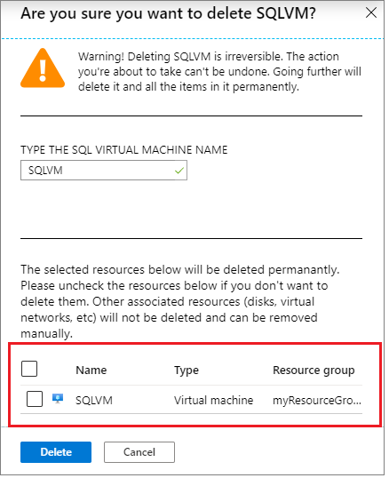

# Register a SQL Server VM in Azure with the SQL VM resource provider
[!INCLUDE[appliesto-sqlvm](../../includes/appliesto-sqlvm.md)]

This article describes how to register your SQL Server virtual machine (VM) in Azure with the SQL VM resource provider. Registering with the resource provider creates the **SQL virtual machine** _resource_ within your subscription, which is a separate resource from the virtual machine resource. Unregistering your SQL Server VM from the resource provider will remove the **SQL virtual machine** _resource_ but will not drop the actual virtual machine. 

Deploying a SQL Server VM Azure Marketplace image through the Azure portal automatically registers the SQL Server VM with the resource provider. However, if you choose to self-install SQL Server on an Azure virtual machine, or provision an Azure virtual machine from a custom VHD, you should register your SQL Server VM with the resource provider for:

- **Feature benefits**: Registering your SQL Server VM with the resource provider unlocks [automated patching](automated-patching.md), [automated backup](automated-backup.md), as well as monitoring and manageability capabilities. It also unlocks [licensing](licensing-model-azure-hybrid-benefit-ahb-change.md) and [edition](change-sql-server-edition.md) flexibility. Previously, these features were only available to SQL Server VM images deployed from Azure Marketplace. 

- **Compliance**: Registering with the SQL VM resource provider offers a simplified method of fulfilling the requirement to notify Microsoft that the Azure Hybrid Benefit has been enabled as is specified in the product terms. This process negates needing to manage licensing registration forms for each resource.  

- **Free management**: Registering with the SQL VM resource provider in all three manageability modes is completely free. There is no additional cost associated with the resource provider, or with changing management modes. 

- **Simplified license management**: Registering with the SQL VM resource provider simplifies SQL Server license management, and allows you to quickly identify SQL Server VMs with the Azure Hybrid Benefit enabled using the [Azure portal](manage-sql-vm-portal.md), the Azure CLI, or PowerShell: 

   # [Azure CLI](#tab/azure-cli)

   ```azurecli-interactive
   $vms = az sql vm list | ConvertFrom-Json
   $vms | Where-Object {$_.sqlServerLicenseType -eq "AHUB"}
   ```

   # [PowerShell](#tab/azure-powershell)

   ```powershell-interactive
   Get-AzSqlVM | Where-Object {$_.LicenseType -eq 'AHUB'}
   ```

   ---

To utilize the SQL VM resource provider, you must first [register your subscription with the resource provider](#register-a-subscription-with-the-resource-provider), which gives the resource provider the ability to create resources within that specific subscription.

## Prerequisites

To register your SQL Server VM with the resource provider, you'll need: 

- An [Azure subscription](https://azure.microsoft.com/free/).
- An Azure Resource Model [SQL Server VM](create-sql-vm-portal.md) deployed to the public  or Azure Government cloud. 
- The latest version of [Azure CLI](/cli/azure/install-azure-cli) or [PowerShell](/powershell/azure/new-azureps-module-az). 

## Management modes

If the [SQL IaaS extension](sql-server-iaas-agent-extension-automate-management.md) has not already been installed, registering with the SQL VM resource provider automatically installs the SQL Server IaaS extension in one of three management modes, specified during the registration process. Not specifying the management mode will install the SQL IaaS extension in full management mode.  

If the SQL IaaS extension has already been installed manually, then it is already in full management mode, and registering with the resource provider in full mode will not restart the SQL Server service.

The three management modes are:

- **Lightweight** mode does not require the restart of SQL Server, but supports only changing the license type and edition of SQL Server. Use this option for SQL Server VMs with multiple instances, or participating in a failover cluster instance (FCI). There is no impact to memory or CPU when using the lightweight mode, and there is no associated cost. It is recommended to register your SQL Server VM in lightweight mode first, and then upgrade to Full mode during a scheduled maintenance window.  

- **Full** mode delivers all functionality, but requires a restart of the SQL Server and system administrator permissions. This is the option that's installed by default when installing the SQL IaaS extension manually. Use it for managing a SQL Server VM with a single instance. Full mode installs two windows services that have a minimal impact to memory and CPU - these can be monitored through task manager. There is no cost associated with using the full manageability mode. 

- **NoAgent** mode is dedicated to SQL Server 2008 and SQL Server 2008 R2 installed on Windows Server 2008. There is no impact to memory or CPU when using the NoAgent mode. There is no cost associated with using the NoAgent manageability mode. 

You can view the current mode of your SQL Server IaaS agent by using PowerShell: 

  ```powershell-interactive
  # Get the SqlVirtualMachine
  $sqlvm = Get-AzSqlVM -Name $vm.Name  -ResourceGroupName $vm.ResourceGroupName
  $sqlvm.SqlManagementType
  ```

## Register a subscription with the resource provider

To register your SQL Server VM with the SQL VM resource provider, you must first register your subscription with the resource provider. This gives the SQL VM resource provider the ability to create resources within your subscription.  You can do so by using the Azure portal, the Azure CLI, or PowerShell.

### Azure portal

1. Open the Azure portal and go to **All Services**. 
1. Go to **Subscriptions** and select the subscription of interest.  
1. On the **Subscriptions** page, go to **Resource providers**. 
1. Enter **sql** in the filter to bring up the SQL-related resource providers. 
1. Select **Register**, **Re-register**, or **Unregister** for the  **Microsoft.SqlVirtualMachine** provider, depending on your desired action. 

   


### Command line

Register your SQL VM resource provider to your Azure subscription using either Azure CLI or PowerShell. 

# [Azure CLI](#tab/bash)

```azurecli-interactive
# Register the SQL VM resource provider to your subscription 
az provider register --namespace Microsoft.SqlVirtualMachine 
```

# [PowerShell](#tab/powershell)

```powershell-interactive
# Register the SQL VM resource provider to your subscription
Register-AzResourceProvider -ProviderNamespace Microsoft.SqlVirtualMachine
```

---

## Register with the resource provider 

### Lightweight management mode

If the [SQL Server IaaS Agent Extension](sql-server-iaas-agent-extension-automate-management.md) has not been installed on the virtual machine, then the recommendation is to register with the SQL VM resource provider in lightweight mode. This will install the SQL IaaS extension in [lightweight mode](#management-modes) and prevent the SQL Server service from restarting. You can then upgrade to full mode at any time, but doing so will restart the SQL Server service so it is recommended to wait until a scheduled maintenance window. 

Provide SQL Server license type as either pay-as-you-go (`PAYG`) to pay per usage, Azure Hybrid Benefit (`AHUB`) to use your own license, or disaster recovery (`DR`) to activate the [free DR replica license](business-continuity-high-availability-disaster-recovery-hadr-overview.md#free-dr-replica-in-azure).

Failover cluster instances and multi-instance deployments can only be registered with the SQL VM resource provider in lightweight mode. 

# [Azure CLI](#tab/bash)

Register a SQL Server VM in lightweight mode with the Azure CLI: 

  ```azurecli-interactive
  # Register Enterprise or Standard self-installed VM in Lightweight mode
  az sql vm create --name <vm_name> --resource-group <resource_group_name> --location <vm_location> --license-type PAYG 
  ```


# [PowerShell](#tab/powershell)

Register a SQL Server VM in lightweight mode with PowerShell:  


  ```powershell-interactive
  # Get the existing compute VM
  $vm = Get-AzVM -Name <vm_name> -ResourceGroupName <resource_group_name>
          
  # Register SQL VM with 'Lightweight' SQL IaaS agent
  New-AzSqlVM -Name $vm.Name -ResourceGroupName $vm.ResourceGroupName -Location $vm.Location `
    -LicenseType PAYG -SqlManagementType LightWeight  
  ```

---

### Full management mode


If the SQL IaaS Extension has already been installed to the virtual machine manually, then you can register the SQL Server VM in full mode without restarting the SQL Server service. **However, if the SQL IaaS extension has not been installed, registering in full mode will install the SQL IaaS extension in full mode and restart the SQL Server service. Please proceed with caution.**


To register your SQL Server VM directly in full mode (and possibly restart your SQL Server service), use the following PowerShell command: 

  ```powershell-interactive
  # Get the existing  Compute VM
  $vm = Get-AzVM -Name <vm_name> -ResourceGroupName <resource_group_name>
        
  # Register with SQL VM resource provider in full mode
  New-AzSqlVM -Name $vm.Name -ResourceGroupName $vm.ResourceGroupName -SqlManagementType Full
  ```

### NoAgent management mode 

SQL Server 2008 and 2008 R2 installed on Windows Server 2008 (_not R2_) can be registered with the SQL VM resource provider in the [NoAgent mode](#management-modes). This option assures compliance and allows the SQL Server VM to be monitored in the Azure portal with limited functionality.

Specify either `AHUB`, `PAYG`, or `DR` as the **sqlLicenseType**, and `SQL2008-WS2008` or `SQL2008R2-WS2008`as the **sqlImageOffer**. 

To register your SQL Server 2008 or 2008 R2 on Windows Server 2008 instance, use the following Azure CLI or PowerShell code snippet: 


# [Azure CLI](#tab/bash)

Register your SQL Server 2008 virtual machine in NoAgent mode with the Azure CLI: 

  ```azurecli-interactive
   az sql vm create -n sqlvm -g myresourcegroup -l eastus |
   --license-type PAYG --sql-mgmt-type NoAgent 
   --image-sku Enterprise --image-offer SQL2008-WS2008
 ```
 
 
Register your SQL Server 2008 R2 virtual machine in NoAgent mode with the Azure CLI: 

  ```azurecli-interactive
   az sql vm create -n sqlvm -g myresourcegroup -l eastus |
   --license-type PAYG --sql-mgmt-type NoAgent 
   --image-sku Enterprise --image-offer SQL2008R2-WS2008
 ```

# [PowerShell](#tab/powershell)

Register your SQL Server 2008 virtual machine in NoAgent mode with PowerShell: 


  ```powershell-interactive
  # Get the existing compute VM
  $vm = Get-AzVM -Name <vm_name> -ResourceGroupName <resource_group_name>
          
  New-AzSqlVM -Name $vm.Name -ResourceGroupName $vm.ResourceGroupName -Location $vm.Location `
    -LicenseType PAYG -SqlManagementType NoAgent -Sku Standard -Offer SQL2008-WS2008
  ```
  
  Register your SQL Server 2008 R2 virtual machine in NoAgent mode with PowerShell: 


  ```powershell-interactive
  # Get the existing compute VM
  $vm = Get-AzVM -Name <vm_name> -ResourceGroupName <resource_group_name>
          
  New-AzSqlVM -Name $vm.Name -ResourceGroupName $vm.ResourceGroupName -Location $vm.Location `
    -LicenseType PAYG -SqlManagementType NoAgent -Sku Standard -Offer SQL2008R2-WS2008
  ```

---

## Upgrade to full management mode 

SQL Server VMs that have the *lightweight* IaaS extension installed can upgrade the mode to _full_ using the Azure portal, the Azure CLI, or PowerShell. SQL Server VMs in _NoAgent_ mode can upgrade to _full_ after the OS is upgraded to Windows 2008 R2 and above. It is not possible to downgrade - to do so, you will need to [unregister](#unregister-from-the-resource-provider) the SQL Server VM from the SQL VM resource provider. Doing so will remove the **SQL virtual machine** _resource_, but will not delete the actual virtual machine. 

You can view the current mode of your SQL Server IaaS agent by using PowerShell: 

  ```powershell-interactive
  # Get the SqlVirtualMachine
  $sqlvm = Get-AzSqlVM -Name $vm.Name  -ResourceGroupName $vm.ResourceGroupName
  $sqlvm.SqlManagementType
  ```

To upgrade the agent mode to full: 


### Azure portal

1. Sign in to the [Azure portal](https://portal.azure.com).
1. Go to your [SQL virtual machines](manage-sql-vm-portal.md#access-the-sql-virtual-machines-resource) resource. 
1. Select your SQL Server VM, and select **Overview**. 
1. For SQL Server VMs with the NoAgent or lightweight IaaS mode, select the **Only license type and edition updates are available with the SQL IaaS extension** message.

   

1. Select the **I agree to restart the SQL Server service on the virtual machine** check box, and then select **Confirm** to upgrade your IaaS mode to full. 

    

### Command line

# [Azure CLI](#tab/bash)

Run the following Azure CLI code snippet:

  ```azurecli-interactive
  # Update to full mode
  az sql vm update --name <vm_name> --resource-group <resource_group_name> --sql-mgmt-type full  
  ```

# [PowerShell](#tab/powershell)

Run the following PowerShell code snippet:

  ```powershell-interactive
  # Get the existing  Compute VM
  $vm = Get-AzVM -Name <vm_name> -ResourceGroupName <resource_group_name>
        
  # Register with SQL VM resource provider in full mode
  Update-AzSqlVM -Name $vm.Name -ResourceGroupName $vm.ResourceGroupName -SqlManagementType Full
  ```

---

## Verify registration status
You can verify if your SQL Server VM has already been registered with the SQL VM resource provider by using the Azure portal, the Azure CLI, or PowerShell. 

### Azure portal 

1. Sign in to the [Azure portal](https://portal.azure.com). 
1. Go to your [SQL Server VMs](manage-sql-vm-portal.md).
1. Select your SQL Server VM from the list. If your SQL Server VM is not listed here, it likely hasn't been registered with the SQL VM resource provider. 
1. View the value under **Status**. If **Status** is **Succeeded**, then the SQL Server VM has been registered with the SQL VM resource provider successfully. 

   

### Command line

Verify current SQL Server VM registration status using either Azure CLI or PowerShell. `ProvisioningState` will show `Succeeded` if registration was successful. 

# [Azure CLI](#tab/bash)


  ```azurecli-interactive
  az sql vm show -n <vm_name> -g <resource_group>
 ```

# [PowerShell](#tab/powershell)

  ```powershell-interactive
  Get-AzSqlVM -Name <vm_name> -ResourceGroupName <resource_group>
  ```

---

An error indicates that the SQL Server VM has not been registered with the resource provider. 


## Unregister from the resource provider

To unregister your SQL Server VM with the SQL VM resource provider, delete the SQL virtual machine *resource* using the Azure portal or Azure CLI. Deleting the SQL virtual machine *resource* does not delete the SQL Server VM. However, use caution and follow the steps carefully because it is possible to inadvertently delete the virtual machine when attempting to remove the *resource*. 

Unregistering the SQL virtual machine with the SQL VM resource provider is necessary to downgrade the management mode from full. 

### Azure portal

To unregister your SQL Server VM with the resource provider using the Azure portal, follow these steps:

1. Sign into the [Azure portal](https://portal.azure.com).
1. Navigate to the SQL VM resource. 
  
   

1. Select **Delete**. 

   

1. Type the name of the SQL virtual machine and **clear the check box next to the virtual machine**.

   

   >[!WARNING]
   > Failure to clear the checkbox next to the virtual machine name will *delete* the virtual machine entirely. Clear the checkbox to unregister the SQL Server VM from the resource provider but *not delete the actual virtual machine*. 

1. Select **Delete** to confirm the deletion of the SQL virtual machine *resource*, and not the SQL Server VM. 

### Command line

# [Azure CLI](#tab/azure-cli)
To unregister your SQL Server VM from the resource provider with Azure CLI, use the [az sql vm delete](/cli/azure/sql/vm?view=azure-cli-latest#az-sql-vm-delete) command. This will remove the SQL Server VM *resource* but will not delete the virtual machine. 


```azurecli-interactive
az sql vm delete 
  --name <SQL VM resource name> |
  --resource-group <Resource group name> |
  --yes 
```

# [PowerShell](#tab/azure-powershell)
To unregister your SQL Server VM from the resource provider with Azure CLI, use the [New-AzSqlVM](/powershell/module/az.sqlvirtualmachine/new-azsqlvm)command. This will remove the SQL Server VM *resource* but will not delete the virtual machine. 

```powershell-interactive
Remove-AzSqlVM -ResourceGroupName <resource_group_name> -Name <VM_name>
```

---

## Limitations

The SQL VM resource provider only supports:
- SQL Server VMs deployed through the Azure Resource Manager. SQL Server VMs deployed through the classic model are not supported. 
- SQL Server VMs deployed to the public or Azure Government cloud. Deployments to other private or government clouds are not supported. 


## Frequently asked questions 

**Should I register my SQL Server VM provisioned from a SQL Server image in Azure Marketplace?**

No. Microsoft automatically registers VMs provisioned from the SQL Server images in Azure Marketplace. Registering with the SQL VM resource provider is required only if the VM was *not* provisioned from the SQL Server images in Azure Marketplace and SQL Server was self-installed.

**Is the SQL VM resource provider available for all customers?** 

Yes. Customers should register their SQL Server VMs with the SQL VM resource provider if they did not use a SQL Server image from Azure Marketplace and instead self-installed SQL Server, or if they brought their custom VHD. VMs owned by all types of subscriptions (Direct, Enterprise Agreement, and Cloud Solution Provider) can register with the SQL VM resource provider.

**Should I register with the SQL VM resource provider if my SQL Server VM already has the SQL Server IaaS extension installed?**

If your SQL Server VM is self-installed and not provisioned from the SQL Server images in Azure Marketplace, you should register with the SQL VM resource provider even if you installed the SQL Server IaaS extension. Registering with the SQL VM resource provider creates a new resource of type Microsoft.SqlVirtualMachine. Installing the SQL Server IaaS extension does not create that resource.

**What is the default management mode when registering with the SQL VM resource provider?**

The default management mode when you register with the SQL VM resource provider is *full*. If the SQL Server management property isn't set when you register with the SQL VM resource provider, the mode will be set as full manageability, and your SQL Server service will restart. It is recommended to register with the SQL VM resource provider in lightweight mode first, and then upgrade to full during a maintenance window. 

**What are the prerequisites to register with the SQL VM resource provider?**

There are no prerequisites to registering with the SQL VM resource provider in lightweight mode or no-agent mode. The prerequisite to registering with the SQL VM resource provider in full mode is having the SQL Server IaaS extension installed on the VM, as otherwise the SQL Server service will restart. 

**Can I register with the SQL VM resource provider if I don't have the SQL Server IaaS extension installed on the VM?**

Yes, you can register with the SQL VM resource provider in lightweight management mode if you don't have the SQL Server IaaS extension installed on the VM. In lightweight mode, the SQL VM resource provider will use a console app to verify the version and edition of the SQL Server instance. 

The default SQL management mode when registering with SQL VM resource provider is _Full_. If SQL Management property is not set when registering with SQL VM resource provider, then the mode will be set as Full Manageability. It is recommended to register with the SQL VM resource provider in lightweight mode first, and then upgrade to full during a maintenance window. 

**Will registering with the SQL VM resource provider install an agent on my VM?**

No. Registering with the SQL VM resource provider will only create a new metadata resource. It won't install an agent on the VM.

The SQL Server IaaS extension is needed only for enabling full manageability. Upgrading the manageability mode from lightweight to full will install the SQL Server IaaS extension and will restart SQL Server.

**Will registering with the SQL VM resource provider restart SQL Server on my VM?**

It depends on the mode specified during registration. If lightweight or NoAgent mode is specified, then the  SQL Server service will not restart. However, specifying the management mode as full, or leaving the management mode blank will install the SQL IaaS extension in full management mode, which will cause the SQL Server service to restart. 

**What is the difference between lightweight and no-agent management modes when registering with the SQL VM resource provider?** 

No-agent management mode is available only for SQL Server 2008 and SQL Server 2008 R2 on Windows Server 2008. It's the only available management mode for these versions. For all other versions of SQL Server, the two available manageability modes are lightweight and full. 

No-agent mode requires SQL Server version and edition properties to be set by the customer. Lightweight mode queries the VM to find the version and edition of the SQL Server instance.

**Can I register with the SQL VM resource provider without specifying the SQL Server license type?**

No. The SQL Server license type is not an optional property when you're registering with the SQL VM resource provider. You have to set the SQL Server license type as pay-as-you-go or Azure Hybrid Benefit when registering with the SQL VM resource provider in all manageability modes (no-agent, lightweight, and full).

**Can I upgrade the SQL Server IaaS extension from no-agent mode to full mode?**

No. Upgrading the manageability mode to full or lightweight is not available for no-agent mode. This is a technical limitation of Windows Server 2008. You will need to upgrade the OS first to Windows Server 2008 R2 or greater, and then you will be able to upgrade to full management mode. 

**Can I upgrade the SQL Server IaaS extension from lightweight mode to full mode?**

Yes. Upgrading the manageability mode from lightweight to full is supported via PowerShell or the Azure portal. It requires restarting SQL Server service.

**Can I downgrade the SQL Server IaaS extension from full mode to no-agent or lightweight management mode?**

No. Downgrading the SQL Server IaaS extension manageability mode is not supported. The manageability mode can't be downgraded from full mode to lightweight or no-agent mode, and it can't be downgraded from lightweight mode to no-agent mode. 

To change the manageability mode from full manageability, [unregister](#unregister-from-the-resource-provider) the SQL Server VM from the SQL VM resource provider by dropping the SQL Server *resource* and re-register the SQL Server VM with the SQL VM resource provider again in a different management mode.

**Can I register with the SQL VM resource provider from the Azure portal?**

No. Registering with the SQL VM resource provider is not available in the Azure portal. Registering with the SQL VM resource provider is only supported with the Azure CLI or PowerShell. 

**Can I register a VM with the SQL VM resource provider before SQL Server is installed?**

No. A VM should have at least one SQL Server (Database Engine) instance to successfully register with the SQL VM resource provider. If there is no SQL Server instance on the VM, the new Microsoft.SqlVirtualMachine resource will be in a failed state.

**Can I register a VM with the SQL VM resource provider if there are multiple SQL Server instances?**

Yes. The SQL VM resource provider will register only one SQL Server (Database Engine) instance. The SQL VM resource provider will register the default SQL Server instance in the case of multiple instances. If there is no default instance, then only registering in lightweight mode is supported. To upgrade from lightweight to full manageability mode, either the default SQL Server instance should exist or the VM should have only one named SQL Server instance.

**Can I register a SQL Server failover cluster instance with the SQL VM resource provider?**

Yes. SQL Server failover cluster instances on an Azure VM can be registered with the SQL VM resource provider in lightweight mode. However, SQL Server failover cluster instances can't be upgraded to full manageability mode.

**Can I register my VM with the SQL VM resource provider if an Always On availability group is configured?**

Yes. There are no restrictions to registering a SQL Server instance on an Azure VM with the SQL VM resource provider if you're participating in an Always On availability group configuration.

**What is the cost for registering with the SQL VM resource provider, or with upgrading to full manageability mode?**
None. There is no fee associated with registering with the SQL VM resource provider, or with using any of the three manageability modes. Managing your SQL Server VM with the resource provider is completely free. 

**What is the performance impact of using the different manageability modes?**
There is no impact when using the *NoAgent* and *lightweight* manageability modes. There is minimal impact when using the *full* manageability mode from two services that are installed to the OS. These can be monitored via task manager and seen in the built-in Windows Services console. 

The two service names are:
- `SqlIaaSExtensionQuery` (Display name - `Microsoft SQL Server IaaS Query Service`)
- `SQLIaaSExtension` (Display name - `Microsoft SQL Server IaaS Agent`)


## Next steps

For more information, see the following articles: 

* [Overview of SQL Server on a Windows VM](sql-server-on-azure-vm-iaas-what-is-overview.md)
* [FAQ for SQL Server on a Windows VM](frequently-asked-questions-faq.md)
* [Pricing guidance for SQL Server on a Windows VM](pricing-guidance.md)
* [Release notes for SQL Server on a Windows VM](../../database/doc-changes-updates-release-notes.md)
