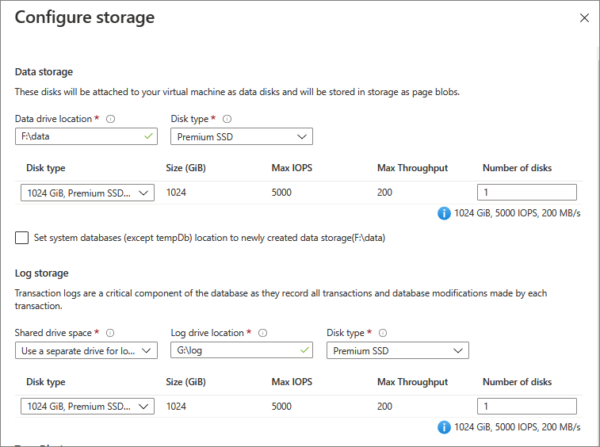
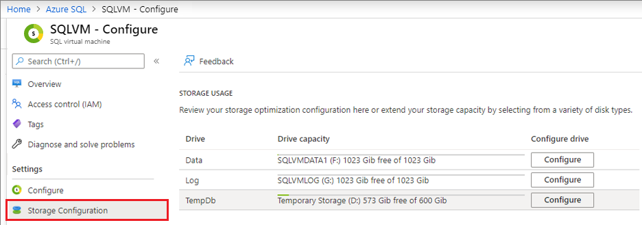
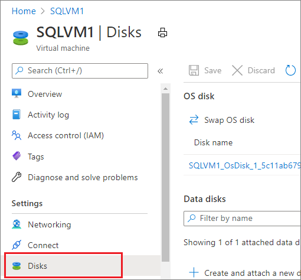
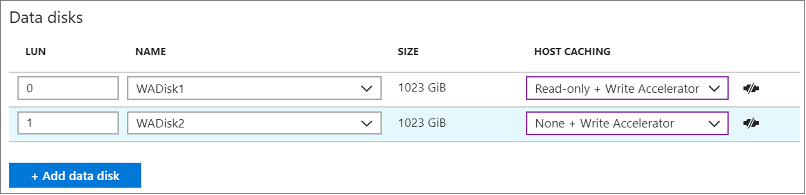

# Configure storage for SQL Server VMs
[!INCLUDE[appliesto-sqlvm](../../includes/appliesto-sqlvm.md)]

This article teaches you how to configure your storage for your SQL Server on Azure Virtual Machines (VMs).

SQL Server VMs deployed through marketplace images automatically follow default [storage best practices](performance-guidelines-best-practices-storage.md) which can be modified during deployment. Some of these configuration settings can be changed after deployment. 


## Prerequisites

To use the automated storage configuration settings, your virtual machine requires the following characteristics:

* Provisioned with a [SQL Server gallery image](sql-server-on-azure-vm-iaas-what-is-overview.md#payasyougo) or registered with the [SQL IaaS extension]().
* Uses the [Resource Manager deployment model](../../../azure-resource-manager/management/deployment-models.md).
* Uses [premium SSDs](../../../virtual-machines/disks-types.md).

## New VMs

The following sections describe how to configure storage for new SQL Server virtual machines.

### Azure portal

When provisioning an Azure VM using a SQL Server gallery image, select **Change configuration** on the **SQL Server Settings** tab to open the Performance Optimized Storage Configuration page. You can either leave the values at default, or modify the type of disk configuration that best suits your needs based on your workload. 


Select the type of workload you're deploying your SQL Server for under **Storage optimization**. With the **General** optimization option, by default you will have one data disk with 5000 max IOPS, and you will use this same drive for your data, transaction log, and TempDB storage. 

Selecting either **Transactional processing** (OLTP) or **Data warehousing** will create a separate disk for data, a separate disk for the transaction log, and use local SSD for TempDB. There are no storage differences between **Transactional processing** and **Data warehousing**, but it does change your [stripe configuration, and trace flags](#workload-optimization-settings). Choosing premium storage  sets the caching to *ReadOnly* for the data drive, and *None* for the log drive as per [SQL Server VM performance best practices](performance-guidelines-best-practices.md). 



The disk configuration is completely customizable so that you can configure the storage topology, disk type and IOPs you need for your SQL Server VM workload. You also have the ability to use UltraSSD (preview) as an option for the **Disk type** if your SQL Server VM is in one of the supported regions (East US 2, SouthEast Asia and North Europe) and you've enabled [ultra disks for your subscription](../../../virtual-machines/disks-enable-ultra-ssd.md).  

Additionally, you have the ability to set the caching for the disks. Azure VMs have a multi-tier caching technology called [Blob Cache](../../../virtual-machines/premium-storage-performance.md#disk-caching) when used with [Premium Disks](../../../virtual-machines/disks-types.md#premium-ssd). Blob Cache uses a combination of the Virtual Machine RAM and local SSD for caching. 

Disk caching for Premium SSD can be *ReadOnly*, *ReadWrite* or *None*. 

- *ReadOnly* caching is highly beneficial for SQL Server data files that are stored on Premium Storage. *ReadOnly* caching brings low read latency, high read IOPS, and throughput as, reads are performed from cache, which is within the VM memory and local SSD. These reads are much faster than reads from data disk, which is from Azure Blob storage. Premium storage does not count the reads served from cache towards the disk IOPS and throughput. Therefore, your applicable is able to achieve higher total IOPS and throughput. 
- *None* cache configuration should be used for the disks hosting SQL Server Log file as the log file is written sequentially and does not benefit from *ReadOnly* caching. 
- *ReadWrite* caching should not be used to host SQL Server files as SQL Server does not support data consistency with the *ReadWrite* cache. Writes waste capacity of the *ReadOnly* blob cache and latencies slightly increase if writes go through *ReadOnly* blob cache layers. 


   > [!TIP]
   > Be sure that your storage configuration matches the limitations imposed by the the selected VM size. Choosing storage parameters that exceed the performance cap of the VM size will result in warning: `The desired performance might not be reached due to the maximum virtual machine disk performance cap`. Either decrease the IOPs by changing the disk type, or increase the performance cap limitation by increasing the VM size. This will not stop provisioning. 


Based on your choices, Azure performs the following storage configuration tasks after creating the VM:

* Creates and attaches Premium SSDs to the virtual machine.
* Configures the data disks to be accessible to SQL Server.
* Configures the data disks into a storage pool based on the specified size and performance (IOPS and throughput) requirements.
* Associates the storage pool with a new drive on the virtual machine.
* Optimizes this new drive based on your specified workload type (Data warehousing, Transactional processing, or General).

or a full walkthrough of how to create a SQL Server VM in the Azure portal, see [the provisioning tutorial](../../../azure-sql/virtual-machines/windows/create-sql-vm-portal.md).

### Resource Manager templates

If you use the following Resource Manager templates, two premium data disks are attached by default, with no storage pool configuration. However, you can customize these templates to change the number of premium data disks that are attached to the virtual machine.

* [Create VM with Automated Backup](https://github.com/Azure/azure-quickstart-templates/tree/master/201-vm-sql-full-autobackup)
* [Create VM with Automated Patching](https://github.com/Azure/azure-quickstart-templates/tree/master/201-vm-sql-full-autopatching)
* [Create VM with AKV Integration](https://github.com/Azure/azure-quickstart-templates/tree/master/201-vm-sql-full-keyvault)

### Quickstart template

You can use the following quickstart template to deploy a SQL Server VM using storage optimization. 

* [Create VM with storage optimization](https://github.com/Azure/azure-quickstart-templates/tree/master/101-sql-vm-new-storage/)
* [Create VM using UltraSSD](https://github.com/Azure/azure-quickstart-templates/tree/master/101-sql-vm-new-storage-ultrassd)

## Existing VMs

[!INCLUDE [windows-virtual-machines-sql-use-new-management-blade](../../../../includes/windows-virtual-machines-sql-new-resource.md)]

For existing SQL Server VMs, you can modify some storage settings in the Azure portal. Open your [SQL virtual machines resource](manage-sql-vm-portal.md#access-the-sql-virtual-machines-resource), and select **Overview**. The SQL Server Overview page shows the current storage usage of your VM. All drives that exist on your VM are displayed in this chart. For each drive, the storage space displays in four sections:

* SQL data
* SQL log
* Other (non-SQL storage)
* Available

To modify the storage settings, select **Configure** under **Settings**. 



You can modify the disk settings for the drives that were configured during the SQL Server VM creation process. Selecting **Extend drive** opens the drive modification page, allowing you to change the disk type, as well as add additional disks. 


## Automated changes

This section provides a reference for the storage configuration changes that Azure automatically performs during SQL Server VM provisioning or configuration in the Azure portal.

* Azure configures a storage pool from storage selected from your VM. The next section of this topic provides details about storage pool configuration.
* Automatic storage configuration always uses [premium SSDs](../../../virtual-machines/disks-types.md) P30 data disks. Consequently, there is a 1:1 mapping between your selected number of Terabytes and the number of data disks attached to your VM.

For pricing information, see the [Storage pricing](https://azure.microsoft.com/pricing/details/storage) page on the **Disk Storage** tab.

### Creation of the storage pool

Azure uses the following settings to create the storage pool on SQL Server VMs.

| Setting | Value |
| --- | --- |
| Stripe size |256 KB (Data warehousing); 64 KB (Transactional) |
| Disk sizes |1 TB each |
| Cache |Read |
| Allocation size |64 KB NTFS allocation unit size |
| Recovery | Simple recovery (no resiliency) |
| Number of columns |Number of data disks up to 8<sup>1</sup> |


<sup>1</sup> After the storage pool is created, you cannot alter the number of columns in the storage pool.


### Workload optimization settings

The following table describes the three workload type options available and their corresponding optimizations:

| Workload type | Description | Optimizations |
| --- | --- | --- |
| **General** |Default setting that supports most workloads |None |
| **Transactional processing** |Optimizes the storage for traditional database OLTP workloads |Trace Flag 1117<br/>Trace Flag 1118 |
| **Data warehousing** |Optimizes the storage for analytic and reporting workloads |Trace Flag 610<br/>Trace Flag 1117 |

> [!NOTE]
> You can only specify the workload type when you provision a SQL Server virtual machine by selecting it in the storage configuration step.

## Enable caching 

Change the caching policy at the disk level. You can do so using the Azure portal, [PowerShell](/powershell/module/az.compute/set-azvmdatadisk), or the [Azure CLI](/cli/azure/vm/disk). 

To change your caching policy in the Azure portal, follow these steps:

1. Stop your SQL Server service. 
1. Sign into the [Azure portal](https://portal.azure.com). 
1. Navigate to your virtual machine, select **Disks** under **Settings**. 
   
   

1. Choose the appropriate caching policy for your disk from the drop-down. 

   

1. After the change takes effect, reboot the SQL Server VM and start the SQL Server service. 


## Enable Write Accelerator

Write Acceleration is a disk feature that is only available for the M-Series Virtual Machines (VMs). The purpose of write acceleration is to improve the I/O latency of writes against Azure Premium Storage when you need single digit I/O latency due to high volume mission critical OLTP workloads or data warehouse environments. 

Stop all SQL Server activity and shut down the SQL Server service before making changes to your write acceleration policy. 

If your disks are striped, enable Write Acceleration for each disk individually, and your Azure VM should be shut down before making any changes. 

To enable Write Acceleration using the Azure portal, follow these steps:

1. Stop your SQL Server service. If your disks are striped, shut down the virtual machine. 
1. Sign into the [Azure portal](https://portal.azure.com). 
1. Navigate to your virtual machine, select **Disks** under **Settings**. 
   
   

1. Choose the cache option with **Write Accelerator** for your disk from the drop-down. 

   

1. After the change takes effect, start the virtual machine and SQL Server service. 

## Disk striping

For more throughput, you can add additional data disks and use disk striping. To determine the number of data disks, analyze the throughput and bandwidth required for your SQL Server data files, including the log and tempdb. Throughput and bandwidth limits vary by VM size. To learn more, see [VM Size](../../../virtual-machines/sizes.md)


* For Windows 8/Windows Server 2012 or later, use [Storage Spaces](https://docs.microsoft.com/previous-versions/windows/it-pro/windows-server-2012-R2-and-2012/hh831739(v=ws.11)) with the following guidelines:

  1. Set the interleave (stripe size) to 64 KB (65,536 bytes) to avoid performance impact due to partition misalignment. This must be set with PowerShell.

  2. Set column count = number of physical disks. Use PowerShell when configuring more than 8 disks (not Server Manager UI).

For example, the following PowerShell creates a new storage pool with the interleave size to 64 KB and the number of columns equal to the amount of physical disk in the storage pool:

  ```powershell
  $PhysicalDisks = Get-PhysicalDisk | Where-Object {$_.FriendlyName -like "*2" -or $_.FriendlyName -like "*3"}
  
  New-StoragePool -FriendlyName "DataFiles" -StorageSubsystemFriendlyName "Storage Spaces*" `
      -PhysicalDisks $PhysicalDisks | New- VirtualDisk -FriendlyName "DataFiles" `
      -Interleave 65536 -NumberOfColumns $PhysicalDisks .Count -ResiliencySettingName simple `
      –UseMaximumSize |Initialize-Disk -PartitionStyle GPT -PassThru |New-Partition -AssignDriveLetter `
      -UseMaximumSize |Format-Volume -FileSystem NTFS -NewFileSystemLabel "DataDisks" `
      -AllocationUnitSize 65536 -Confirm:$false 
  ```

  * For Windows 2008 R2 or earlier, you can use dynamic disks (OS striped volumes) and the stripe size is always 64 KB. This option is deprecated as of Windows 8/Windows Server 2012. For information, see the support statement at [Virtual Disk Service is transitioning to Windows Storage Management API](https://docs.microsoft.com/windows/win32/w8cookbook/vds-is-transitioning-to-wmiv2-based-windows-storage-management-api).
 
  * If you are using [Storage Spaces Direct (S2D)](https://docs.microsoft.com/windows-server/storage/storage-spaces/storage-spaces-direct-in-vm) with [SQL Server Failover Cluster Instances](https://docs.microsoft.com/azure/azure-sql/virtual-machines/windows/failover-cluster-instance-storage-spaces-direct-manually-configure), you must configure a single pool. Although different volumes can be created on that single pool, they will all share the same characteristics, such as the same caching policy.
 
  * Determine the number of disks associated with your storage pool based on your load expectations. Keep in mind that different VM sizes allow different numbers of attached data disks. For more information, see [Sizes for virtual machines](../../../virtual-machines/sizes.md?toc=/azure/virtual-machines/windows/toc.json).


## Next steps

For other topics related to running SQL Server in Azure VMs, see [SQL Server on Azure Virtual Machines](sql-server-on-azure-vm-iaas-what-is-overview.md).
