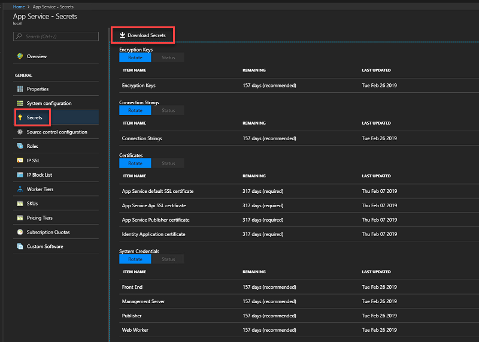
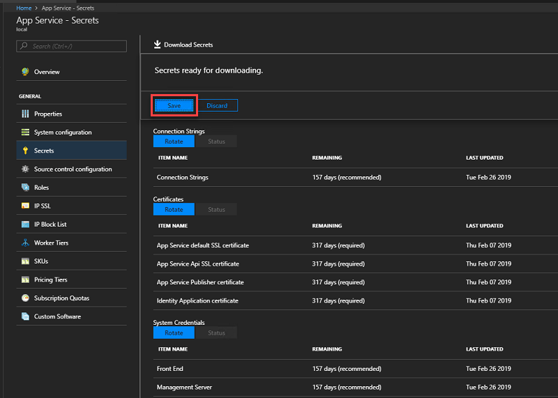

# Back up App Service on Azure Stack

*Applies to: Azure Stack integrated systems and Azure Stack Development Kit*  

This document provides instructions about how to back up App Service on Azure Stack.

> [!IMPORTANT]
> App Service on Azure Stack is not backed up as part of [Azure Stack infrastructure backup](azure-stack-backup-infrastructure-backup.md). As an Azure Stack Operator, you must take steps to ensure App Service can be successfully recovered if necessary.

Azure App Service on Azure Stack has four main components to consider when planning for disaster recovery:
1. The resource provider infrastructure; server roles, worker tiers, etc. 
2. The App Service secrets
3. The App Service SQL Server hosting and metering databases
4. The App Service user workload content stored in the App Service file share	

## Back up App Service secrets
When recovering App Service from backup, you need provide the App Service keys used by the initial deployment. This information should be saved as soon as App Service is successfully deployed and stored in a safe location. The resource provider infrastructure configuration will be recreated from backup during recovery using App Service recovery PowerShell cmdlets.

Use the administration portal to back up app service secrets by following these steps: 

1. Sign in to the Azure Stack administration portal as the service administrator.

2. Browse to **App Service** -> **Secrets**. 

3. Select **Download Secrets**.

   

4. When secrets are ready for downloading, click **Save** and store the App Service secrets (**SystemSecrets.JSON**) file in a safe location. 

   

> [!NOTE]
> Repeat these steps every time the App Service secrets are rotated.

## Back up the App Service databases
To restore App Service, you will need the **Appservice_hosting** and **Appservice_metering** database backups. We recommend using SQL Server maintenance plans or Azure Backup Server to ensure these databases are backed up and saved securely on a regular basis. However, any method of ensuring regular SQL backups are created can be used.

To manually back up these databases while logged into the SQL Server, you can use the following PowerShell commands:

  ```powershell
  $s = "<SQL Server computer name>"
  $u = "<SQL Server login>" 
  $p = read-host "Provide the SQL admin password"
  sqlcmd -S $s -U $u -P $p -Q "BACKUP DATABASE appservice_hosting TO DISK = '<path>\hosting.bak'"
  sqlcmd -S $s -U $u -P $p -Q "BACKUP DATABASE appservice_metering TO DISK = '<path>\metering.bak'"
  ```

> [!NOTE]
> If you need to back up SQL AlwaysOn databases, follow [these instructions](https://docs.microsoft.com/sql/database-engine/availability-groups/windows/configure-backup-on-availability-replicas-sql-server?view=sql-server-2017). 

After all databases have been successfully backed up, copy the .bak files to a safe location along with the App Service secrets information.

## Back up the App Service file share
App Service stores tenant app information in the file share. This must be backed up on a regular basis along with the App Service databases so that as little data as possible is lost if a restore is required. 

To back up the App Service file share content, you can use Azure Backup Server or another method to regularly copy the file share content to the location you've saved all previous recovery information. 

For example, you can use these steps to use robocopy from a Windows PowerShell (not PowerShell ISE) console session:

```powershell
$source = "<file share location>"
$destination = "<remote backup storage share location>"
net use $destination /user:<account to use to connect to the remote share in the format of domain\username> *
robocopy $source $destination
net use $destination /delete
```

## Next steps
[Restore App Service on Azure Stack](app-service-recover.md)