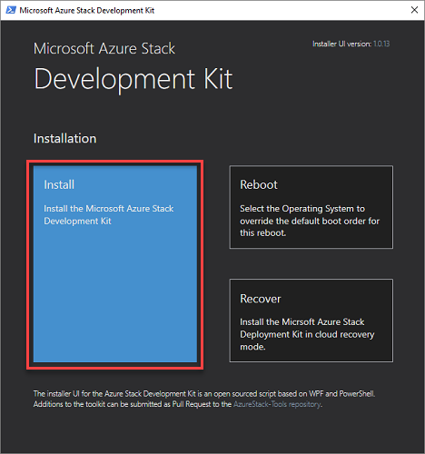
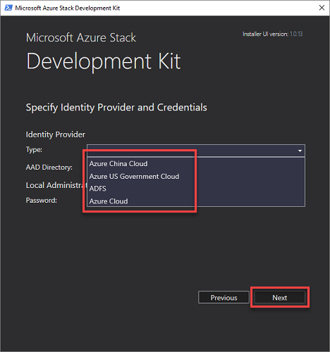
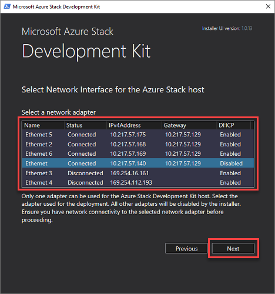
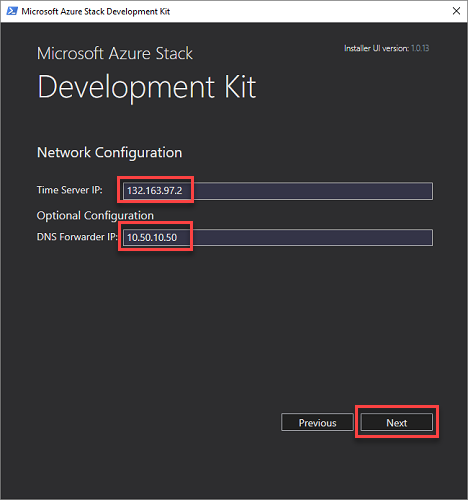
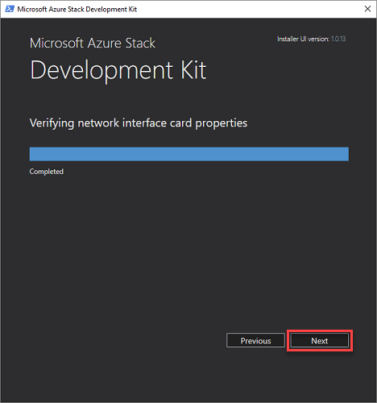
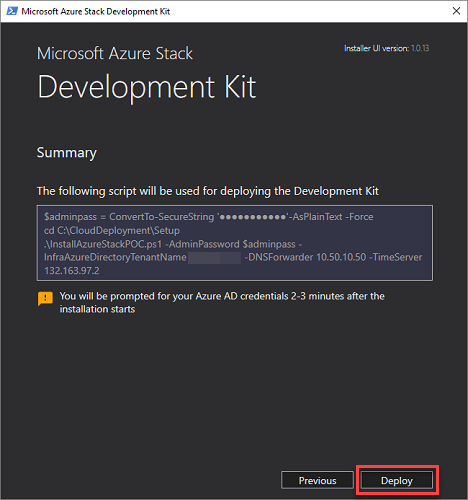
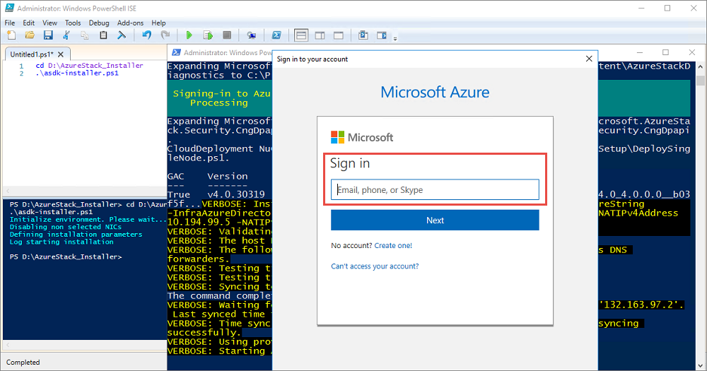

# Install the Azure Stack Development Kit (ASDK)
After [preparing the ASDK host computer](asdk-prepare-host.md), the ASDK can be deployed into the CloudBuilder.vhdx image using the following steps in this article.

## Install the ASDK
The steps in this article show you how to deploy the ASDK using a graphical user interface (GUI) provided by downloading and running the **asdk-installer.ps1** PowerShell script.

> [!NOTE]
> The installer user interface for the Azure Stack Development Kit is an open-sourced script based on WCF and PowerShell.


1. After the host computer successfully boots into the CloudBuilder.vhdx image, log in using the administrator credentials specified when you [prepared the development kit host computer](asdk-prepare-host.md) for ASDK installation. This should be the same as the development kit host local administrator credentials.
2. Open an elevated PowerShell console and run the **&lt;drive letter>\AzureStack_Installer\asdk-installer.ps1** script (which might now be on a different drive than C:\ in the CloudBuilder.vhdx image). Click **Install**.

     

3. In the Identity Provider **Type** drop-down box, select **Azure Cloud** or **AD FS**. Under **Local Administrator Password** type the local administrator password (which must match the current configured local administrator password) in the **Password** box, and then click **Next**.
    - **Azure Cloud**: Configures Azure Active Directory (Azure AD) as the identity provider. To use this option, you need an internet connection, the full name of an Azure AD directory tenant in the form of *domainname*.onmicrosoft.com or an Azure AD verified custom domain name, and global admin credentials for the specified directory. After deployment, Azure Active Directory global administrator permission is not required. However, some operations may require the global administrator credential. For example, a resource provider installer script or a new feature requiring a permission to be granted. You can either temporarily re-instate the account’s global administrator permissions or use a separate global administrator account that is an owner of the *default provider subscription*.
    - **AD FS**: The default stamp directory service is used as the identity provider. The default account to sign in with is azurestackadmin@azurestack.local, and the password to use is the one you provided as part of setup.

     
    
    > [!NOTE]
    > For best results, even if you want to use a disconnected Azure Stack environment using AD FS as the identity provider, it is best to install the ASDK while connected to the internet. That way, the Windows Server 2016 evaluation version included with the development kit installation can be activated at deployment time.
4. Select a network adapter to use for the development kit and then click **Next**.

    

5. Select DHCP or static network configuration for the BGPNAT01 virtual machine.
    > [!TIP]
    > The BGPNAT01 VM is the edge router that provides NAT and VPN capabilities for Azure Stack.

    - **DHCP** (default): The virtual machine gets the IP network configuration from the DHCP server.
    - **Static**: Only use this option if DHCP can’t assign a valid IP address for Azure Stack to access the Internet. **A static IP address must be specified with the subnetmask length in CIDR format (for example, 10.0.0.5/24)**.
    - Type in a valid **Time server IP** address. This required field sets the time server to be used by the development kit. This parameter must be provided as a valid time server IP address. Server names are not supported.

      > [!TIP]
      > To find a time server IP address, visit [pool.ntp.org](http://pool.ntp.org) or ping time.windows.com. 

    - **Optionally**, you set the following values:
        - **VLAN ID**: Sets the VLAN ID. Only use this option if the host and AzS-BGPNAT01 must configure VLAN ID to access the physical network (and internet). 
        - **DNS forwarder**: A DNS server is created as part of the Azure Stack deployment. To allow computers inside the solution to resolve names outside of the stamp, provide your existing infrastructure DNS server. The in-stamp DNS server forwards unknown name resolution requests to this server.

    

6. On the **Verifying network interface card properties** page, you'll see a progress bar. When verification is complete, click **Next**.

    

9. On **Summary** page, click **Deploy** to start ASDK installation on the development kit host computer.

    

    > [!TIP]
    > Here you can also copy the PowerShell setup commands that will be used to install the development kit. This is helpful if you ever need to [redeploy the ASDK on the host computer using PowerShell](asdk-deploy-powershell.md).

10. If you're performing an Azure AD deployment, you'll be prompted to enter your Azure AD global administrator account credentials a few minutes after setup starts.

    

11. The deployment process will take a few hours, during which time the host computer will automatically reboot once. If you want to monitor the deployment progress, sign in as azurestack\AzureStackAdmin after the development kit host restarts. When the deployment succeeds, the PowerShell console displays: **COMPLETE: Action 'Deployment'**. 
    > [!IMPORTANT]
    > If you sign in as a local admin after the machine is joined to the domain, you won't see the deployment progress. Do not rerun deployment, instead sign in as azurestack\AzureStackAdmin to validate that it's running.

    

Congratulations, you've successfully installed the ASDK!

If the deployment fails for some reason, you can [redeploy](asdk-redeploy.md) from scratch or use the following PowerShell commands, from the same elevated PowerShell window, to restart the deployment from the last successful step:

  ```powershell
  cd C:\CloudDeployment\Setup
  .\InstallAzureStackPOC.ps1 -Rerun
  ```

## Next steps
[Post deployment configuration](asdk-post-deploy.md)
