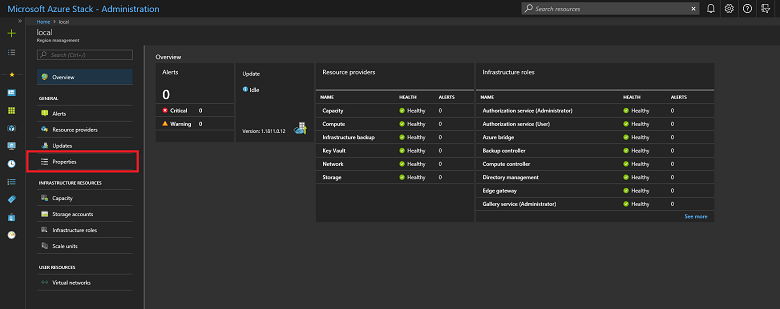

# Azure Stack registration
You can register your Azure Stack Development Kit (ASDK) installation with Azure to download marketplace items from Azure and to set up commerce data reporting back to Microsoft. Registration is required to support full Azure Stack functionality, including marketplace syndication. Registration is recommended because it enables you to test important Azure Stack functionality like marketplace syndication and usage reporting. After you register Azure Stack, usage is reported to Azure commerce. You can see it under the subscription you used for registration. However, ASDK users aren't charged for any usage they report.

If you do not register your ASDK, you might see an **Activation Required** warning alert that advises you to register your Azure Stack Development Kit. This behavior is expected.

## Prerequisites
Before using these instructions to register the ASDK with Azure, ensure that you have installed the Azure Stack PowerShell and downloaded the Azure Stack tools as described in the [post-deployment configuration](asdk-post-deploy.md) article.

In addition, the PowerShell language mode must be set to **FullLanguageMode** on the computer used to register the ASDK with Azure. To verify that the current language mode is set to full, open an elevated PowerShell window and run the following PowerShell commands:

```PowerShell  
$ExecutionContext.SessionState.LanguageMode
```

Ensure the output returns **FullLanguageMode**. If any other language mode is returned, registration will need to be run on another computer or the language mode will need to be set to **FullLanguageMode** before continuing.

## Register Azure Stack with Azure
Follow these steps to register the ASDK with Azure.

> [!NOTE]
> All these steps must be run from a computer that has access to the privileged endpoint. For the ASDK, that's the development kit host computer.

1. Open a PowerShell console as an administrator.  

2. Run the following PowerShell commands to register your ASDK installation with Azure. You will need to sign in to both your Azure subscription and the local ASDK installation. If you don’t have an Azure subscription yet, you can [create a free Azure account here](https://azure.microsoft.com/free/?b=17.06). Registering Azure Stack incurs no cost on your Azure subscription.<br><br>If you are running the registration script on more than one instance of Azure Stack using the same Azure Subscription ID, set a unique name for the registration when you run the **Set-AzsRegistration** cmdlet. The **RegistrationName** parameter has a default value of **AzureStackRegistration**. However, if you use the same name on more than one instance of Azure Stack, the script will fail.

    ```PowerShell  
    # Add the Azure cloud subscription environment name. 
    # Supported environment names are AzureCloud, AzureChinaCloud or AzureUSGovernment depending which Azure subscription you are using.
    Add-AzureRmAccount -EnvironmentName "<environment name>"

    # Register the Azure Stack resource provider in your Azure subscription
    Register-AzureRmResourceProvider -ProviderNamespace Microsoft.AzureStack

    # Import the registration module that was downloaded with the GitHub tools
    Import-Module C:\AzureStack-Tools-master\Registration\RegisterWithAzure.psm1

    # Register Azure Stack
    $AzureContext = Get-AzureRmContext
    $CloudAdminCred = Get-Credential -UserName AZURESTACK\CloudAdmin -Message "Enter the credentials to access the privileged endpoint."
    $RegistrationName = "<unique-registration-name>"
    Set-AzsRegistration `
    -PrivilegedEndpointCredential $CloudAdminCred `
    -PrivilegedEndpoint AzS-ERCS01 `
    -BillingModel Development `
    -RegistrationName $RegistrationName `
    -UsageReportingEnabled:$true
    ```
3. When the script completes, you should see this message: **Your environment is now registered and activated using the provided parameters.**

    


## Register in disconnected environments
If you are registering Azure Stack in a disconnected environment (with no internet connectivity), you need to get a registration token from the Azure Stack environment and then use that token on a computer that can connect to Azure to register and create an activation resource for your ASDK environment.
 
 > [!IMPORTANT]
 > Before using these instructions to register Azure Stack, ensure that you have installed PowerShell for Azure Stack and downloaded the Azure Stack tools as described in the [post-deployment configuration](asdk-post-deploy.md) article on both the ASDK host computer and the computer with internet access used to connect to Azure and register.

### Get a registration token from the Azure Stack environment
On the ASDK host computer, start PowerShell as an administrator and navigate to the **Registration** folder in the **AzureStack-Tools-master** directory created when you downloaded the Azure Stack tools. Use the following PowerShell commands to import the **RegisterWithAzure.psm1** module and then use the **Get-AzsRegistrationToken** cmdlet to get the registration token:  

   ```PowerShell  
   # Import the registration module that was downloaded with the GitHub tools
   Import-Module C:\AzureStack-Tools-master\Registration\RegisterWithAzure.psm1

   # Create registration token
   $CloudAdminCred = Get-Credential -UserName AZURESTACK\CloudAdmin -Message "Enter the credentials to access the privileged endpoint."
   # File path to save the token. This example saves the file as C:\RegistrationToken.txt.
   $FilePathForRegistrationToken = "$env:SystemDrive\RegistrationToken.txt"
   $RegistrationToken = Get-AzsRegistrationToken -PrivilegedEndpointCredential $CloudAdminCred `
   -UsageReportingEnabled:$false `
   -PrivilegedEndpoint AzS-ERCS01 `
   -BillingModel Development `
   -MarketplaceSyndicationEnabled:$false `
   -TokenOutputFilePath $FilePathForRegistrationToken
   ```

Save this registration token for use on the internet-connected computer. You can copy the file or the text from the file created by the $FilePathForRegistrationToken parameter.

### Connect to Azure and register
On the internet connected computer, use the following PowerShell commands to import the **RegisterWithAzure.psm1** module and then use the **Register-AzsEnvironment** cmdlet to register with Azure using the registration token you just created and a unique registration name:  

  ```PowerShell  
  # Add the Azure cloud subscription environment name. 
  # Supported environment names are AzureCloud, AzureChinaCloud or AzureUSGovernment depending which Azure subscription you are using.
  Add-AzureRmAccount -EnvironmentName "<environment name>"

  # If you have multiple subscriptions, run the following command to select the one you want to use:
  # Get-AzureRmSubscription -SubscriptionID "<subscription ID>" | Select-AzureRmSubscription

  # Register the Azure Stack resource provider in your Azure subscription
  Register-AzureRmResourceProvider -ProviderNamespace Microsoft.AzureStack

  # Import the registration module that was downloaded with the GitHub tools
  Import-Module C:\AzureStack-Tools-master\Registration\RegisterWithAzure.psm1

  # Register with Azure
  # This example uses the C:\RegistrationToken.txt file.
  $registrationToken = Get-Content -Path "$env:SystemDrive\RegistrationToken.txt"
  $RegistrationName = "<unique-registration-name>"
  Register-AzsEnvironment -RegistrationToken $registrationToken `
  -RegistrationName $RegistrationName
  ```

Alternatively, you can use the **Get-Content** cmdlet to point to a file that contains your registration token:

  ```PowerShell  
  # Add the Azure cloud subscription environment name. 
  # Supported environment names are AzureCloud, AzureChinaCloud or AzureUSGovernment depending which Azure subscription you are using.
  Add-AzureRmAccount -EnvironmentName "<environment name>"

  # If you have multiple subscriptions, run the following command to select the one you want to use:
  # Get-AzureRmSubscription -SubscriptionID "<subscription ID>" | Select-AzureRmSubscription

  # Register the Azure Stack resource provider in your Azure subscription
  Register-AzureRmResourceProvider -ProviderNamespace Microsoft.AzureStack

  # Import the registration module that was downloaded with the GitHub tools
  Import-Module C:\AzureStack-Tools-master\Registration\RegisterWithAzure.psm1

  # Register with Azure 
  # This example uses the C:\RegistrationToken.txt file.
  $registrationToken = Get-Content -Path "$env:SystemDrive\RegistrationToken.txt"
  Register-AzsEnvironment -RegistrationToken $registrationToken `
  -RegistrationName $RegistrationName
  ```

When registration is complete, you should see a message similar to **Your Azure Stack environment is now registered with Azure.**

> [!IMPORTANT]
> Do not close the PowerShell window. 

Save the registration token and registration resource name for future reference.

### Retrieve an activation key from the Azure registration resource

Still using the internet-connected computer, **and the same PowerShell console window**, retrieve an activation key from the registration resource created when you registered with Azure.

To get the activation key, run the following PowerShell commands, use the same unique registration name value you provided when registering with Azure in the previous step:  

  ```Powershell
  $RegistrationResourceName = "<unique-registration-name>"
  # File path to save the activation key. This example saves the file as C:\ActivationKey.txt.
  $KeyOutputFilePath = "$env:SystemDrive\ActivationKey.txt"
  $ActivationKey = Get-AzsActivationKey -RegistrationName $RegistrationResourceName `
  -KeyOutputFilePath $KeyOutputFilePath
  ```
### Create an Activation Resource in Azure Stack

Return to the Azure Stack environment with the file or text from the activation key created from **Get-AzsActivationKey**. Run the following PowerShell commands to create an activation resource in Azure Stack using that activation key:   

  ```Powershell
  # Import the registration module that was downloaded with the GitHub tools
  Import-Module C:\AzureStack-Tools-master\Registration\RegisterWithAzure.psm1
  
  $CloudAdminCred = Get-Credential -UserName AZURESTACK\CloudAdmin -Message "Enter the credentials to access the privileged endpoint."
  $ActivationKey = "<activation key>"
  New-AzsActivationResource -PrivilegedEndpointCredential $CloudAdminCred `
  -PrivilegedEndpoint AzS-ERCS01 `
  -ActivationKey $ActivationKey
  ```

Alternatively, you can use the **Get-Content** cmdlet to point to a file that contains your registration token:

  ```Powershell
  # Import the registration module that was downloaded with the GitHub tools
  Import-Module C:\AzureStack-Tools-master\Registration\RegisterWithAzure.psm1

  $CloudAdminCred = Get-Credential -UserName AZURESTACK\CloudAdmin -Message "Enter the credentials to access the privileged endpoint."
  # This example uses the C:\ActivationKey.txt file.
  $ActivationKey = Get-Content -Path "$env:SystemDrive\Activationkey.txt"
  New-AzsActivationResource -PrivilegedEndpointCredential $CloudAdminCred `
  -PrivilegedEndpoint AzS-ERCS01 `
  -ActivationKey $ActivationKey
  ```

When activation is complete, you should see a message similar to **Your environment has finished the registration and activation process.**

## Verify the registration was successful
<<<<<<< HEAD
=======
Follow these steps to verify that the ASDK registration with Azure **in connected environments** was successful.
>>>>>>> 97fa768a06b635f23b311b7af4dd42b81c0790ed

You can use the **Region management** tile to verify that the Azure Stack registration was successful. This tile is available on the default dashboard in the administrator portal.

1. Sign in to the [Azure Stack administration portal](https://adminportal.local.azurestack.external).

2. From the Dashboard, select **Region management**.

    [  ](media/asdk-register/admin1.png#lightbox)

3. Select **Properties**. This blade shows the status and details of your environment. The status can be **Registered** or **Not registered**. If registered, it also shows the Azure subscription ID that you used to register your Azure Stack, along with the registration resource group and name.

## Move a registration resource
Moving a registration resource between resource groups under the same subscription **is** supported. For more information about moving resources to a new resource group, see [Move resources to new resource group or subscription](https://docs.microsoft.com/azure/azure-resource-manager/resource-group-move-resources).


## Next steps
[Add an Azure Stack marketplace item](.\.\azure-stack-marketplace.md)
