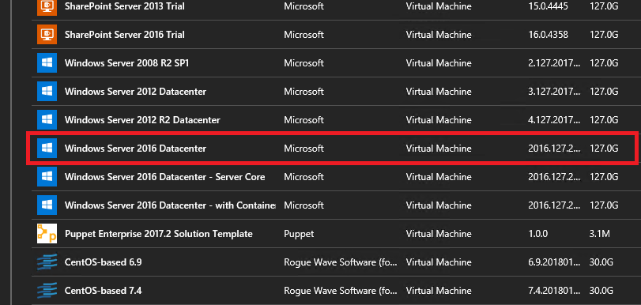

# Add the Windows Server 2016 VM image to the Azure Stack marketplace

By default, there aren’t any virtual machine images available in the Azure Stack marketplace. The Azure Stack operator must add an image to the marketplace before users can use them. You can add the Windows Server 2016 image to the Azure Stack marketplace by using one of the following two methods:

* [Add the image by downloading it from the Azure Marketplace](#add-the-image-by-downloading-it-from-the-Azure-marketplace) - Use this option if you are operating in a connected scenario and if you have registered your Azure Stack instance with Azure.

* [Add the image by using PowerShell](#add-the-image-by-using-powershell) - Use this option if you have deployed Azure Stack in a disconnected scenario or in scenarios with limited connectivity.

## Add the image by downloading it from the Azure Marketplace

1. After deploying Azure Stack, sign in to your Azure Stack Development Kit.

2. click **More services** > **Marketplace Management** > **Add from Azure** 

3. Find or search for the **Windows Server 2016 Datacenter – Eval** image > click **Download**

   

After the download completes, the image is added to the **Marketplace Management** blade and it is also made available from the **Virtual Machines** blade.

## Add the image by using PowerShell

### Prerequisites 

Run the following prerequisites either from the [development kit](azure-stack-connect-azure-stack.md#connect-to-azure-stack-with-remote-desktop), or from a Windows-based external client if you are [connected through VPN](azure-stack-connect-azure-stack.md#connect-to-azure-stack-with-vpn):

* Install [Azure Stack-compatible Azure PowerShell modules](azure-stack-powershell-install.md).  

* Download the [tools required to work with Azure Stack](azure-stack-powershell-download.md).  

* Go to https://www.microsoft.com/en-us/evalcenter/evaluate-windows-server-2016 and download the Windows Server 2016 evaluation. When prompted, select the **ISO** version of the download. Record the path to the download location, which is used later in these steps. This step requires internet connectivity.  

Now run the following steps to add the image to the Azure Stack marketplace:
   
1. Import the Azure Stack Connect and ComputeAdmin modules by using the following commands:

   ```powershell
   Set-ExecutionPolicy RemoteSigned

   # import the Connect and ComputeAdmin modules   
   Import-Module .\Connect\AzureStack.Connect.psm1
   Import-Module .\ComputeAdmin\AzureStack.ComputeAdmin.psm1

   ```

2. Sign in to your Azure Stack environment. Run the following script depending on if your Azure Stack environment is deployed by using AAD or AD FS (Make sure to replace the AAD tenantName, GraphAudience endpoint and ArmEndpoint values as per your environment configuration):  

   a. **Azure Active Directory**, use the following cmdlet:

   ```PowerShell
   # For Azure Stack development kit, this value is set to https://adminmanagement.local.azurestack.external. To get this value for Azure Stack integrated systems, contact your service provider.
   $ArmEndpoint = "<Resource Manager endpoint for your environment>"

   # For Azure Stack development kit, this value is set to https://graph.windows.net/. To get this value for Azure Stack integrated systems, contact your service provider.
   $GraphAudience = "<GraphAuidence endpoint for your environment>"
   
   # Create the Azure Stack operator's AzureRM environment by using the following cmdlet:
   Add-AzureRMEnvironment `
     -Name "AzureStackAdmin" `
     -ArmEndpoint $ArmEndpoint

   Set-AzureRmEnvironment `
    -Name "AzureStackAdmin" `
    -GraphAudience $GraphAudience

   $TenantID = Get-AzsDirectoryTenantId `
     -AADTenantName "<myDirectoryTenantName>.onmicrosoft.com" `
     -EnvironmentName AzureStackAdmin

   Login-AzureRmAccount `
     -EnvironmentName "AzureStackAdmin" `
     -TenantId $TenantID 
   ```

   b. **Active Directory Federation Services**, use the following cmdlet:
    
   ```PowerShell
   # For Azure Stack development kit, this value is set to https://adminmanagement.local.azurestack.external. To get this value for Azure Stack integrated systems, contact your service provider.
   $ArmEndpoint = "<Resource Manager endpoint for your environment>"

   # For Azure Stack development kit, this value is set to https://graph.local.azurestack.external/. To get this value for Azure Stack integrated systems, contact your service provider.
   $GraphAudience = "<GraphAuidence endpoint for your environment>"

   # Create the Azure Stack operator's AzureRM environment by using the following cmdlet:
   Add-AzureRMEnvironment `
     -Name "AzureStackAdmin" `
     -ArmEndpoint $ArmEndpoint

   Set-AzureRmEnvironment `
     -Name "AzureStackAdmin" `
     -GraphAudience $GraphAudience `
     -EnableAdfsAuthentication:$true

   $TenantID = Get-AzsDirectoryTenantId `
     -ADFS 
     -EnvironmentName AzureStackAdmin 

   Login-AzureRmAccount `
     -EnvironmentName "AzureStackAdmin" `
     -TenantId $TenantID 
   ```
   
3. Add the Windows Server 2016 image to the Azure Stack marketplace (Make sure to replace the *Path_to_ISO* with the path to the WS2016 ISO you downloaded):

   ```PowerShell
   $ISOPath = "<Fully_Qualified_Path_to_ISO>"

   # Add a Windows Server 2016 Evaluation VM Image.
   New-AzsServer2016VMImage `
     -ISOPath $ISOPath

   ```

To ensure that the Windows Server 2016 VM image has the latest cumulative update, include the `IncludeLatestCU` parameter when running the `New-AzsServer2016VMImage` cmdlet. See the [Parameters](#parameters) section for information about allowed parameters for the `New-AzsServer2016VMImage` cmdlet. It takes about an hour to publish the image to the Azure Stack marketplace. 

## Parameters

|New-AzsServer2016VMImage parameters|Required?|Description|
|-----|-----|------|
|ISOPath|Yes|The fully qualified path to the downloaded Windows Server 2016 ISO.|
|Net35|No|This parameter allows you to install the .NET 3.5 runtime on the Windows Server 2016 image. By default, this value is set to true. It is mandatory that the image contains the .NET 3.5 runtime to install the SQL and MYSQL resource providers. |
|Version|No|This parameter allows you to choose whether to add a **Core** or **Full** or **Both** Windows Server 2016 images. By default, this value is set to "Full."|
|VHDSizeInMB|No|Sets the size (in MB) of the VHD image to be added to your Azure Stack environment. By default, this value is set to 40960 MB.|
|CreateGalleryItem|No|Specifies if a Marketplace item should be created for the Windows Server 2016 image. By default, this value is set to true.|
|location |No |Specifies the location to which the Windows Server 2016 image should be published.|
|IncludeLatestCU|No|Set this switch to apply the latest Windows Server 2016 cumulative update to the new VHD.|
|CUUri |No |Set this value to choose the Windows Server 2016 cumulative update from a specific URI. |
|CUPath |No |Set this value to choose the Windows Server 2016 cumulative update from a local path. This option is helpful if you have deployed the Azure Stack instance in a disconnected environment.|

## Next steps

[Provision a virtual machine](azure-stack-provision-vm.md)
