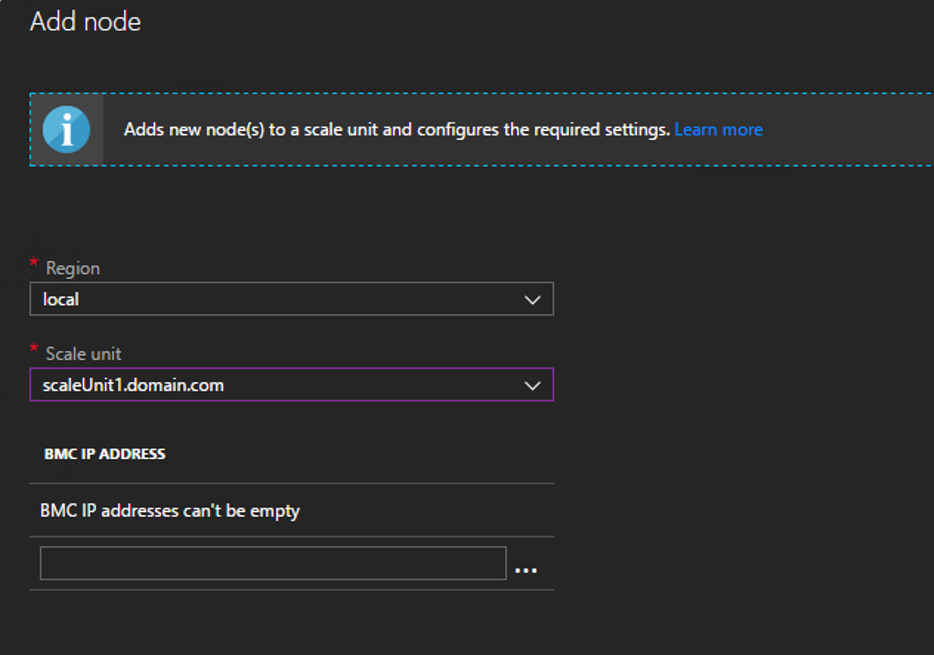

# Add additional scale unit nodes in Azure Stack

Azure Stack operators can increase the overall capacity of an existing scale unit by adding an additional physical computer. The physical computer is also referred to as a scale unit node. Each new scale unit node you add must be homogenous in CPU type, memory, and disk number & size to the nodes that are already present in the scale unit.  

> [!NOTE]  
You must run Azure Stack 1807 or later to add additional scale unit nodes.

To add a scale unit node, you act in Azure Stack and run tooling from your hardware equipment manufacturer (OEM). The OEM tooling runs on the hardware lifecycle host (HLH) to make sure the new physical computer matches the same firmware level as existing nodes.

The following flow diagram shows the general process to add a scale unit node.


&#42; *Whether your OEM hardware vendor enacts the physical server rack placement and updates the firmware varies based on your support contract.*

The operation to add a new node can take several hours or days to complete.

## Add scale unit nodes 
The following steps are a high-level overview of how to add a node. Don't follow these steps without first referring to your OEM-provided capacity expansion documentation.

1. Place the new physical server in the rack and cable it appropriately. 
2. Configure the correct IP Address in the baseboard management controller (BMC) and apply all BIOS settings per your OEM-provided documentation.
3. Apply the current firmware baseline to all components by using the tools that are provided by the hardware manufacturer that run on the HLH.
4. Run the Add node operation in the Azure Stack admin portal.
5. Validate that the add node operation succeeds. To do so, check the [**Status** of the Scale Unit](#monitor-add-node-operations). 

## Add the node 
You can use the admin console or PowerShell to add new nodes. The add node operation first adds the new scale unit node as available compute capacity and then automatically extends the storage capacity. The capacity expands automatically because Azure Stack is a hyperconverged system where *compute* and *storage* scale together.

### Use the admin console
1. Sign in to the Azure Stack admin portal as an Azure Stack operator.
2. Navigate to **Region management** > **Scale units**, and then select the scale unit that you want to expand capacity for.  
   

   
 
3. The following parameters are required:  
   - **BMC IP ADDRESS** for each scale unit node you add. (One IP address per line.)
   

### Use PowerShell

Use the **New-AzsScaleUnitNodeObject** cmdlet to add one or more nodes.  

Before using either of the following sample PowerShell scripts, replace the values *node names* and *IP addresses* with values from your Azure Stack environment.

**For a single node:**
  ```powershell
  ## Add a single Node 
  $NewNode=New-AzsScaleUnitNodeObject -computername "<name_of_new_node>" -BMCIPv4Address "<BMCIP_address_of_new_node>" 
 
  Add-AzsScaleUnitNode -NodeList $NewNode -ScaleUnit "<name_of_scale_unit_cluster>" 
  ```  

**Add multiple nodes:**
  ```powershell
  ## Add multiple nodes 
  $NewNode1=New-AzsScaleUnitNodeObject -computername "<name_of_new_node01>"  -BMCIPv4Address "<BMCIP_address_of_new_node01>" 
 
  $NewNode2=New-AzsScaleUnitNodeObject -computername "<name_of_new_node02>" -BMCIPv4Address “<BMCIP_address_of_new_node02>”$ 
 
  Add-AzsScaleUnitNode -NodeList @($NewNode1,$NewNode2) -ScaleUnit "<name_of_scale_unit_cluster>" 
  ```

## Monitor Add Node operations 
You can use the admin portal or PowerShell to get the status of the add node operation. Add node operations can take several hours to days to complete.

### Use the admin console 
To monitor the addition of a new node, in the admin portal review the scale unit or scale unit node objects. To do so, go to **Region management** > **Scale units**. Next, select the scale unit or scale unit node you want to review. 

### Use PowerShell
The status for scale unit and scale unit nodes can be retrieved using PowerShell as follows:
  ```powershell
  #Retrieve Status for the Scale Unit
  Get-AzsScaleUnit|select name,state
 
  #Retrieve Status for each Scale Unit Node
  Get-AzsScaleUnitNode |Select Name, ScaleUnitNodeStatus
```

### Status for the add node operation 
**For a scale unit:**
|Status               |Description  |
|---------------------|---------|
|Running              |All nodes are actively participating in the scale unit.|
|Stopped              |The scale unit node is either down or unreachable.|
|Expanding            |One or more scale unit nodes are currently being added as compute capacity.|
|Configuring Storage  |The compute capacity has been expanded and the storage configuration is running.|
|Requires Remediation |An error has been detected that requires one or more scale unit nodes to be repaired.|


**For a scale unit node:**
|Status                |Description  |
|----------------------|---------|
|Running               |The node is actively participating in the scale unit.|
|Stopped               |The node is unavailable.|
|Adding                |The node is actively being added to the scale unit.|
|Repairing             |The node is actively being repaired.|
|Maintenance           |The node is paused, and no active user workload is running. |
|Requires Remediation  |An error has been detected that requires the node to be repaired.|


## Troubleshooting
The following are common issues seen when adding a node. 

**Scenario 1:**  The add scale unit node operation fails but one or more nodes are listed with a status of Stopped.  
- Remediation: Use the repair operation to repair one or more nodes. Only a single repair operation can run at one time.

**Scenario 2:** One or more scale unit nodes have been added but the storage expansion failed. In this scenario, the scale unit node object reports a status of Running but the Configuring Storage task isn't started.  
- Remediation: Use the privileged endpoint to review the storage health by running the following PowerShell cmdlet:
 
**Scenario 3:** You received an alert that indicates the storage scale-out job failed.  
- Remediation: In this case, the storage configuration task has failed. This problem requires you to contact support.


## Next Steps 
Review [Node actions](azure-stack-node-actions.md) 
