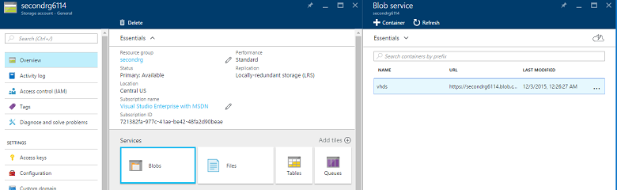
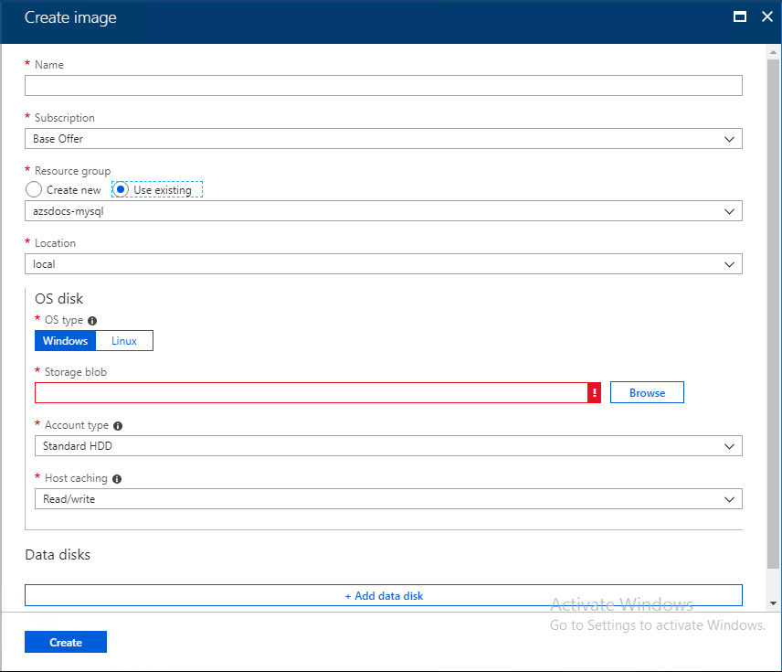

# Make a virtual machine image available in Azure Stack

*Applies to: Azure Stack integrated systems and Azure Stack Development Kit*

In Azure Stack, you can make virtual machine images available to your users. These images can be referenced by Azure Resource Manager templates, or you can add them to the Azure Marketplace UI as a Marketplace item. You can use either an image form the global Azure Marketplace or add your own custom image. You can add a VM using the portal or Windows PowerShell.

## Add a VM image through the portal

> [!NOTE]
> With this method, you must create the Marketplace item separately.

Images must be able to be referenced by a blob storage URI. Prepare a Windows or Linux operating system image in VHD format (not VHDX), and then upload the image to a storage account in Azure or Azure Stack. If your image is already uploaded to the blob storage in Azure or Azure Stack, you can skip step 1.

1. [Upload a Windows VM image to Azure for Resource Manager deployments](https://azure.microsoft.com/documentation/articles/virtual-machines-windows-upload-image/) or, for a Linux image, follow the instructions described in [Deploy Linux virtual machines on Azure Stack](azure-stack-linux.md). Before you upload the image, it's important to consider the following factors:

   - Azure Stack only supports generation one (1) VM in the fixed disk VHD format. The fixed-format structures the logical disk linearly within the file, so that disk offset X is stored at blob offset X. A small footer at the end of the blob describes the properties of the VHD. To confirm if your disk is fixed, use the [Get-VHD](https://docs.microsoft.com/powershell/module/hyper-v/get-vhd?view=win10-ps) PowerShell command.  

    > [!IMPORTANT]
    >  Azure Stack does not support dynamic disk VHDs. Resizing a dynamic disk that is attached to a VM will leave the VM in a failed state. To mitigate this issue, delete the VM without deleting the VM’s disk, a VHD blob in a storage account. The, convert the VHD from a dynamic disk to a fixed disk and re-create the virtual machine.

   * It's more efficient to upload an image to Azure Stack blob storage than to Azure blob storage because it takes less time to push the image to the Azure Stack image repository.

   * When you upload the [Windows VM image](https://azure.microsoft.com/documentation/articles/virtual-machines-windows-upload-image/), make sure to substitute the **Login to Azure** step with the [Configure the Azure Stack operator's PowerShell environment](azure-stack-powershell-configure-admin.md) step.  

   * Make a note of the blob storage URI where you upload the image. The blob storage URI has the following format:
  *&lt;storageAccount&gt;/&lt;blobContainer&gt;/&lt;targetVHDName&gt;*.vhd.

   * To make the blob anonymously accessible, go to the storage account blob container where the VM image VHD was uploaded. Select **Blob**, and then select **Access Policy**. Optionally, you can instead generate a shared access signature for the container, and include it as part of the blob URI. This step makes sure the blob is available to be used for adding this as an image. If the blob is not anonymously accessible, the VM image will be created to in a failed state.

   

   

2. Sign in to Azure Stack as operator. In the menu, select **All services**. Then, under the **ADMINISTRATION** category select  **Compute** > **VM images** > **Add**.

3. Under **Add a VM Image**, enter the publisher, offer, SKU, and version of the virtual machine image. These name segments refer to the VM   image in Resource Manager templates. Make sure to select the **osType** value correctly. For **OS Disk Blob URI**, enter the Blob URI where the    image was uploaded. Then, select **Create** to begin creating the VM Image.

   

   When the image is successfully created, the VM image status changes to **Succeeded**.

4. To make the virtual machine image more readily available for user consumption in the UI, it's a good idea to [create a Marketplace item](azure-stack-create-and-publish-marketplace-item.md).

## Remove a VM image through the portal

1. Open the administration portal at [https://adminportal.local.azurestack.external](https://adminportal.local.azurestack.external).

2. Select **Marketplace management**, and then select the VM you would like to delete.

3. Click **Delete**.

## Add a VM image to the Marketplace by using PowerShell

> [!Note]  
> When you add an image it will only be available for Azure Resource Manger based templates and PowerShell deployments. To make an image available to a your users as a marketplace item, publish the marketplace item using the steps in the article, [Create and publish a Marketplace item](https://docs.microsoft.com/azure/azure-stack/azure-stack-create-and-publish-marketplace-item)

1. [Install PowerShell for Azure Stack](azure-stack-powershell-install.md).  

2. Sign in to Azure Stack as an operator. For instructions, see [Sign in to Azure Stack as an operator](azure-stack-powershell-configure-admin.md).

3. Open PowerShell with an elevated prompt, and run:

  ````PowerShell  
    Add-AzsPlatformimage -publisher "<publisher>" `
      -offer "<offer>" `
      -sku "<sku>" `
      -version "<#.#.#>” `
      -OSType "<ostype>" `
      -OSUri "<osuri>"
  ````

  The **Add-AzsPlatformimage** cmdlet specifies values used by the Azure Resource Manager templates to reference the VM image. The values include:
  - **publisher**  
    For example: `Canonical`  
    The publisher name segment of the VM image that users use when they deploy the image. An example is **Microsoft**. Do not include a space or other special characters in this field.  
  - **offer**  
    For example: `UbuntuServer`  
    The offer name segment of the VM image that users use when they deploy the VM image. An example is **WindowsServer**. Do not include a space or other special characters in this field.  
  - **sku**  
    For example: `14.04.3-LTS`  
    The SKU name segment of the VM Image that users use when they deploy the VM image. An example is **Datacenter2016**. Do not include a space or other special characters in this field.  
  - **version**  
    For example: `1.0.0`  
    The version of the VM Image that users use when they deploy the VM image. This version is in the format *\#.\#.\#*. An example is **1.0.0**. Do not include a space or other special characters in this field.  
  - **osType**  
    For example: `Linux`  
    The osType of the image must be either **Windows** or **Linux**.  
  - **OSUri**  
    For example: `https://storageaccount.blob.core.windows.net/vhds/Ubuntu1404.vhd`  
    You can specify a blob storage URI for an `osDisk`.  

    For more information, see the PowerShell reference for the [Add-AzsPlatformimage](https://docs.microsoft.com/powershell/module/azs.compute.admin/add-azsplatformimage) cmdlet and the [New-DataDiskObject](https://docs.microsoft.com/powershell/module/Azs.Compute.Admin/New-DataDiskObject) cmdlet.

## Add a custom VM image to the Marketplace by using PowerShell
 
1. [Install PowerShell for Azure Stack](azure-stack-powershell-install.md).

  ```PowerShell  
    # Create the Azure Stack operator's Azure Resource Manager environment by using the following cmdlet:
    Add-AzureRMEnvironment `
      -Name "AzureStackAdmin" `
      -ArmEndpoint $ArmEndpoint

    Set-AzureRmEnvironment `
      -Name "AzureStackAdmin" `
      -GraphAudience $GraphAudience

    $TenantID = Get-AzsDirectoryTenantId `
      -AADTenantName "<myDirectoryTenantName>.onmicrosoft.com" `
      -EnvironmentName AzureStackAdmin

    Add-AzureRmAccount `
      -EnvironmentName "AzureStackAdmin" `
      -TenantId $TenantID
  ```

2. If using **Active Directory Federation Services**, use the following cmdlet:

  ```PowerShell
  # For Azure Stack Development Kit, this value is set to https://adminmanagement.local.azurestack.external. To get this value for Azure Stack integrated systems, contact your service provider.
  $ArmEndpoint = "<Resource Manager endpoint for your environment>"

  # For Azure Stack Development Kit, this value is set to https://graph.local.azurestack.external/. To get this value for Azure Stack integrated systems, contact your service provider.
  $GraphAudience = "<GraphAuidence endpoint for your environment>"

  # Create the Azure Stack operator's Azure Resource Manager environment by using the following cmdlet:
  Add-AzureRMEnvironment `
    -Name "AzureStackAdmin" `
    -ArmEndpoint $ArmEndpoint
    ```

3. Sign in to Azure Stack as an operator. For instructions, see [Sign in to Azure Stack as an operator](azure-stack-powershell-configure-admin.md).

4. Create a storage account in global Azure or Azure Stack to store your custom VM image. For instructions see [Quickstart: Upload, download, and list blobs using the Azure portal](https://docs.microsoft.com/azure/storage/blobs/storage-quickstart-blobs-portal).

5. Prepare a Windows or Linux operating system image in VHD format (not VHDX), upload the image to your storage account, and get the URI where the VM image can be retrieved by PowerShell.  

  ````PowerShell  
    Add-AzureRmAccount `
      -EnvironmentName "AzureStackAdmin" `
      -TenantId $TenantID
  ````

6. (Optionally) You can upload an array of data disks as part of the VM image. Create your data disks using the New-DataDiskObject cmdlet. Open PowerShell from an elevated prompt, and run:

  ````PowerShell  
    New-DataDiskObject -Lun 2 `
    -Uri "https://storageaccount.blob.core.windows.net/vhds/Datadisk.vhd"
  ````

7. Open PowerShell with an elevated prompt, and run:

  ````PowerShell  
    Add-AzsPlatformimage -publisher "<publisher>" -offer "<offer>" -sku "<sku>" -version "<#.#.#>” -OSType "<ostype>" -OSUri "<osuri>"
  ````

    For more information about the Add-AzsPlatformimage cmdlet and New-DataDiskObject cmdlet, see the Microsoft PowerShell [Azure Stack Operator module documentation](https://docs.microsoft.com/powershell/module/).

## Remove a VM image by using PowerShell

When you no longer need the virtual machine image that you uploaded, you can delete it from the Marketplace by using the following cmdlet:

1. [Install PowerShell for Azure Stack](azure-stack-powershell-install.md).

2. Sign in to Azure Stack as an operator.

3. Open PowerShell with an elevated prompt, and run:

  ````PowerShell  
  Remove-AzsPlatformImage `
    -publisher "<publisher>" `
    -offer "<offer>" `
    -sku "<sku>" `
    -version "<version>" `
  ````
  The **Remove-AzsPlatformImage** cmdlet specifies values used by the Azure Resource Manager templates to reference the VM image. The values include:
  - **publisher**  
    For example: `Canonical`  
    The publisher name segment of the VM image that users use when they deploy the image. An example is **Microsoft**. Do not include a space or other special characters in this field.  
  - **offer**  
    For example: `UbuntuServer`  
    The offer name segment of the VM image that users use when they deploy the VM image. An example is **WindowsServer**. Do not include a space or other special characters in this field.  
  - **sku**  
    For example: `14.04.3-LTS`  
    The SKU name segment of the VM Image that users use when they deploy the VM image. An example is **Datacenter2016**. Do not include a space or other special characters in this field.  
  - **version**  
    For example: `1.0.0`  
    The version of the VM Image that users use when they deploy the VM image. This version is in the format *\#.\#.\#*. An example is **1.0.0**. Do not include a space or other special characters in this field.  
    
    For more information about the Remove-AzsPlatformImage cmdlet, see the Microsoft PowerShell [Azure Stack Operator module documentation](https://docs.microsoft.com/powershell/module/).

## Next steps

[Provision a virtual machine](azure-stack-provision-vm.md)
