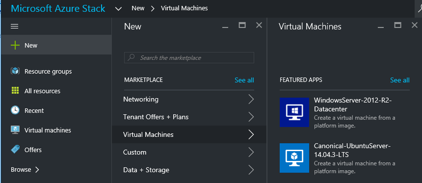

# Make a custom virtual machine image available in Azure Stack
Azure Stack enables administrators to make custom virtual machine images available to their tenants. These images can
be referenced by Azure Resource Manager templates or added to the
Azure Marketplace UI with the creation of a Marketplace item. 

## Add a VM image to marketplace with PowerShell

You can use the steps described in this article either from the Azure Stack Development Kit, or from a Windows-based external client if you are connected through VPN.

1. Prepare a Windows or Linux operating system virtual hard disk image in VHD format (not VHDX).
   
   * For Windows images, the article [Upload a Windows VM image to Azure for Resource Manager deployments](../virtual-machines/windows/upload-image.md?toc=%2fazure%2fvirtual-machines%2fwindows%2ftoc.json) contains image preparation instructions in the **Prepare the VHD for upload** section.
   * For Linux images, follow the steps to
     prepare the image or use an existing Azure Stack Linux image as described in
     the article [Deploy Linux virtual machines on Azure
     Stack](azure-stack-linux.md).
2. [Download Azure Stack tools from GitHub](azure-stack-powershell-download.md) and then import the Connect and ComputeAdmin modules:
   
   ```powershell
   Import-Module .\Connect\AzureStack.Connect.psm1
   Import-Module .\ComputeAdmin\AzureStack.ComputeAdmin.psm1
   ``` 

3. Create the Azure Stack administrator's AzureRM environment by using the following cmdlet:
   ```powershell
   Add-AzureStackAzureRmEnvironment `
     -Name "AzureStackAdmin" `
     -ArmEndpoint "https://adminmanagement.local.azurestack.external" 
   ```

4. Get the GUID value of the Active Directory(AD) tenant that is used to deploy the Azure Stack. If your Azure Stack environment is deployed by using:  

    a. **Azure Active Directory**, use the following cmdlet:
    
    ```PowerShell
    $TenantID = Get-AzsDirectoryTenantId `
      -AADTenantName "<myDirectoryTenantName>.onmicrosoft.com" `
      -EnvironmentName AzureStackAdmin
    ```
    b. **Active Directory Federation Services**, use the following cmdlet:
    
    ```PowerShell
    $TenantID = Get-AzsDirectoryTenantId `
      -ADFS 
      -EnvironmentName AzureStackAdmin 
    ```

5. Add the VM image by invoking the `Add-AzsVMImage` cmdlet. In the Add-AzsVMImage cmdlet, specify the osType as Windows or Linux. Include the publisher, offer, SKU, and version for the VM image. See the [Parameters](#parameters) section for information about the allowed parameters. These parameters are used by Azure Resource Manager templates to reference the VM image. Following is an example invocation of the script:
     
     ```powershell
     Add-AzsVMImage `
       -publisher "Canonical" `
       -offer "UbuntuServer" `
       -sku "14.04.3-LTS" `
       -version "1.0.0" `
       -osType Linux `
       -osDiskLocalPath 'C:\Users\AzureStackAdmin\Desktop\UbuntuServer.vhd' `
     ```

The command does the following:

* Authenticates to the Azure Stack environment
* Uploads the local VHD to a newly created temporary storage account
* Adds the VM image to the VM image repository and
* Creates a Marketplace item

To verify that the command ran successfully, go to Marketplace in the portal, and then verify that the VM image is available in the **Virtual Machines** category.

 

## Remove a VM image with PowerShell

When you no longer need the virtual machine image that you have uploaded earlier, you can delete it from the marketplace by using the following cmdlet:

```powershell
Remove-AzsVMImage `
  -publisher "Canonical" `
  -offer "UbuntuServer" `
  -sku "14.04.3-LTS" `
  -version "1.0.0" `
```

## Parameters

| Parameter | Description |
| --- | --- |
| **publisher** |The publisher name segment of the VM image that tenants use when deploying the image. An example is ‘Microsoft’. Do not include a space or other special characters in this field. |
| **offer** |The offer name segment of the VM Image that tenants use when deploying the VM image. An example is ‘WindowsServer’. Do not include a space or other special characters in this field. |
| **sku** |The SKU name segment of the VM Image that tenants use when deploying the VM image. An example is ‘Datacenter2016’. Do not include a space or other special characters in this field. |
| **version** |The version of the VM Image that tenants use when deploying the VM image. This version is in the format *\#.\#.\#*. An example is ‘1.0.0’. Do not include a space or other special characters in this field. |
| **osType** |The osType of the image must be either ‘Windows’ or ‘Linux’. |
| **osDiskLocalPath** |The local path to the OS disk VHD that you are uploading as a VM image to Azure Stack. |
| **dataDiskLocalPaths** |An optional array of the local paths for data disks that can be uploaded as part of the VM image. |
| **CreateGalleryItem** |A Boolean flag that determines whether to create an item in Marketplace. By default, it is set to true. |
| **title** |The display name of Marketplace item. By default, it is set to the Publisher-Offer-Sku of the VM image. |
| **description** |The description of the Marketplace item. |
| **location** |The location to which the VM image should be published. By default, this value is set to local.|
| **osDiskBlobURI** |Optionally, this script also accepts a Blob storage URI for osDisk. |
| **dataDiskBlobURIs** |Optionally, this script also accepts an array of Blob storage URIs for adding data disks to the image. |

## Add a VM image through the portal

> [!NOTE]
> This method requires creating the Marketplace item separately.

One requirement of images is that they can be referenced by a Blob storage URI. Prepare a Windows or Linux operating system image in VHD format (not VHDX), and then upload the image to a storage account in Azure or Azure Stack. If your image is already uploaded to the Blob storage in Azure or Azure Stack, you can skip step1.

1. [Upload a Windows VM image to Azure for Resource Manager deployments](https://azure.microsoft.com/documentation/articles/virtual-machines-windows-upload-image/) or for a Linux image, follow the instructions described in the [Deploy Linux virtual machines on Azure Stack](azure-stack-linux.md) article. You should understand the following considerations before you upload the image:

   * It's more efficient to upload an image to Azure Stack Blob storage than to Azure Blob storage because it takes less time to push the image to the Azure Stack image repository. 
   
   * When uploading the [Windows VM image](https://azure.microsoft.com/documentation/articles/virtual-machines-windows-upload-image/), make sure to substitute the **Login to Azure** step with the [Configure and Sign in PowerShell for Azure Stack](azure-stack-powershell-configure.md) step.  

   * Make a note of the Blob storage URI where you upload the image, which is in the following format:
  *&lt;storageAccount&gt;/&lt;blobContainer&gt;/&lt;targetVHDName&gt;*.vhd

   * To make the blob anonymously accessible, go to the storage account blob container where the VM image VHD was uploaded to **Blob,** and then select **Access Policy**. If you want, you can instead generate a shared access signature for the container and include it as part of the blob URI.

   

   

2. Sign in to Azure Stack as an administrator > From the menu, click **More services** > **Resource Providers** > select  **Compute** > **VM images** > **Add**

3. On the **Add a VM Image** blade, enter the publisher, offer, SKU, and version
   of the virtual machine image. These name segments refer to the VM
   image in Resource Manager templates. Make sure to select the
   **osType** correctly. For **OD Disk Blob URI**, enter the Blob URI where the
   image was uploaded and click **Create** to begin creating the
   VM Image.
   
   

   When the image is successfully created, the VM image status changes to ‘Succeeded’.

4. To make the virtual machine image
   more readily available for user consumption in the UI, it is best
   to [create a
   Marketplace item](azure-stack-create-and-publish-marketplace-item.md).
