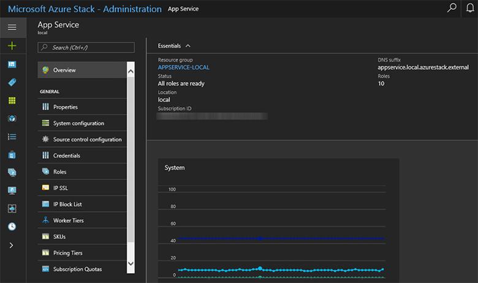
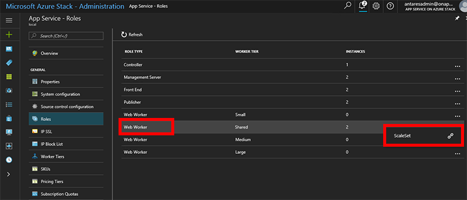
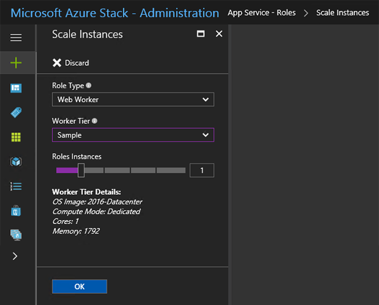
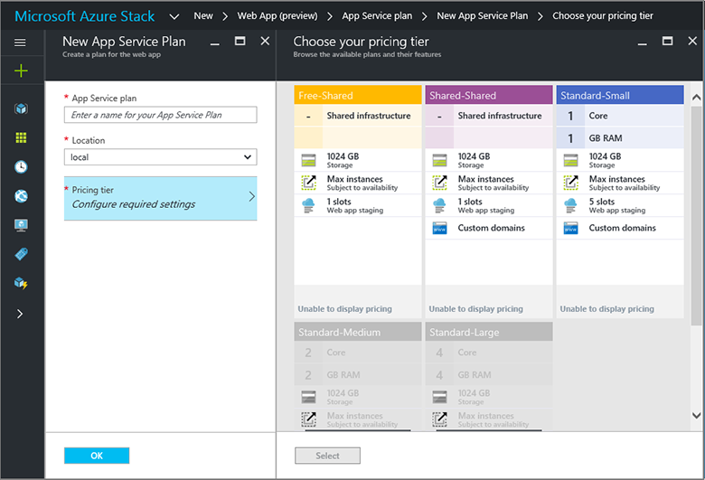

# App Service on Azure Stack: Add more infrastructure or worker roles

*Applies to: Azure Stack integrated systems and Azure Stack Development Kit*  

This document provides instructions about how to scale App Service on Azure Stack infrastructure and worker roles. It contains steps for creating additional worker roles to support applications of any size.

> [!NOTE]
> If your Azure Stack Environment does not have more than 96-GB RAM, you may have difficulties adding additional capacity.

App Service on Azure Stack, by default, supports free and shared worker tiers. To add other worker tiers, you need to add more worker roles.

If you are not sure what was deployed with the default App Service on Azure Stack installation, you can review additional information in the [App Service on Azure Stack overview](azure-stack-app-service-overview.md).

Azure App Service on Azure Stack deploys all roles using Virtual Machine Scale Sets and as such takes advantage of the scaling capabilities of this workload. Therefore, all scaling of the worker tiers is done via the App Service Admin.

> [!IMPORTANT]
> Currently it is not possible to scale virtual machine scale sets in the portal as identified in the Azure Stack release notes,  therefore use the PowerShell example to scale out.
>
>

## Add additional workers with PowerShell

1. [Setup the Azure Stack Admin environment in PowerShell](azure-stack-powershell-configure-admin.md)

2. Use this example to scale out the scale set:
   ```powershell
   
    ##### Scale out the AppService Role instances ######
   
    # Set context to AzureStack admin.
    Login-AzureRmAccount -EnvironmentName AzureStackAdmin
                                                 
    ## Name of the Resource group where AppService is deployed.
    $AppServiceResourceGroupName = "AppService.local"

    ## Name of the ScaleSet : e.g. FrontEndsScaleSet, ManagementServersScaleSet, PublishersScaleSet , LargeWorkerTierScaleSet,      MediumWorkerTierScaleSet, SmallWorkerTierScaleSet, SharedWorkerTierScaleSet
    $ScaleSetName = "SharedWorkerTierScaleSet"

    ## TotalCapacity is sum of the instances needed at the end of operation. 
    ## e.g. if your VMSS has 1 instance(s) currently and you need 1 more the TotalCapacity should be set to 2
    $TotalCapacity = 2  

    # Get current scale set
    $vmss = Get-AzureRmVmss -ResourceGroupName $AppServiceResourceGroupName -VMScaleSetName $ScaleSetName

    # Set and update the capacity
    $vmss.sku.capacity = $TotalCapacity
    Update-AzureRmVmss -ResourceGroupName $AppServiceResourceGroupName -Name $ScaleSetName -VirtualMachineScaleSet $vmss 
   ```    

   > [!NOTE]
   > This step can take a number of hours to complete depending on the type of role and the number of instances.
   >
   >

3. Monitor the status of the new role instances in the App Service Administration, to check the status of an individual role instance click the role type in the list.

## Add additional workers directly within the App Service Resource Provider Admin.

1. Sign in to the Azure Stack administration portal as the service administrator.

2. Browse to **App Services**.

    

3. Click **Roles**. Here you see the breakdown of all App Service roles deployed.

4. Right click on the row of the type you want to scale and then click **ScaleSet**.

    

5. Click **Scaling**, select the number of instances you want to scale to, and then click **Save**.

    

6. App Service on Azure Stack will now add the additional VMs, configure them, install all the required software, and mark them as ready when this process is complete. This process can take approximately 80 minutes.

7. You can monitor the progress of the readiness of the new roles by viewing the workers in the **Roles** blade.

## Result

After they are fully deployed and ready, the workers become available for users to deploy their workload onto them. The following shows an example of the multiple pricing tiers available by default. If there are no available workers for a particular worker tier, the option to choose the corresponding pricing tier is unavailable.



>[!NOTE]
> To scale out Management, Front End or Publisher roles add you must scale out the corresponding role type. 
>
>

To scale out Management, Front End, or Publisher roles, follow the same steps selecting the appropriate role type. Controllers are not deployed as Scale Sets and therefore two should be deployed at Installation time for all production deployments.

### Next steps

[Configure deployment sources](azure-stack-app-service-configure-deployment-sources.md)
