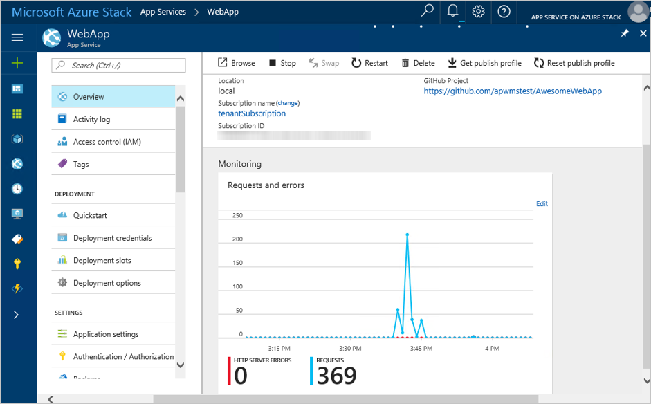

# App Service on Azure Stack overview

*Applies to: Azure Stack integrated systems and Azure Stack Development Kit*

Azure App Service on Azure Stack is a platform-as-a-service (PaaS) offering of Microsoft Azure available to Azure Stack. The service enables your internal or external customers to create web, API, and Azure Functions applications for any platform or device. They can integrate your apps with on-premises applications and automate their business processes. Azure Stack cloud operators can run customer apps on fully managed virtual machines (VMs), with their choice of shared VM resources or dedicated VMs.

Azure App Service enables you to automate business processes and host cloud APIs. As a single integrated service, Azure App Service lets you combine various components, such as websites, REST APIs, and business processes, into a single solution.

## Why offer Azure App Service on Azure Stack?

Here are some key features and capabilities of App Service:

- **Multiple languages and frameworks**: App Service has first-class support for ASP.NET, Node.js, Java, PHP, and Python. You can also run Windows PowerShell and other scripts or executables on App Service VMs.
- **DevOps optimization**: Set up continuous integration and deployment with GitHub, local Git, or BitBucket. You can promote updates through test and staging environments, and manage your apps in App Service by using Azure PowerShell or the cross-platform command-line interface (CLI).
- **Visual Studio integration**: Dedicated tools in Visual Studio streamline the work of creating and deploying applications.

## App types in App Service

App Service offers several app types, each of which is intended to host a specific workload:

- [Web Apps](../app-service/app-service-web-overview.md) for hosting websites and web applications.
- [API Apps](../app-service/app-service-web-overview.md) for hosting REST APIs.
- Azure Functions for hosting event driven, serverless workloads.

The word *app* refers to the hosting resources dedicated to running a workload. Taking *web app* as an example, you're probably accustomed to thinking of a web app as both the compute resources and application code that together deliver functionality to a browser. In App Service, a web app is the compute resource that Azure Stack provides for hosting your application code.

Your application can be composed of multiple App Service apps of different kinds. For example, if your application is composed of a web front end and a REST API back end, you can:

- Deploy both (front end and api) to a single web app
- Deploy your front-end code to a web app and your back-end code to an API app.

   

## What is an App Service plan?

The App Service resource provider uses the same code that Azure App Service uses, and thus shares some common concepts. In App Service, the pricing container for applications is called the *App Service plan*. It represents the set of dedicated virtual machines used to hold your apps. Within a given subscription, you can have multiple App Service plans.

In Azure, there are shared and dedicated workers. A shared worker supports high-density multi-tenant app hosting, and there is only one set of shared workers. Dedicated servers are used by only one tenant and come in three sizes: small, medium, and large. The needs of on-premises customers cannot always be described by using those terms. In App Service on Azure Stack, resource provider administrators can define the worker tiers they want to make available. Based on your unique hosting needs, you can define multiple sets of shared workers or different sets of dedicated workers. By using those worker-tier definitions, they can then define their own pricing SKUs.

## Portal features

App Service on Azure Stack uses the same user interface that Azure App Service uses. The same is true with the back end. However, some features are disabled in Azure Stack. The Azure-specific expectations or services that those features require are not currently available in Azure Stack.

## Next steps

- [Before you get started with App Service on Azure Stack](azure-stack-app-service-before-you-get-started.md)
- [Install the App Service resource provider](azure-stack-app-service-deploy.md)

You can also try out other [platform as a service (PaaS) services](azure-stack-tools-paas-services.md), such as the [SQL Server resource provider](azure-stack-sql-resource-provider-deploy.md) and the [MySQL resource provider](azure-stack-mysql-resource-provider-deploy.md).
