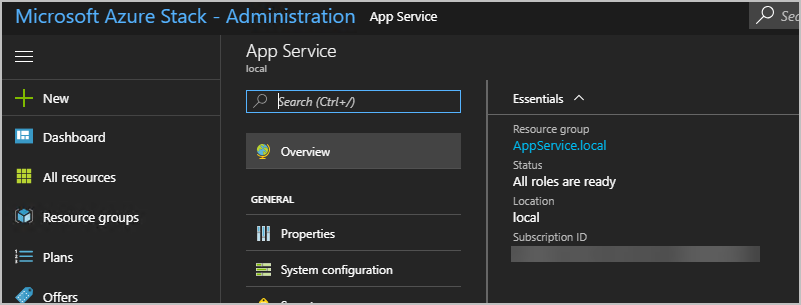

# App Service on Azure Stack update 3 release notes

*Applies to: Azure Stack integrated systems and Azure Stack Development Kit*

These release notes describe the improvements and fixes in Azure App Service on Azure Stack Update 3 and any known issues. Known issues are divided into issues directly related to the deployment, update process, and issues with the build (post-installation).

> [!IMPORTANT]
> Apply the 1807 update to your Azure Stack integrated system or deploy the latest Azure Stack development kit before deploying Azure App Service 1.3.
>
>

## Build reference

The App Service on Azure Stack Update 3 build number is **74.0.13698.31**

### Prerequisites

Refer to the [Before You Get Started documentation](azure-stack-app-service-before-you-get-started.md) before beginning deployment.

Before you begin the upgrade of Azure App Service on Azure Stack to 1.3, ensure all roles are Ready in the Azure App Service Administration in the Azure Stack Admin Portal



### New features and fixes

Azure App Service on Azure Stack Update 3 includes the following improvements and fixes:

- Support for use of SQL Server Always On for Azure App Service Resource Provider databases.

- Added new Environment parameter to the Create-AADIdentityApp helper script to assist targeting different AAD regions.

- Updates to **App Service Tenant, Admin, Functions portals and Kudu tools**. Consistent with Azure Stack Portal SDK version.

- Updates to core service to improve reliability and error messaging enabling easier diagnosis of common issues.

- **Updates to the following application frameworks and tools**:
  - Added ASP.Net Core 2.1.2
  - Added NodeJS 10.0.0
  - Added Zulu OpenJDK 8.30.0.1
  - Added Tomcat 8.5.31 and 9.0.8
  - Added PHP Versions:
    - 5.6.36
    - 7.0.30
    - 7.1.17
    - 7.2.5
  - Added Wincache 2.0.0.8
  - Updated Git for Windows to v 2.17.1.2
  - Updated Kudu to 74.10611.3437
  
- **Updates to underlying operating system of all roles**:
  - [Servicing stack update for Windows Server 2016 for x64-based Systems (KB4132216)](https://support.microsoft.com/help/4132216/servicing-stack-update-for-windows-10-1607-may-17-2018)
  - [2018-07 Cumulative Update for Windows Server 2016 for x64-based Systems (KB4338822)](https://support.microsoft.com/help/4338822/windows-10-update-kb4338822)

### Post Update Steps (optional)

For customers wishing to migrate to contained database for existing Azure App Service on Azure Stack deployments, execute these steps after the Azure App Service on Azure Stack 1.3 update has completed:

> [!IMPORTANT]
> This procedure takes approximately 5-10 minutes.  This procedure involves killing the existing database login sessions.  Plan for downtime to migrate and validate Azure App Service on Azure Stack post migration
>
>

1. Add [AppService databases (appservice_hosting and appservice_metering) to an Availability group](https://docs.microsoft.com/sql/database-engine/availability-groups/windows/availability-group-add-a-database)

1. Enable contained database
    ```sql

        sp_configure 'contained database authentication', 1;
        GO
        RECONFIGURE;
            GO
    ```

1. Converting a Database to Partially Contained.  This step will incur downtime as all active sessions need to be killed

    ```sql
        /******** [appservice_metering] Migration Start********/
            USE [master];

            -- kill all active sessions
            DECLARE @kill varchar(8000) = '';  
            SELECT @kill = @kill + 'kill ' + CONVERT(varchar(5), session_id) + ';'  
            FROM sys.dm_exec_sessions
            WHERE database_id  = db_id('appservice_metering')

            EXEC(@kill);

            USE [master]  
            GO  
            ALTER DATABASE [appservice_metering] SET CONTAINMENT = PARTIAL  
            GO  

        /********[appservice_metering] Migration End********/

        /********[appservice_hosting] Migration Start********/

            -- kill all active sessions
            USE [master];

            DECLARE @kill varchar(8000) = '';  
            SELECT @kill = @kill + 'kill ' + CONVERT(varchar(5), session_id) + ';'  
            FROM sys.dm_exec_sessions
            WHERE database_id  = db_id('appservice_hosting')

            EXEC(@kill);

            -- Convert database to contained
            USE [master]  
            GO  
            ALTER DATABASE [appservice_hosting] SET CONTAINMENT = PARTIAL  
            GO  

            /********[appservice_hosting] Migration End********/
    '''

1. Migrate Logins to Contained Database Users

    ```sql
        IF EXISTS(SELECT * FROM sys.databases WHERE Name=DB_NAME() AND containment = 1)
        BEGIN
        DECLARE @username sysname ;  
        DECLARE user_cursor CURSOR  
        FOR
            SELECT dp.name
            FROM sys.database_principals AS dp  
            JOIN sys.server_principals AS sp
                ON dp.sid = sp.sid  
                WHERE dp.authentication_type = 1 AND dp.name NOT IN ('dbo','sys','guest','INFORMATION_SCHEMA');
            OPEN user_cursor  
            FETCH NEXT FROM user_cursor INTO @username  
                WHILE @@FETCH_STATUS = 0  
                BEGIN  
                    EXECUTE sp_migrate_user_to_contained
                    @username = @username,  
                    @rename = N'copy_login_name',  
                    @disablelogin = N'do_not_disable_login';  
                FETCH NEXT FROM user_cursor INTO @username  
            END  
            CLOSE user_cursor ;  
            DEALLOCATE user_cursor ;
            END
        GO
    ```

Validate

1. Check if SQL Server has containment enabled

    ```sql
        sp_configure  @configname='contained database authentication'
    ```

1. Check existing contained behavior
    ```sql
        SELECT containment FROM sys.databases WHERE NAME LIKE (SELECT DB_NAME())
    ```

### Known issues (post-installation)

- Workers are unable to reach file server when App Service is deployed in an existing virtual network and the file server is only available on the private network.  This is also called out in the Azure App Service on Azure Stack deployment documentation.

If you chose to deploy into an existing virtual network and an internal IP address to connect to your file server, you must add an outbound security rule, enabling SMB traffic between the worker subnet and the file server. To do this, go to the WorkersNsg in the Admin Portal and add an outbound security rule with the following properties:
 * Source: Any
 * Source port range: *
 * Destination: IP Addresses
 * Destination IP address range: Range of IPs for your file server
 * Destination port range: 445
 * Protocol: TCP
 * Action: Allow
 * Priority: 700
 * Name: Outbound_Allow_SMB445

### Known issues for Cloud Admins operating Azure App Service on Azure Stack

Refer to the documentation in the [Azure Stack 1807 Release Notes](azure-stack-update-1807.md)

## Next steps

- For an overview of Azure App Service, see [Azure App Service on Azure Stack overview](azure-stack-app-service-overview.md).
- For more information about how to prepare to deploy App Service on Azure Stack, see [Before you get started with App Service on Azure Stack](azure-stack-app-service-before-you-get-started.md).
