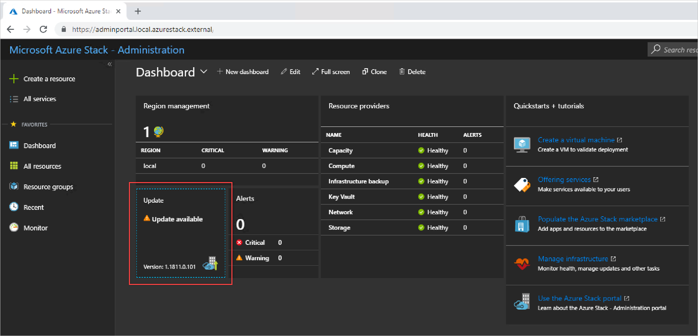
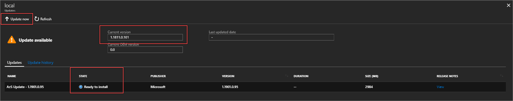
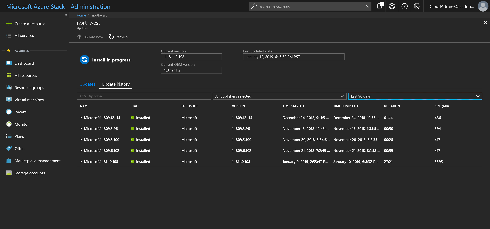

# Apply updates in Azure Stack

*Applies to: Azure Stack integrated systems*

You can use the **Update** tile in the administration portal to apply Microsoft or OEM update packages for Azure Stack.

If you are using an integrated systems version 1807 or earlier, you must download the update package, import the package files to Azure Stack, and then install the update package. For instructions, see [Update Azure Stack by downloading the package](#update-azure-stack-by-downloading-the-package)

These upgrade instructions work with Azure Stack integrated systems. If you are using the Azure Stack Development System, you must download the installation package for the current version. For instructions, see [Install the Azure Stack Development Kit](./asdk/asdk-install.md)

## Update Azure Stack

### Select and apply an update package

1. Open the Administration portal.

2. Select **Dashboard**. Select the **Update** tile.

    

3. Make note of the current version of your Azure Stack. You can update to the next full version. For example if you running Azure Stack 1811, the next released version is 1901.

    

4. Select the next available version in the Updates list. You can select **View** in the release notes column to open the release notes topic for the version if would like to review the version changes.

5. Select update now. The update will start.

### Review update history

1. Open the Administration portal.

2. Select **Dashboard**. Select the **Update** tile.

3. Select **Update history**.

## Update Azure Stack by downloading the package

If you are using an integrated systems version 1807 or earlier, you must download the update package, import the package files to Azure Stack, and then install the update package.

## Download the update package

When a Microsoft or OEM update package for Azure Stack is available, download the package to a location that's reachable from Azure Stack, and review the package contents. An update package typically consists of the following files:

- A self-extracting `<PackageName>.exe` file. This file contains the payload for the update, for example the latest cumulative update for Windows Server.

- Corresponding `<PackageName>.bin` files. These files provide compression for the payload that's associated with the *PackageName*.exe file.

- A `Metadata.xml` file. This file contains essential information about the update, for example the publisher, name, prerequisite, size, and support path URL.

> [!IMPORTANT]  
> After the Azure Stack 1901 update package is applied, the packaging format for Azure Stack update pacakges will move from .exe, .bin(s), and .xml format to a .zip(s) and .xml format. Azure Stack operators that have connected stamps won't be impacted. Azure Stack operators that are disconnected will simply import the .xml and .zip file(s) by using the same process described below.

## Import and install updates

The following procedure shows how to import and install update packages in the administrator portal.

> [!IMPORTANT]  
> We strongly recommend that you notify users of any maintenance operations, and that you schedule normal maintenance windows during non-business hours as much as possible. Maintenance operations may affect both user workloads and portal operations.

1. In the administrator portal, select **All services**. Then, under the **DATA + STORAGE** category, select **Storage accounts**. (Or, in the filter box, start typing **storage accounts**, and select it.)

    

2. In the filter box, type **update**, and select the **updateadminaccount** storage account.

3. In the storage account details, under **Services**, select **Blobs**.
 
     

4. Under **Blob service**, select **+ Container** to create a  container. Enter a name (for example *Update-1811*), and then select **OK**.
 
     

5. After the container is created, click the container name, and then click **Upload** to upload the package files to the container.
 
    

6. Under **Upload blob**, click the folder icon, browse to the update package's .exe file, and then click **Open** in the file explorer window.
  
7. Under **Upload blob**, click **Upload**.
  
    

8. Repeat steps 6 and 7 for the *PackageName*.bin and Metadata.xml files. Do not import the Supplemental Notice.txt file if included.
9. When done, you can review the notifications (bell icon in the top-right corner of the portal). The notifications should indicate that the upload has completed.
10. Navigate back to the Update tile on the dashboard. The tile should indicate that an update is available. Click the tile to review the newly added update package.
11. To install the update, select the package that's marked as **Ready** and either right-click the package and select **Update now**, or click the **Update now** action near the top.
12. When you click the installing update package, you can view the status in the **Update run details** area. From here, you can also click **Download full logs** to download the log files.
13. When the update completes, the Update tile shows the updated Azure Stack version.

You can manually delete updates from the storage account after they have been installed on Azure Stack. Azure Stack periodically checks for older update packages and removes them from storage. It may take Azure Stack two weeks to remove the old packages.

## Next steps

- [Manage updates in Azure Stack overview](azure-stack-updates.md)
- [Azure Stack servicing policy](azure-stack-servicing-policy.md)
