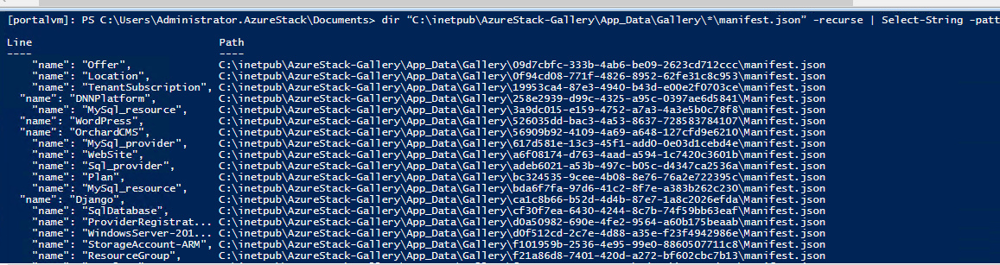
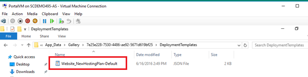

<properties
	pageTitle="Use Azure Resource Manager templates in Azure Stack (tenant developers) | Microsoft Azure"
	description="Learn how to use Azure Resource Manager templates in Azure Stack to deploy and provision all of the resources for your application in a single, coordinated operation."
	services="azure-stack"
	documentationCenter=""
	authors="ErikjeMS"
	manager="byronr"
	editor=""/>

<tags
	ms.service="azure-stack"
	ms.workload="na"
	ms.tgt_pltfrm="na"
	ms.devlang="na"
	ms.topic="article"
	ms.date="01/29/2016"
	ms.author="erikje"/>

# Use Azure Resource Manager templates in Azure Stack

Azure Resource Manager templates deploy and provision all of the resources for your application in a single, coordinated operation. You define the resources for the application and how it will be deployed.

These templates can be deployed with the Microsoft Azure Stack portal, PowerShell, the command line, and Visual Studio.

The following templates are available on [GitHub](http://aka.ms/azurestackgithub):

## Deploy SharePoint (non-high availability)

Use the PowerShell DSC extension to create a SharePoint 2013 farm that includes the following:

-	A virtual network

-	Three storage accounts

-	Two external load balancers

-	One VM configured as a domain controller for a new forest with a single domain

-	One VM configured as a SQL Server 2014 stand-alone server

-	One VM configured as a one machine SharePoint 2013 farm

## Deploy AD (non-high availability)

Use the PowerShell DSC extension to create an AD domain controller server that includes the following:

-	A virtual network

-	One storage account

-	One external load balancer

-	One VM configured as a domain controller for a new forest with a single domain

## Deploy AD/SQL (non-high availability)

Use the PowerShell DSC extension to create a SQL Server 2014 stand-alone server that includes the following:

-	A virtual network

-	Two storage accounts

-	One external load balancer

-	One VM configured as a domain controller for a new forest with a single domain

-	One VM configured as a SQL Server 2014 stand-alone server

## VM-DSC-Extension-Azure-Automation-Pull-Server

Use the PowerShell DSC extension to configure an existing virtual machine Local Configuration Manager (LCM) and register it to an Azure Automation Account DSC Pull Server.

## Create a virtual machine from a user image

Create a virtual machine from a custom user image. This template also deploys a virtual network (with DNS), public IP address, and a network interface.

## Simple VM

Deploy a simple Windows VM that includes a virtual network (with DNS), public IP address, and a network interface.

## Cancel a running template deployment

To cancel a running template deployment, use the `Stop-AzureRmResourceGroupDeployment` PowerShell cmdlet.

##Finding ARM Templates in Azure Stack Gallery

This process allows you to find ARM templates in Azure Stack once they have been uploaded to the gallery.

1.  Open PowerShell as administrator on the ClientVM

2.  Run the following cmd to create a remote PowerShell session on the
    PortalVM

    Enter-PSSession -ComputerName portalvm

3.  Next run the command below to find the names of all templates in the
    Gallery

    dir “C:\\inetpub\\AzureStack-Gallery\\App\_Data\\Gallery\\\*\\manifest.json” -recurse | Select-String -pattern "\`"name\`":" -SimpleMatch -List | ft -Property Line,Path

> 

4.  Once you have found the correct template, on the ClientVM, navigate
    to the
    \\\\PortalVM\\C\$\\InetPub\\AzureStack-**Gallery\\App\_Data\\Gallery\\&lt;GUID&gt;\\DeploymentTemplates** folder on the PortalVM. This folder contains the JSON file you will require for the deployment steps below.

Example: Web App Template

5.  Copy the JSON file to a location on the ClientVM where you can work with it with the tool of your choice.

## Next steps

[Deploy templates with the portal](azure-stack-deploy-template-portal.md)

[Azure Resource Manager overview](../resource-group-overview.md)
