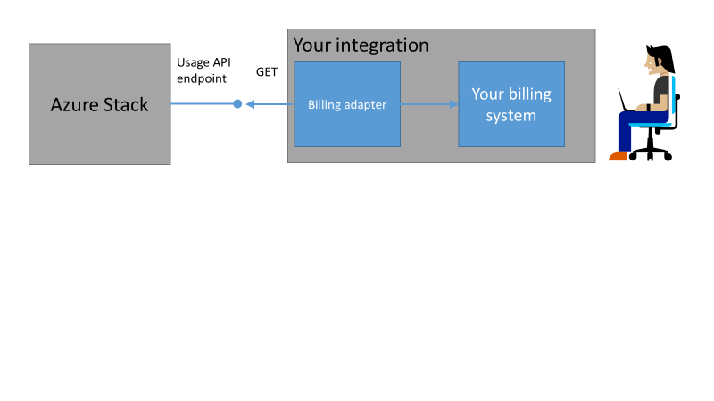

---
title: Customer Billing And Chargeback In Azure Stack | Microsoft Docs
description: Learn how to retrieve resource usage information from Azure Stack.
services: azure-stack
documentationcenter: ''
author: AlfredoPizzirani
manager: byronr
editor: ''

ms.assetid: a9afc7b6-43da-437b-a853-aab73ff14113
ms.service: azure-stack
ms.workload: na
ms.tgt_pltfrm: na
ms.devlang: na
ms.topic: article
ms.date: 04/08/2016
ms.author: alfredop

---
# Usage and billing in Azure Stack

Usage represents the quantity of resources consumed by a user. Azure Stack collects usage information for each user and uses it to bill them. This article describes how Azure Stack users are billed for resource usage, and how the billing information is accessed for analytics, chargeback, etc.

Azure Stack contains the infrastructure to collect and aggregate usage data for all resources. You can access this data and export it to a billing system by using a billing adapter, or export it to a business intelligence tool like Microsoft Power BI. After exporting, this billing information is used for analytics or transferred to a chargeback system.



## What usage information can I find, and how?

Azure Stack Resource providers, such as Compute, Storage, and Network, generate usage data at hourly intervals for each subscription. The usage data contains information about the resource used such as resource name, meter name, meter ID, quantity used etc. To learn about the meters ID resources, refer to the [usage API FAQ](azure-stack-usage-related-faq.md) article. 

After the usage data has been collected, it is [reported to Azure](azure-stack-usage-reporting.md) to generate a bill, which can be viewed through the Azure billing portal. The Azure billing portal shows the usage data only for the chargeable resources. In addition to the chargeable resources, Azure Stack captures usage data for a broader set of resources, which you can access in your Azure Stack environment through REST APIs or PowerShell. Service administrators can retrieve the usage data for all tenant subscriptions whereas a tenant can get only their usage details.

## Retrieve usage information

To generate the usage data, you should have resources that are running and actively using the system. If you’re not sure whether you have any resources running in Azure Stack Marketplace, deploy a virtual machine (VM), and verify the VM monitoring blade to make sure it’s running. Use the following PowerShell cmdlets to view the usage data:

1. [Install PowerShell for Azure Stack.](azure-stack-powershell-install.md)
2. [Configure PowerShell and sign in to your Azure Stack administrator or user subscription.](azure-stack-powershell-configure.md)
3. To retrieve the usage data, use the [Get-UsageAggregates](/powershell/module/azurerm.usageaggregates/get-usageaggregates) PowerShell cmdlet:
   ```PowerShell
   Get-UsageAggregates -ReportedStartTime "<Start time for usage reporting>" -ReportedEndTime "<end time for usage reporting>" -AggregationGranularity <Hourly or Daily>
   ```

   If usage data is available, it’s returned in as shown in the following screenshot: 
   
   
   
   PowerShell returns 1,000 lines of usage per call. You can use the continuation parameter to retrieve more than 1,000 lines

## Next steps

[Report Azure Stack usage data to Azure](azure-stack-usage-reporting.md)

[Provider Resource Usage API](azure-stack-provider-resource-api.md)

[Tenant Resource Usage API](azure-stack-tenant-resource-usage-api.md)

[Usage-related FAQ](azure-stack-usage-related-faq.md)

