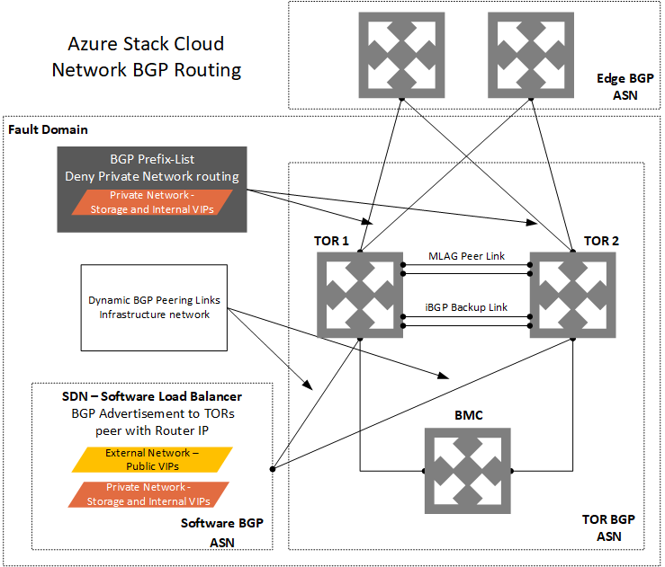
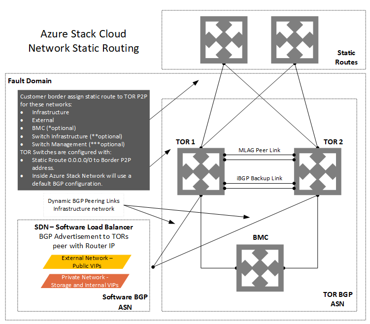
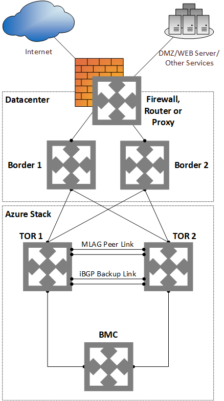

# Border connectivity 
Network integration planning is an important prerequisite for successful Azure Stack integrated systems deployment, operation, and management. Border connectivity planning begins by choosing whether or not to use dynamic routing with border gateway protocol (BGP). This requires assigning a 16-bit BGP autonomous system number (public or private) or using static routing, where a static default route is assigned to the border devices.

> [!IMPORTANT]
> The top of rack (TOR) switches require Layer 3 uplinks with Point-to-Point IPs (/30 networks) configured on the physical interfaces. It is not supported to use Layer 2 uplinks with TOR switches supporting Azure Stack operations. 

## BGP routing
Using a dynamic routing protocol like BGP guarantees that your system is always aware of network changes and facilitates administration. 

As shown in the following diagram, advertising of the private IP space on the TOR switch is restricted using a prefix-list. The prefix list defines the private IP subnets and applying it as a route-map on the connection between the TOR and the border.

The Software Load Balancer (SLB) running inside the Azure Stack solution peers to the TOR devices so it can dynamically advertise the VIP addresses.

To ensure that user traffic immediately and transparently recovers from failure, the VPC or MLAG configured between the TOR devices allows the use of multi-chassis link aggregation to the hosts and HSRP or VRRP that provides network redundancy for the IP networks.

## Static routing
Static routing requires additional configuration to the border devices. It requires more manual intervention and management as well as thorough analysis before any change and issues caused by a configuration error may take more time to rollback depending on the changes made. It is not the recommended routing method, but it is supported.

To integrate Azure Stack into your networking environment using static routing, all four physical links between the border and the TOR device must be connected and high availability cannot be guaranteed because of how static routing works.

The border device must be configured with static routes pointing to the TOR devices P2P for traffic destined to the *External* network or Public VIPs and the *Infrastructure* network. It will require static routes to the *BMC* and the *External* networks for the deployment. Operators can choose to leave static routes in the border to access management resources that reside on the *BMC* network. Adding static routes to *switch infrastructure* and *switch management* networks is optional.

The TOR devices come configured with a static default route sending all traffic to the border devices. The one traffic exception to the default rule is for the private space, which is blocked using an Access Control List applied on the TOR to border connection.

Static routing applies only to the uplinks between the TOR and border switches. BGP dynamic routing is used inside the rack because it is an essential tool for the SLB and other components and can’t be disabled or removed.

\* The BMC network is optional after deployment.

\*\* The Switch Infrastructure network is optional, as the whole network can be included in the Switch Management network.

\*\*\* The Switch Management network is required and can be added separately from the Switch Infrastructure network.

## Transparent proxy
If your datacenter requires all traffic to use a proxy, you must configure a *transparent proxy* to process all traffic from the rack to handle it according to policy, separating traffic between the zones on your network.

> [!IMPORTANT]
> The Azure Stack solution doesn’t support normal web proxies.  

A transparent proxy (also known as an intercepting, inline, or forced proxy) intercepts normal communication at the network layer without requiring any special client configuration. Clients need not to be aware of the existence of the proxy.

## Next steps
[DNS integration](azure-stack-integrate-dns.md)