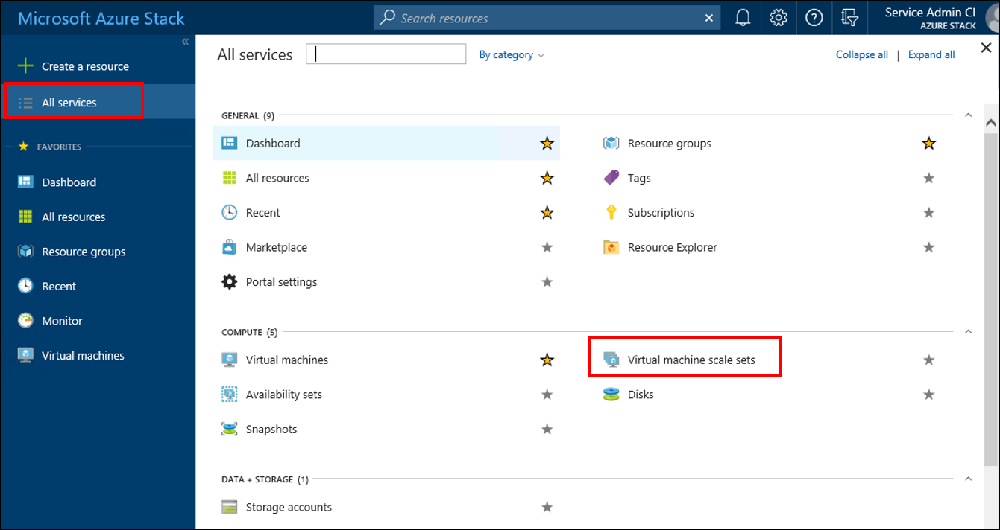
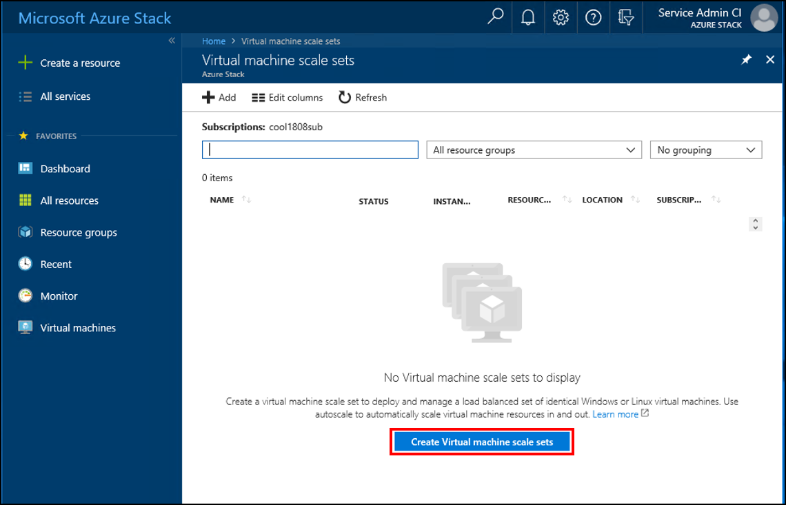
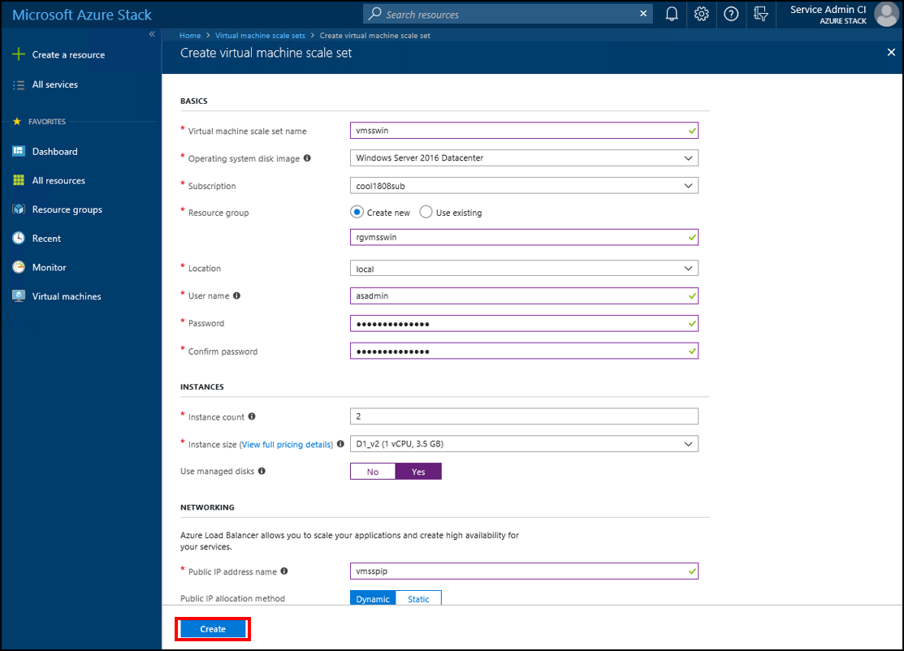
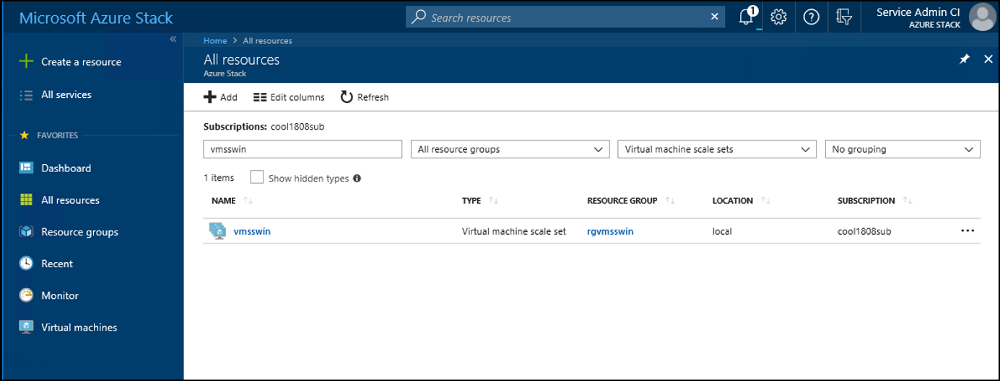
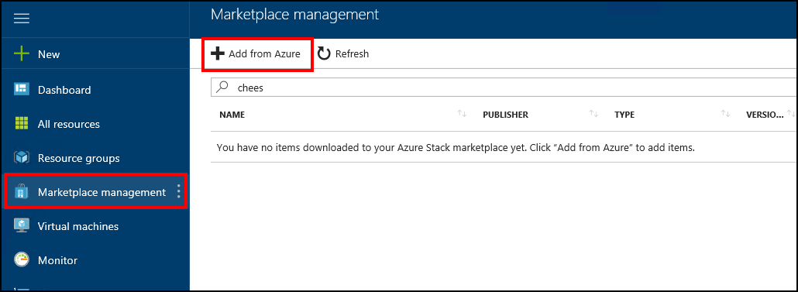
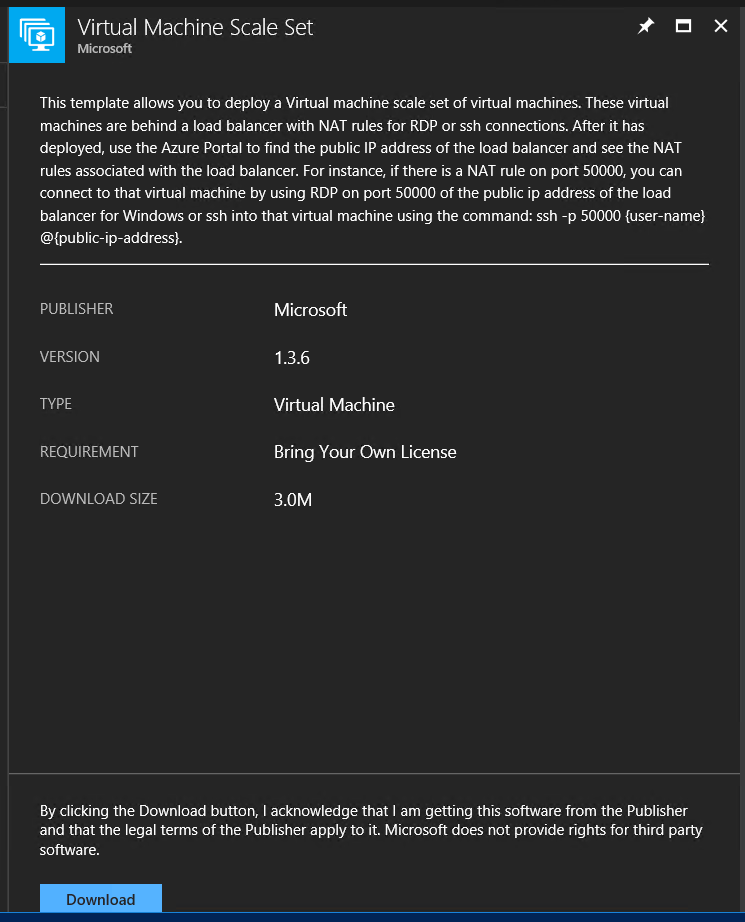
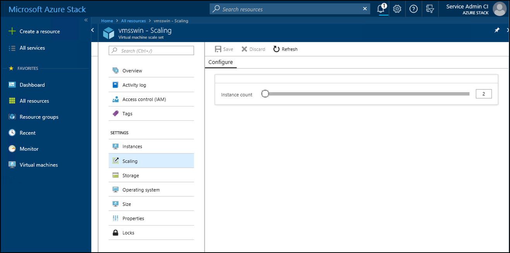

# Make Virtual Machine Scale Sets available in Azure Stack

*Applies to: Azure Stack integrated systems and Azure Stack Development Kit*
  
Virtual machine scale sets are an Azure Stack compute resource. You can use them to deploy and manage a set of identical virtual machines. With all virtual machines configured the same, scale sets don’t require pre-provisioning of virtual machines. It's easier to build large-scale services that target big compute, big data, and containerized workloads.

This article guides you through the process to make scale sets available in the Azure Stack Marketplace. After you complete this procedure, your users can add virtual machine scale sets to their subscriptions.

Virtual machine scale sets on Azure Stack are like virtual machine scale sets on Azure. For more information, see the following videos:
* [Mark Russinovich talks Azure scale sets](https://channel9.msdn.com/Blogs/Regular-IT-Guy/Mark-Russinovich-Talks-Azure-Scale-Sets/)
* [Virtual Machine Scale Sets with Guy Bowerman](https://channel9.msdn.com/Shows/Cloud+Cover/Episode-191-Virtual-Machine-Scale-Sets-with-Guy-Bowerman)

On Azure Stack, virtual machine scale sets don't support auto-scale. You can add more instances to a scale set using Resource Manager templates, CLI, or PowerShell.

## Prerequisites

- **The Marketplace**  
    Register Azure Stack with global Azure to enable the availability of items in the Marketplace. Follow the instructions in [Register Azure Stack with Azure](azure-stack-registration.md).
- **Operating system image**  
  Before a virtual machine scale set (VMSS) can be created, you must download the VM images for use in the VMSS from the [Azure Stack Marketplace](azure-stack-download-azure-marketplace-item.md). The images must already be present before a user can create a new VMSS. 


## Use the Azure Stack portal 

>[!NOTE]  
> The information in this section applies when you use  Azure Stack version 1808 or later. If your version is 1807 or earlier, see [Add the Virtual Machine Scale Set (Prior to 1808)](#add-the-virtual-machine-scale-set-(prior-to-version-1808)).

1. Sign in to the Azure Stack portal. Then, go to **All services** > **Virtual machine scale sets**, and then under *COMPUTE*, select **Virtual machine scale sets**. 
   

2. Select Create ***Virtual machine scale sets***.
   

3. Fill in the empty fields, choose from the dropdowns for *Operating system disk image*, *Subscription*, and *Instance size*. Select **Yes** for *Use managed disks*. Then, select **Create**.
    

4. To see your new virtual machine scale set, go to **All resources**, search for the virtual machine scale set name, and then select its name in the search. 
   


## Add the Virtual Machine Scale Set (prior to version 1808)
>[!NOTE]  
> The information in this section applies when you use a version of Azure Stack prior to 1808. If you use version 1808 or later, see [Use the Azure Stack portal](#use-the-azure-stack-portal).

1. Open the Azure Stack Marketplace and connect to Azure. Select **Marketplace management**> **+ Add from Azure**.

    

2. Add and download the Virtual Machine Scale Set marketplace item.

    

## Update images in a Virtual Machine Scale Set

After you create a virtual machine scale set, users can update images in the scale set without the scale set having to be recreated. The process to update an image depends on the following scenarios:

1. Virtual machine scale set deployment template **specifies latest** for *version*:  

   When the *version* is set as **latest** in the *imageReference* section of the template for a scale set, scale up operations on the scale set use the newest available version of the image for the scale set instances. After a scale up is complete, you can delete older virtual machine scale sets instances.  (The values for *publisher*, *offer*, and *sku* remain unchanged). 

   The following JSON example specifies *latest*:  

    ```Json  
    "imageReference": {
        "publisher": "[parameters('osImagePublisher')]",
        "offer": "[parameters('osImageOffer')]",
        "sku": "[parameters('osImageSku')]",
        "version": "latest"
        }
    ```

   Before scale up can use a new image, you must download that new image:  

   - When the image on the Marketplace is a newer version than the image in the scale set: Download the new image that replaces the older image. After the image is replaced, a user can proceed to scale up. 

   - When the image version on the Marketplace is the same as the image in the scale set: Delete the image that is in use in the scale set, and then download the new image. During the time between the removal of the original image and the download of the new image, you cannot scale up. 
      
     This process is required  to resyndicate images that make use of the sparse file format, introduced with version 1803. 
 

2. Virtual machine scale set deployment template **does not specify latest** for *version* and specifies a version number instead:  

    If you download an image with a newer version (which changes the available version), the scale set can't scale up. This is by design as the image version specified in the scale set template must be available.  

For more information, see [operating system disks and images](.\user\azure-stack-compute-overview.md#operating-system-disks-and-images).  


## Scale a virtual machine scale set
You can scale the size of a *virtual machine scale set* to make it larger or smaller.  

1. In the portal, select your scale set and then select **Scaling**.
2. Use the slide-bar to set the new level of scaling for this virtual machine scale set, and then select **Save**.
     


## Remove a Virtual Machine Scale Set

To remove a virtual machine scale set gallery item, run the following PowerShell command:

```PowerShell  
    Remove-AzsGalleryItem
````

> [!NOTE]
> The gallery item may not be removed immediately. You night need to refresh the portal several times before the item shows as removed from the Marketplace.

## Next steps
[Frequently asked questions for Azure Stack](azure-stack-faq.md)