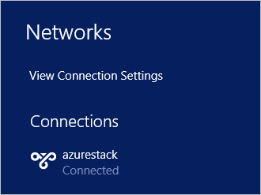

# Connect to Azure Stack

To manage resources, you must connect to the Azure Stack Development Kit. This topic details the steps required to connect to the development kit. You can use either of the following connection options:

* [Remote Desktop](#connect-with-remote-desktop): lets a single concurrent user quickly connect from the development kit.
* [Virtual Private Network (VPN)](#connect-with-vpn): lets multiple concurrent users connect from clients outside of the Azure Stack infrastructure (requires configuration).

## Connect with Remote Desktop
With a Remote Desktop connection, a single concurrent user can work with the portal to manage resources.

1. Open a Remote Desktop Connection and connect to the development kit. Enter **AzureStack\AzureStackAdmin** as the username, and the administrative password you provided during Azure Stack setup.  

2. From the development kit computer, open Server Manager, click **Local Server**, turn off Internet Explorer Enhanced Security, and then close Server Manager.

3. To open the user [portal](azure-stack-key-features.md#portal), navigate to (https://portal.local.azurestack.external/) and sign in using user credentials. To open the administrator [portal](azure-stack-key-features.md#portal), navigate to (https://adminportal.local.azurestack.external/) and sign in using the Azure Active Directory credentials specified during installation.

## Connect with VPN

In an Azure Stack Development Kit environment, you can use a Virtual Private Network (VPN) to connect your local Windows-based computer to Azure Stack. VPN connectivity is supported in both Azure Active Directory(AAD) and Active Directory Federation Services(AD FS) based deployments. VPN connections enable multiple clients to connect to Azure Stack at the same time.
 
Through the VPN connection, you can access the administrator portal, user portal, and locally installed tools such as Visual Studio and PowerShell to manage Azure Stack resources.

> [!NOTE] 
> This VPN connection does not provide connectivity to Azure Stack infrastructure VMs. 

The following sections describe the steps that are required to establish VPN connectivity to Azure Stack.

### Prerequisites

* Install [Azure Stack compatible Azure PowerShell](azure-stack-powershell-install.md) on your local computer.  
* Download the [tools required to work with Azure Stack](azure-stack-powershell-download.md) to your local computer.  

### Import the Connect PowerShell module

After you download the tools, navigate to the downloaded folder and import the **Connect** PowerShell module onto your local Windows-based computer by using the following command:

```PowerShell
Set-ExecutionPolicy RemoteSigned
Import-Module .\Connect\AzureStack.Connect.psm1 
```

### Configure VPN to Azure Stack Development Kit

To create a VPN connection to the development kit, run the following steps on your local Windows-based computer:

1. Add the development kit computer’s host IP address & certificate authority (CA) to the list of trusted hosts on your client computer by running the following script in an elevated PowerShell session:

    ```PowerShell
    #Change the IP address in the following command to match your Azure Stack host IP address
    $hostIP = "<Azure Stack host IP address>"
    
    # Change the password in the following command to administrator password that is provided when deploying Azure Stack. 
    $Password = ConvertTo-SecureString `
      "<Administrator password provided when deploying Azure Stack>" `
      -AsPlainText `
      -Force
    
    #Add host IP and certificate authority to the to trusted hosts
    Set-Item wsman:\localhost\Client\TrustedHosts `
      -Value $hostIP `
      -Concatenate
    
    Set-Item wsman:\localhost\Client\TrustedHosts `
      -Value mas-ca01.azurestack.local `
      -Concatenate
    ```

2. Get the Azure Stack host computer’s NAT IP address. If you do not remember the NAT IP address of the development kit instance you are trying to connect to, you can get it by using the `Get-AzureStackNatServerAddress` command:

    ```PowerShell
    # Get host computer's NAT IP address
    $natIp = Get-AzureStackNatServerAddress `
      -HostComputer $hostIP `
      -Password $Password
    ```
      

    This command remotes into the **MAS-BGPNAT01** infrastructure VM and gets the NAT IP address.  

3. Create a VPN connection entry for your local user by using the `Add-AzureStackVpnConnection` command:

    ```PowerShell
    Add-AzureStackVpnConnection `
      -ServerAddress $natIp `
      -Password $Password
    ```
      

    If the connection succeeds, you should see **azurestack** in your list of VPN connections.

      


4.	Connect to the Azure Stack instance by using either of the following methods:  

    a.	`Connect-AzureStackVpn` command: 
    
    ```PowerShell
    Connect-AzureStackVpn `
      -Password $Password
    ```
    
      

    When prompted, trust the Azure Stack host and install the certificate from **AzureStackCertificateAuthority** into your local computer’s certificate store. (the prompt might appear behind the PowerShell session window). 

    b.	Open your local computer’s **Network Settings** > **VPN** >click **azurestack** > **connect**

      

    At the sign-in prompt, enter the username (AzureStack\AzureStackAdmin) and the password. If the connection succeeds, the azurestack VPN should be in a connected state.

### Test the VPN connectivity

To test the portal connection, open an Internet browser and navigate to either the user portal (https://portal.local.azurestack.external/) or the administrator portal (https://adminportal.local.azurestack.external/), sign in and create resources.  

## Next steps

[Make virtual machines available to your Azure Stack users](azure-stack-tutorial-tenant-vm.md)

