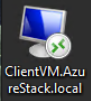
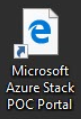

<properties
	pageTitle="Connect to Microsoft Azure Stack POC | Microsoft Azure"
	description="Learn how to connect to the Azure Stack POC portal as a service administrator or tenant."
	services="azure-stack"
	documentationCenter=""
	authors="ErikjeMS"
	manager="byronr"
	editor=""/>

<tags
	ms.service="azure-stack"
	ms.workload="na"
	ms.tgt_pltfrm="na"
	ms.devlang="na"
	ms.topic="get-started-article"
	ms.date="08/01/2016"
	ms.author="erikje"/>

# Log in to the Azure Stack POC virtual machine

You can log in to the Azure Stack POC virtual machine as a

- [**service administrator**](#log-in-as-a-service-administrator) to manage resource providers, tenant offers, plans, services, quotas, and pricing.

or

- [**tenant**](#log-in-as-a-tenant) to provision, monitor, and manage services that you're subscribe to, like Web Apps, storage, and virtual machines.

## Log in as a service administrator

1.  Log in to the Azure Stack POC physical machine.

2.  Double-click the **ClientVM.AzureStack.local.rdp** desktop icon to open a Remote Desktop Connection to the client virtual machine.
 
    
    
    This automatically uses the AzureStack\\AzureStackUser account that was created by the deployment script. Use the admin password you gave in step 5 of the script process at the **Enter the password for the built-in administrator** prompt.

3.  On the ClientVM.AzureStack.local desktop, double-click **Microsoft Azure Stack POC Portal** icon (https://portal.azurestack.local/) to open the [portal](azure-stack-key-features.md#portal).

    

4.  Log in using the service administrator account.

## Log in as a tenant

A service administrator can log in as a tenant to test the plans, offers, and subscriptions that their tenants might use.
If you don’t already have one, [Create a tenant account](azure-stack-add-new-user-aad.md) before you log in.

1.  Log in to the Azure Stack physical machine.

2.  Double-click the **ClientVM.AzureStack.local.rdp** desktop icon to open a Remote Desktop Connection to the client virtual machine. 

    

    This automatically uses the AzureStack\\AzureStackUser account that was created by the deployment script. Use the admin password you gave in step 5 of the script process at the **Enter the password for the built-in administrator** prompt.

3.  On the ClientVM.AzureStack.local desktop, double-click **Microsoft Azure Stack POC Portal** icon (https://portal.azurestack.local/) to open the [portal](azure-stack-key-features.md#portal).

    

4.  Log in using a tenant account.

RDP may restrict how many users can access the physical Microsoft Azure POC host. To enable multiple users, see [Enable multiple concurrent user connections](azure-stack-enable-multiple-concurrent-users.md).

## Next steps

[First tasks](azure-stack-first-scenarios.md)
