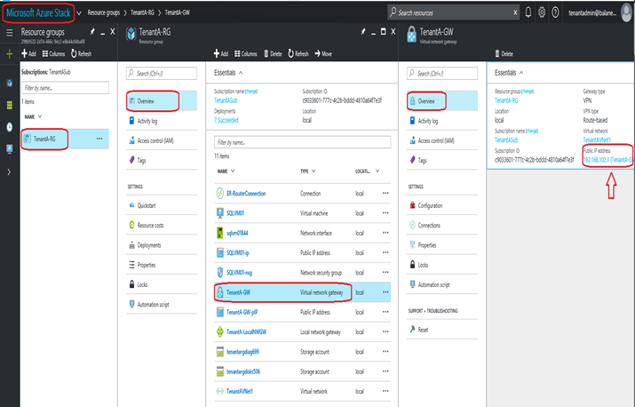

# Connect Azure Stack to Azure using ExpressRoute

*Applies to: Azure Stack integrated systems and Azure Stack Development Kit*

There are two supported methods to connect virtual networks in Azure Stack to virtual networks in Azure:
   * **Site-to-Site**

     A VPN connection over IPsec (IKE v1 and IKE v2). This type of connection requires a VPN device or RRAS. For more information, see [Connect Azure Stack to Azure using VPN](azure-stack-connect-vpn.md).
   * **ExpressRoute**

     A direct connection to Azure from your Azure Stack deployment. ExpressRoute is **not** a VPN connection over the public Internet. For more information about Azure ExpressRoute, see [ExpressRoute overview](../expressroute/expressroute-introduction.md).

This article shows an example using ExpressRoute to connect Azure Stack to Azure.
## Requirements
The following are specific requirements to connect Azure Stack and Azure using ExpressRoute:
* An Azure subscription to create an ExpressRoute circuit and VNets in Azure.
* A provisioned ExpressRoute circuit through a [connectivity provider](../expressroute/expressroute-locations.md).
* A router that has the ExpressRoute circuit connected to its WAN ports.
* The LAN side of the router is linked to the Azure Stack Multitenant Gateway.
* The router must support Site-to-Site VPN connections between its LAN interface and Azure Stack Multitenant Gateway.
* If more than one tenant is added in your Azure Stack deployment, the router must be able to create multiple VRFs (Virtual Routing and Forwarding).

The following diagram shows a conceptual networking view after you complete the configuration:


**Diagram 1**

The following architecture diagram shows how multiple tenants connect from the Azure Stack infrastructure through the ExpressRoute router to Azure at the Microsoft edge:


**Diagram 2**

The example shown in this article uses the same architecture to connect to Azure via ExpressRoute private peering. It is done using a Site-to-Site VPN connection from the virtual network gateway in Azure Stack to an ExpressRoute router. The following steps in this article show how to create an end-to-end connection between two VNets from two different tenants in Azure Stack to their respective VNets in Azure. You can choose to add as many tenant VNets and replicate the steps for each tenant or use this example to deploy just a single tenant VNet.

## Configure Azure Stack
Now you create the resources you need to set up your Azure Stack environment as a tenant. The following steps illustrate what you need to do. These instructions show how to create resources using the Azure Stack portal, but you can also use PowerShell.


### Before you begin
Before you start the configuration, you need:
* An Azure Stack deployment.

   For information about deploying Azure Stack Development Kit, see [Azure Stack Development Kit deployment quickstart](azure-stack-deploy-overview.md).
* An offer on Azure Stack that your user can subscribe to.

  For instructions, see [Make virtual machines available to your Azure Stack users](azure-stack-tutorial-tenant-vm.md).

### Create network resources in Azure Stack

Use the following procedures to create the required network resources in Azure Stack for each tenant:

#### Create the virtual network and VM subnet
1. Sign in the user portal with a user (tenant) account.

2. In the portal, click **New**.

   

3. Select **Networking** from the Marketplace menu.

4. Click **Virtual network** on the menu.

5. Type the values into the appropriate fields using the following table:

   |Field  |Value  |
   |---------|---------|
   |Name     |Tenant1VNet1         |
   |Address space     |10.1.0.0/16|
   |Subnet name     |Tenant1-Sub1|
   |Subnet address range     |10.1.1.0/24|

6. You should see the Subscription you created earlier populated in the **Subscription** field.

    a. For Resource Group, you can either create a Resource Group or if you already have one, select **Use existing**.

    b. Verify the default location.

    c. Click **Pin to dashboard**.

    d. Click **Create**.


#### Create the gateway subnet
1. Open the Virtual Network resource you created (Tenant1VNet1) from
   the dashboard.
2. On the Settings section, select **Subnets**.
3. Click **Gateway Subnet** to add a gateway subnet to
   the virtual network.
   
    
4. The name of the subnet is set to **GatewaySubnet** by default.
   Gateway subnets are special and must have this specific name to function properly.
5. In the **Address range** field, verify the address is **10.1.0.0/24**.
6. Click **OK** to create the gateway subnet.

#### Create the virtual network gateway
1. In the Azure Stack user portal, click **New**.
   
2. Select **Networking** from the Marketplace menu.
3. Select **Virtual network gateway** from the list of
   network resources.
4. In the **Name** field type **GW1**.
5. Click the **Virtual network** item to choose a virtual network.
   Select **Tenant1VNet1** from the list.
6. Click the **Public IP address** menu item. When the **Choose public
   IP address** section opens click **Create new**.
7. In the **Name** field, type **GW1-PiP** and click **OK**.
8. The **VPN type** should have **Route-based** selected by default.
    Keep this setting.
9. Verify that **Subscription** and **Location** are correct. You can pin
    the resource to the Dashboard if you want. Click **Create**.

#### Create the local network gateway

The purpose of the Local network gateway resource is to indicate the remote gateway at the other end of the VPN connection. For this example, the remote side is the LAN subinterface of the ExpressRoute router. For Tenant 1 in this example, the remote address is 10.60.3.255 as shown in Diagram 2.

1. Log in to the Azure Stack physical machine.
2. Sign in to the user portal with your user account and click **New**.
3. Select **Networking** from the Marketplace menu.
4. Select **local network gateway** from the list of resources.
5. In the **Name** field type **ER-Router-GW**.
6. For the **IP address** field, refer to Diagram 2. The IP address of the ExpressRoute router's LAN subinterface for Tenant 1 is 10.60.3.255. For your own environment, type the IP address of your router's corresponding interface.
7. In the **Address Space** field, type the address space of the VNets that you want to connect to in Azure. For this example, refer to Diagram 2. For Tenant 1, notice that the required subnets are **192.168.2.0/24** (this is the Hub Vnet in Azure) and **10.100.0.0/16** (this is the Spoke VNet in Azure). Type the corresponding subnets for your own environment.
   > [!IMPORTANT]
   > This example assumes you are using static routes for the Site-to-Site VPN connection between the Azure Stack gateway and the ExpressRoute router.

8. Verify that your **Subscription**, **Resource Group**, and
   **Location** are all correct and click **Create**.

#### Create the connection
1. In the Azure Stack user portal, click **New**.
2. Select **Networking** from the Marketplace menu.
3. Select **Connection** from the list of resources.
4. In the **Basics** settings section, choose **Site-to-site (IPSec)** as
   the **Connection type**.
5. Select the **Subscription**, **Resource Group**, and **Location** and
   click **OK**.
6. In the **Settings** section,  click **Virtual network gateway** click **GW1**.
7. Click **Local network gateway**, and click **ER Router GW**.
8. In the **Connection Name** field, type **ConnectToAzure**.
9. In the **Shared key (PSK)** field, type **abc123** and click **OK**.
10. On the **Summary** section, click **OK**.

    After the connection is created, you can see the public IP address used by the virtual network gateway. To find the address in the Azure Stack portal, browse to your Virtual network gateway. In **Overview**, find the **Public IP address**. Note this address; you will use it as the *Internal IP address* in the next section (if applicable for your deployment).

    

#### Create a virtual machine
To validate data traveling through the VPN Connection, you
need virtual machines to send and receive data in the Azure Stack Vnet. Create a virtual machine now and put it in your VM subnet in your virtual network.

1. In the Azure Stack user portal, click **New**.
2. Select **Virtual Machines** from the Marketplace menu.
3. In the list of virtual machine images, select the **Windows Server 2016 Datacenter Eval** image and click **Create**.
4. On the **Basics** section, in the **Name** field type **VM01**.
5. Type a valid user name and password. You’ll use this account to log
   in to the VM after it has been created.
6. Provide a **Subscription**, **Resource Group**, and **Location** and
   then click **OK**.
7. On the **Size** section, click a virtual machine size for this instance and then
   click **Select**.
8. On the **Settings** section, you can accept the defaults. But ensure
   the virtual network selected is **Tenant1VNet1** and the subnet is
   set to **10.1.1.0/24**. Click **OK**.
9. Review the settings on the **Summary** section and click **OK**.

For each tenant VNet you want to connect, repeat the previous steps from **Create the virtual network and VM subnet** through **Create a virtual machine** sections.

### Configure the NAT virtual machine for gateway traversal
> [!IMPORTANT]
> This section is for Azure Stack Development Kit deployments only. The NAT is not needed for multi-node deployments.

The Azure Stack Development Kit is self-contained and isolated from the
network on which the physical host is deployed. So, the “External” VIP network
that the gateways are connected to is not external, but instead
is hidden behind a router doing Network Address Translation (NAT).
 
The router is a Windows Server virtual machine (**AzS-BGPNAT01**) running the
Routing and Remote Access Services (RRAS) role in the Azure Stack Development Kit
infrastructure. You must configure NAT on the AzS-BGPNAT01 virtual machine to allow the Site-to-Site VPN Connection to connect on both ends.

#### Configure the NAT

1. Log in to the Azure Stack physical machine with your administrator account.
2. Copy and edit the following PowerShell script and run in an elevated Windows PowerShell ISE. Replace your administrator password. The address returned is your *External BGPNAT address*.

   ```
   cd \AzureStack-Tools-master\connect
   Import-Module .\AzureStack.Connect.psm1
   $Password = ConvertTo-SecureString "<your administrator password>" `
    -AsPlainText `
    -Force
   Get-AzureStackNatServerAddress `
    -HostComputer "azs-bgpnat01" `
    -Password $Password
   ```
4. To configure the NAT, copy and edit the following PowerShell script and run in an elevated Windows PowerShell ISE. Edit the script to replace the *External BGPNAT address* and *Internal IP address* (which you noted previously in the **Create the Connection** section).

   In the example diagrams, the *External BGPNAT address* is 10.10.0.62 and the *Internal IP address* is 192.168.102.1.

   ```
   # Designate the external NAT address for the ports that use the IKE authentication.
   Invoke-Command `
    -ComputerName azs-bgpnat01 `
     {Add-NetNatExternalAddress `
      -NatName BGPNAT `
      -IPAddress <External BGPNAT address> `
      -PortStart 499 `
      -PortEnd 501}
   Invoke-Command `
    -ComputerName azs-bgpnat01 `
     {Add-NetNatExternalAddress `
      -NatName BGPNAT `
      -IPAddress <External BGPNAT address> `
      -PortStart 4499 `
      -PortEnd 4501}
   # create a static NAT mapping to map the external address to the Gateway
   # Public IP Address to map the ISAKMP port 500 for PHASE 1 of the IPSEC tunnel
   Invoke-Command `
    -ComputerName azs-bgpnat01 `
     {Add-NetNatStaticMapping `
      -NatName BGPNAT `
      -Protocol UDP `
      -ExternalIPAddress <External BGPNAT address> `
      -InternalIPAddress <Internal IP address> `
      -ExternalPort 500 `
      -InternalPort 500}
   # Finally, configure NAT traversal which uses port 4500 to
   # successfully establish the complete IPSEC tunnel over NAT devices
   Invoke-Command `
    -ComputerName azs-bgpnat01 `
     {Add-NetNatStaticMapping `
      -NatName BGPNAT `
      -Protocol UDP `
      -ExternalIPAddress <External BGPNAT address> `
      -InternalIPAddress <Internal IP address> `
      -ExternalPort 4500 `
      -InternalPort 4500}
   ```

## Configure Azure
Now that you have completed the Azure Stack configuration, you can deploy some Azure resources. The following diagram shows a sample tenant virtual network in Azure. You can use any name and addressing scheme for your VNet in Azure. However, the address range of the VNets in Azure and Azure Stack must be unique and not overlap.


**Diagram 3**

The resources you deploy in Azure are similar to the resources you deployed in Azure Stack. Similarly, you deploy:
* Virtual networks and subnets
* A gateway subnet
* A virtual network gateway
* A connection
* An ExpressRoute circuit

The example Azure network infrastructure is configured in the following way:
* A standard hub (192.168.2.0/24) and spoke (10.100.0.0./16) VNet model is used.
* The workloads are deployed in the spoke Vnet and the ExpressRoute circuit is connected to the hub VNet.
* The two VNets are linked using the VNet peering feature.

### Configure Vnets
1. Sign in to the Azure portal with your Azure credentials.
2. Create the hub VNet using the 192.168.2.0/24 address space. Create a subnet using the 192.168.2.0/25 address range, and add a gateway subnet using the 192.168.2.128/27 address range.
3. Create the spoke VNet and subnet using the 10.100.0.0/16 address range.


For more information about creating virtual networks in Azure, see [Create a virtual network with multiple subnets](../virtual-network/virtual-networks-create-vnet-arm-pportal.md).

### Configure an ExpressRoute circuit

1. Review the ExpressRoute prerequisites in [ExpressRoute prerequisites & checklist](../expressroute/expressroute-prerequisites.md).
2. Follow the steps in [Create and modify an ExpressRoute circuit](../expressroute/expressroute-howto-circuit-portal-resource-manager.md) to create an ExpressRoute circuit using your Azure subscription.
3. Share the service key from the previous step with your hoster/provider to provision your ExpressRoute circuit at their end.
4. Follow the steps in [Create and modify peering for an ExpressRoute circuit](../expressroute/expressroute-howto-routing-portal-resource-manager.md) to configure private peering on the ExpressRoute circuit.

### Create the virtual network gateway

* Follow the steps in [Configure a virtual network gateway for ExpressRoute using PowerShell](../expressroute/expressroute-howto-add-gateway-resource-manager.md) to create a virtual network gateway for ExpressRoute in the hub VNet.

### Create the connection

* To link the ExpressRoute circuit to the hub VNet, follow the steps in [Connect a virtual network to an ExpressRoute circuit](../expressroute/expressroute-howto-linkvnet-portal-resource-manager.md).

### Peer the Vnets

* Peer the Hub and Spoke VNets using the steps in [Create a virtual network peering using the Azure portal](../virtual-network/virtual-networks-create-vnetpeering-arm-portal.md). When configuring VNet peering, ensure you select the following options:
   * From hub to spoke: **Allow gateway transit**
   * From spoke to hub: **Use remote gateway**

### Create a virtual machine

* Deploy your workload virtual machines into the spoke VNet.

Repeat these steps for any additional tenant VNets you want to connect in Azure through their respective ExpressRoute circuits.

## Configure the router

You can use the following end-to-end infrastructure diagram to guide the configuration of your ExpressRoute Router. This diagram shows two tenants (Tenant 1 and Tenant 2) with their respective Express Route circuits. Each is linked to their own VRF (Virtual Routing and Forwarding) in the LAN and WAN side of the ExpressRoute router to ensure end-to-end isolation between the two tenants. Note the IP addresses used in the router interfaces as you follow the sample configuration.


**Diagram 4**

You can use any router that supports IKEv2 VPN and BGP to terminate the Site-to-Site VPN connection from Azure Stack. The same router is used to connect to Azure using an ExpressRoute circuit. 

Here is a sample configuration from a Cisco ASR 1000 that supports the network infrastructure shown in Diagram 4:

```
ip vrf Tenant 1
 description Routing Domain for PRIVATE peering to Azure for Tenant 1
 rd 1:1
!
ip vrf Tenant 2
 description Routing Domain for PRIVATE peering to Azure for Tenant 2
 rd 1:5
!
crypto ikev2 proposal V2-PROPOSAL2 
description IKEv2 proposal for Tenant 1 
encryption aes-cbc-256
 integrity sha256
 group 2
crypto ikev2 proposal V4-PROPOSAL2 
description IKEv2 proposal for Tenant 2 
encryption aes-cbc-256
 integrity sha256
 group 2
!
crypto ikev2 policy V2-POLICY2 
description IKEv2 Policy for Tenant 1 
match fvrf Tenant 1
 match address local 10.60.3.255
 proposal V2-PROPOSAL2
description IKEv2 Policy for Tenant 2
crypto ikev2 policy V4-POLICY2 
 match fvrf Tenant 2
 match address local 10.60.3.251
 proposal V4-PROPOSAL2
!
crypto ikev2 profile V2-PROFILE
description IKEv2 profile for Tenant 1 
match fvrf Tenant 1
 match address local 10.60.3.255
 match identity remote any
 authentication remote pre-share key abc123
 authentication local pre-share key abc123
 ivrf Tenant 1
!
crypto ikev2 profile V4-PROFILE
description IKEv2 profile for Tenant 2
 match fvrf Tenant 2
 match address local 10.60.3.251
 match identity remote any
 authentication remote pre-share key abc123
 authentication local pre-share key abc123
 ivrf Tenant 2
!
crypto ipsec transform-set V2-TRANSFORM2 esp-gcm 256 
 mode tunnel
crypto ipsec transform-set V4-TRANSFORM2 esp-gcm 256 
 mode tunnel
!
crypto ipsec profile V2-PROFILE
 set transform-set V2-TRANSFORM2 
 set ikev2-profile V2-PROFILE
!
crypto ipsec profile V4-PROFILE
 set transform-set V4-TRANSFORM2 
 set ikev2-profile V4-PROFILE
!
interface Tunnel10
description S2S VPN Tunnel for Tenant 1
 ip vrf forwarding Tenant 1
 ip address 11.0.0.2 255.255.255.252
 ip tcp adjust-mss 1350
 tunnel source TenGigabitEthernet0/1/0.211
 tunnel mode ipsec ipv4
 tunnel destination 10.10.0.62
 tunnel vrf Tenant 1
 tunnel protection ipsec profile V2-PROFILE
!
interface Tunnel20
description S2S VPN Tunnel for Tenant 2
 ip vrf forwarding Tenant 2
 ip address 11.0.0.2 255.255.255.252
 ip tcp adjust-mss 1350
 tunnel source TenGigabitEthernet0/1/0.213
 tunnel mode ipsec ipv4
 tunnel destination 10.10.0.62
 tunnel vrf VNET3
 tunnel protection ipsec profile V4-PROFILE
!
interface GigabitEthernet0/0/1
 description PRIMARY Express Route Link to AZURE over Equinix
 no ip address
 negotiation auto
!
interface GigabitEthernet0/0/1.100
description Primary WAN interface of Tenant 1
 description PRIMARY ER link supporting Tenant 1 to Azure
 encapsulation dot1Q 101
 ip vrf forwarding Tenant 1
 ip address 192.168.1.1 255.255.255.252
!
interface GigabitEthernet0/0/1.102
description Primary WAN interface of Tenant 2
 description PRIMARY ER link supporting Tenant 2 to Azure
 encapsulation dot1Q 102
 ip vrf forwarding Tenant 2
 ip address 192.168.1.17 255.255.255.252
!
interface GigabitEthernet0/0/2
 description BACKUP Express Route Link to AZURE over Equinix
 no ip address
 negotiation auto
!
interface GigabitEthernet0/0/2.100
description Secondary WAN interface of Tenant 1
 description BACKUP ER link supporting Tenant 1 to Azure
 encapsulation dot1Q 101
 ip vrf forwarding Tenant 1
 ip address 192.168.1.5 255.255.255.252
!
interface GigabitEthernet0/0/2.102
description Secondary WAN interface of Tenant 2 
description BACKUP ER link supporting Tenant 2 to Azure
 encapsulation dot1Q 102
 ip vrf forwarding Tenant 2
 ip address 192.168.1.21 255.255.255.252
!
interface TenGigabitEthernet0/1/0
 description Downlink to ---Port 1/47
 no ip address
!
interface TenGigabitEthernet0/1/0.211
 description LAN interface of Tenant 1
description Downlink to --- Port 1/47.211
 encapsulation dot1Q 211
 ip vrf forwarding Tenant 1
 ip address 10.60.3.255 255.255.255.254
!
interface TenGigabitEthernet0/1/0.213
description LAN interface of Tenant 2
 description Downlink to --- Port 1/47.213
 encapsulation dot1Q 213
 ip vrf forwarding Tenant 2
 ip address 10.60.3.251 255.255.255.254
!
router bgp 65530
 bgp router-id <removed>
 bgp log-neighbor-changes
 description BGP neighbor config and route advertisement for Tenant 1 VRF 
 address-family ipv4 vrf Tenant 1
  network 10.1.0.0 mask 255.255.0.0
  network 10.60.3.254 mask 255.255.255.254
  network 192.168.1.0 mask 255.255.255.252
  network 192.168.1.4 mask 255.255.255.252
  neighbor 10.10.0.62 remote-as 65100
  neighbor 10.10.0.62 description VPN-BGP-PEER-for-Tenant 1
  neighbor 10.10.0.62 ebgp-multihop 5
  neighbor 10.10.0.62 activate
  neighbor 10.60.3.254 remote-as 4232570301
  neighbor 10.60.3.254 description LAN peer for CPEC:INET:2112 VRF
  neighbor 10.60.3.254 activate
  neighbor 10.60.3.254 route-map BLOCK-ALL out
  neighbor 192.168.1.2 remote-as 12076
  neighbor 192.168.1.2 description PRIMARY ER peer for Tenant 1 to Azure
  neighbor 192.168.1.2 ebgp-multihop 5
  neighbor 192.168.1.2 activate
  neighbor 192.168.1.2 soft-reconfiguration inbound
  neighbor 192.168.1.2 route-map Tenant 1-ONLY out
  neighbor 192.168.1.6 remote-as 12076
  neighbor 192.168.1.6 description BACKUP ER peer for Tenant 1 to Azure
  neighbor 192.168.1.6 ebgp-multihop 5
  neighbor 192.168.1.6 activate
  neighbor 192.168.1.6 soft-reconfiguration inbound
  neighbor 192.168.1.6 route-map Tenant 1-ONLY out
  maximum-paths 8
 exit-address-family
 !
description BGP neighbor config and route advertisement for Tenant 2 VRF 
address-family ipv4 vrf Tenant 2
  network 10.1.0.0 mask 255.255.0.0
  network 10.60.3.250 mask 255.255.255.254
  network 192.168.1.16 mask 255.255.255.252
  network 192.168.1.20 mask 255.255.255.252
  neighbor 10.10.0.62 remote-as 65300
  neighbor 10.10.0.62 description VPN-BGP-PEER-for-Tenant 2
  neighbor 10.10.0.62 ebgp-multihop 5
  neighbor 10.10.0.62 activate
  neighbor 10.60.3.250 remote-as 4232570301
  neighbor 10.60.3.250 description LAN peer for CPEC:INET:2112 VRF
  neighbor 10.60.3.250 activate
  neighbor 10.60.3.250 route-map BLOCK-ALL out
  neighbor 192.168.1.18 remote-as 12076
  neighbor 192.168.1.18 description PRIMARY ER peer for Tenant 2 to Azure
  neighbor 192.168.1.18 ebgp-multihop 5
  neighbor 192.168.1.18 activate
  neighbor 192.168.1.18 soft-reconfiguration inbound
  neighbor 192.168.1.18 route-map VNET-ONLY out
  neighbor 192.168.1.22 remote-as 12076
  neighbor 192.168.1.22 description BACKUP ER peer for Tenant 2 to Azure
  neighbor 192.168.1.22 ebgp-multihop 5
  neighbor 192.168.1.22 activate
  neighbor 192.168.1.22 soft-reconfiguration inbound
  neighbor 192.168.1.22 route-map VNET-ONLY out
  maximum-paths 8
 exit-address-family
!
ip forward-protocol nd
!
ip as-path access-list 1 permit ^$
ip route vrf Tenant 1 10.1.0.0 255.255.0.0 Tunnel10
ip route vrf Tenant 2 10.1.0.0 255.255.0.0 Tunnel20
!
ip prefix-list BLOCK-ALL seq 5 deny 0.0.0.0/0 le 32
!
route-map BLOCK-ALL permit 10
 match ip address prefix-list BLOCK-ALL
!
route-map VNET-ONLY permit 10
 match as-path 1
!
```

## Test the connection

Test your connection after establishing the Site-to-Site connection and the ExpressRoute circuit. This task is simple.  Log on to one of the virtual machines you created in your Azure VNet and ping the virtual machine you created in the Azure Stack environment, or vice versa. 

To ensure you are sending the traffic through the Site-to-Site and ExpressRoute connections, you must ping the dedicated IP (DIP) address of the virtual machine at both ends and not the VIP address of the virtual machine. So, you must find and note the address on the other end of the connection.

### Allow ICMP in through the firewall
By default, Windows Server 2016 does not allow ICMP packets in through the firewall. So, for every virtual machine you use in the test, run the following cmdlet in an elevated PowerShell window:


   ```
   New-NetFirewallRule `
    –DisplayName “Allow ICMPv4-In” `
    –Protocol ICMPv4
   ```

### Ping the Azure Stack virtual machine

1. Sign in to the Azure Stack user portal using a tenant account.
2. Click **Virtual Machines** in the left navigation bar.
3. Find the virtual machine that you previously created and click it.
4. On the section for the virtual machine, click **Connect**.
5. Open an elevated PowerShell window, and type **ipconfig /all**.
6. Find the IPv4 Address in the output and note it. Ping this address from the virtual machine in the Azure VNet. In the example environment, the address is from the 10.1.1.x/24 subnet. In your environment, the address might be different. However, it should be within the subnet you created for the Tenant VNet subnet.


### View data transfer statistics

If you want to know how much traffic is passing through your connection, you can find this information on the Connection section in the Azure Stack user portal. This information is also another good way to verify that the ping you just sent actually
went through the VPN and ExpressRoute connections.

1. Sign in to the Microsoft Azure Stack user portal using your tenant account.
2. Navigate to the resource group where your VPN Gateway was created and select the **Connections** object type.
3. Click the **ConnectToAzure** connection in the list.
4. On the **Connection** section, you can see statistics for **Data in** and **Data out**. You should see some non-zero values there.

   

## Next steps
[Deploy apps to Azure and Azure Stack](azure-stack-solution-pipeline.md)