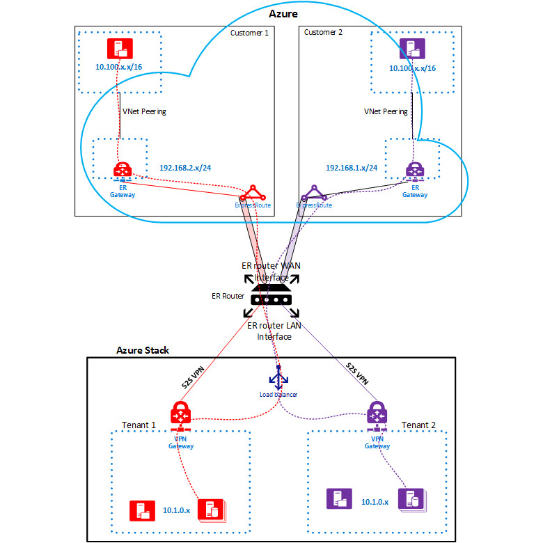
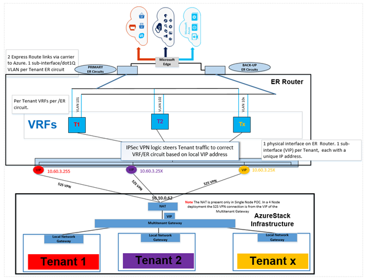
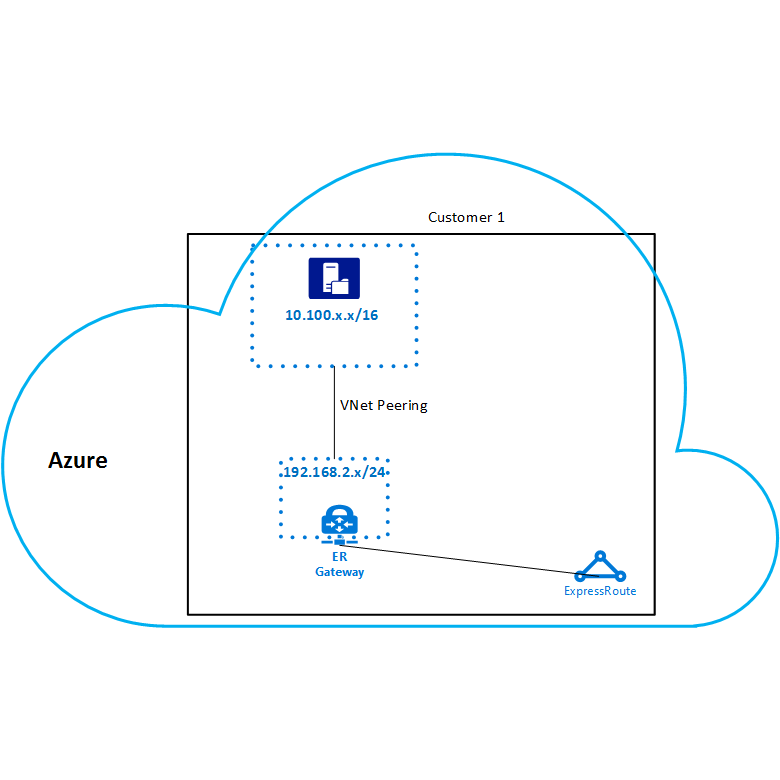
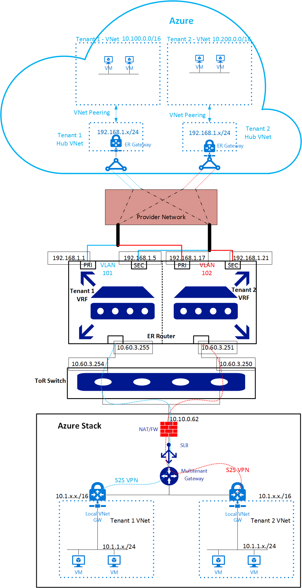
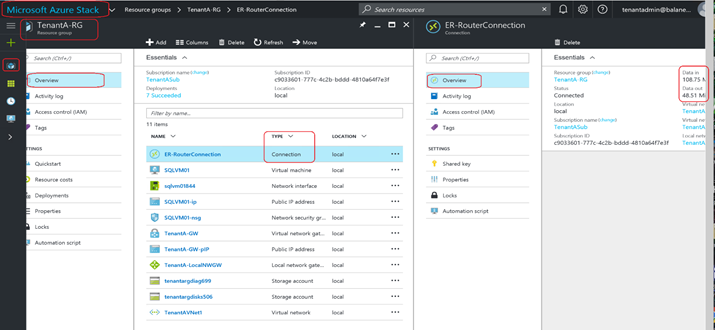

# Connect Azure Stack to Azure using Azure ExpressRoute

*Applies to: Azure Stack integrated systems and Azure Stack Development Kit*

This article shows you how to connect an Azure Stack  virtual network to an Azure virtual network by using a Microsoft Azure ExpressRoute direct connection.

You can use this article as a tutorial and use the examples to set up the same test environment. Or, you can use the article as a walkthrough that guides you through setting up your own ExpressRoute environment.

## Overview, assumptions, and prerequisites

Azure ExpressRoute lets you extend your on-premises networks into the Microsoft cloud over a private connection supplied by a connectivity provider. ExpressRoute is not a VPN connection over the public Internet.

For more information about Azure ExpressRoute, see the [ExpressRoute overview](../expressroute/expressroute-introduction.md).

### Assumptions

This article assumes that:

* You have a working knowledge of Azure.
* You have a basic understanding of Azure Stack.
* You have a basic understanding of networking.

### Prerequisites

To connect Azure Stack and Azure using ExpressRoute, you must meet the following requirements:

* A provisioned [ExpressRoute circuit](../expressroute/expressroute-circuit-peerings.md) through a [connectivity provider](../expressroute/expressroute-locations.md).
* An Azure subscription to create an ExpressRoute circuit and VNets in Azure.
* A router that must:
  * Support Site-to-Site VPN connections between its LAN interface and Azure Stack Multitenant Gateway.
  * Support creating multiple VRFs (Virtual Routing and Forwarding) if there's more than one tenant in your Azure Stack deployment.
* A router that has:
  * A WAN port connected to the ExpressRoute circuit.
  * A LAN port connected to the Azure Stack Multitenant Gateway.

### ExpressRoute network architecture

The next diagram shows the Azure Stack and Azure environments after you finish setting up ExpressRoute using the examples in this article.

*Figure 1. ExpressRoute network*



The next architecture diagram shows how multiple tenants connect from the Azure Stack infrastructure through the ExpressRoute router to Azure at the Microsoft edge.

*Figure 2. Multi-tenant connections*



The example in this article uses the same multi-tenant architecture shown in *Figure 2* to connect Azure Stack to Azure using ExpressRoute private peering. It's done using a Site-to-Site VPN connection from the virtual network gateway in Azure Stack to an ExpressRoute router.

The steps in this article show you how to create an end-to-end connection between two VNets from two different tenants in Azure Stack to corresponding VNets in Azure. Setting up two tenants is optional, you can also use these steps for a single tenant.

## Configure Azure Stack

To set up the Azure Stack environment for the first tenant, use the steps in following diagram as a guide. If you're setting up more than one tenant, repeat these steps.

>[!NOTE]
>These steps show how to create resources using the Azure Stack portal, but you can also use PowerShell.


### Before you begin

Before you start configuring Azure Stack, you need:

* An Azure Stack integrated system deployment or an Azure Stack Development Kit (ASDK) deployment. For information about deploying the ASDK, see the [Azure Stack Development Kit deployment quickstart](azure-stack-deploy-overview.md).
* An offer in Azure Stack that your users can subscribe to. For more information, see [plans, offers, and subscriptions](azure-stack-plan-offer-quota-overview.md).

### Create network resources in Azure Stack

Use the following procedures to create the required network resources in Azure Stack for a tenant.

#### Create the virtual network and VM subnet

1. Sign in to the user portal with a user (tenant) account.
1. In the portal, select **+ Create a resource**.

1. Under **Azure Marketplace**, select **Networking**.

1. Under **Featured**, select **Virtual network**.

1. Under **Create virtual network**, enter the values shown in the following table in the appropriate fields.

   |Field  |Value  |
   |---------|---------|
   |Name     |Tenant1VNet1         |
   |Address space     |10.1.0.0/16|
   |Subnet name     |Tenant1-Sub1|
   |Subnet address range     |10.1.1.0/24|

1. You should see the Subscription you created earlier populated in the **Subscription** field. For the remaining fields:

    * Under **Resource group**, select **Create new** to create a new resource Group or if you already have one, select **Use existing**.
    * Verify the default **Location**.
    * Select **Create**.
    * (Optional) Select **Pin to dashboard**.

#### Create the gateway subnet

1. Under **Virtual network**, select Tenant1VNet1.
1. Under **SETTINGS**, select **Subnets**.
1. Select **+ Gateway subnet** to add a gateway subnet to the virtual network.
1. The name of the subnet is set to **GatewaySubnet** by default. Gateway subnets are a special case and must use this name to function properly.
1. Verify that the **Address range** is **10.1.0.0/24**.
1. Select **OK** to create the gateway subnet.

#### Create the virtual network gateway

1. In the Azure Stack user portal, select **+ Create a resource**.
1. Under **Azure Marketplace**, select **Networking**.
1. Select **Virtual network gateway** from the list of network resources.
1. In the **Name** field, enter **GW1**.
1. Select **Virtual network**.
1. Select **Tenant1VNet1** from the drop-down list.
1. Select **Public IP address**>**Choose public
   IP address**, and then select **Create new**.
1. In the **Name** field, enter **GW1-PiP** and select **OK**.
1. The **VPN type** should have **Route-based** selected by default. Keep this setting.
1. Verify that **Subscription** and **Location** are correct. Select **Create**.

#### Create the local network gateway

The Local network gateway resource identifies the remote gateway at the other end of the VPN connection. For this example, the remote end of the connection is the LAN subinterface of the ExpressRoute router. For Tenant 1, shown in *Figure 2*, the remote address is 10.60.3.255.

1. Sign in to the Azure Stack user portal with your user account and select **+ Create a resource**.
1. Under **Azure Marketplace**, select **Networking**.
1. Select **local network gateway** from the list of resources.
1. In the **Name** field, enter **ER-Router-GW**.
1. For the **IP address** field, refer to *Figure 2*. The IP address of the ExpressRoute router's LAN subinterface for Tenant 1 is 10.60.3.255. For your own environment, enter the IP address of your router's corresponding interface.
1. In the **Address Space** field, enter the address space of the VNets that you want to connect to in Azure. The subnets for Tenant 1 in *Figure 2* are:

   * 192.168.2.0/24 is the hub VNet in Azure.
   * 10.100.0.0/16 is the spoke VNet in Azure.

   > [!IMPORTANT]
   > This example assumes that you're using static routes for the Site-to-Site VPN connection between the Azure Stack gateway and the ExpressRoute router.

1. Verify that your **Subscription**, **Resource Group**, and **Location** are correct. Select **Create**.

#### Create the connection

1. In the Azure Stack user portal, select **+ Create a resource**.
1. Under **Azure Marketplace**, select **Networking**.
1. Select **Connection** from the list of resources.
1. Under **Basics**, choose **Site-to-site (IPSec)** as
   the **Connection type**.
1. Select the **Subscription**, **Resource group**, and **Location**. Select **OK**.
1. Under **Settings**, select **Virtual network gateway**, and then select **GW1**.
1. Select **Local network gateway**, and then select **ER Router GW**.
1. In the **Connection name** field, enter **ConnectToAzure**.
1. In the **Shared key (PSK)** field, enter **abc123** and then select **OK**.
1. Under **Summary**, select **OK**.

**Get the Virtual network gateway public IP address**

After you create the Virtual network gateway you can get the gateway's public IP address. Make note of this address in case you need it later for your deployment. Depending on your deployment, this address is used as the ***Internal IP address***.

1. In the Azure Stack user portal, select **All resources**.
1. Under **All resources**, select the virtual network gateway, which is **GW1** in the example.
1. Under **Virtual network gateway**, select **Overview** from the list of resources. Alternatively, you can select **Properties**.
1. The IP address that you want to note is listed under **Public IP address**. For the example configuration, this address is 192.68.102.1.

#### Create a virtual machine

To test data traffic over the VPN Connection, you need virtual machines to send and receive data in the Azure Stack VNet. Create a virtual machine and deploy it to the VM subnet for your virtual network.

1. In the Azure Stack user portal, select **+ Create a resource**.
1. Under **Azure Marketplace**, select **Compute**.
1. In the list of virtual machine images, select the **Windows Server 2016 Datacenter Eval** image.

   >[!NOTE]
   >If the image used for this article isn't available, ask your Azure Stack operator to provide a different Windows Server image.

1. In **Create virtual machine**>**Basics**, enter **VM01** as the **Name**.
1. Enter a valid user name and password. You’ll use this account to sign in to the VM after it's been created.
1. Provide a **Subscription**, **Resource group**, and a **Location**. Select **OK**.
1. Under **Choose a size**, select a virtual machine size for this instance, and then select **Select**.
1. Under **Settings**, confirm that:

   * The virtual network is **Tenant1VNet1**.
   * The subnet is set to **10.1.1.0/24**.

   Use the default settings and select **OK**.

1. Under **Summary**, review the VM configuration and then select **OK**.

>[!NOTE]
>
>To add more tenants, repeat the steps you followed in these sections:
>
>* Create the virtual network and VM subnet
>* Create the gateway subnet
>* Create the virtual network gateway
>* Create the local network gateway
>* Create the connection
>* Create a virtual machine
>
>If you're going to use Tenant 2 as an example, remember to change the IP addresses to avoid overlaps.

### Configure the NAT virtual machine for gateway traversal

> [!IMPORTANT]
> This section is for Azure Stack Development Kit deployments only. The NAT isn't needed for multi-node deployments.

The Azure Stack Development Kit is self-contained and isolated from the network where the physical host is deployed. The VIP network that the gateways are connected to isn't external, it's hidden behind a router doing Network Address Translation (NAT).

The router is a Windows Server virtual machine (AzS-BGPNAT01) running the Routing and Remote Access Services (RRAS) role. You must configure NAT on the AzS-BGPNAT01 virtual machine to enable the Site-to-Site VPN Connection to connect on both ends.

#### Configure the NAT

1. Sign in to the Azure Stack host computer with your administrator account.
1. Copy and edit the following PowerShell script.  Replace `"<your administrator password>"` with your administrator password, and then run the script in an elevated PowerShell ISE. This script returns your  *External BGPNAT address*.

   ```PowerShell
   cd \AzureStack-Tools-master\connect
   Import-Module .\AzureStack.Connect.psm1
   $Password = ConvertTo-SecureString "<your administrator password>" `
    -AsPlainText `
    -Force
   Get-AzureStackNatServerAddress `
    -HostComputer "azs-bgpnat01" `
    -Password $Password

   ```

1. To configure the NAT, copy and edit the following PowerShell script. Edit the script to replace the `'<External BGPNAT address>'` and `'<Internal IP address>'` with the following example values:

   * For *External BGPNAT address* use 10.10.0.62
   * For *Internal IP address* use 192.168.102.1

   Run the following script from an elevated PowerShell ISE:

   ```PowerShell
   $ExtBgpNat = '<External BGPNAT address>'
   $IntBgpNat = '<Internal IP address>'

   # Designate the external NAT address for the ports that use the IKE authentication.
   Invoke-Command `
    -ComputerName azs-bgpnat01 `
     {Add-NetNatExternalAddress `
      -NatName BGPNAT `
      -IPAddress $Using:ExtBgpNat `
      -PortStart 499 `
      -PortEnd 501}
   Invoke-Command `
    -ComputerName azs-bgpnat01 `
     {Add-NetNatExternalAddress `
      -NatName BGPNAT `
      -IPAddress $Using:ExtBgpNat `
      -PortStart 4499 `
      -PortEnd 4501}
   # Create a static NAT mapping to map the external address to the Gateway public IP address to map the ISAKMP port 500 for PHASE 1 of the IPSEC tunnel.
   Invoke-Command `
    -ComputerName azs-bgpnat01 `
     {Add-NetNatStaticMapping `
      -NatName BGPNAT `
      -Protocol UDP `
      -ExternalIPAddress $Using:ExtBgpNat `
      -InternalIPAddress $Using:IntBgpNat `
      -ExternalPort 500 `
      -InternalPort 500}
   # Configure NAT traversal which uses port 4500 to  establish the complete IPSEC tunnel over NAT devices.
   Invoke-Command `
    -ComputerName azs-bgpnat01 `
     {Add-NetNatStaticMapping `
      -NatName BGPNAT `
      -Protocol UDP `
      -ExternalIPAddress $Using:ExtBgpNat `
      -InternalIPAddress $Using:IntBgpNat `
      -ExternalPort 4500 `
      -InternalPort 4500}

   ```

## Configure Azure

After you finish configuring Azure Stack, you can deploy the Azure resources. The following diagram shows an example of a tenant virtual network in Azure. You can use any name and addressing scheme for your VNet in Azure. However, the address range of the VNets in Azure and Azure Stack must be unique and not overlap.

*Figure 3. Azure VNets*



The resources you deploy in Azure are similar to the resources you deployed in Azure Stack. You'll deploy the following components:

* Virtual networks and subnets
* A gateway subnet
* A virtual network gateway
* A connection
* An ExpressRoute circuit

The example Azure network infrastructure is configured as follows:

* A standard hub (192.168.2.0/24) and spoke (10.100.0.0./16) VNet model. For more information about a hub-spoke network topology, see [Implement a hub-spoke network topology in Azure](https://docs.microsoft.com/en-us/azure/architecture/reference-architectures/hybrid-networking/hub-spoke).
* The workloads are deployed in the spoke VNet and the ExpressRoute circuit is connected to the hub VNet.
* The two VNets are connected using VNet peering.

### Configure the Azure VNets

1. Sign in to the Azure portal with your Azure credentials.
1. Create the hub VNet using the 192.168.2.0/24 address range.
1. Create a subnet using the 192.168.2.0/25 address range, and add a gateway subnet using the 192.168.2.128/27 address range.
1. Create the spoke VNet and subnet using the 10.100.0.0/16 address range.

For more information about creating virtual networks in Azure, see [Create a virtual network](../virtual-network/manage-virtual-network.md#create-a-virtual-network).

### Configure an ExpressRoute circuit

1. Review the ExpressRoute prerequisites in [ExpressRoute prerequisites & checklist](../expressroute/expressroute-prerequisites.md).

1. Follow the steps in [Create and modify an ExpressRoute circuit](../expressroute/expressroute-howto-circuit-portal-resource-manager.md) to create an ExpressRoute circuit using your Azure subscription.

   >[!NOTE]
   >Give the service key for your circuit to your service  so they can setup your ExpressRoute circuit at their end.

1. Follow the steps in [Create and modify peering for an ExpressRoute circuit](../expressroute/expressroute-howto-routing-portal-resource-manager.md) to configure private peering on the ExpressRoute circuit.

### Create the virtual network gateway

Follow the steps in [Configure a virtual network gateway for ExpressRoute using PowerShell](../expressroute/expressroute-howto-add-gateway-resource-manager.md) to create a virtual network gateway for ExpressRoute in the hub VNet.

### Create the connection

To link the ExpressRoute circuit to the hub VNet, follow the steps in [Connect a virtual network to an ExpressRoute circuit](../expressroute/expressroute-howto-linkvnet-portal-resource-manager.md).

### Peer the VNets

Peer the hub and spoke VNets using the steps in [Create a virtual network peering using the Azure portal](../virtual-network/virtual-networks-create-vnetpeering-arm-portal.md). When configuring VNet peering, make sure you use the following options:

* From the hub to the spoke, **Allow gateway transit**.
* From the spoke to the hub, **Use remote gateway**.

### Create a virtual machine

Deploy your workload virtual machines into the spoke VNet.

Repeat these steps for any additional tenant VNets you want to connect in Azure through their respective ExpressRoute circuits.

## Configure the router

You can use the following *ExpressRoute router configuration* diagram as a guide for configuring your ExpressRoute Router. This diagram shows two tenants (Tenant 1 and Tenant 2) with their respective ExpressRoute circuits. Each tenant is linked to their own VRF (Virtual Routing and Forwarding) in the LAN and WAN side of the ExpressRoute router. This configuration ensures end-to-end isolation between the two tenants. Take note of the IP addresses used in the router interfaces as you follow the configuration example.

*Figure 4. ExpressRoute router configuration*



You can use any router that supports IKEv2 VPN and BGP to terminate the Site-to-Site VPN connection from Azure Stack. The same router is used to connect to Azure using an ExpressRoute circuit.

The following Cisco ASR 1000 Series Aggregation Services Router configuration example supports the network infrastructure shown in the *ExpressRoute router configuration* diagram.

**Cisco ASR 1000 configuration example**

```
ip vrf Tenant 1
 description Routing Domain for PRIVATE peering to Azure for Tenant 1
 rd 1:1
!
ip vrf Tenant 2
 description Routing Domain for PRIVATE peering to Azure for Tenant 2
 rd 1:5
!
crypto ikev2 proposal V2-PROPOSAL2
description IKEv2 proposal for Tenant 1
encryption aes-cbc-256
 integrity sha256
 group 2
crypto ikev2 proposal V4-PROPOSAL2
description IKEv2 proposal for Tenant 2
encryption aes-cbc-256
 integrity sha256
 group 2
!
crypto ikev2 policy V2-POLICY2
description IKEv2 Policy for Tenant 1
match fvrf Tenant 1
 match address local 10.60.3.255
 proposal V2-PROPOSAL2
description IKEv2 Policy for Tenant 2
crypto ikev2 policy V4-POLICY2
 match fvrf Tenant 2
 match address local 10.60.3.251
 proposal V4-PROPOSAL2
!
crypto ikev2 profile V2-PROFILE
description IKEv2 profile for Tenant 1
match fvrf Tenant 1
 match address local 10.60.3.255
 match identity remote any
 authentication remote pre-share key abc123
 authentication local pre-share key abc123
 ivrf Tenant 1
!
crypto ikev2 profile V4-PROFILE
description IKEv2 profile for Tenant 2
 match fvrf Tenant 2
 match address local 10.60.3.251
 match identity remote any
 authentication remote pre-share key abc123
 authentication local pre-share key abc123
 ivrf Tenant 2
!
crypto ipsec transform-set V2-TRANSFORM2 esp-gcm 256
 mode tunnel
crypto ipsec transform-set V4-TRANSFORM2 esp-gcm 256
 mode tunnel
!
crypto ipsec profile V2-PROFILE
 set transform-set V2-TRANSFORM2
 set ikev2-profile V2-PROFILE
!
crypto ipsec profile V4-PROFILE
 set transform-set V4-TRANSFORM2
 set ikev2-profile V4-PROFILE
!
interface Tunnel10
description S2S VPN Tunnel for Tenant 1
 ip vrf forwarding Tenant 1
 ip address 11.0.0.2 255.255.255.252
 ip tcp adjust-mss 1350
 tunnel source TenGigabitEthernet0/1/0.211
 tunnel mode ipsec ipv4
 tunnel destination 10.10.0.62
 tunnel vrf Tenant 1
 tunnel protection ipsec profile V2-PROFILE
!
interface Tunnel20
description S2S VPN Tunnel for Tenant 2
 ip vrf forwarding Tenant 2
 ip address 11.0.0.2 255.255.255.252
 ip tcp adjust-mss 1350
 tunnel source TenGigabitEthernet0/1/0.213
 tunnel mode ipsec ipv4
 tunnel destination 10.10.0.62
 tunnel vrf VNET3
 tunnel protection ipsec profile V4-PROFILE
!
interface GigabitEthernet0/0/1
 description PRIMARY ExpressRoute Link to AZURE over Equinix
 no ip address
 negotiation auto
!
interface GigabitEthernet0/0/1.100
description Primary WAN interface of Tenant 1
 description PRIMARY ER link supporting Tenant 1 to Azure
 encapsulation dot1Q 101
 ip vrf forwarding Tenant 1
 ip address 192.168.1.1 255.255.255.252
!
interface GigabitEthernet0/0/1.102
description Primary WAN interface of Tenant 2
 description PRIMARY ER link supporting Tenant 2 to Azure
 encapsulation dot1Q 102
 ip vrf forwarding Tenant 2
 ip address 192.168.1.17 255.255.255.252
!
interface GigabitEthernet0/0/2
 description BACKUP ExpressRoute Link to AZURE over Equinix
 no ip address
 negotiation auto
!
interface GigabitEthernet0/0/2.100
description Secondary WAN interface of Tenant 1
 description BACKUP ER link supporting Tenant 1 to Azure
 encapsulation dot1Q 101
 ip vrf forwarding Tenant 1
 ip address 192.168.1.5 255.255.255.252
!
interface GigabitEthernet0/0/2.102
description Secondary WAN interface of Tenant 2
description BACKUP ER link supporting Tenant 2 to Azure
 encapsulation dot1Q 102
 ip vrf forwarding Tenant 2
 ip address 192.168.1.21 255.255.255.252
!
interface TenGigabitEthernet0/1/0
 description Downlink to ---Port 1/47
 no ip address
!
interface TenGigabitEthernet0/1/0.211
 description LAN interface of Tenant 1
description Downlink to --- Port 1/47.211
 encapsulation dot1Q 211
 ip vrf forwarding Tenant 1
 ip address 10.60.3.255 255.255.255.254
!
interface TenGigabitEthernet0/1/0.213
description LAN interface of Tenant 2
 description Downlink to --- Port 1/47.213
 encapsulation dot1Q 213
 ip vrf forwarding Tenant 2
 ip address 10.60.3.251 255.255.255.254
!
router bgp 65530
 bgp router-id <removed>
 bgp log-neighbor-changes
 description BGP neighbor config and route advertisement for Tenant 1 VRF
 address-family ipv4 vrf Tenant 1
  network 10.1.0.0 mask 255.255.0.0
  network 10.60.3.254 mask 255.255.255.254
  network 192.168.1.0 mask 255.255.255.252
  network 192.168.1.4 mask 255.255.255.252
  neighbor 10.10.0.62 remote-as 65100
  neighbor 10.10.0.62 description VPN-BGP-PEER-for-Tenant 1
  neighbor 10.10.0.62 ebgp-multihop 5
  neighbor 10.10.0.62 activate
  neighbor 10.60.3.254 remote-as 4232570301
  neighbor 10.60.3.254 description LAN peer for CPEC:INET:2112 VRF
  neighbor 10.60.3.254 activate
  neighbor 10.60.3.254 route-map BLOCK-ALL out
  neighbor 192.168.1.2 remote-as 12076
  neighbor 192.168.1.2 description PRIMARY ER peer for Tenant 1 to Azure
  neighbor 192.168.1.2 ebgp-multihop 5
  neighbor 192.168.1.2 activate
  neighbor 192.168.1.2 soft-reconfiguration inbound
  neighbor 192.168.1.2 route-map Tenant 1-ONLY out
  neighbor 192.168.1.6 remote-as 12076
  neighbor 192.168.1.6 description BACKUP ER peer for Tenant 1 to Azure
  neighbor 192.168.1.6 ebgp-multihop 5
  neighbor 192.168.1.6 activate
  neighbor 192.168.1.6 soft-reconfiguration inbound
  neighbor 192.168.1.6 route-map Tenant 1-ONLY out
  maximum-paths 8
 exit-address-family
 !
description BGP neighbor config and route advertisement for Tenant 2 VRF
address-family ipv4 vrf Tenant 2
  network 10.1.0.0 mask 255.255.0.0
  network 10.60.3.250 mask 255.255.255.254
  network 192.168.1.16 mask 255.255.255.252
  network 192.168.1.20 mask 255.255.255.252
  neighbor 10.10.0.62 remote-as 65300
  neighbor 10.10.0.62 description VPN-BGP-PEER-for-Tenant 2
  neighbor 10.10.0.62 ebgp-multihop 5
  neighbor 10.10.0.62 activate
  neighbor 10.60.3.250 remote-as 4232570301
  neighbor 10.60.3.250 description LAN peer for CPEC:INET:2112 VRF
  neighbor 10.60.3.250 activate
  neighbor 10.60.3.250 route-map BLOCK-ALL out
  neighbor 192.168.1.18 remote-as 12076
  neighbor 192.168.1.18 description PRIMARY ER peer for Tenant 2 to Azure
  neighbor 192.168.1.18 ebgp-multihop 5
  neighbor 192.168.1.18 activate
  neighbor 192.168.1.18 soft-reconfiguration inbound
  neighbor 192.168.1.18 route-map VNET-ONLY out
  neighbor 192.168.1.22 remote-as 12076
  neighbor 192.168.1.22 description BACKUP ER peer for Tenant 2 to Azure
  neighbor 192.168.1.22 ebgp-multihop 5
  neighbor 192.168.1.22 activate
  neighbor 192.168.1.22 soft-reconfiguration inbound
  neighbor 192.168.1.22 route-map VNET-ONLY out
  maximum-paths 8
 exit-address-family
!
ip forward-protocol nd
!
ip as-path access-list 1 permit ^$
ip route vrf Tenant 1 10.1.0.0 255.255.0.0 Tunnel10
ip route vrf Tenant 2 10.1.0.0 255.255.0.0 Tunnel20
!
ip prefix-list BLOCK-ALL seq 5 deny 0.0.0.0/0 le 32
!
route-map BLOCK-ALL permit 10
 match ip address prefix-list BLOCK-ALL
!
route-map VNET-ONLY permit 10
 match as-path 1
!
```

## Test the connection

Test your connection after you establish the Site-to-Site connection and the ExpressRoute circuit.

Do the following ping tests:

* Sign in to one of the virtual machines in your Azure VNet and ping the virtual machine you created in Azure Stack.
* Sign in to one of the virtual machines you created in Azure Stack and ping the virtual machine you created in the Azure VNet.

>[!NOTE]
>To make sure you're sending traffic over the Site-to-Site and ExpressRoute connections, you must ping the dedicated IP (DIP) address of the virtual machine at both ends and not the VIP address of the virtual machine.

### Allow ICMP in through the firewall

By default, Windows Server 2016 doesn't allow incoming ICMP packets through the firewall. For every virtual machine that you're using for ping tests you need to allow incoming ICMP packets. To create a firewall rule for ICMP, run the following cmdlet in an elevated PowerShell window:

```PowerShell
# Create ICMP firewall rule.
New-NetFirewallRule `
  –DisplayName “Allow ICMPv4-In” `
  –Protocol ICMPv4

```

### Ping the Azure Stack virtual machine

1. Sign in to the Azure Stack user portal using a tenant account.

1. Find the virtual machine that you created and select the virtual machine.

1. Select **Connect**.

1. From an elevated Windows or PowerShell command prompt, enter **ipconfig /all**. Note the IPv4 address returned in the output.

1. Ping the IPv4 address from the virtual machine in the Azure VNet.

   In the example environment, the IPv4 address is from the 10.1.1.x/24 subnet. In your environment, the address might be different. But it should be in the subnet you created for the tenant VNet subnet.

### View data transfer statistics

If you want to know how much traffic is passing through your connection, you can find this information on the Azure Stack user portal. This is also a good way to find out whether or not your ping test data went through the VPN and ExpressRoute connections.

1. Sign in to the Azure Stack user portal using your tenant account and select **All resources**.
1. Navigate to the resource group for your VPN Gateway and select the **Connection** object type.
1. Select the **ConnectToAzure** connection from the list.
1. Under **Connections**>**Overview**, you can see statistics for **Data in** and **Data out**. You should see some non-zero values.

   

## Next steps

[Deploy apps to Azure and Azure Stack](azure-stack-solution-pipeline.md)
