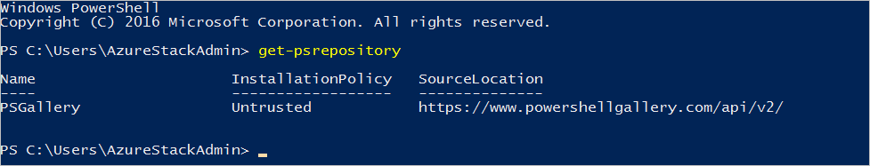

<properties
	pageTitle="Install PowerShell and connect | Microsoft Azure"
	description="Learn how to manage Azure Stack with PowerShell"
	services="azure-stack"
	documentationCenter=""
	authors="HeathL17"
	manager="byronr"
	editor=""/>

<tags
	ms.service="azure-stack"
	ms.workload="na"
	ms.tgt_pltfrm="na"
	ms.devlang="na"
	ms.topic="article"
	ms.date="09/26/2016"
	ms.author="helaw"/>

# Install PowerShell and connect
In this guide, we walk through the steps for connecting to Azure Stack with PowerShell. Once completed, these steps can also help you manage and deploy resources.

## Install Azure Stack PowerShell cmdlets

1.  AzureRM cmdlets are installed from the PowerShell Gallery. To begin, open a PowerShell Console on MAS-CON01 and run the following command to return a list of PowerShell repositories available:

        Get-PSRepository

      

2.  Run the following command to install the AzureRM module:

        Install-Module -Name AzureRM -RequiredVersion 1.2.6 -Scope CurrentUser

    >[AZURE.NOTE] *-Scope CurrentUser* is optional. If you want more than the current user to have access to the modules, use an elevated command prompt and leave off the *Scope* parameter.

3.  To confirm the installation of AzureRM modules, execute the following commands:

	    Get-Command -Module AzureRM.AzureStackAdmin

## Connect to Azure Stack
A module is available for download which handles configuring the PowerShell connection to Azure Stack for you.  Visit [Azure Stack Tools](http://aka.ms/ConnectToAzureStackPS) for the module and additional steps. 

## Retrieve a list of subscriptions
In this section, you verify PowerShell cmdlets are running against Azure Stack by retrieving and selecting a subscription for use.

Run the following command to retrieve a list of Azure Stack subscriptions associated with your account:

    Get-AzureRMSubsciptions

## Next steps
[Deploy templates with PowerShell](azure-stack-deploy-template-powershell.md)

[Connect with Azure CLI](azure-stack-connect-cli.md)

[Deploy templates with Visual Studio](azure-stack-deploy-template-visual-studio.md)

