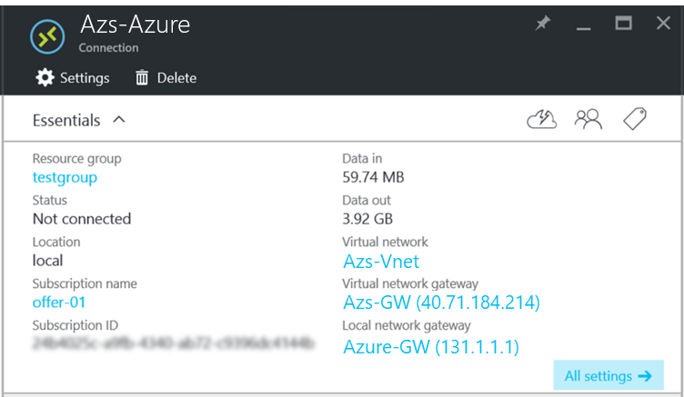

# Connect Azure Stack to Azure using VPN

*Applies to: Azure Stack integrated systems*

This article shows you how to create a site-to-site VPN to connect a virtual network in Azure Stack to a virtual network in Azure.

## Before you begin

To complete the connection configuration, make sure you have the following items before you begin:

* An Azure Stack integrated systems (multi-node) deployment that is directly connected to the Internet. Your external public IP address range must be directly reachable from the public Internet.
* A valid Azure subscription. If you don’t have an Azure subscription, you can create a [free Azure account here](https://azure.microsoft.com/free/?b=17.06).

### VPN connection diagram

The following diagram shows what the connection configuration should look like when you’re done:


### Network configuration example values

The network configuration examples table shows the values that are used for examples in this article. You can use these values or you can refer to them to better understand the examples in this article.

**Network configuration examples**

|   |Azure Stack|Azure|
|---------|---------|---------|
|Virtual network name     |Azs-VNet|AzureVNet |
|Virtual network address space |10.1.0.0/16|10.100.0.0/16|
|Subnet name     |FrontEnd|FrontEnd|
|Subnet address range|10.1.0.0/24 |10.100.0.0/24 |
|Gateway subnet     |10.1.1.0/24|10.100.1.0/24|

## Create the network resources in Azure

First you create the network resources for Azure. The following instructions show how to create the resources by using the [Azure portal](http://portal.azure.com/).

### Create the virtual network and virtual machine (VM) subnet

1. Sign in to the [Azure portal](http://portal.azure.com/) using your Azure account.
2. In the user portal, select **+ Create a resource**.
3. Go to **Marketplace**, and then select **Networking**.
4. Select **Virtual network**.
5. Use the information from the network configuration table to identify the values for Azure **Name**, **Address space**, **Subnet name**, and **Subnet address range**.
6. For **Resource Group**, create a new resource group or, if you already have one, select **Use existing**.
7. Select the **Location** of your VNet.  If you're using the example values, select **East US** or use another location if you prefer.
8. Select **Pin to dashboard**.
9. Select **Create**.

### Create the Gateway Subnet

1. Open the Virtual network resource you created (**AzureVNet**) from the dashboard.
2. On the **Settings** section, select **Subnets**.
3. Select  **Gateway subnet** to add a gateway subnet to
   the virtual network.
4. The name of the subnet is set to **GatewaySubnet** by default.

   >[!IMPORTANT]
   >Gateway subnets are special and **must** have this specific name to function properly.

5. In the **Address range** field, verify the address is **10.100.1.0/24**.
6. Select **OK** to create the gateway subnet.

### Create the virtual network gateway

1. In the Azure portal, select **+ Create a resource**.  
2. Go to **Marketplace**, and then select **Networking**.
3. From the list of network resources, select **Virtual network gateway**.
4. In **Name**, type **Azure-GW**.
5. To choose a virtual network, select **Virtual network**. Then select **AzureVnet** from the list.
6. Select **Public IP address**. When the **Choose public IP address** section opens, select **Create new**.
7. In **Name**, type **Azure-GW-PiP**, and then select **OK**.
8. By default, for **VPN type**, **Route-based** is selected. Keep the **Route-based** VPN type.
9. Verify that **Subscription** and **Location** are correct. You can pin the resource to the dashboard. Select **Create**.

### Create the local network gateway resource

1. In the Azure portal, select **+ Create a resource**.
2. Go to **Marketplace**, and then select **Networking**.
3. From the list of resources, select **Local network gateway**.
4. In **Name**, type **Azs-GW**.
5. In **IP address**, type the public IP address for your Azure Stack Virtual Network Gateway that is listed earlier in the network configuration table.
6. In **Address Space**, from Azure Stack, type the **10.1.0.0/24** and **10.1.1.0/24** address space for
   **AzureVNet**.
7. Verify that your **Subscription**, **Resource Group**, and **Location** are correct, and then select **Create**.

## Create the connection

1. In the user portal, select **+ Create a resource**.
2. Go to **Marketplace**, and then select **Networking**.
3. From the list of resources, select **Connection**.
4. On the **Basic** settings section, for the **Connection type**, choose **Site-to-site (IPSec)**.
5. Select the **Subscription**, **Resource Group**, and **Location**, and then select **OK**.
6. On the **Settings** section, select **Virtual network gateway**, and then select **Azure-GW**.
7. Select **Local network gateway**, and then select **Azs-GW**.
8. In **Connection name**, type **Azure-Azs**.
9. In **Shared key (PSK)**, type **12345**. Select **OK**.

   >[!NOTE]
   >If you use a different value for the shared key, remember that it *must* match the value for the shared key that you create on the other end of the connection.

10. Review the **Summary** section, and then select **OK**.

## Create a virtual machine

Create a virtual machine in Azure now, and put it on your VM subnet in your virtual network.

1. In the Azure portal, select **+ Create a resource**.
2. Go to **Marketplace**, and then select **Compute**.
3. In the list of virtual machine images, select the **Windows Server 2016 Datacenter Oval** image.
4. On the **Basics** section, for **Name**, type **AzureVM**.
5. Type a valid username and password. You use this account to sign in to the virtual machine after it's created.
6. Provide a **Subscription**, **Resource Group**, and **Location**, and then select **OK**.
7. On the **Size** section, select a virtual machine size for this instance, and then select **Select**.
8. On the **Settings** section, you can use the default settings. Before you select OK, confirm that:

   * The **AzureVnet** virtual network is selected.
   * The subnet is set to **10.100.0.0/24**.

   Select **OK**.

9. Review the settings on the **Summary** section, and then select **OK**.

## Create the network resources in Azure Stack

Next you create the network resources in Azure Stack.

### Sign in as a user

A service administrator can sign in as a user to test the plans, offers, and subscriptions that their users might use. If you don’t already have one, [create a user
account](azure-stack-add-new-user-aad.md) before
you sign in.

### Create the virtual network and a VM subnet

1. Use a user account to sign in to the user portal.
2. In the user portal, select **+ Create a resource**.

    

3. Go to **Marketplace**, and then select **Networking**.
4. Select **Virtual network**.
5. For **Name**, **Address space**, **Subnet name**, and **Subnet address range**, use the values from the network configuration table.
6. In **Subscription**, the subscription that you created earlier appears.
7. For **Resource Group**, you can either create a resource group or if you already have one, select **Use existing**.
8. Verify the default location.
9. Select **Pin to dashboard**.
10. Select **Create**.

### Create the gateway subnet

1. On the dashboard, open the Azs-VNet virtual network resource you created.
2. On the **Settings** section, select **Subnets**.
3. To add a gateway subnet to the virtual network, select **Gateway Subnet**.

    

4. By default, the subnet name is set to **GatewaySubnet**. Gateway subnets are special. To function properly, they must use the *GatewaySubnet* name.
5. In **Address range**, verify that the address is **10.1.1.0/24**.
6. Select **OK** to create the gateway subnet.

### Create the virtual network gateway

1. In the Azure Stack portal, select **+ Create a resource**.
2. Go to **Marketplace**, and then select **Networking**.
3. From the list of network resources, select **Virtual network gateway**.
4. In **Name**, type **Azs-GW**.
5. Select the **Virtual network** item to choose a virtual network. Select **Azs-VNet** from the list.
6. Select the **Public IP address** menu item. When the **Choose public IP address** section opens, select **Create new**.
7. In **Name**, type **Azs-GW-PiP**, and then select **OK**.
8. By default, **Route-based** is selected for **VPN type**. Keep the **Route-based** VPN type.
9. Verify that **Subscription** and **Location** are correct. You can pin the resource to the dashboard. Select **Create**.

### Create the local network gateway

The concept of a *local network gateway* in Azure Stack is a bit different than in an Azure deployment.

In an Azure deployment, a local network gateway represents an on-premises (at the user location) physical device that you connect to a virtual network gateway in Azure. But in Azure Stack, both ends of the connection are virtual network gateways!

A more generic way to think about this is that the local network gateway resource always indicates the remote gateway at the other end of the connection.

### Create the local network gateway resource

1. Sign in to the Azure Stack portal.
2. In the user portal, select **+ Create a resource**.
3. Go to **Marketplace**, and then select **Networking**.
4. From the list of resources, select **local network gateway**.
5. In **Name**, type **Azure-GW**.
6. In **IP address**, type the Public IP Address for the virtual network gateway in Azure **Azure-GW-PiP**. This address appears earlier in the network configuration table.
7. In **Address Space**, for the address space of the Azure VNET that you created, type **10.100.0.0/24** and **10.100.1.0/24**.
8. Verify that your **Subscription**, **Resource Group**, and **location** are correct, and then select **Create**.

### Create the connection

1. In the user portal, select **+ Create a resource**.
2. Go to **Marketplace**, and then select **Networking**.
3. From the list of resources, select **Connection**.
4. On the **Basics** settings section, for the **Connection type**, select **Site-to-site (IPSec)**.
5. Select the **Subscription**, **Resource Group**, and **Location**, and then select **OK**.
6. On the **Settings** section,  select **Virtual network gateway**, and then select **Azs-GW**.
7. Select **Local network gateway**, and then select **Azure-GW**.
8. In **Connection Name**, type **Azs-Azure**.
9. In **Shared key (PSK)**, type **12345**, and then select **OK**.
10. On the **Summary** section, select **OK**.

### Create a virtual machine (VM)

To check the VPN connection, you need to create two VMs, one in Azure, and one in Azure Stack. After you create these VMs, you can use them to send and receive data through the VPN tunnel.

1. In the Azure portal, select **+ Create a resource**.
2. Go to **Marketplace**, and then select **Compute**.
3. In the list of virtual machine images, select the **Windows Server 2016 Datacenter Oval** image.
4. On the **Basics** section, in **Name**, type **Azs-VM**.
5. Type a valid username and password. You use this account to sign in to the VM after it's created.
6. Provide a **Subscription**, **Resource Group**, and **Location**, and then select **OK**.
7. On the **Size** section, for this instance, select a virtual machine size, and then select **Select**.
8. On the **Settings** section, accept the defaults. Make sure that the **Azs-VNet** virtual network is selected. Verify that the subnet is set to **10.1.0.0/24**. Then select **OK**.
9. On the **Summary** section, review the settings, and then select **OK**.

## Test the connection

After the site-to-site connection is established, you should verify that you can get data flowing in both directions. The easiest way to test the connection is by doing a ping test:

* Sign in to the virtual machine you created in Azure Stack and ping the virtual machine in Azure.
* Sign in to the virtual machine you created in Azure and ping the virtual machine in Azure Stack.

>[!NOTE]
>To make sure that you're sending traffic through the site-to-site connection, ping the Direct IP (DIP)
address of the virtual machine on the remote subnet, not the VIP.

### Sign in to the user VM in Azure Stack

1. Sign in to the Azure Stack portal.
2. In the left navigation bar, select **Virtual Machines**.
3. In the list of VMs, find **Azs-VM** that you created previously, and then select it.
4. On the section for the virtual machine, select **Connect**, and then open the Azs-VM.rdp file.

     

5. Sign in with the account that you configured when you created the virtual machine.
6. Open an elevated **Windows PowerShell** window.
7. Type **ipconfig /all**.
8. In the output, find the **IPv4 Address**, and then save the address for later use. This is the address that you will ping from Azure. In the example environment, the
   address is **10.1.0.4**, but in your environment it might be different. It should fall within the **10.1.0.0/24** subnet that you created previously.
9. To create a firewall rule that allows the virtual machine to respond to pings, run the following PowerShell command:

   ```powershell
   New-NetFirewallRule `
    –DisplayName “Allow ICMPv4-In” `
    –Protocol ICMPv4
   ```

### Sign in to the tenant VM in Azure

1. Sign in to the Azure portal.
2. In the left navigation bar, select **Virtual Machines**.
3. From the list of virtual machines, find **Azure-VM** that you created previously, and then select it.
4. On the section for the virtual machine, select **Connect**.
5. Sign in with the account that you configured when you created the virtual machine.
6. Open an elevated **Windows PowerShell** window.
7. Type **ipconfig /all**.
8. You should see an IPv4 address that falls within **10.100.0.0/24**. In the example environment, the address is **10.100.0.4**, but your address might be different.
9. To create a firewall rule that allows the virtual machine to respond to pings, run the following PowerShell command:

   ```powershell
   New-NetFirewallRule `
    –DisplayName “Allow ICMPv4-In” `
    –Protocol ICMPv4
   ```

10. From the virtual machine in Azure, ping the virtual machine in Azure Stack, through the tunnel. To do this, you ping the DIP that you recorded from Azs-VM. In the example environment, this is **10.1.0.4**, but be sure to ping the address you noted in your lab. You should see a result that looks like the following screen capture:

    

11. A reply from the remote virtual machine indicates a successful test! You can close the virtual machine window.

You should also do more rigorous data transfer testing. For example, copying different sized files in both directions.

### Viewing data transfer statistics through the gateway connection

If you want to know how much data passes through your site-to-site connection, this information is available on the **Connection** section. This test is also another way to verify that the ping you just sent actually
went through the VPN connection.

1. While you're signed in to the user virtual machine in Azure Stack, use your user account to sign in to the user portal.
2. Go to **All resources**, and then select the **Azs-Azure** connection. **Connections** appears.
3. On the **Connection** section, the statistics for **Data in** and **Data out** appear. In the following screen capture, the large numbers are attributed to additional file transfer. You should see some nonzero values there.

    

## Next steps

[Deploy apps to Azure and Azure Stack](azure-stack-solution-pipeline.md)
