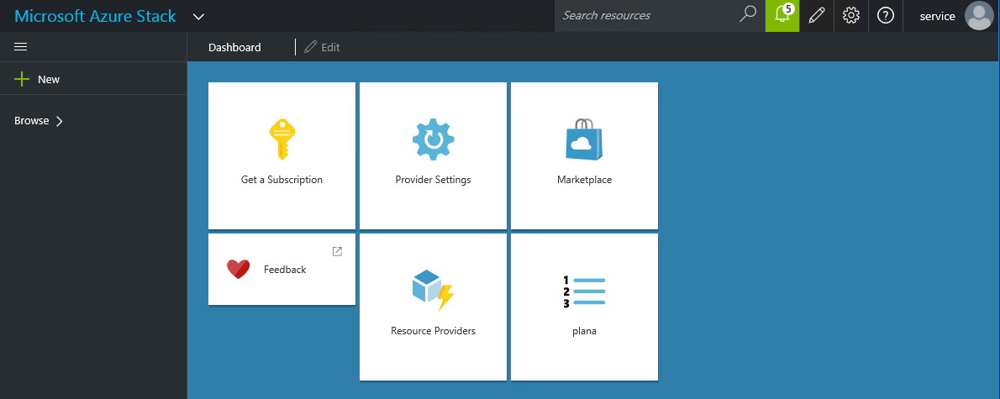
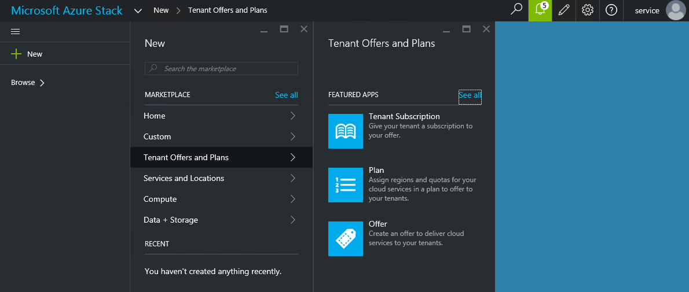
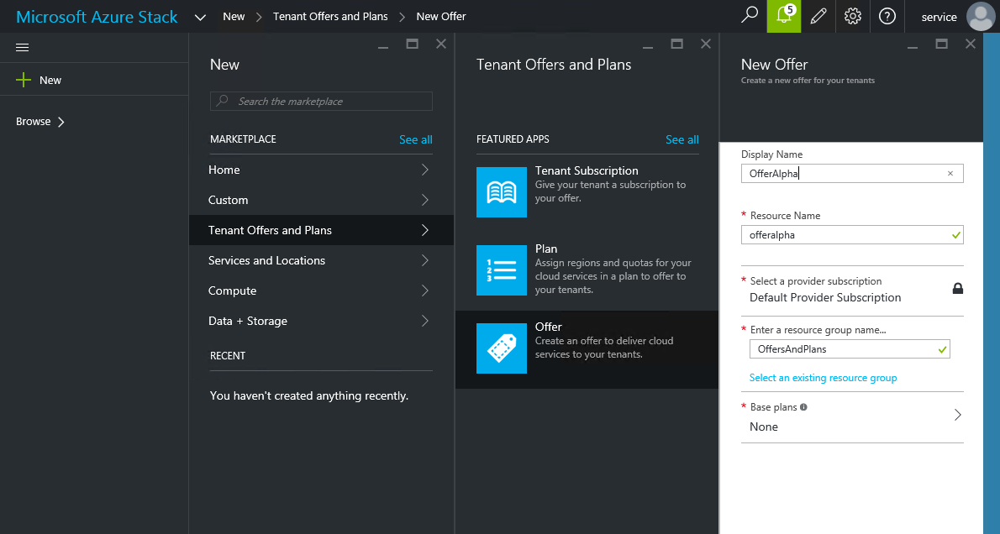
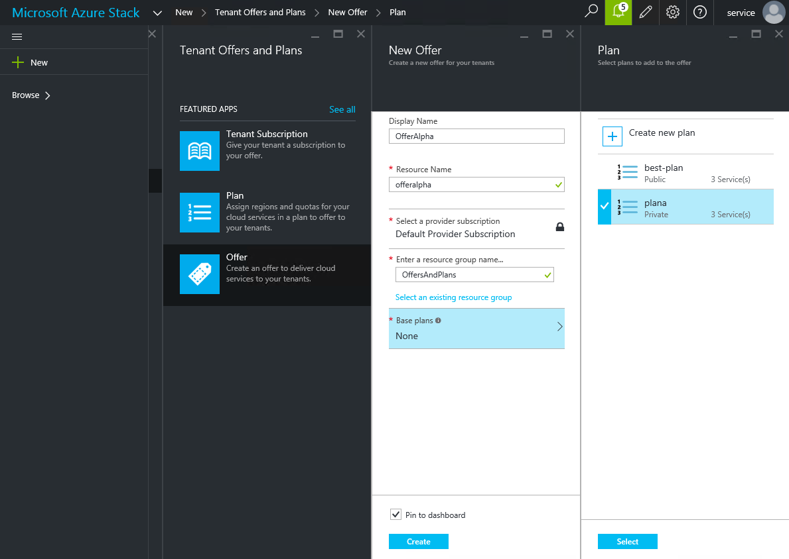
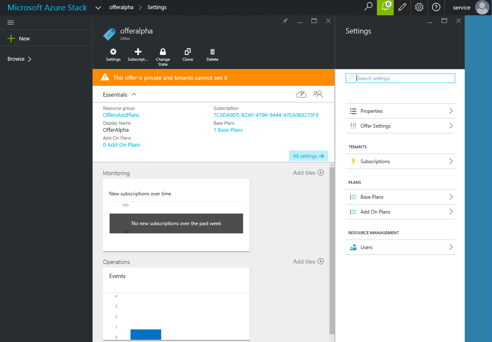

<properties
	pageTitle="Create an offer in Azure Stack (service administrator)"
	description="As a service administrator, learn how to create an offer for your tenants in Azure Stack."
	services="azure-stack"
	documentationCenter=""
	authors="erikje"
	manager="v-kiwhit"
	editor=""/>

<tags
	ms.service="azure-stack"
	ms.workload="na"
	ms.tgt_pltfrm="na"
	ms.devlang="na"
	ms.topic="article"
	ms.date="01/29/2016"
	ms.author="erikje"/>

# Create an offer in Azure Stack (service administrator)

Now that you have a plan, you can create and include it in an offer.

1.  Login in to the Admin portal as a service administrator.
	

2.  Click **New**.

3.  Click **Tenant Offers and Plans**, then click **Offer**.
	

4.  In the New Offer blade, complete the following:

    1.  Fill in **Display Name** and **Resource Name**. The Display Name is the name that tenants will see when they see offers available to them. It may contain spaces and special characters. The Resource Name is only exposed to the admin and is the name that admins will use to interact with the offer as an Azure Resource Manager resource.

    2.  Select provider subscription (locked here). The Offer is created as a resource on this subscription.

    3.  Select a new or existing **Resource Group**

    	

5.  Click **Base plans** and, in the **Plan** blade, select the plans you want to include in the offer, and then click **Select**.

	

6.  Click **Create** to create the offer. After the offer is created, you will see the following:

    

7.  Click **Change State**, and then click **Public**. This makes the offer visible to tenants.

    

**Notes**

1.  Plans and offers have to be made public for tenants to get the full view when subscribing. If a plan is private and the offer is public, tenants can get to the offer but won’t be able to see the details of the plan. That possible status values are:

    -   **Public**: The plan or offer is visible to tenants for self-subscription.

    -   **Private**: The plan or offer is not visible to tenants. It is only visible to the service administrator. This status might be used while drafting the plan or offer, or if the service administrator doesn’t want to let users self-subscribe.

    -   **Decommissioned**: The plan or offer already has subscribers but the service administrator does not want to new subscriptions for some reason. Since plans and offers that already have subscriptions can’t be deleted, the service administrator can use decommissioned to prevent future subscriptions but leave current subscribers untouched.

2.  Changes to the plan or offer are not immediately visible to the tenant. To see the changes, the subscription state must be InSync, then the tenant must refresh the portal or login/logout.

3.  Even after an additional subscription has been created and is InSync, you might have to logout/login to see the new subscription in the “Subscription picker” when creating new resources/resource groups.

## Next Steps

[Subscribe to an offer and then provision a VM](azure-stack-subscribe-plan-provision-vm.md)
