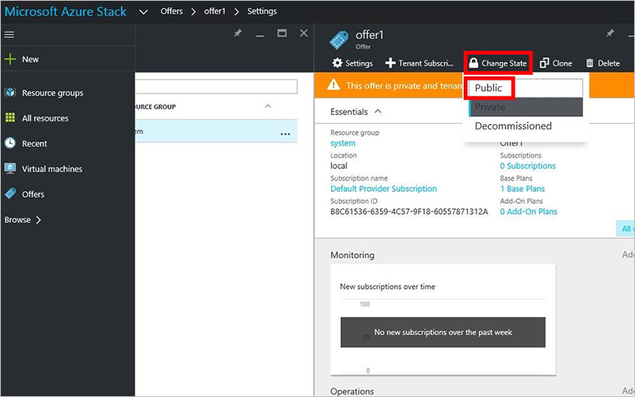
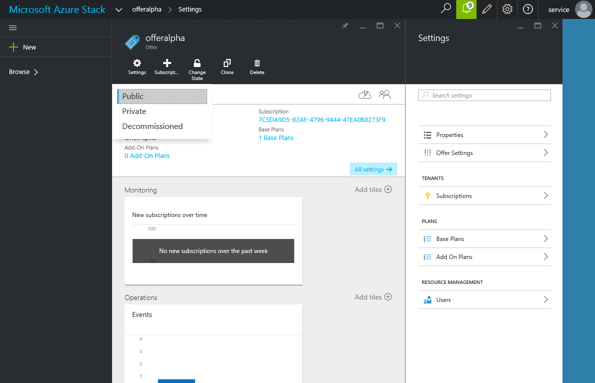

<properties
	pageTitle="Create an offer in Azure Stack | Microsoft Azure"
	description="As a service administrator, learn how to create an offer for your tenants in Azure Stack."
	services="azure-stack"
	documentationCenter=""
	authors="ErikjeMS"
	manager="byronr"
	editor=""/>

<tags
	ms.service="azure-stack"
	ms.workload="na"
	ms.tgt_pltfrm="na"
	ms.devlang="na"
	ms.topic="get-started-article"
	ms.date="05/25/2016"
	ms.author="erikje"/>

# Create an offer in Azure Stack

[Offers](azure-stack-key-features.md#services-plans-offers-and-subscriptions) are groups of one or more plans that providers present to tenants to buy (subscribe to). In this example, you will create an offer that includes the [plan that you created](azure-stack-create-plan.md) in the last step. This will give subscribers to the offer the ability to provision virtual machines.

1.  [Sign in](azure-stack-connect-azure-stack.md#log-in-as-a-service-administrator) to the portal as a service administrator and then click **New** > **Tenant Offers + Plans** > **Offer**.
	

2.  In the **New Offer** blade, fill in **Display Name** and **Resource Name**, and then select a new or existing **Resource Group**. The Display Name is the offer's friendly name. Only the admin can see the Resource Name. It's the name that admins use to work with the offer as an Azure Resource Manager resource.

    	

3.  Click **Base plans** and, in the **Plan** blade, select the plans you want to include in the offer, and then click **Select**. Click **Create** to create the offer.

	
	
4. Click **Offers** and then click the offeryou just created.

	

5.  Click **Change State**, and then click **Public**.
  
	

Plans and offers have to be made public for tenants to get the full view when subscribing. If a plan is private and the offer is public, tenants can get to the offer but won’t be able to see the details of the plan. Plans and offers can be:

    -   **Public**: Visible to tenants.

    -   **Private**: Only visible to the service administrators. Useful while drafting the plan or offer, or if the service administrator wants to approve every subscription.

    -   **Decommissioned**: Closed to new subscribers. The service administrator can use decommissioned to prevent future subscriptions, but leave current subscribers untouched.

    

Changes to the plan or offer are not immediately visible to the tenant. To see the changes, the subscription state must be InSync, then the tenant must refresh the portal or login/logout.

Even after an additional subscription has been created and is InSync, you might have to logout/login to see the new subscription in the “Subscription picker” when creating new resources/resource groups.

## Next steps

[Subscribe to an offer and then provision a VM](azure-stack-subscribe-plan-provision-vm.md)
