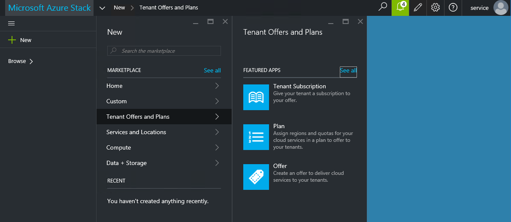
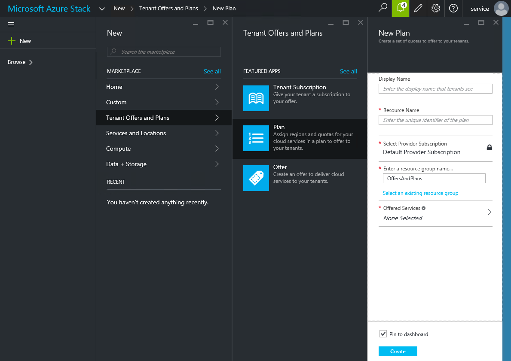
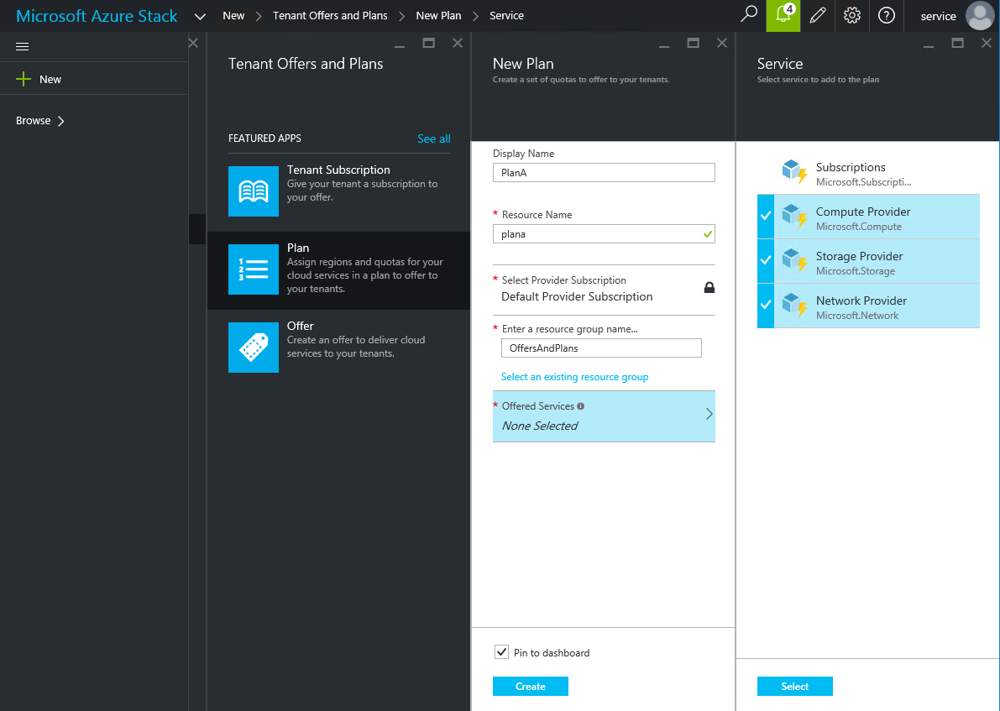
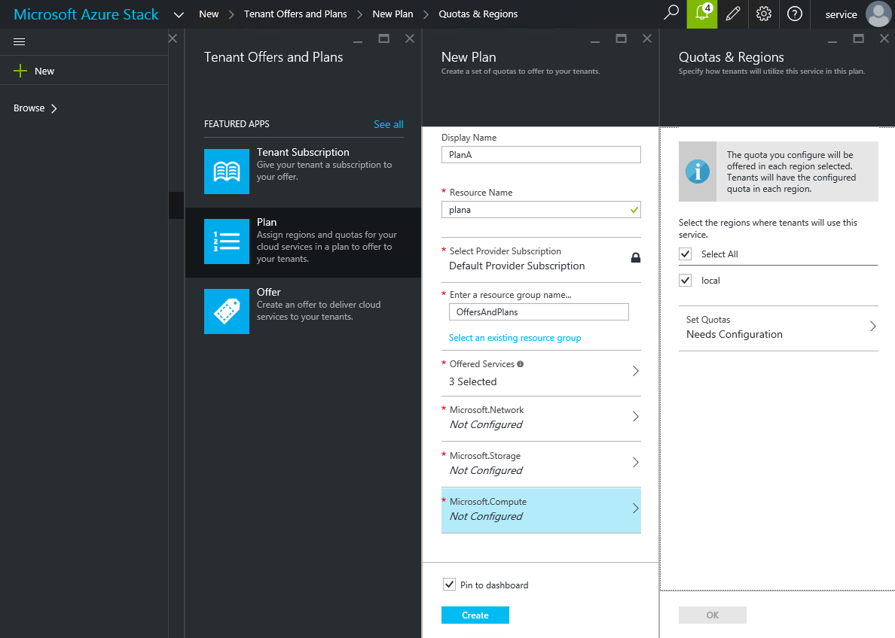
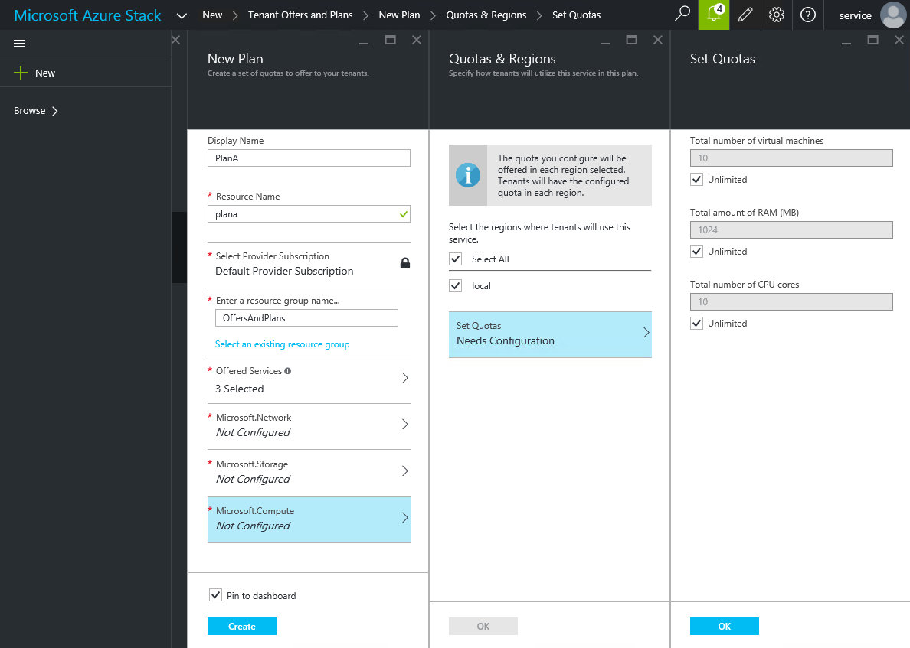
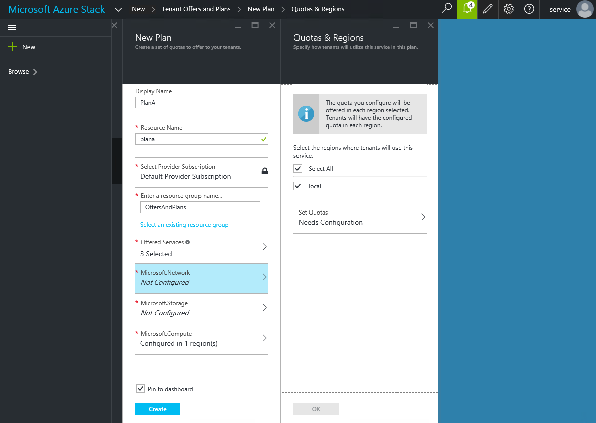
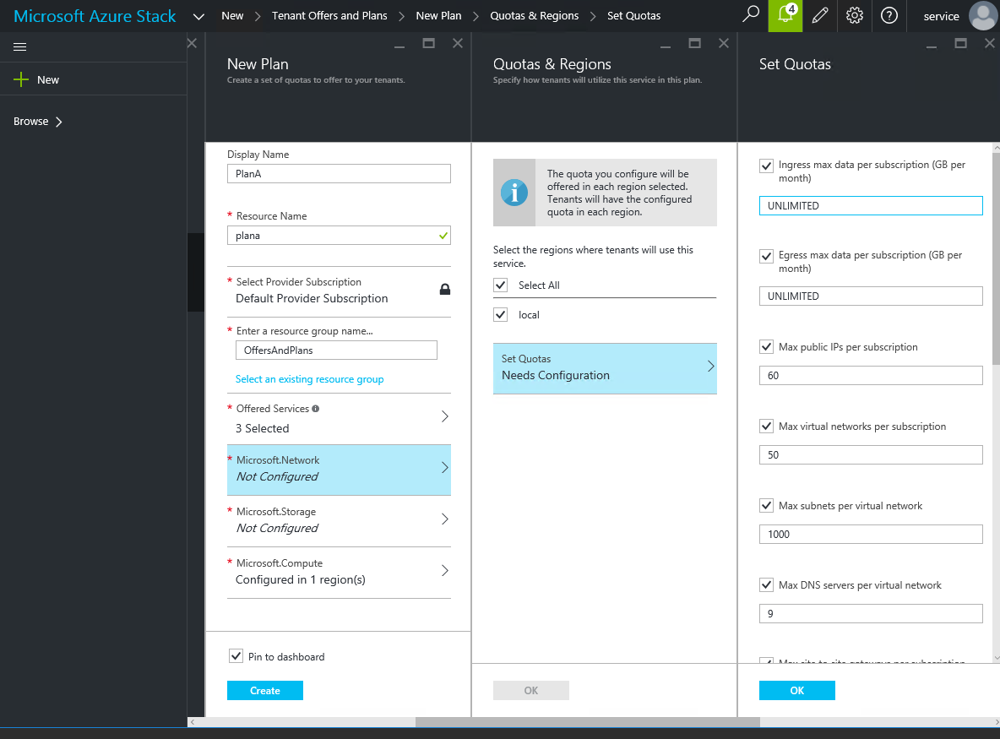
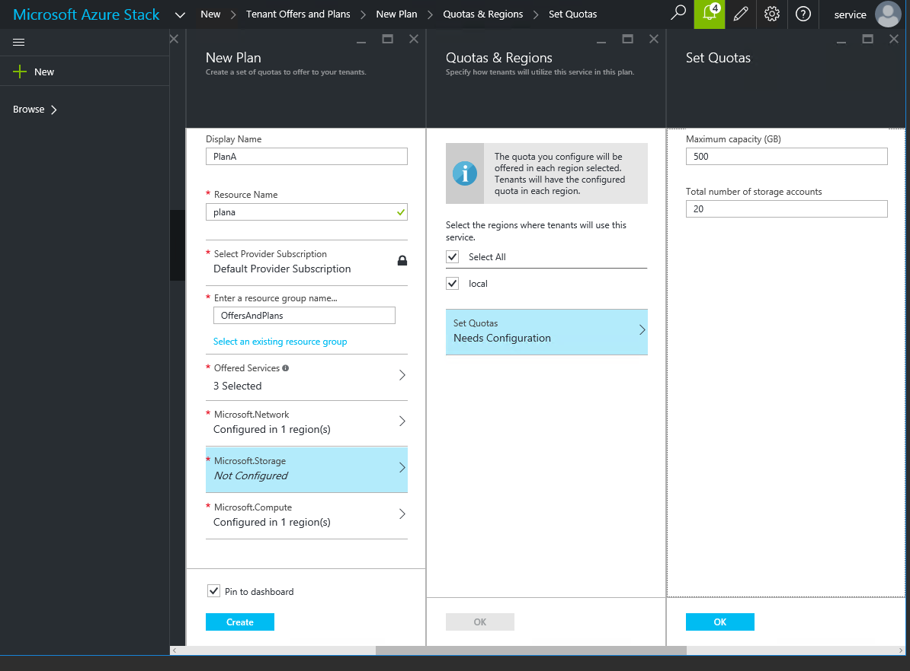

<properties
	pageTitle="Create a plan in Azure Stack | Microsoft Azure"
	description="As a service administrator, create a plan that lets subscribers provision virtual machines."
	services="azure-stack"
	documentationCenter=""
	authors="ErikjeMS"
	manager="byronr"
	editor=""/>

<tags
	ms.service="azure-stack"
	ms.workload="na"
	ms.tgt_pltfrm="na"
	ms.devlang="na"
	ms.topic="get-started-article"
	ms.date="05/25/2016"
	ms.author="erikje"/>

# Create a plan in Azure Stack

[Plans](azure-stack-key-features.md#services-plans-offers-and-subscriptions) are groupings of one or more services. As a provider, you can create plans to offer to your tenants. In turn, your tenants subscribe to your offers to use the plans and services they include. In this example, you will create a plan that includes the compute, network, and storage resource providers. This will give subscribers to the plan the ability to provision virtual machines.

1.  In an internet browser, navigate to https://portal.azurestack.local.

2.  [Sign in](azure-stack-connect-azure-stack.md#log-in-as-a-service-administrator) to the Azure Stack Portal as a service administrator and enter your service administrator credentials (this is the account created during step 5 of the [Run the PowerShell script](azure-stack-run-powershell-script.md) section), and then click **Sign in**.

    Service administrators can create offers and plans, and manage users.

3.  To create a plan and offer that tenants can subscribe to, click **New**.

    

4.  In the Create blade, click **Tenant Offers and Plans**, and then click **Plan**.

	

5.  Fill in **Display Name** and **Resource Name**. The Display Name is the plan's friendly name. Only the admin can see the Resource Name. It's the name that admins  use to work with the plan as an Azure Resource Manager resource.

	

6.  Select or create a new **Resource Group** as a container for the plan. By default, all plans and offers will go into a resource group called OffersAndPlans.

7.  Click **Offered Services**, use the Shift key to multi-select all three providers (**Compute Provider**, **Storage Provider**, and **Network Provider**) and then click **Select**.

	

8.  Click **Microsoft.Compute**, and then click **Needs Configuration**.

	

9.  In the **Set Quotas** blade, accept all the defaults, click **OK**, and then click **OK** again.

    

10. Click **Microsoft.Network**, then click **Needs Configuration**.

	

11. In the **Set Quotas** blade, select all the check boxes, click **OK**, then click **OK** again.

	

12. Click **Microsoft.Storage**, click **Needs Configuration**, and then in the **Set Quotas** blade, accept all the defaults, click **OK**, click **OK** again, and then click **Create** to create the plan.

	

13. Your plan can now be included in an offer. View notifications by clicking the bell at the top right.

    

## Next steps

[Create an offer](azure-stack-create-offer.md)
